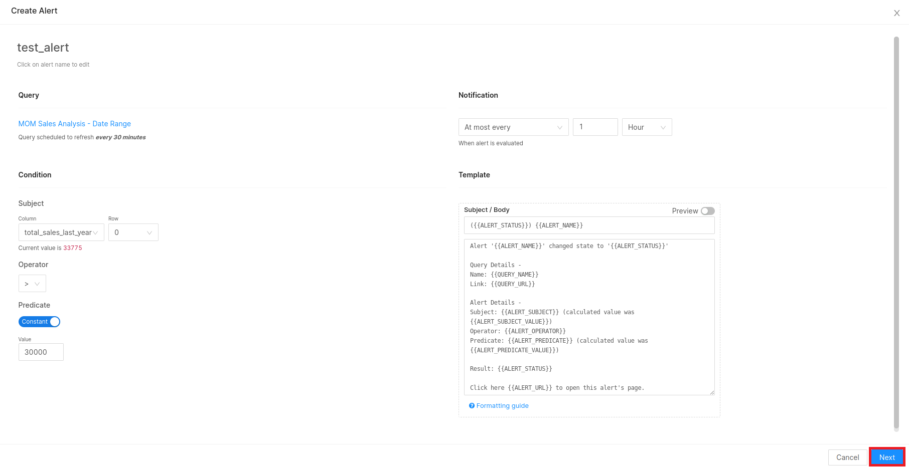
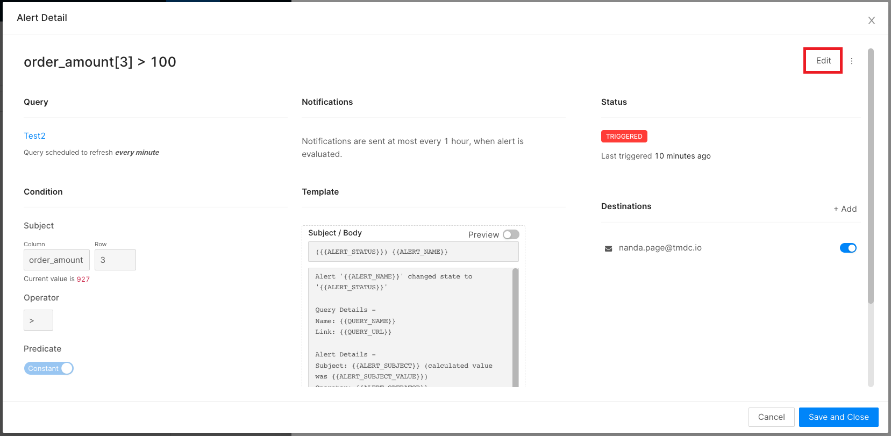

# Alerts

Clicking on the ‘**Alerts’** tab on Atlas landing page, you can view all the alerts created by you. By default, the list is sorted in reverse chronological order. You can reorder the list by clicking the column headings. 

The list contains the **Name**, targeted **Query**, **Created By, Created at, Last Updated** information. **State** shows whether the alert status is `TRIGGERED`, `OK`, or `UNKNOWN`.

- `TRIGGERED` means that on the most recent execution, the Value column in your target query met the Condition and Threshold you configured. If your alert checks whether ordered_amt is above 1500, your alert will be triggered as long as ordered_amt  is above 1500 for the selected brand.
- `OK` means that on the most recent query execution, the Value column did not meet the Condition and Threshold you configured. This doesn’t mean that the Alert was not previously triggered. If your ordered_amt value is now 1470, your alert will show as `OK`.
- `UNKNOWN` means SQL does not have enough data to evaluate the alert criteria. You will see this status immediately after creating your Alert and until the query has been executed. You will also see this status if there is no data in the query result or if the most recent query result doesn’t include the *Value Column* you configured.

### **Create an Alert**

An Alert can be added via the `Queries` section. The top right side menu shows '**Alerts[0]**'; clicking on that will open a panel that shows alerts created by you. It gives you the option to add a new alert. 

<figcaption align = "center">Creating alerts </figcaption>

#### **Setting up Destination for Alerts**

Click on `Next` to set up the destination for this alert. Save your alert.

### **Edit an Alert**

If you wish to modify the settings or notification message, open the alert and click the “Edit” button at the top of the alert page.

A message template consisting of input fields for the subject and body will be seen on the screen. You can customize the notification message with static content and built-in template variables.

<figcaption align = "center">Modifying alert settings</figcaption>

To learn more about creating alerts, refer to [Setting up Dashboard Alerts](/dataos_alerts/dashboard_alerts/).

<aside class="callout">DataOS offers a diverse range of integrated alert mechanisms, emphasizing observability and active monitoring.  To learn more about them, refer to <a href="/dataos_alerts/">DataOS Alerts.</a></aside>