# DataOS Integration with Power BI

This article will help you to set up the connection between DataOS and Power BI. It provides specific steps needed to fetch data from DataOS into Power BI.

## Explore your DataOS data with Power BI

Power BI is a business analytics service to provide interactive visualizations and business intelligence capabilities. Using Power BI’s simple user interface, you can create your reports and dashboards.

DataOS and Power BI seamless integration works to take advantage of that powerful visualization technology, on the data pulled from DataOS.

## Requirements

- Power BI Desktop installed on your system - If Power BI is not installed on your system, you can download the latest version from the [Power BI website](https://powerbi.microsoft.com/en-us/downloads/).
- Simba Presto ODBC Driver - In order to connect to DataOS Catalog, you would have to install this Presto driver.
- DataOS API token - To authenticate and access DataOS, you will need API token.

## Download and Install Presto Driver

1.  Download it from [Presto ODBC & JDBC Drivers download page](https://www.magnitude.com/drivers/presto-odbc-jdbc).
   
   <figcaption align = "center">Presto download</figcaption>
2.  To run the installer, double-click on downloaded Simba Presto XX-bit installer file. Select the 32 or 64 bit version according to your system configurations.

    
    <figcaption align = "center">Presto setup</figcaption>
    
    Follow the steps for the successful installation.

    a. Click Next.

    b. Select the check box to accept the terms of the License Agreement if you agree, and then click Next.

    c. To change the installation location, click Change, then browse to the desired folder, and then click OK.

    To accept the installation location, click Next.

    d. Click Install.

    e. When the installation completes, click Finish.

    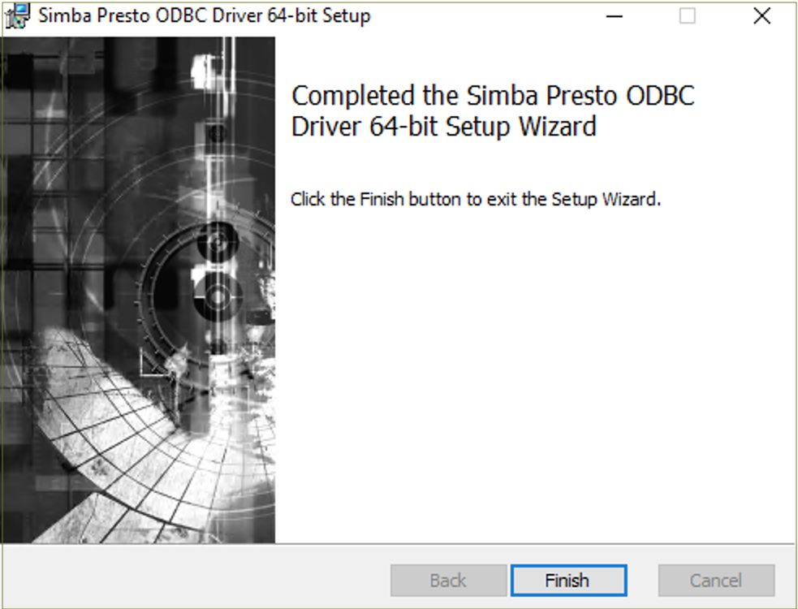
    <figcaption align = "center">Presto setup done</figcaption>

3. After successful installation, copy the license file (that you have received in your email) into the \lib subfolder of the Simba installation folder.

    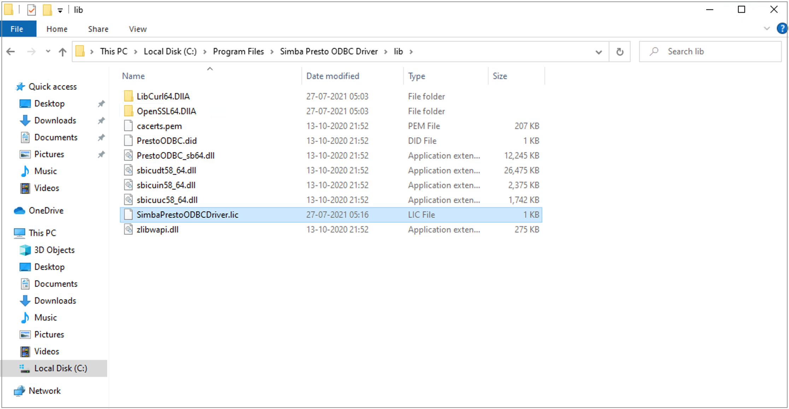
    <figcaption align = "center">Presto license</figcaption>
    

    > 📌 Note: Contact your network administrator in case you encounter an error due to not having required admin privileges.
    > 

## Generate DataOS API Token

1. Sign in to your DataOS instance with your username and password. On the DataOS home page, click on Profile.

    
    <figcaption align = "center">DataOS Homepage</figcaption>

2. On the 'Profile' page, click on Tokens.

    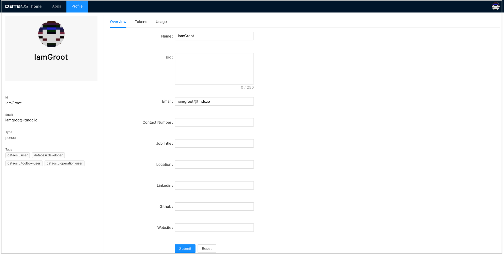
    <figcaption align = "center">Profile</figcaption>

3. Click on the Add API Key link on the Tokens tab.
    
    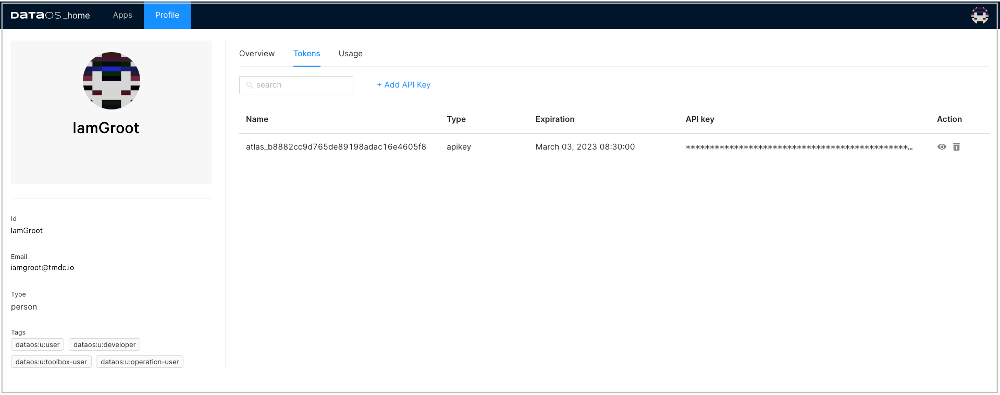
     <figcaption align = "center">DataOS Token</figcaption>

4. Type in name for this token and also set the validity period of your token based on the security requirements as per your business needs. Click Save to create one for you.
    
    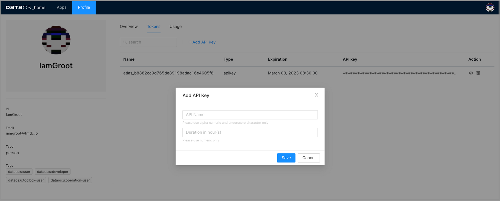
    <figcaption align = "center">Add key</figcaption>

5. The API key is listed below. Click on the “eye icon” on the right side to make the full API key visible.

    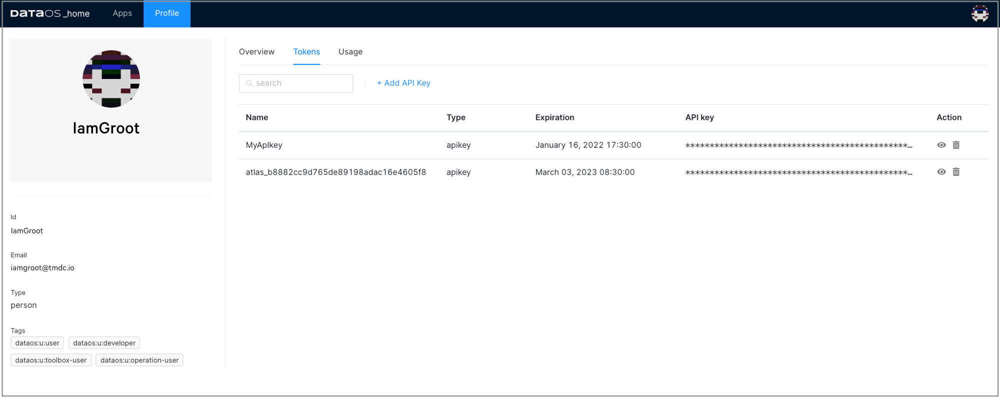
    <figcaption align = "center">Key created</figcaption>

6. Click on the API key to copy it. You need this API key to configure Simba Presto driver.

## Configure Presto ODBC DSN

To use the Simba Presto ODBC Driver in Power BI application, you need to configure a Data Source Name (DSN) to connect to your data in DataOS.

1. Open ODBC Data Source Administrator (64-bit or 32-bit).

2. Click  System DSN tab.

3. In the list of DSNs, select Simba Presto ODBC DSN, and then click Configure.

    
    <figcaption align = "center">ODBC system DSN</figcaption>

4. In the DSN Setup dialog box, provide the following inputs:

    - Provide 'Description' for the data source name.
    - In the 'Authentication' section:
        - Select Authentication type as LDAP Authentication.
        - Enter username for the User and generated API key as the password.
    - Now in the 'Data Source' section, provide the required information.
        - Host (e.g. tcp.reasonably-welcome-grub.dataos.io)
        - Port (e.g. 7432)
        - Catalog (e.g. icebase)
        - Schema (optional)

    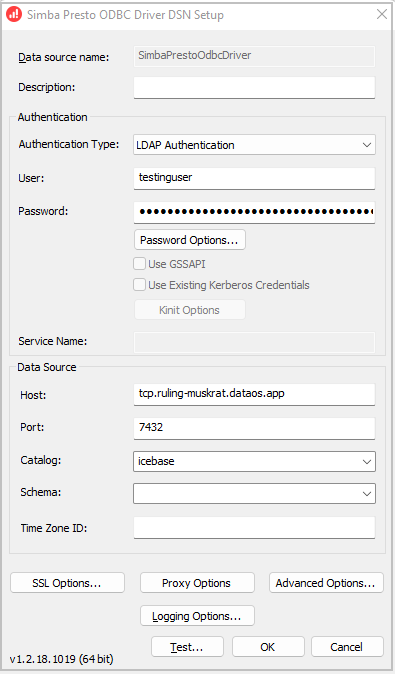
    <figcaption align = "center">Inputs for DSN setup</figcaption>

5. In the DSN Setup dialog box, click SSL Options and enable SSL.

    
    <figcaption align = "center">Enable ssn.png</figcaption>

6. Click Test. and if successful, press OK to close the Test Results dialog box.

    
    <figcaption align = "center">Test success</figcaption>

7.Click OK to save your DSN.

> 📌 Note: If you encounter any error in setting up the connection, please check DataOS url, validity of API key and try again or contact your administrator.
> 

## Access DataOS on Power BI

1. Launch Power BI. Click on the Get Data option in the top menu bar and click More.

    
    <figcaption align = "center">Get data</figcaption>

2. Search for the ODBC from the data source list, then select ODBC and click on Connect.

    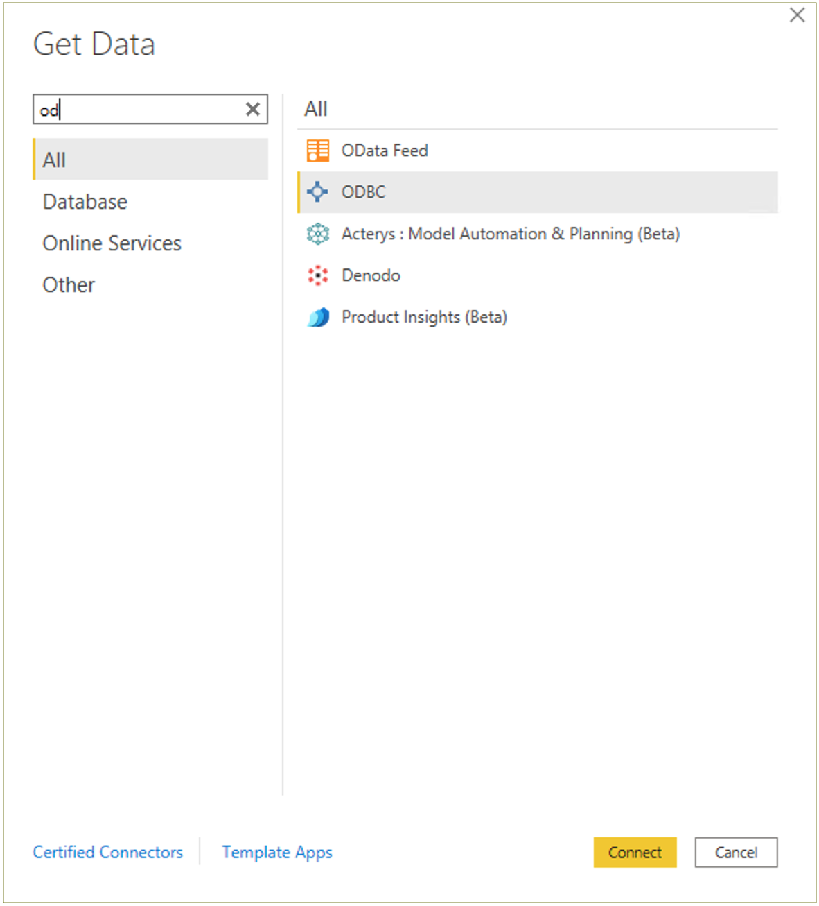
    <figcaption align = "center">Search ODBC.png</figcaption>

3. Select the DSN you tested successfully during the DSN setup process, and click OK

    
    <figcaption align = "center">select DSN name</figcaption>

4. Enter API key for username and password both in the dialogue box and click on Connect.

    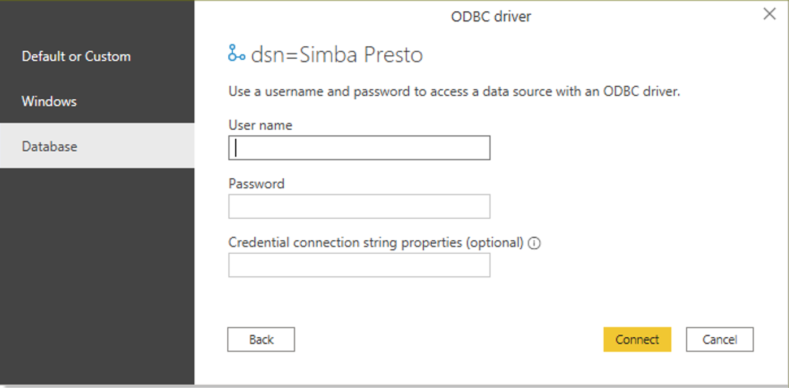
    <figcaption align = "center">Credentials to access the data source</figcaption>
    
5. On successful connection, you can see the DataOS catalog in the left panel. Select the schema and table and click Load.

    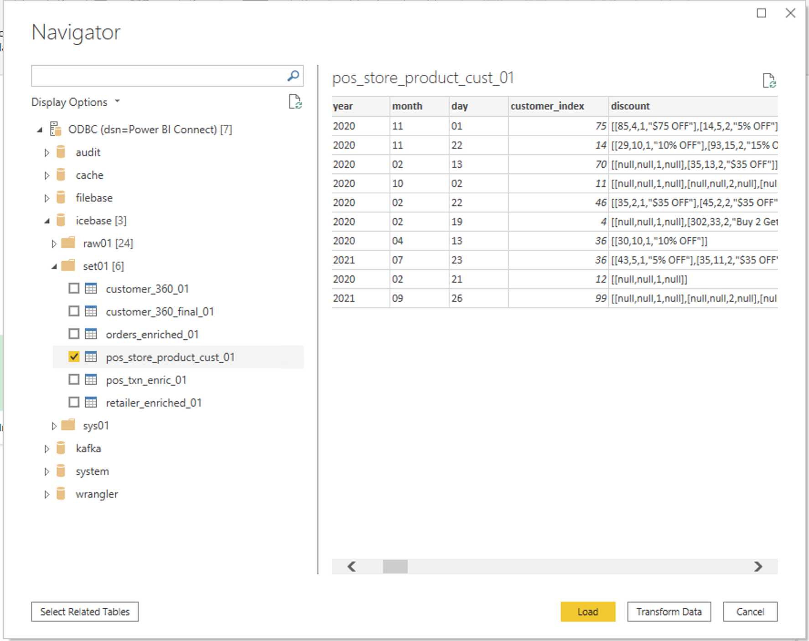
    <figcaption align = "center">Data loaded</figcaption>
    

6. Now you can explore and visualize this data in Power BI.

    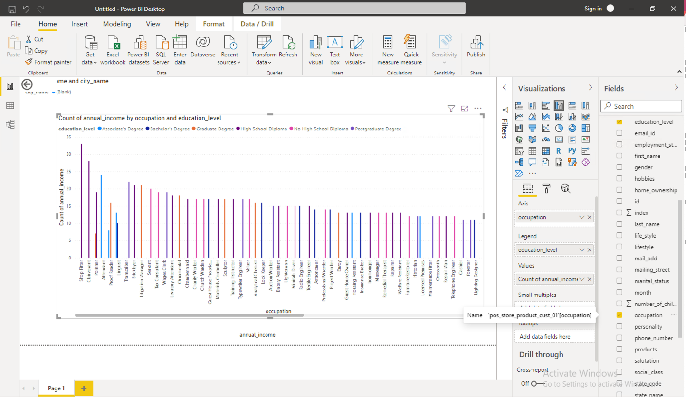
    <figcaption align = "center">PowerBI data chart</figcaption>
    