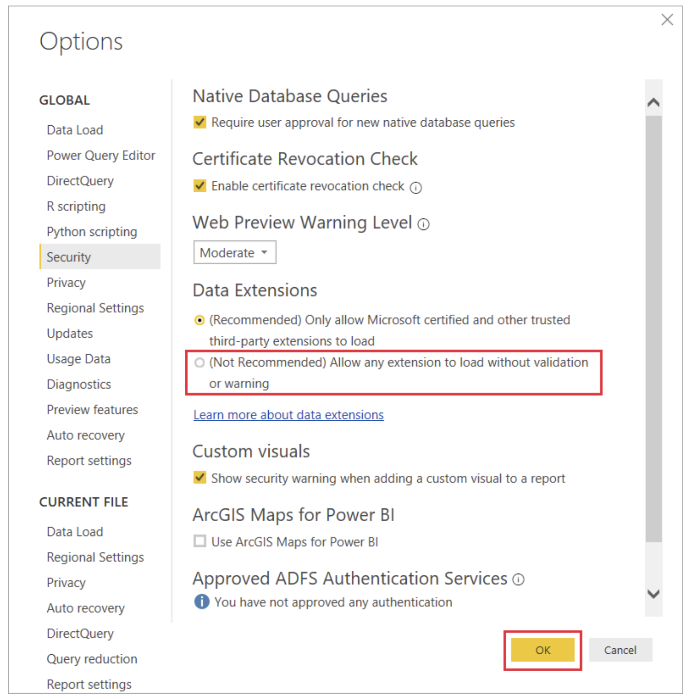
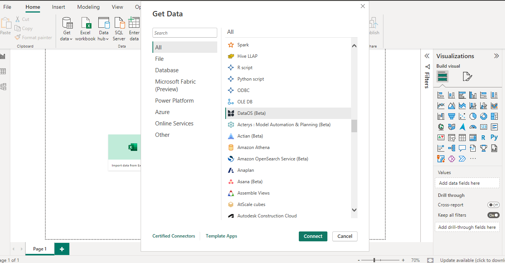
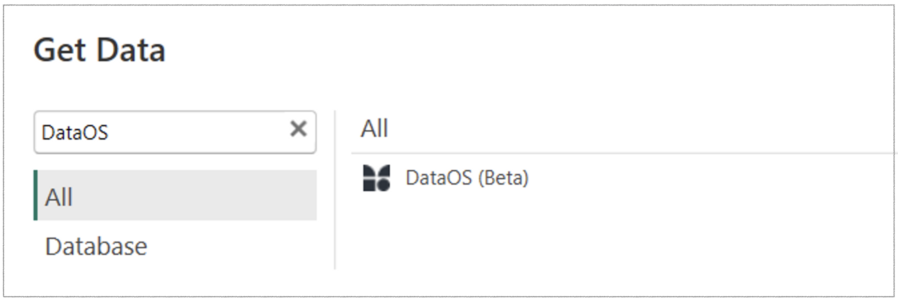
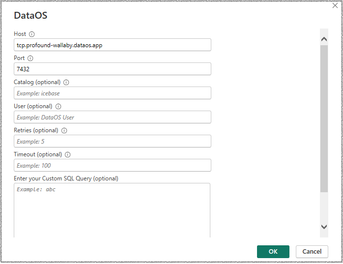
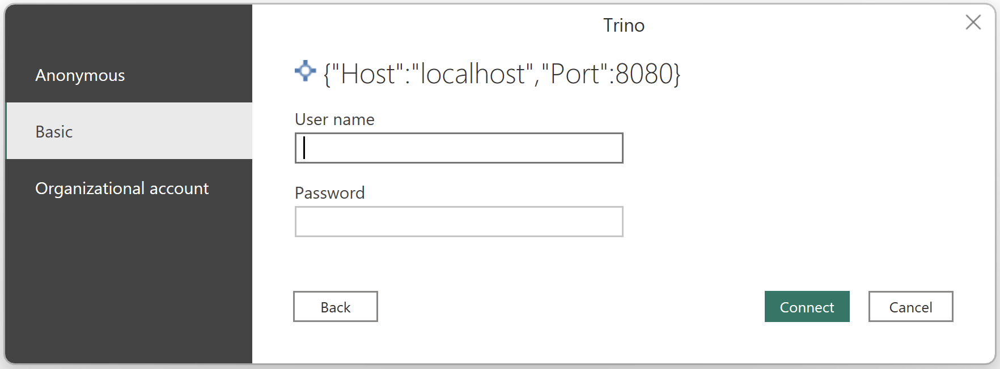
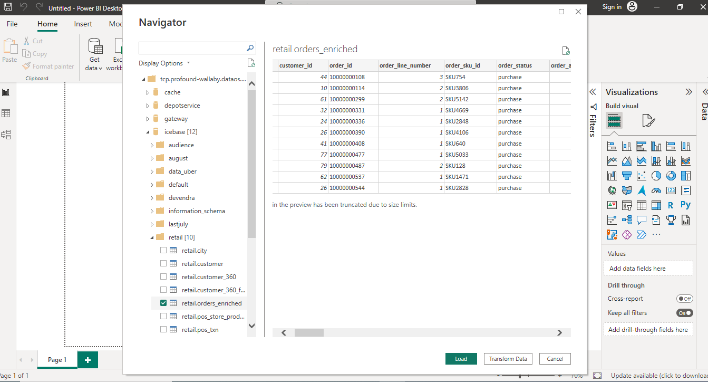
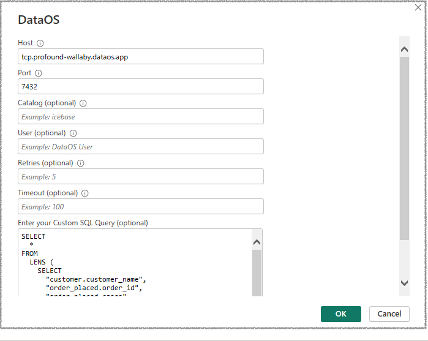
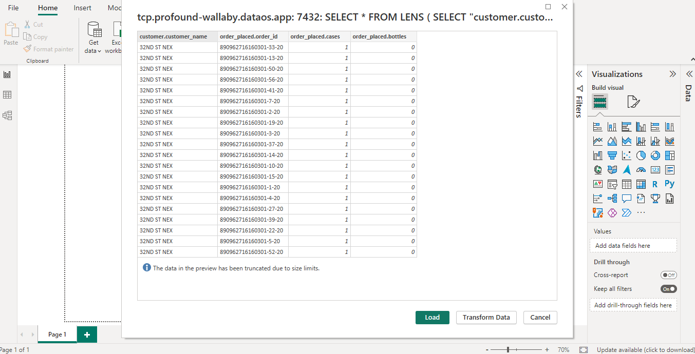

# DataOS Power BI Connector

The DataOS Power BI Connector is engineered to facilitate integration between the DataOS platform and Power BI. This custom connector empowers users to seamlessly import DataOS data into Power BI, providing an additional interface for DataOS access combined with Power BI's visualization and dashboarding capabilities.

The DataOS Power BI Connector uses the Minerva query engine to channel DataOS data into Power BI for exploration and analysis. Queries run on the Minerva cluster. Cluster selection considers sources (query origin), priority, and alphabetical order. If these criteria don't apply, a default cluster is chosen for query execution.

You can query any data source for which a depot has been established, or a connector configuration is done for the data source to access it as a ‘catalog’ within the selected Minerva cluster. You can also run Lens queries within Power BI, tailored for extracting insights from the ontology layer—known as the Lens.

This custom connector functions in alignment with existing data and access policies. Users can confidently explore and analyze DataOS data within Power BI, adhering to access policy decisions and data governance through data policy decisions such as masking and filtering of data.

The following section contains further information on how to configure this connector to retrieve and analyze DataOS data within Power BI Desktop.

## Prerequisites

- DataOS API key to authenticate and access DataOS from the Power BI interface.
    
    To learn more about generating an API key/token, refer to [Create API Key](https://dataos.info/interfaces/create_token/).
    

## Configure custom connector support

Before you start using the DataOS Power BI Connector, configure it as a custom connector in Power BI Desktop.

1. Contact your customer success representative to obtain the`.mez` file required for the Connector.
2. Place the`.mez` file in your local **`Documents\Power BI Desktop\Custom Connectors`** folder. Create this folder if it doesn't exist yet.
3. To adjust the data extension security settings, in Power BI Desktop, select **File** > **Options and Settings** > **Options** > **Security**.
4. Under **Data Extensions**, select **(Not Recommended) Allow any extension to load without validation or warning**.
5. Select **OK**, and then restart Power BI Desktop.
    
    
    
    For more information, follow the [official documentation from Microsoft](https://learn.microsoft.com/en-us/power-bi/connect-data/desktop-connector-extensibility).
    
6. In Power BI Desktop, click on the **Get Data > More.** You should be able to see DataOS as an available data source.
    
    
    

## **Access data from DataOS on Power BI**

Once DataOS appears as a data source in Power BI Desktop, data from DataOS can be accessed. There are two methods to retrieve datasets from DataOS:

### **Select tables from DataOS data lake**

1. Open Power BI Desktop and select **Get Data** > **More.**
2. Choose ‘DataOS’ from the list of available data sources. 
    
    
    
3. A pop-up appears. Fill in the required and optional fields to establish communication with your DataOS environment. 
    - Basic connection information such as the URL of the DataOS instance, including the port used. Ask the DataOS administrator for this information. It is essential to provide the URL with `tcp` for TCP/IP connection.
    - Configure the following optional information, such as specific catalog, user, etc.
4. Leave the `Custom SQL Query` field blank.
5. Click "OK" to scan all objects and retrieve schema and tables within the selected catalog(s).
    
    
    
6. Enter your Username and Password (APIKEY) and proceed.
    
    
    
7. Choose a table from the available list of catalogs and schemas. You'll be able to preview the data. 
    
    
    
    <aside class="callout">
    🗣 The visibility of these catalogs and schemas will depend on your access level within DataOS.
    
    </aside>
    
8. Click the 'Load' option to import the data. Subsequently, you can explore and craft visualizations within Power BI using the loaded data.

### **Fetch the result of a specific query**

1. Open Power BI Desktop and select **Get Data** > **More.**
2. Select ‘DataOS’ from the available data sources.
3. Provide connection information. Ask the DataOS administrator for the DataOS URL and port.
4. In the `Custom SQL Query` field, enter the desired query (or a Lens Query) and fill in the other mandatory fields.
    
    
    
    <aside class="callout">
    🗣 Ensure that you have access to the datasets mentioned in the query to avoid the “forbidden access” error. Reach out to the administrator to request access to the specific datasets mentioned in your query.
    
    </aside>
    
5. Enter your Username and Password (APIKEY) and press Enter.
6. The result of that query will be fetched instead of the catalog and table views and loaded into Power BI. Click on ‘Load’ to view the data.
    
    
    

## Prepare the dashboard(s)

Once you have retrieved the data from DataOS into Power BI, you can create your dashboard(s) according to your business requirements.