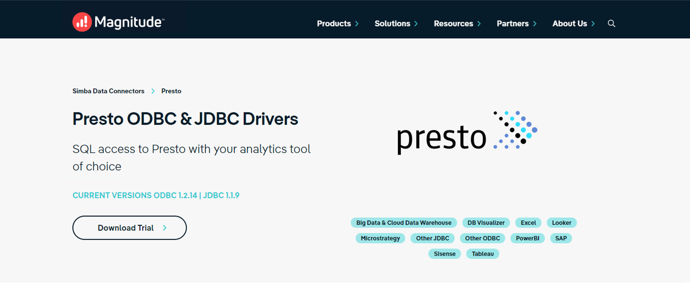
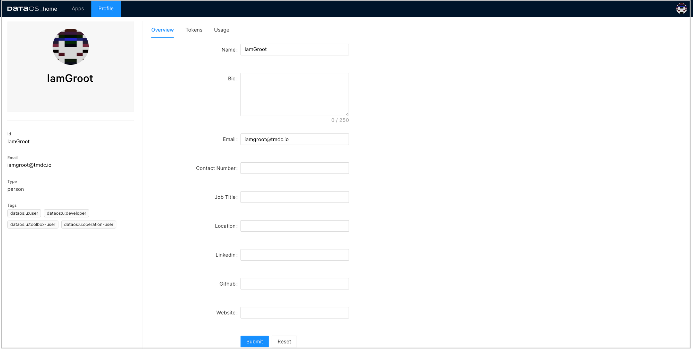
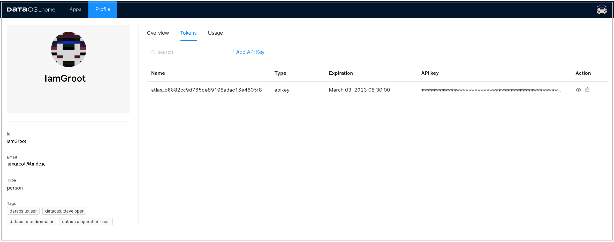
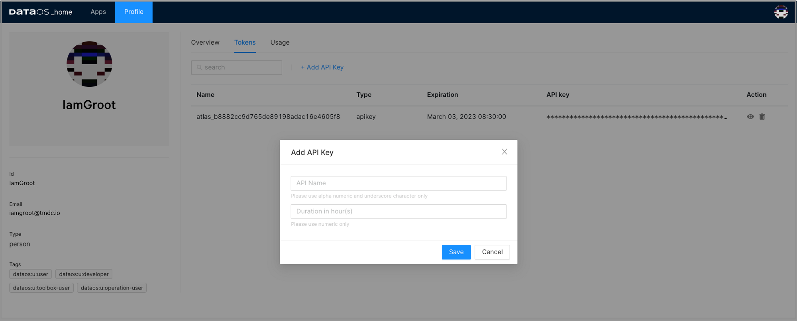
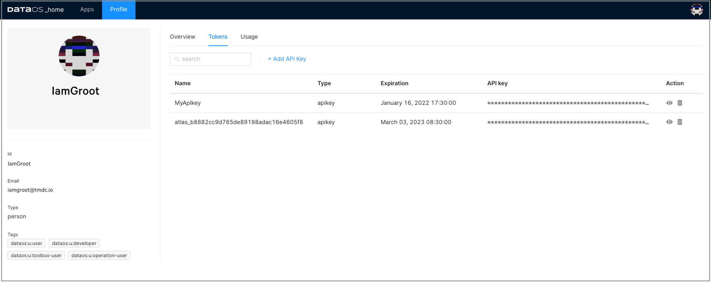
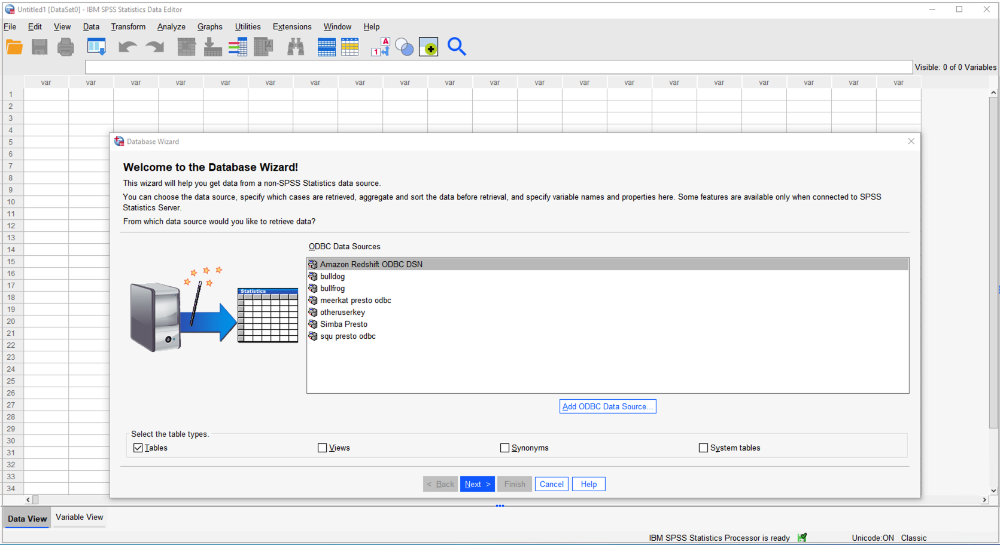
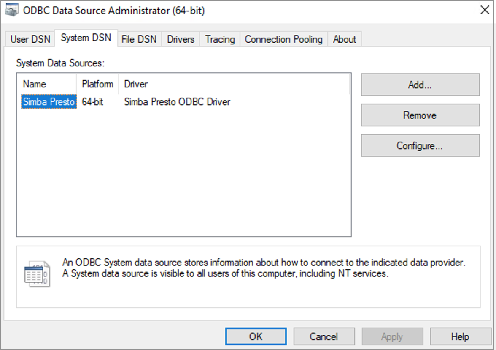
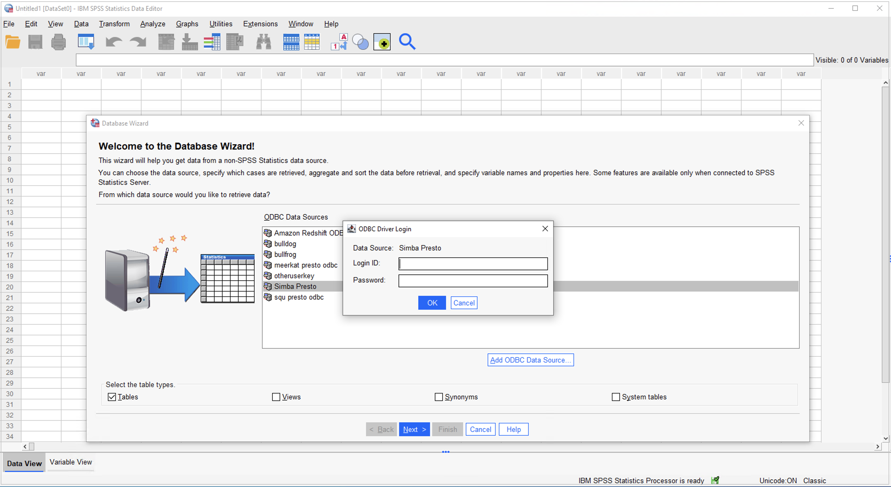
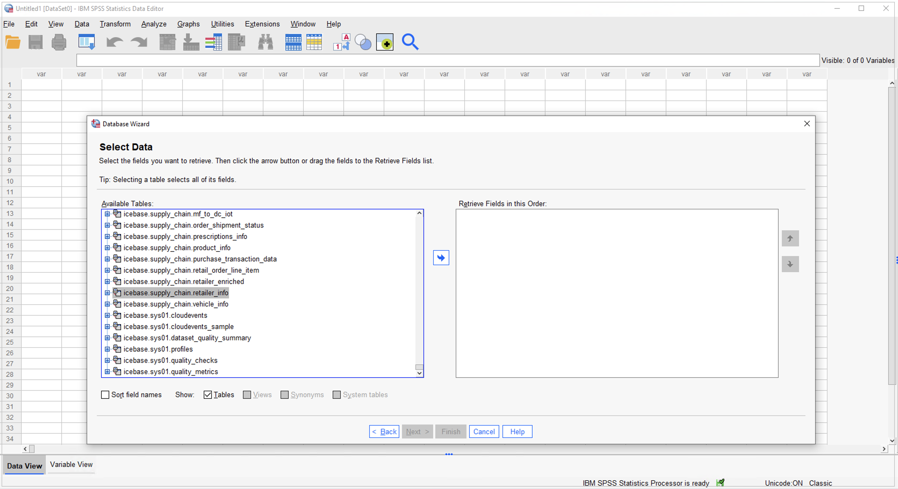
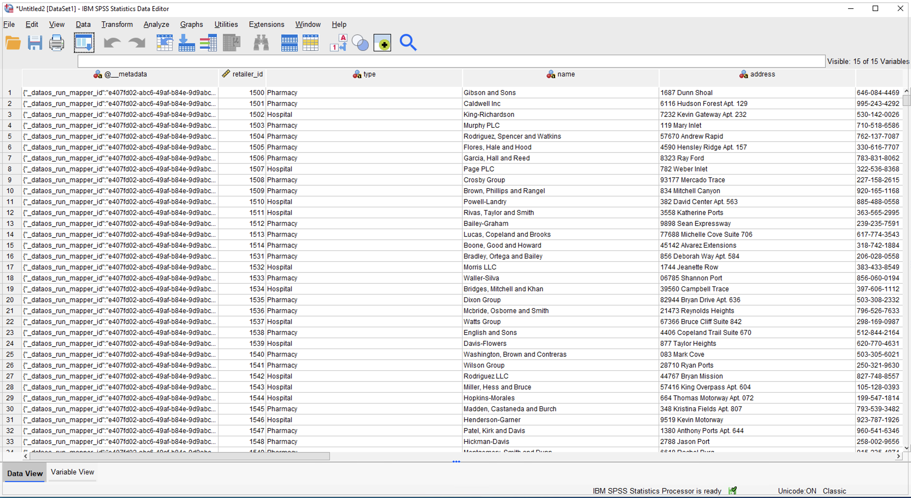

# DataOS Integration with IBM SPSS Statistics

This article will help you to set up the connection between DataOS and SPSS Statistics. It provides specific steps needed to fetch data from DataOS into SPSS Statistics for descriptive analysis and mining.

## Explore DataOS data with SPSS Statistics

SPSS Statistics is a comprehensive statistical analysis and data management solution.  SPSS can take data from almost any type of file and use them to generate tabulated reports, charts, and plots of distributions and trends, descriptive statistics. It is used by market researchers, survey companies, government, education researchers, marketing organizations, and data miners.

DataOS and SPSS Statistics integration works to take advantage of powerful statistical analysis, of the data pulled from DataOS.

## Requirements

- SPSS Statistics installed on your system - If SPSS Statistics is not installed on your system, you can download the latest version from the [IBM SPSS software website](https://www.ibm.com/analytics/spss-statistics-software).
- Simba Presto ODBC Driver - In order to connect to DataOS Catalog, you would have to install the Presto driver.
- DataOS API token - To authenticate to and access DataOS, you will need an API token.

## Download and Install Presto Driver

1. Download it from [Presto ODBC & JDBC Drivers download page](https://www.magnitude.com/drivers/presto-odbc-jdbc).

    
    <figcaption align = "center">Driver down;oad </figcaption>

2.  To run the installer, double-click on the downloaded Simba Presto XX-bit installer file. Select the 32-bit or 64-bit version according to your system configurations.

    
    <figcaption align = "center">Driver setup </figcaption>

    Follow these steps for a successful installation.

    a. Click Next.

    b. Select the check box to accept the terms of the License Agreement if you agree, and then click Next.

    c. To change the installation location, click Change, then browse to the desired folder, and then click OK.

    To accept the installation location, click Next.

    d. Click Install.

    e. When the installation completes, click Finish.

    
    <figcaption align = "center">Setup complete </figcaption>

3. After successful installation, copy the license file (that you have received in your email) into the \lib subfolder of the Simba installation folder.

    
    <figcaption align = "center">License file </figcaption>

    > 📌 Note: Contact your network administrator in case you encounter an error due to not having required admin privileges.
    > 

## Generate DataOS API token

1. Sign in to your DataOS instance with your username and password. On the DataOS home page, click on Profile.

    
    <figcaption align = "center"> DataOS homepage</figcaption>

2. On the 'Profile' page, click on Tokens.

    
    <figcaption align = "center"> Profile</figcaption>

3. Click on the Add API Key link on the Tokens tab:

    
    <figcaption align = "center">API key </figcaption>

4. Type in a name for this token and also set the validity period of your token based on the security requirements as per your business needs. Click Save to create one for you.

    
    <figcaption align = "center"> Add key</figcaption>

5. The API key is listed below. Click on the “eye icon” on the right side to make the full API key visible.

    
    <figcaption align = "center">Key created </figcaption>

6. Click on the API key to copy it. You need this API key to configure the Simba Presto driver.

## Configure Presto ODBC DSN

To use the Simba Presto ODBC Driver in the SPSS Statistics application, you need to configure a Data Source Name (DSN) to connect to your data in DataOS.

> 📌 Note: Currently, SPSS does not provide an SPSS Data Access Pack for Mac so you need to use the Windows system. For more information, refer to [IBM Support](https://www.ibm.com/support/pages/can-i-setup-odbc-data-sources-mac-import-data-spss).
> 

1. Launch SPSS Statistics. Double-click on the New Database Query.

    
    <figcaption align = "center">New database query </figcaption>

2. Click on Add ODBC DataSource.

    
    <figcaption align = "center">Add data source </figcaption>

3. In ODBC Data Source Administrator (64-bit or 32-bit) dialog box, click the System DSN tab.

4. In the list of DSNs, select Simba Presto ODBC DSN and then click Configure.

    
    <figcaption align = "center">Select DSN </figcaption>

5. In the DSN Setup dialog box, provide the following inputs:

    - Provide 'Description' for the data source name.
    - In the 'Authentication' section:
        - Select Authentication type as `LDAP Authentication.
        - Enter your username as User and generated API key as password.
    - Now in the 'Data Source' section, provide the required information.
        - Host (e.g. tcp.reasonably-welcome-grub.dataos.io)
        - Port (e.g. 7432)
        - Catalog (e.g. icebase)
        - Schema (optional)
            
            .png )
            <figcaption align = "center">Inputs for DSN setup </figcaption>
        
    
6. In the DSN Setup dialog box, click SSL Options and enable SSL.    

    
    <figcaption align = "center">Enable SSN </figcaption>

7. Click Test. and if successful, press OK to close the Test Results dialog box.

    
    <figcaption align = "center">Test success </figcaption>

8. Click OK to save your DSN.

    > 📌 Note: If you encounter any error in setting up the connection, please check the DataOS URL, and validity of the API key and try again or contact your administrator.
    > 

## Access DataOS on SPSS Statistics

1. Launch SPSS Statistics. Click on the New Database Query option.

    
    <figcaption align = "center"> Database query option</figcaption>

2. Select the DSN you tested successfully during the DSN setup process, and double-click.

    
    <figcaption align = "center">Select DSN </figcaption>

3. Enter IBM SPSS credentials in the dialogue box and click on Connect.

    
    <figcaption align = "center">DSN login </figcaption>

4. On a successful connection, you can see the DataOS tables in the left panel. Select the table and click the Arrow button.

    
    <figcaption align = "center">Select table </figcaption>

5. You can see the fields of the selected table.

    
    <figcaption align = "center">Table fields </figcaption>

6. Now you can explore and visualize this data in SPSS Statistics.

    
    <figcaption align = "center"> SPSS table data</figcaption>