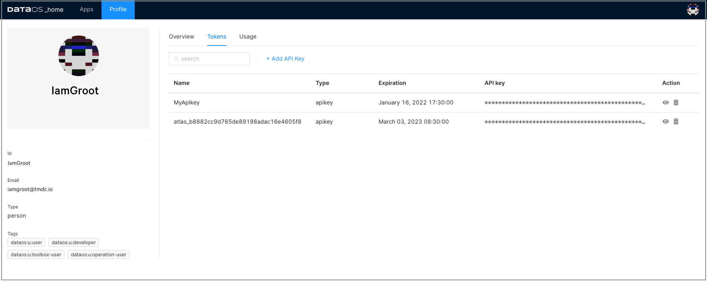

# DataOS Integration with Tableau

This article will help you to set up the connection between DataOS and Tableau. It provides specific steps needed to fetch data from DataOS into Tableau.

## Explore your DataOS data with Tableau

Tableau is one of the most powerful business intelligence tools which allows you to pull vast amounts of information from disparate sources, and helps you turn it into advanced visualizations. The dashboard created from these visualizations empowers you with business insights and helps in data-driven decisions.

DataOS and Tableau integration work to take advantage of that powerful visualization technology on the data pulled from DataOS.

## Requirements

- Tableau Desktop installed on your system - If Tableau is not installed on your system, you can download the latest version from the [Tableau website](https://www.tableau.com/products/desktop/download).
- Java installed on your system- you can download the latest version from the [Latest Oracle Java](https://www.oracle.com/java/technologies/downloads/#jdk17-mac).
- Driver - In order to connect to DataOS Catalog, you would have to install the driver.
- DataOS API token - To authenticate and access DataOS, you need an API token.

## Download and install the driver

Check your Tableau version and follow the steps given below:

- Tableau: 2021.3, 2021.2.2, 2021.1.5, 2020.4.8, 2020.3.12, and above
    
    a. Download the driver (for example, trino-jdbc-373.jar) from the [Trino](https://trino.io/docs/current/client/jdbc.html) page. Please note that Presto is Trino now.
    
    b. Copy the downloaded JAR file to the appropriate location.
    
    - ~/Library/Tableau/Drivers for MAC
    - C:\Program Files\Tableau\Drivers for WINDOWS
- Tableau: 10.0-2020.2 and below.
    
    a. Download the driver from [Tableau driver download page](https://www.tableau.com/support/drivers?__full-version=20204.21.0114.0916#presto).
    
    b. Select the operating system and bit version according to your system configurations.
    
    
    <figcaption align = "center"> Driver download</figcaption>
    
    c. Click on the Download button (mac or Windows).
    
    
    <figcaption align = "center">Driver download for Mac </figcaption>
    
    d. Double-click on downloaded 'Simba Presto 1.1.pkg' for mac or Windows 64-bit driver to run the installer.
    
    e. Click Continue and follow the steps for a successful installation.
    

## Generate DataOS API token

1. Sign in to your DataOS instance with your username and password. On the DataOS home page, click on 'Profile'.

    
    <figcaption align = "center"> </figcaption>

2. On the 'Profile' page, click on Tokens.

    
    <figcaption align = "center"> Profile</figcaption>

3. Click on the Add API Key link on the Tokens tab:

    
    <figcaption align = "center"> API key</figcaption>

4. Type in the name for this token and also set the validity period of your token based on the security requirements as per your business needs. Click Save to create one for you.

    
    <figcaption align = "center"> Add key</figcaption>

5. The API key is listed below. Click on the “eye icon” on the right side to make the full API key visible.

    
    <figcaption align = "center">Key created </figcaption>

6. Click on the API key to copy it. You would need this API key to configure the Presto driver.

## Configure driver on Tableau

You need to configure the Presto driver in the Tableau application to connect to your data in DataOS.

1. Open the Tableau desktop application. Click on More to access the list of all the servers connectors. Search for Presto and click on it.

    
    <figcaption align = "center">Server connectors </figcaption>
    
2. A dialogue box appears where the user can provide the following values:

    | Property | Value |
    | --- | --- |
    | Server | e.g. tcp.reasonably-welcome-grub.dataos.io |
    | Port | 7432 |
    | Catalog | e.g. icebase |
    | Schema | an optional field |
    | Authentication | LDAP |
    | Username | Username |
    | Password | Access API Key from DataOS |
    | Require SSL | Check the box |

    
    <figcaption align = "center"> Inputs</figcaption>
    

3. Click Sign In.

    > 📌 Note: If you encounter any error in setting up the connection, please check DataOS URL, and validity of the API key and try again or contact your administrator.

## Access DataOS on Tableau

1. Once you've completed the driver configuration steps successfully, you can see the DataOS catalog in the left panel in Tableau dialog.

    
    <figcaption align = "center"> Tableau connected</figcaption>

2. To get the list of available schemas, click on Search icon. To select the relevant schema, double-click on it.

    
    <figcaption align = "center">Schema </figcaption>

3. To bring the data from the table, click on Search icon and you can see all the tables available in your DataOS schema cluster. Double-click to select a table that you want to retrieve data from.

    
    <figcaption align = "center"> </figcaption>

4. Click Upload Now to load the data for preview. Tableau retrieves data from the selected DataOS table and loads it into a worksheet.

    
    <figcaption align = "center">Data loaded </figcaption>

5. Now you can explore and visualize this data in Tableau.

    
    <figcaption align = "center">Tableau visualization</figcaption>
    