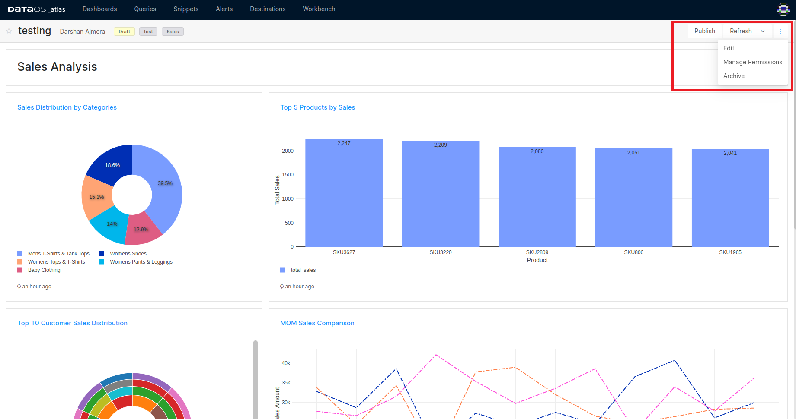
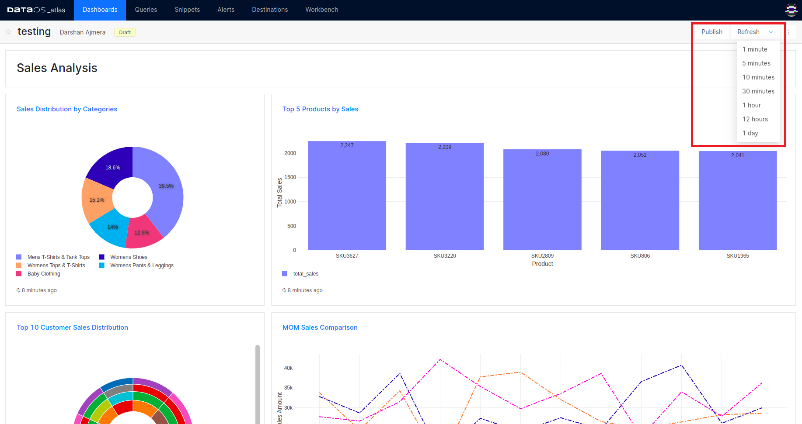

# Dashboards
## Create and Manage Dashboards

Atlas lets you create a dashboard with a collection of different visualization charts that help you to track KPIs and get your insights at a glance. Additionally, you can include text boxes to provide additional explanations, insights, or narrative to enhance the understanding of the data being presented. 

When you run your queries, you get the output in tabular form. Various visualizations like Sankey, Sunburst, Treemap, Bar, etc., can be created from the query output.  Create new dashboards and start adding visualizations to them. 

To learn more about how to create and add visualization to your dashboard, click here.

[Adding Visualizations to Dashboards](dashboards/adding_visualizations.md)

## Manage Dashboard Permissions

Any dashboard created by a user can be shared with another user via the 'Manage Permissions' option. Any user added can edit the Dashboard, i.e., add/edit and delete visualizations, rearrange the windows, etc. However, the author of the dashboard reserves the right to share the dashboard and add other users.

<figcaption align = "center">Sharing a dashboard</figcaption>

## Dashboard Refresh

To force a refresh, click the **Refresh** button on the upper-right of the dashboard editor. This runs all the dashboard queries and updates its visualizations.

<figcaption align = "center">Refresh schedule options</figcaption>