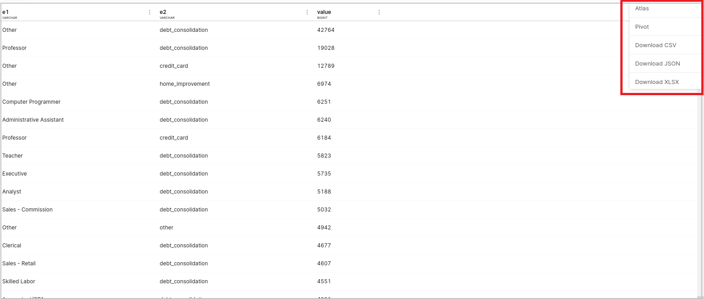
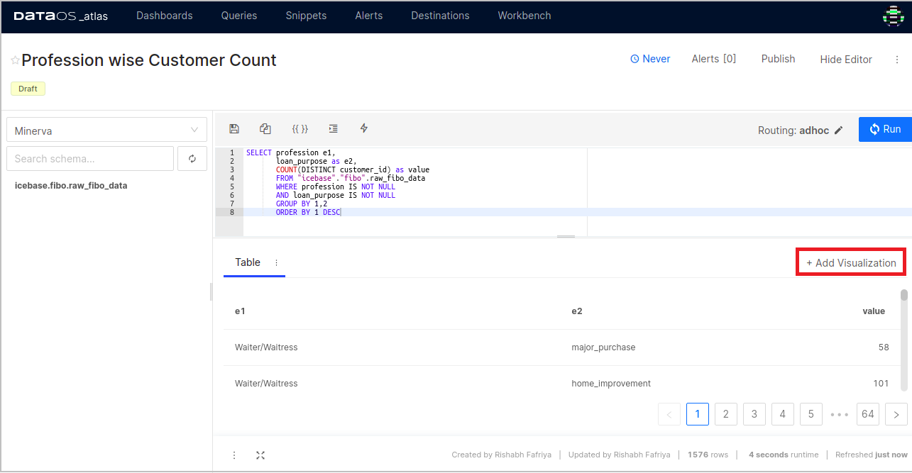
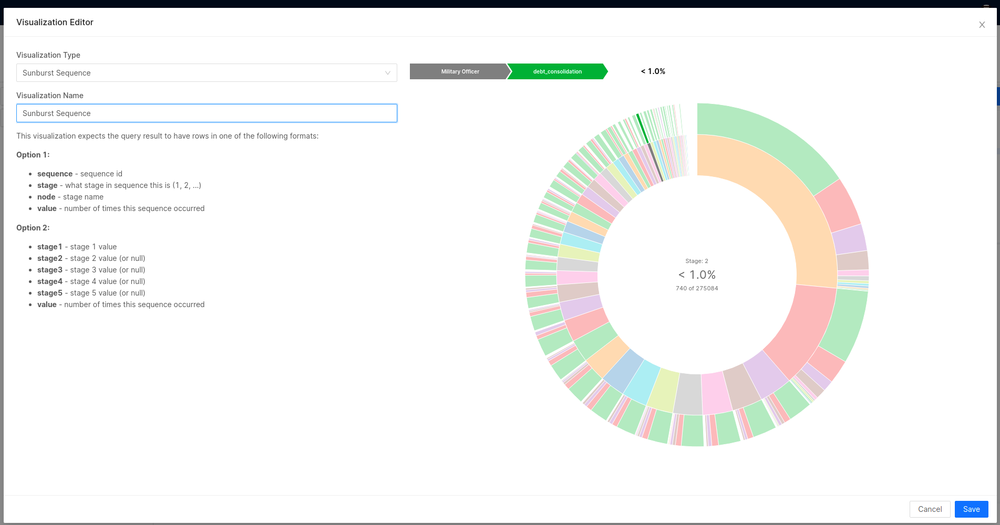
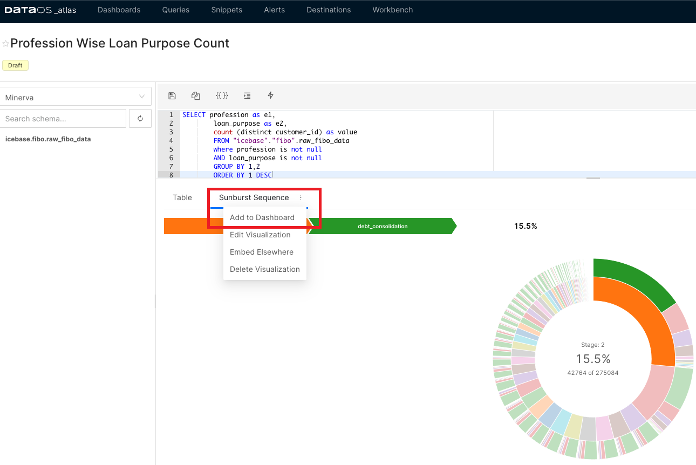
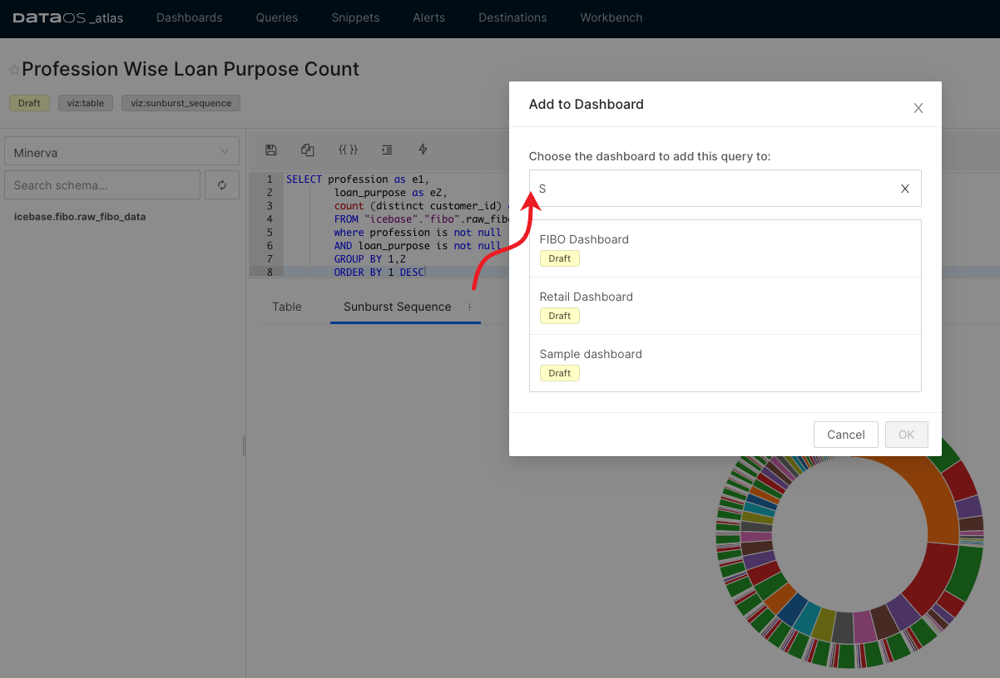
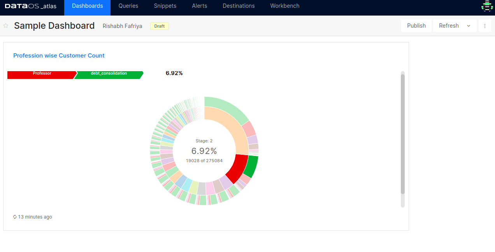
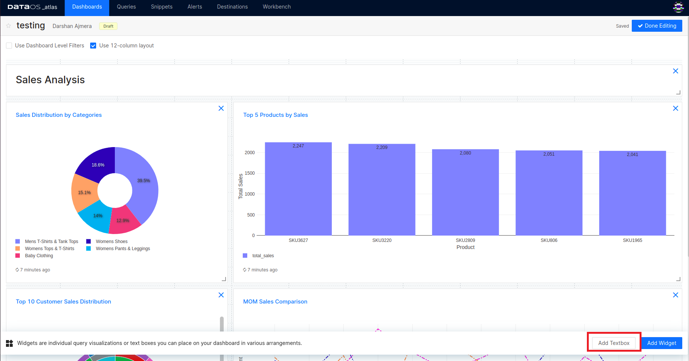
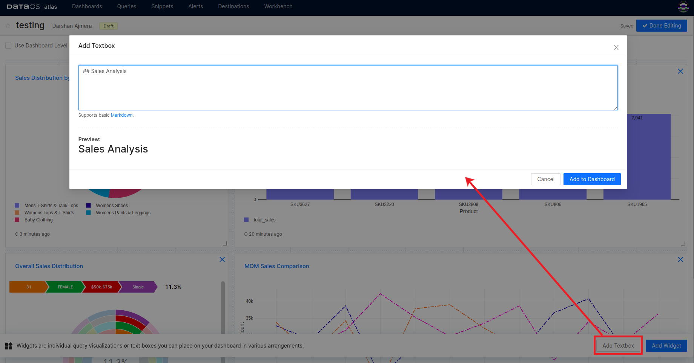

# Adding Visualizations to Dashboards

This tutorial demonstrates the steps to create and add visualizations charts like Sankey, Sunburst, Treemap, Bar, etc., to an existing/new Dashboard. 

When you have explored and gathered all the necessary data with appropriate queries, you can start using Atlas to create visualizations on top of that data.

## Export Query

The first step to creating dashboards is to export the query from the workbench to Atlas.

Click on the three dots present just above the output data table. In the pop-up, select the **Atlas** option. A pop-up box will appear, provide the name for the query and then export it.

<figcaption align = "center">Atlas option</figcaption>

## Create Visualization

Once you have exported your query, a new tab in your browser will open, as shown below.

You can add a chart using the visualization editor. Click on the **+Add Visualization** tab.

<figcaption align = "center">Adding visualization</figcaption>

A pop-up appears on the screen. Select the right visualization type for your data from the drop-down and provide its name.

<figcaption align = "center">Selecting visualization type</figcaption>

Based on the visualization type, provide additional inputs (if required) for rendering the chart. These inputs will vary according to the selected visualization type. Click on **Save**.

<figcaption align = "center">Visualization specific inputs </figcaption>

you can see the created visualization under the **Queries** tab.

<figcaption align = "center">Created Visualization</figcaption>

## Add Created Visualization to Dashboard

Click on the three dots present next to the chart tab. In the pop-up, click on **Add to Dashboard**.

<figcaption align = "center">Option to add visualization to the dashboard</figcaption>

Choose the one from the existing/available dashboards where you wish to add the chart /visualization and then click on **Ok**.

<figcaption align = "center">Selecting a dashboard for adding visualization</figcaption>

To see the added chart/visualization, go to the **Dashboards** tab and click on your dashboard.

<figcaption align = "center">Visualization on the dashboard</figcaption>

### **Adding Visualization to New Dashboard**

You can create a new dashboard from the `Dashboards` tab. Click on the `+ Add New` and give it a name. Then Goto the **Queries** tab and add your visualization to the newly created dashboard as explained in the previous step.

## Add Text boxes to Dashboards

Text boxes can be added to your dashboards to provide descriptions or context for your data. 

In the **Edit mode,** click on the `Add Textbox` button.

<figcaption align = "center">Adding a text box</figcaption>

Atlas provides options to style the text boxes in your dashboards using Markdown.

<figcaption align = "center">Text formatting options</figcaption>

<aside class="callout">
🗣 On any dashboard, click on `Add Widget` to add more visualizations from existing queries.

</aside>