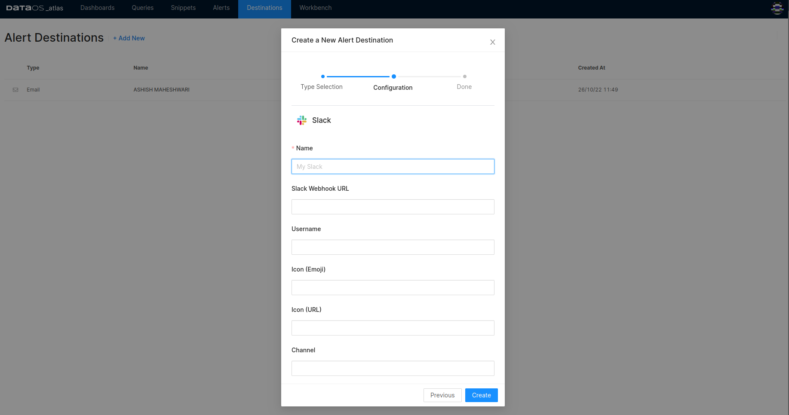

# Destinations

## Configure destination

Clicking on +Add New will give you the following screen to add a new alert destination.

<figcaption align = "center">Create destination</figcaption>

### **Destination options**

Clicking on the destination from the list will open the dialog box for entering the configurations for the desired destination.

<figcaption align = "center">Configuring destination for alert messages</figcaption>