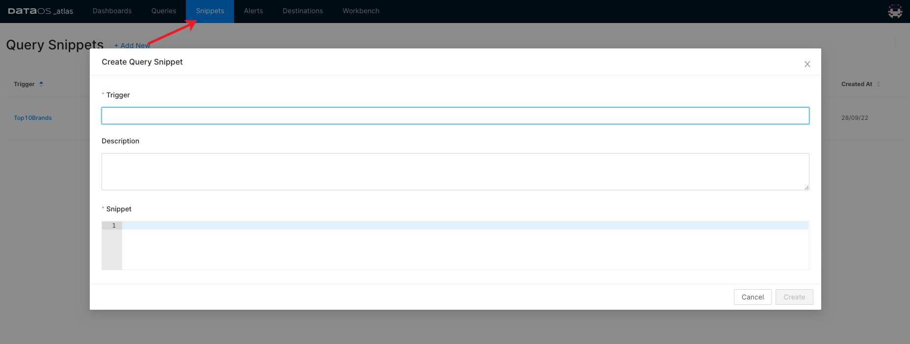

# snippet

### Create a Snippet

Clicking on +Add New will give you the following screen to add a new snippet. Provide a keyword for the trigger, which (if typed and tabbed) will be replaced with the entire snippet.

<figcaption align = "center">Creating a new snippet</figcaption">

### Insert a Snippet

In Query editor or Workbench, type the trigger keyword that you defined in the Query Snippet editor. Auto Complete will suggest the snippet like any other related word,  selecting the query snippet will insert the snippet.

<aside style="background-color:#FFE5CC; padding:15px; border-radius:5px;">
🗣 Make sure that Live Autocomplete is enabled. Click on the lightning icon shown on Query Editor.

</aside>