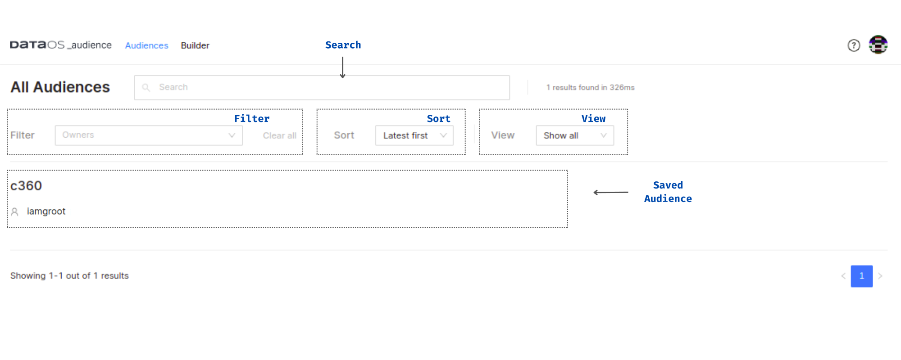

# Audience UI

## Audience on DataOS Home App
 

<figcaption align = "center">Audiences on the DataOS Home App</figcaption>
 

## Audience Builder
 

<figcaption align = "center">Audience Builder Graphical User Interface</figcaption>
 

## Saved Audiences
 

<figcaption align = "center">Saved Audiences (or specific cohorts) within the Audience App</figcaption>
 