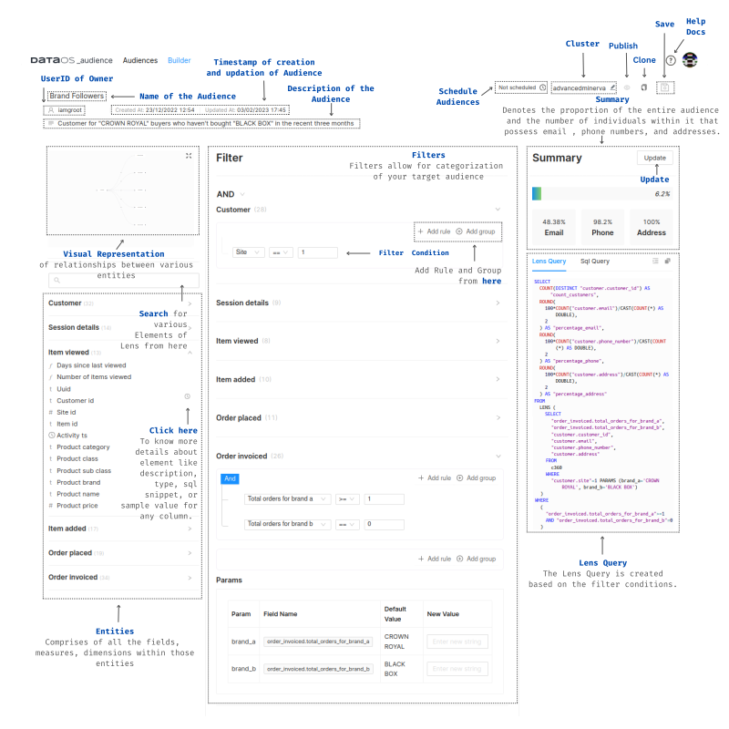
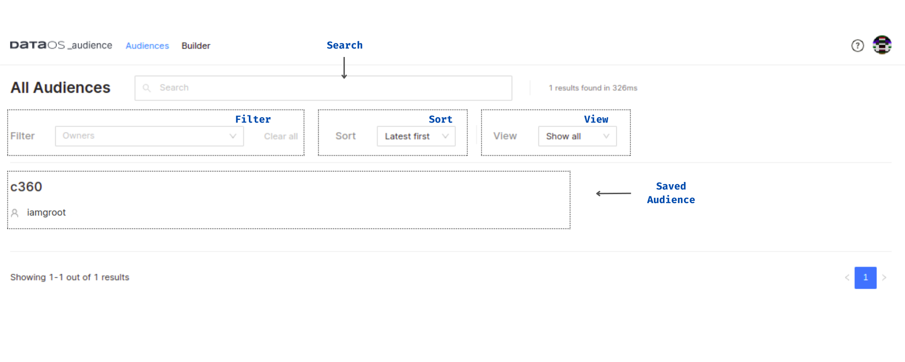

# Audiences UI

## Audiences on DataOS Home App
 

<figcaption align = "center">Audiences on the DataOS Home App</figcaption>
 

## Audiences Builder
 

<figcaption align = "center">Audiences Builder Graphical User Interface</figcaption>
 

## Saved Audiences
 

<figcaption align = "center">Saved Audiences (or specific cohorts) within the Audiences App</figcaption>
 