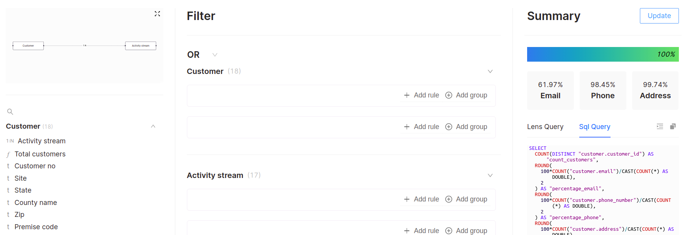
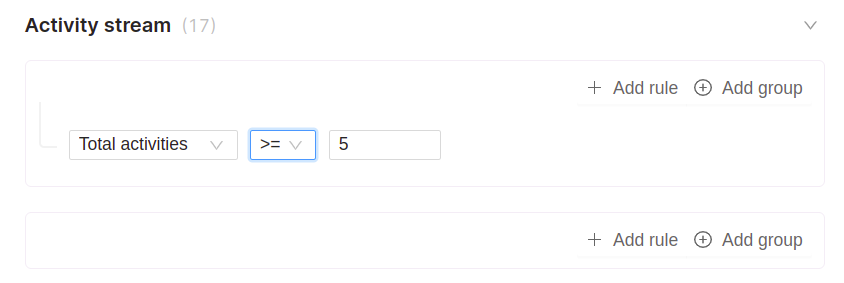
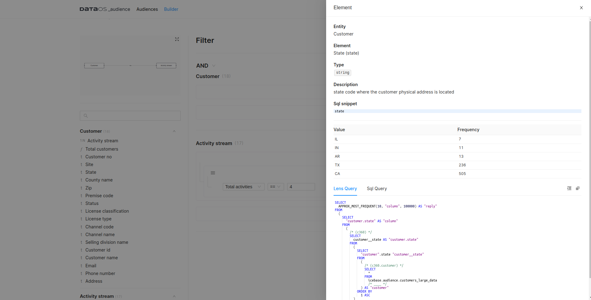
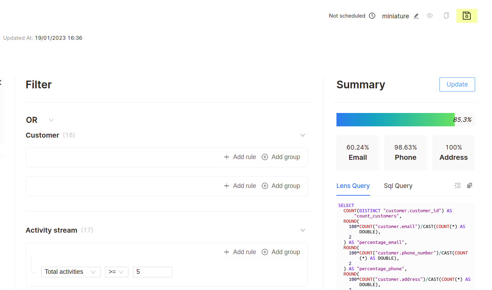
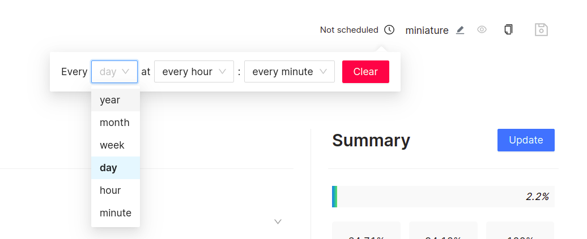

# Getting Started with Audiences

## Pre-Requisites

### **Name of the Lens should be `c360`**

A Lens with the designated name `c360` must be established. It should be noted that any other name chosen for the Lens will not be reflected within the Audience App. The Audience App provides a comprehensive view of audience information using the default Lens Query, and the name `c360` is a critical component in this regard.

### **`customer` entity with a `customer_id` field**

In the Audience App, the `customer` entity of the `c360` Lens must consistently feature a `customer_id` column, encompassing dimensions such as `email`, `phone_number`, and `address`. The absence of the `customer` entity with the `customer_id` will result in the failure of the workflow.

<aside class="best-practice"> 📖 Best Practice: Assigning a string data type to the `customer_id` field is recommended to improve query performance. However, even if a different data type is specified, our query-building process has been designed to handle it seamlessly.</aside>

Let’s get right into building audiences within the Audience App.

## Building Audiences

### **Step 1: Create a Lens**

Ensure that the Lens YAML is created with the prerequisites satisfied. If you want to learn more about the process of creating a Lens, refer to [Building Lens](/interfaces/lens/building_lens/) documentation for detailed instructions.

For the demonstration purpose, a `c360` Lens sample has been created. The YAML outlines the entities, fields, measures, and relationships, providing a structured data model for the Audience app.

<details><Summary>Example YAML for the 'c360'</summary>

```yaml
name: "c360"
contract: "data_mapper"
description: "Data Model to answer any questions around a customer."
owner: "The Modern Data Company"
tags:
- "c360"
- "activity_schema"
- "segment"
entities:
- name: "customer"
  sql:
    query: "SELECT * FROM icebase.audience.customers_large_data"
    columns:
    - name: "customer_id"
    - name: "customer_name"
    - name: "email"
    - name: "phone_number"
    - name: "address"
    - name: "state"
    - name: "county_name"
    - name: "zip"
    tables:
    - "icebase.audience.customers_large_data_01"
  fields:
  - name: "customer_id"
    description: "unique identifier of the customer"
    tags:
    - "customer_identifier"
    type: "string"
    column: "customer_id"
    primary: true
  - name: "customer_name"
    description: "Business name the customer operates under"
    tags:
    - "name_identifier"
    type: "string"
    column: "customer_name"
    primary: false
  - name: "email"
    description: "email address of the customer"
    tags:
    - "email_identifier"
    type: "string"
    column: "email"
  - name: "phone_number"
    description: "contact number of the customer"
    tags:
    - "phone_identifier"
    type: "string"
    column: "phone_number"
  - name: "address"
    description: "postal address of the customer"
    tags:
    - "address_identifier"
    type: "string"
    column: "address"
  - name: "state"
    description: "state code where the customer physical address is located"
    type: "string"
    column: "state"
  - name: "county_name"
    description: "name of the county"
    type: "string"
    column: "county_name"
  - name: "zip"
    description: "ZIP code associate with the customer physical address"
    type: "string"
    column: "zip"
  measures:
  - name: "count_customers"
    description: "count of total customers"
    tags:
    - "total_customers"
    type: "count"
    sql_snippet: "${customer.customer_id}"
  - name: "percentage_email"
    description: "percentage customers with email"
    tags:
    - "email_reachability"
    type: "number"
    sql_snippet: "round(100*count(${customer.email})/cast(count(*) as double),2)"
  relationships:
  - type: "1:N"
    field: "customer_id"
    target:
      name: "order_placed"
      field: "entity_id"
  - type: "1:N"
    field: "customer_id"
    target:
      name: "order_rejected"
      field: "entity_id"
  - type: "1:N"
    field: "customer_id"
    target:
      name: "order_invoiced"
      field: "entity_id"
- name: "order_placed"
  sql:
    query: "SELECT \n  activity_uuid, \n  entity_id,\n  trim(feature1) as order_id,\n\
      \  activity_ts,\n  trim(feature2) as product_id,\n  trim(feature3) as brand_name,\n\
      \  trim(feature4) as supplier_name,\n  trim(feature5) as product_category,\n  cast(feature9 as double)\
      \ as order_value,\n  feature10 as request_delivery_date\nFROM icebase.audience.activity_streams_large_data\
      \ where activity = 'order_placed'\n"
    columns:
    - name: "activity_uuid"
    - name: "entity_id"
    - name: "activity_ts"
    - name: "order_id"
    - name: "product_id"
    - name: "supplier_name"
    - name: "product_category"
    - name: "order_value"
    - name: "request_delivery_date"
    tables:
    - "icebase.audience.activity_streams_large_data"
  fields:
  - name: "activity_uuid"
    description: "unique identifier of the activity event"
    type: "string"
    column: "activity_uuid"
    primary: true
  - name: "entity_id"
    description: "customer identifier"
    type: "string"
    column: "entity_id"
  - name: "order_id"
    description: "order identifier"
    type: "string"
    column: "order_id"
  - name: "activity_ts"
    description: "timestamp of the moment when activity_occured"
    type: "date"
    column: "activity_ts"
  - name: "product_id"
    description: "product identifier"
    type: "string"
    column: "product_id"
  - name: "order_value"
    description: "value of the order placed"
    type: "number"
    column: "order_value"
  - name: "request_delivery_date"
    description: "requested delivery date"
    type: "date"
    column: "request_delivery_date"
  - name: "supplier_name"
    description: "name of the supplier"
    type: "string"
    column: "supplier_name"
  - name: "product_category"
    description: "category of the product"
    type: "string"
    column: "product_category"
  dimensions:
  - name: "order_no"
    description: "unique order_no for a customer"
    type: "string"
    sql_snippet: "concat(${order_placed.entity_id},'-',split_part(${order_placed.order_id},'-',1))"
  measures:
  - name: "recency"
    description: "days since last order was placed"
    type: "min"
    sql_snippet: "day(current_date - ${order_placed.activity_ts})"
  - name: "frequency"
    description: "count of total activities"
    type: "number"
    sql_snippet: "count( distinct ${order_placed.order_no}) filter (where date(${order_placed.activity_ts})\
      \ = date('{{date:2022-07-05}}'))"
  - name: "avg_order_value"
    type: "number"
    sql_snippet: "${order_placed.monetary_for_day}/ cast(${order_placed.frequency}\
      \ as double)"
- name: "order_rejected"
  sql:
    query: "SELECT \n  activity_uuid, \n  entity_id,\n  trim(feature1) as ref_order_id,\n\
      \  activity_ts,\n  trim(feature2) as product_id,\n  trim(feature3) as order_reject_code,\n\
      \  trim(feature4) as order_status_code,\n  trim(feature5) as order_delivery_status,\n\
      \  cast(feature9 as double) as order_value,\n  feature10 as request_delivery_date,\nFROM icebase.audience.activity_streams_large_data\
      \  where activity = 'order_rejected'\n"
    columns:
    - name: "activity_uuid"
    - name: "entity_id"
    - name: "ref_order_id"
    - name: "activity_ts"
    - name: "product_id"
    - name: "order_reject_code"
    - name: "order_status_code"
    - name: "order_delivery_status"
    - name: "order_value"
    - name: "request_delivery_date"
    tables:
    - "icebase.audience.activity_streams_large_data"
    lenses: []
  fields:
  - name: "activity_uuid"
    description: "unique identifier of the activity event"
    type: "string"
    column: "activity_uuid"
    primary: true
  - name: "entity_id"
    description: "customer identifier"
    type: "string"
    column: "entity_id"
  - name: "ref_order_id"
    description: "order identifier"
    type: "string"
    column: "ref_order_id"
  - name: "activity_ts"
    description: "timestamp of the moment when activity_occured"
    type: "date"
    column: "activity_ts"
  - name: "product_id"
    description: "product identifier"
    type: "string"
    column: "product_id"
  - name: "order_value"
    description: "value of the order placed"
    type: "number"
    column: "order_value"
  - name: "request_delivery_date"
    description: "requested delivery date"
    type: "date"
    column: "request_delivery_date"
  - name: "order_reject_code"
    description: "code for rejection"
    type: "string"
    column: "order_reject_code"
  - name: "order_status_code"
    description: "code for order status"
    type: "string"
    column: "order_status_code"
  - name: "order_delivery_status"
    description: "status of order delivery"
    type: "string"
    column: "order_delivery_status"
  dimensions:
  - name: "order_no"
    description: "unique order_no for a customer"
    type: "string"
    sql_snippet: "concat(${order_rejected.entity_id},'-',split_part(${order_rejected.ref_order_id},'-',1))"
  measures:
  - name: "frequency"
    description: "count of total activities"
    type: "number"
    sql_snippet: "count( distinct ${order_rejected.order_no}) filter (where date(${order_rejected.activity_ts})\
      \ = date('{{date2:2022-07-25}}'))"
  - name: "avg_order_value"
    type: "number"
    sql_snippet: "${order_rejected.monetary_for_day}/ cast(${order_rejected.frequency}\
      \ as double)"
- name: "order_invoiced"
  sql:
    query: "SELECT \n  activity_uuid, \n  entity_id,\n  trim(feature1) as ref_order_id,\n\
      \  activity_ts,\n  trim(feature2) as product_id,\n\
      \  trim(feature4) as supplier_name,\n  trim(feature5) as product_category,\n  cast(feature9 as double) as order_value,\n   \  feature10 as request_delivery_date,\n\
      \  FROM icebase.audience.activity_streams_large_data \
      \ where activity = 'order_invoiced'\n"
    columns:
    - name: "activity_uuid"
    - name: "entity_id"
    - name: "ref_order_id"
    - name: "activity_ts"
    - name: "product_id"
    - name: "supplier_name"
    - name: "product_category"
    - name: "order_value"
    - name: "request_delivery_date"
    tables:
    - "icebase.audience.activity_streams_large_data"
  fields:
  - name: "activity_uuid"
    description: "unique identifier of the activity event"
    type: "string"
    column: "activity_uuid"
    primary: true
  - name: "entity_id"
    description: "customer identifier"
    type: "string"
    column: "entity_id"
  - name: "ref_order_id"
    description: "order identifier"
    type: "string"
    column: "ref_order_id"
  - name: "activity_ts"
    description: "timestamp of the moment when activity_occured"
    type: "date"
    column: "activity_ts"
  - name: "product_id"
    description: "product identifier"
    type: "string"
    column: "product_id"
  - name: "order_value"
    description: "order value"
    type: "number"
    column: "order_value"
  measures:
  - name: "frequency"
    description: "count of total activities"
    type: "number"
    sql_snippet: "count( distinct ${order_invoiced.ref_order_id}) filter (where date(${order_invoiced.activity_ts})\
      \ = date('{{date3:2022-07-11}}'))"
  - name: "avg_order_value"
    type: "number"
    sql_snippet: "${order_invoiced.monetary_for_day}/ cast(${order_invoiced.frequency}\
      \ as double)"
    hidden: false
    depends:
    - "frequency" 
```
</details>
### **Step 2: Deploy the Lens using Postman**

With the YAML for the Lens being created, the next step is to deploy it. Postman will be used as the deployment tool. Ensure that you have installed Postman and followed all necessary steps to deploy the Lens.

### **Step 3: Access the Audience App**

Once the Lens is deployed in the DataOS environment, go to the Audiences application on the DataOS Homepage and navigate to the Builder section. When you deploy a Lens named "c360" that meets all the prerequisites, it instantly appears in the Audience Builder. From there, you can explore the entities in the c360 model, review the different fields and measures associated with them, and visually examine the relationships between them. The below image depicts the various steps to be executed while building audiences:
 
<center>


</center>
<figcaption align = "center"> Audience Builder  </figcaption>

The following is a comprehensive procedure that outlines the steps depicted in the aforementioned diagram:

#### **3.1: Provide Name and Description for the Audience**

As a primary step, it is essential to supply the name and description to the audience. The provision of the name is a mandatory requirement, while the description is optional.

<aside class="best-practice"> 📖 Best Practice: Providing an appropriate description for the audience is part of the best practices so that people within the organization can easily find out what the saved audiences (or cohorts) represent.</aside>

#### **3.2: Select a Cluster**

In this step, select a cluster if it has not been pre-selected. If the desired cluster has already been pre-selected, proceed to the next step.

Upon selecting a cluster, you will be presented with a summary of all available data. The bar graph in the block displays the percentage of the selected cohort's audience, taking into consideration that no filter conditions or parameters have been applied at this time.
 
<center>



</center>
<figcaption align = "center"> Summary statistics </figcaption>

The summary statistics reveal that out of the total data set, only 61.97% of individuals have email information available, 98.45% have phone numbers on record, and 99.74% have address information. These statistics are essential in determining the appropriate marketing channel to use.

#### **3.3: Set Filter Conditions**

The filter capabilities provide you with the ability to segment your target audience based on specific criteria and traits. For example, by implementing a filter on the metric of total activities, to evaluate the number of target audience members who have completed more than 5 activities, simply navigate to the "Activity Stream" section within Filters and select the "+ Add rule" button. Configure the operator to ">=" and set the value to "5," as illustrated below.
 
<center>



</center>
<figcaption align = "center">Filter conditions  </figcaption>

To access the values and frequency information for a specific column, click on the `i` icon located adjacent to the column name. This will bring up a pop-up window displaying the detailed information for that column.
 
<center>



</center>
<figcaption align = "center"> Detailed column information  </figcaption>

#### **3.4: Update**

Upon clicking the "Update" button, the Summary Statistics for the selected cohort of individuals who meet the filter criteria will be displayed. The Percentage Bar within the Summary Statistics shows the proportion of individuals who satisfy the criteria. The text panes below indicate the percentage of the audience that possess email addresses, phone numbers, and physical addresses. Once you have confirmed that this is the desired audience, you may proceed to save them.

#### **3.5: Save the Targeted Audience**

The audience whose activity meets or exceeds the threshold of 5 has now been acquired. The summary reveals that 85.3% of the 100% of the audience satisfies the criteria. Within this group, 60.24% have email addresses, 98.63% have phone numbers, and 100% have physical addresses.
 
<center>



</center>
<figcaption align = "center"> Summary </figcaption>

Once you save the Audiences, they are saved in the [Audiences](../audience_ui/audience_ui.md) by the name you provided earlier, and you can still make changes to them, but you cannot schedule them or query them using Workbench until you Publish them. 

#### **3.6: Publish the Audiences**

You can click the eye-like icon near the Save button to Publish the Audiences. Only when the audiences are Published, you can schedule them. You can Clone the Published Audiences to create new ones using the Clone button.

#### **3.7: Schedule the Audiences**

Schedule the Audiences using the feature available in the Audiences App. You can choose the cadence interval, whether it's every minute, hour, day, etc. 

<aside class="callout"> 🗣️ The Audience workflow will only commence another iteration once the previous one has been successfully concluded. If an error occurs prior to the next scheduled iteration, the workflow will initiate at the designated cron time.</aside>
 
<center>



</center>
<figcaption align = "center"> Scheduling options </figcaption>

#### **3.8: Save the Audiences. Again!!!**

As soon as you save the audiences again after scheduling, a workflow will be triggered to write the audience data to the DataOS internal storage, Icebase. 

## Leveraging the Generated Audience Insights

Once the Audience data has been saved to the Icebase, it can be accessed using the Workbench for marketing campaigns targeting these specific audiences. To access the data, select the `icebase` depot and the `audience_segment` catalog in the Workbench, where you have two datasets available, `segment_stream` and `max_occurence_state`. Both these datasets can be queried to provide answers to various questions. An example query is provided below:

```sql
SELECT * FROM "icebase"."audience_segment".segment_stream LIMIT 10;
```