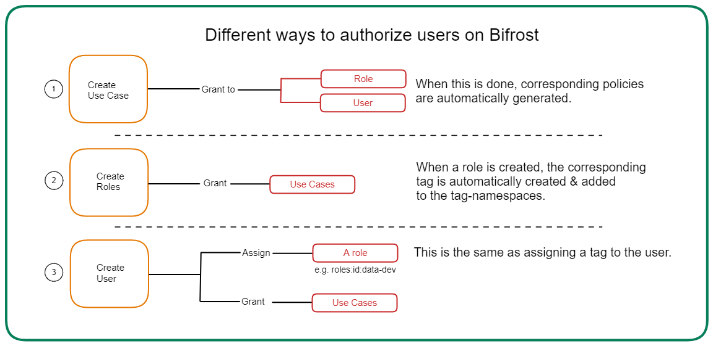

# Bifrost

Bifrost is a Graphical User Interface that enables you to create and manage access policies for applications, services, people & datasets. It is backed by the governance engine (policy engine) of DataOS, Heimdall.

All policies in DataOS are implemented as ABAC policies, giving users fine-grained control over all aspects of the operating system and their data landscape. To make the user interface intuitive, Bifrost appears to follow RBAC, but underneath it is still ABAC implementation of access control.

> Using Bifrost requires Operator level permissions; in other words, the following tag must be assigned to you: `roles:id:operator`
All other users will have ‘view-only’ permission.
> 

To understand how Bifrost works, you need to focus on three things - Users, Use-cases & Grants.

## User

A User can be an application or a person.  Think of the User as the *subject* of your ABAC policy. To learn more about the intricacies of ‘User’ in Bifrost, read through the page below:

[Users](./bifrost/users.md)

## Use-case

A use-case defines what actions you want to perform on which objects. Thus, a use-case comprises of two elements - *Predicates* & *Objects.*

Get the details of how use-cases are created and assigned here:

[Use-Cases](./bifrost/use_cases.md)

## Grant

A grant is how the Subject-Predicate-Object is linked, and an access policy is generated. This is where you assign use-cases to users, giving them access to specific parts of the system or data. We have explained Grants in detail on the page below:

[Grants](./bifrost/grants.md)

While the ability to grant specific use-cases to individual users is necessary for fine-grained access control, it is pragmatic to be able to group these users together. We call these groups Roles.

## Roles

A role in DataOS is basically a tag present in the tag-namespace called roles, with the glob `roles:**`. It is a way to group two or more subjects that need to share the same level of access to various entities in the ecosystem. The following page elaborates on the default roles in DataOS, and how you can create new roles and manage them.

[Roles](./bifrost/roles.md)

The diagram below summarises how you can provide access through Bifrost.

