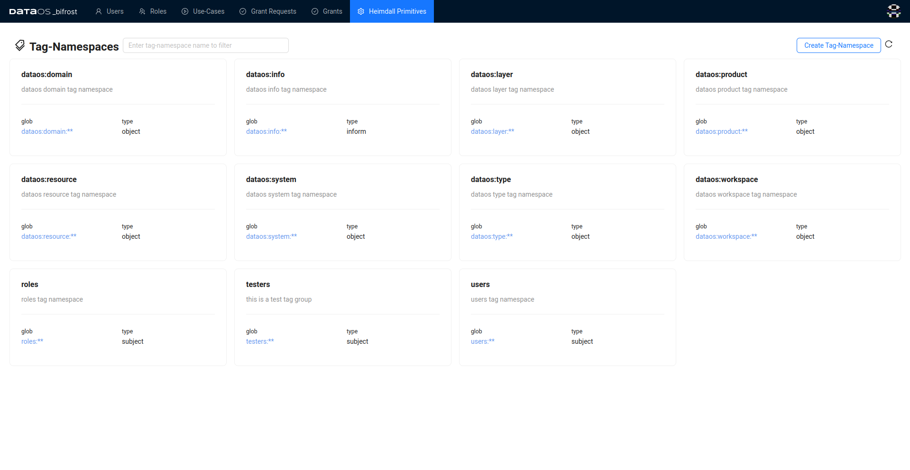

# Bifrost

Bifrost is a Graphical User Interface that enables you to create and manage access policies for applications, services, people & datasets. It is backed by the governance engine of DataOS, Heimdall.

All policies in DataOS are implemented as ABAC policies, giving users fine-grained control over all aspects of the operating system and their data landscape. To make the user interface intuitive, Bifrost appears to follow RBAC, but underneath it is still ABAC implementation of access control. The following page explains in detail how this framework is implemented in DataOS click [here](../interfaces/bifrost_new/abac_implementation_in_dataos.md)

<aside class="callout">

 🗣️ Using Bifrost requires operator-level permissions; in other words, the following tag must be assigned to the user: `roles:id:operator` All other users will have ‘view-only’ permission.

</aside>

## How does Bifrost work?

DataOS enforces a default denial stance, requiring users must explicitly request access to perform any action within the system. It establishes a continuous authorization mechanism, where access permissions are dynamically evaluated each time a user attempts an action. Access is granted only if the user has the requisite permissions at that precise moment. Bifrost is a tool to implement this philosophy,  backed by Heimdall, the governance engine of DataOS implementing Attribute-Based Access Control (ABAC).

Understanding how Bifrost works involves focusing on - Users, Use-cases, Grants, Roles, and Grant Requests.

## User

An application or a person can serve as a User. Consider the User as the subject of the ABAC policy. Get the details of  'User' in Bifrost from [here](../interfaces/bifrost_new/users.md)

## Use-case

A use case in Bifrost defines actions a user wants to perform on a specific object. Get the details of how use cases are created and assigned [here](../interfaces/bifrost_new/use_cases.md).

## Grant

A grant is how the Subject-Predicate-Object is linked, and an access policy is generated. This is where you assign use-cases to users, giving them access to specific parts of the system or data. Get the details of Grants [here](../interfaces/bifrost_new/grants.md)

## Role

While the ability to grant specific Use-Cases to individual users is necessary for fine-grained access control, it is pragmatic to be able to group these users. We call these groups Roles. To know more about Roles click [here](../interfaces/bifrost_new/roles.md).

## Grant Requests

The Grant Request section in Bifrost streamlines the process of managing access permissions requests. Users can initiate grant requests through the Bifrost UI or via [CLI](../interfaces/cli.md), detailing their desired access permissions. Administrators track pending requests, prioritize responses, and meticulously review details before approving or rejecting requests in alignment with organizational policies and security requirements. To know more about Grant Requests click [here](../interfaces/bifrost_new/grant_requests.md).

## How does Heimdall facilitate authorization?

Objects represent resources exposed by the system or applications/services running on top of it, identified by either a path or a set of tags. When a user attempts to execute a predicate on an object within a service or system, Heimdall can be utilized to authorize this action. This interaction pattern is elucidated through understanding PDP and PEP.

**Policy Decision Point (PDP)**

True to its name, the Policy Decision Point (PDP) is responsible for making policy decisions. It maintains a data structure comprising all the policies and provides an API that receives a user token (to ascertain the subject), the predicate being requested, and the target object. Based on existing policies, it responds by either granting or refusing permission.

**Policy Enforcement Point (PEP)**

A Provider or Policy Enforcement Point (PEP) signifies the service at the point of access. Upon being accessed, it interacts with the Policy Decision Point (PDP), providing it with the necessary information to authorize the current context. Depending on the response received from the PDP, the PEP either permits or denies the user's intended action. For instance, during ingress, the proxy validates whether specific API paths are permissible or restricted and refrains from proxying the request if the PDP indicates denial.

## Heimdall Primitives

Heimdall primitives are components of the Heimdall authentication, authorization, and governance engine within DataOS. This section provides access to various primitives and configurations related to access control and security.

### **Providers**

In DataOS, all resources or applications function as Policy Enforcement Points (PEPs) when interacted with by other resources, applications, or users. Here, you can also access the authorization atoms associated with each provider. For instance, when inspecting the authorization atoms for Lens, you may discover permissions like saving charts, running queries, viewing tabs, saving results, and accessing attribute information. Likewise, the “Ingress Service” Provider governs and controls access to all ingress services within the data OS network. Similarly, other providers like Metis contain distinct authorization atoms for various actions such as deleting, writing, and reading, as well as root access, such as admin user privileges.

#### **How to register a PEP Provider?**

When adding a new application to the DataOS environment, it's imperative to register it as a PEP to enable interaction. To register a new PEP provider, the following details are required:

- **Version**: Indicates the version of the PEP provider. For new applications in dataos, the version is typically set to `0.1.0`.
- **ID**: Unique identifier for the PEP provider.
- **Name**: Name of the PEP provider.
- **Description**: Brief description of the PEP provider's purpose.
- **Authorization Atoms:** Define authorization atoms for the PEP provider. Authorization atoms consist of predicates and objects, specifying the conditions under which access is granted or denied. Once authorization atoms are created for the PEP provider, they can be combined in various combinations to address different use cases.

Utilize the provided manifest template as a reference for registering the new PEP provider:

```yaml
#YAML to register a new PEP provider on Bifrost
version: 0.0.1
id: gateway-pep-provider
name: Gateway PEP
description: PEP to manage access to Minerva clusters
authorization_atoms:
  - id: cluster-access
    description: authorization atom to select clusters for running Minerva queries
    predicate: select
    tags: 
      - dataos:resource:cluster:${cluster}
```

Ensure to replace `${cluster}` with the appropriate value when granting access.

Once the PEP provider is registered, follow these steps to view and manage it on Bifrost:

- The newly registered PEP (named Gateway PEP) will appear in the list of PEP Providers under the Heimdall Primitives.
- Click on the PEP provider to view its details.
- Click on an Authorization Atom to get its specific details.
- If needed, you can delete the provider after it is created.

### **Policies**

DataOS [Policy](../resources/policy.md) within Heimdall Primitives is a rule defining the association of tags with subjects, predicates, other tags, or paths linked with objects to allow or deny access. Additionally, it imposes specific conditions on metadata, thereby governing access permissions to DataOS resources and environments.

### **Tag-Namespaces**

A tag-namespace is a container or group of tags for instance `roles:**`, `users:**`.  tag-namespaces are organized into three distinct categories serving specific purposes. One category is for creating tags assigned to subjects within an access policy. Another category is designated for tags assigned to objects in the policy. Lastly,  is a category employed for conveying non-mandatory information about either the subject or object involved in the policy.

During the installation of DataOS, system tags, and default policies are generated to facilitate core functionality. These tags encompass the following predefined tag namespaces by default:

- `users:id:testuser`
- `roles:id:operator`
- `roles:id:app-user`
- `roles:id:data-dev`

However, these are not the exclusive tags created during the installation process.

<aside class="callout">
🗣 New tag namespaces can be created to mimic the organizational structure for a particular use case.
</aside>

**How to create a tag-namespace?**

To create a tag-namespace, four fields need to be specified. These fields, along with their descriptions and examples, are outlined in the table below:

| Fields | Description | Example |
| --- | --- | --- |
| Name | declare a name for the tag-namespace  | test namespace |
| GLOB | define its glob pattern | test:** |
| Type | depending on how the tags in this group will be used, declare one of these three values: subject/object/inform  | subject |
| Description | describe in short the purpose for which the tags in this namespace will be created | tag-namespace created specifically to create test-roles for users |

For instance, let’s create a new tag group called `testers`

To create a new tag-namespace Open Bifrost navigate to Heimdall Primitives

- Click on tag-namespace
- Now click on create tag-namespace button

<center></center>
<center>users will be directed to a page where all existing tag-namespaces are listed 
</center>

The tag-namespace will be configured with the following details, as depicted in the figure below:

- Name: tester
- GLOB: tester:**
- Type: subject
- Description: tester group


- A success message will be displayed confirming that the new tag-namespace has been added successfully. 

### **Tags**

A tag is an attribute following a fixed glob pattern, as defined by its Tag-Namespace. The tag can be of two types subject or object. For instance, `dataos:layer:system` is a object type tag and `users:id:iamgroot` is a subject type tag.

 Under the "Tags" section, users can access a list of tags organized as follows:


**How  to create a Tag?**

When creating tags, it's crucial to note that each tag is within a specific tag-namespace, preventing the creation of random or unstructured tags within the system.

### **Collections**

The diagram below summarizes how you can provide access through Bifrost.


