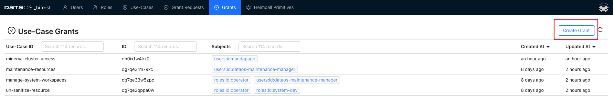

# Grants

In the Grants, administrators can easily track which use cases are assigned to specific roles and users. This level of visibility allows for precise management of user permissions.

To assign a particular use case to multiple roles, create a grant. When administrators create a grant, they define the access policies that govern user interactions with specific resources. Once a grant is created in the Grant section, it can be leveraged as a reusable template for similar access scenarios and employed repeatedly without recreating the entire configuration.

## How to create Policy Use-Case Grant?

While it's straightforward to assign use-cases to individual users via the Bifrost UI, there's a rare chance that you may be required to assign a particular use-case to multiple users across different teams, you can accomplish this by following the steps outlined below.

1. On Bifrost UI, goto the **Grants** tab, where you can view all the grants (use-cases assigned to users). Click on **Create Grant.**




1. In the create grant dialog box, define a grant manifest. A sample grant manifest is given

```yaml
policy_use_case_id: manage-pulsar
	subjects:
	- roles:id:operator
```
2. Click on the **Create** button to apply the use-case grant.

**Sample manifest 2**

```yaml
name: test-user-runas-test-dev1
version: v1alpha
type: grant
layer: user
tags:
- governance
grant:
  policy_use_case_id: run-as-user
  subjects:
  - users:id:test-user
  values:
    run-as-dataos-resource: 
    - userId: test-developer
  requester: iamgroot
  notes: the user test-user needs to runas the test-developer for data dev purposes
  approve: false
```

<aside class="callout">
🗣 To revoke a particular grant linked with a role, you'll need to delete it
</aside>