# Users

The Users tab in Bifrost presents a list of users who have access to DataOS. Users can be categorized into two types **person** & **application**. New users can be added by clicking the ‘Create User’ button. However, it's important to note that new users of type applications, can only be added directly through Bifrost.  Adding new user of person type requires access to your organization’s Active Directory.

<aside class="callout">

🗣 If you add a person as a new user through Bifrost without first including this person in your organization’s AD, it will create an empty user who cannot perform any actions. 

</aside>

<center>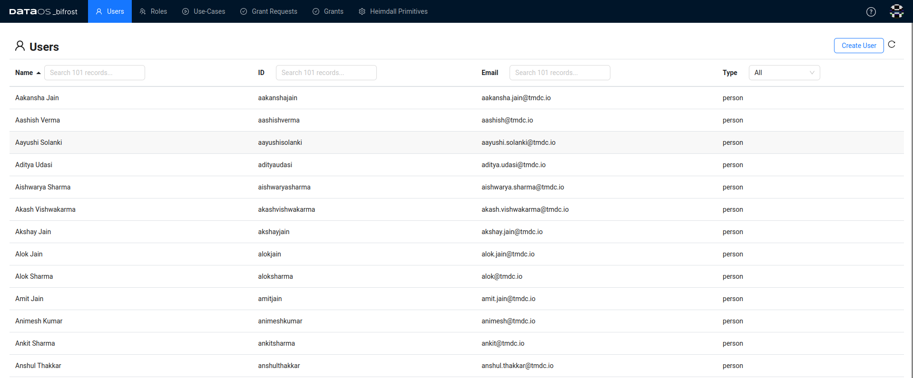</center>
<center>User tab in Bifrost</center>

## User Details Panel

Clicking on a user in the list opens a detailed view, showcasing additional information about the user. It contains further additional sections:

- **Info:** Provides additional information or metadata about the user.

<center>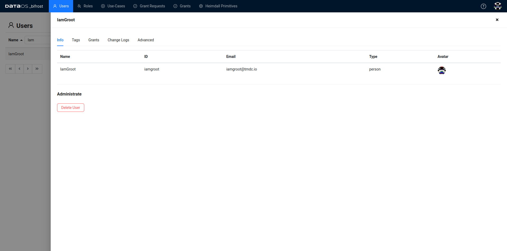</center>
<center>Info section</center>

- **Tags:** Contains the list of tags the user possesses, who assigned it, and an action button to delete the certain tag.

<center>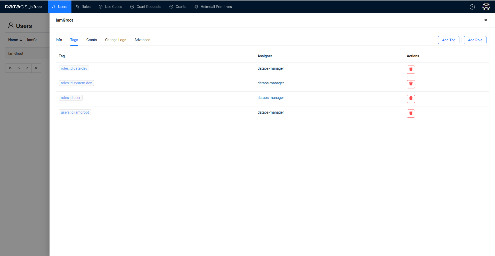</center>
<center>Tags section</center>

-  **Grants:** Displays a summary of Use-Cases granted to the user. Furthermore, clicking on a Use-Case will display the list of tags have previously been assigned to this Use-Case. You can [Grant a Use-Case to the User](../bifrost_new/users.md#how-to-grant-a-use-case-to-a-user).

<center>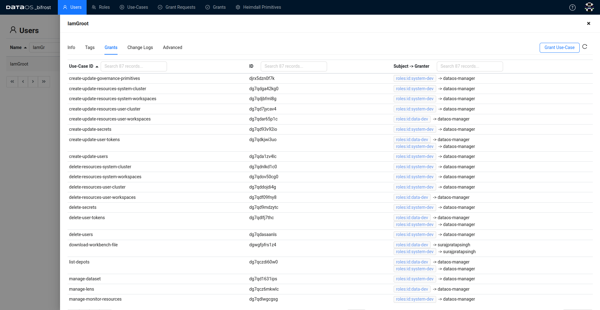</center>
<center>Grants section</center>

-  **Change Logs:** Logs any changes to the user's profile, providing an audit trail.

<center>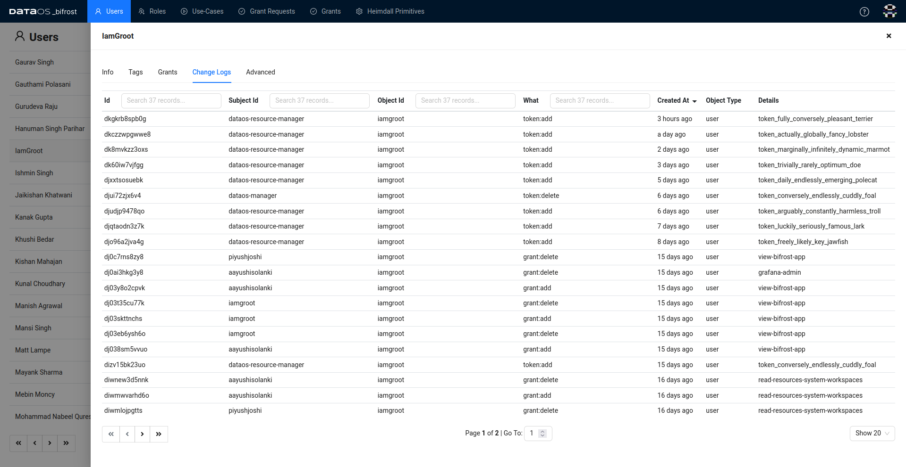</center>
<center>Change logs section</center>

- **Advanced:** Contains federated User ID and Connection ID. The system assigns a unique identifier known as the federated user ID and Connection ID to each user for identification and authentication purposes. By default, the system uses the federated user ID to identify users. Alternatively, you can add other properties for user identification using “Add Property”.

<center>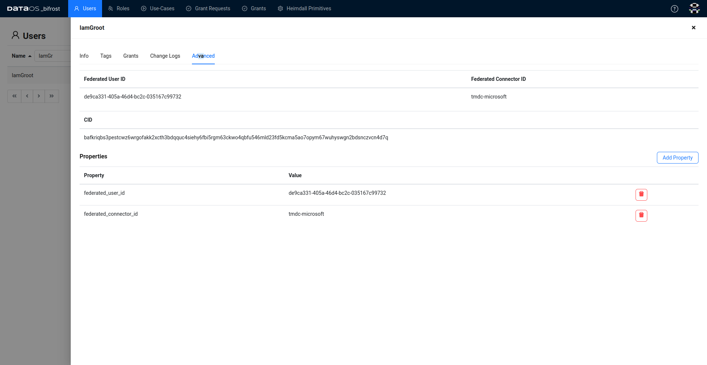</center>
<center>Advanced section</center>

## How to create a User of type Application?

1. In the top-right corner, the "Create User" button allows administrators to add new users to the system.
2. Upon clicking, a form is presented for entering user details, including Name, ID, and Type of User.

After creating the user, administrators can further tailor their access and permissions using Bifrost. Bifrost allows to manage a User's access through the following options:

- **Adding Role:** Users can be assigned new Roles and their corresponding permissions by clicking the "Add Role" option.
- **Granting Use-Case:** Instead of assigning all permissions linked with a Role, the user is granted specific Use-Case, restricting their access to precisely what is required in the given scenario.
- **Adding Tag:** New Tags can be added to the list of attributes associated with the user. It's important to note that only Tags already included in one of the Tag-Namespaces can be added.

There's a difference between assigning a Role and granting a Use-Case to a user. For the sake of illustrating, let's consider a user needs to create the depot and he does not have a `operator` role. 

**Assigning Roles**  

  Assigning `operator` Roles involves granting specific sets of permissions or capabilities to a user. `roles:id:operator` role-tag encompass a broader scope of permissions beyond just depot creation, allowing the user to perform other tasks unrelated to depot management.
    
**Granting Use-Cases**

  Granting a Use-Case involves authorizing a user to perform a specific action or set of actions within a defined context. In this context, granting the Use-Case Write Depot - DataOS Address specifically allows the user to create depots ensuring that the user's actions are restricted to the intended task. 
  
  Unlike Roles, which grant broader permissions, this Use-Case is narrowly focused on enabling depot creation only.
  
  However, when granting this Use-Case, it's essential for the user to include additional attribute called `RunasUser` in the Depot's configuration file, which is used to declare the ID of the operator who authorized them to create the depot. This ensures accountability and proper authorization, as the user's ability to create the depot is tied to a specific authorization granted by an operator.

???tip "Sample manifest template for depot creation"
    ```yaml hl_lines="11"
    name: bigquerydepot
    version: v1
    type: depot
    tags:
      - bigquery
    layer: user
    depot:
      type: BIGQUERY                 
      description: Bigquery depot connection
      external: true
      runAsUser: iamgroot
      connectionSecret:            
        - acl: rw
          type: key-value-properties
          data:
            projectid: dbt-analytics-engineer-412212
            email: dbt-user@dbt-analytics-engineer-412212.iam.gserviceaccount.com
          files:
            json_keyfile: ./bigquery.json
      spec:                           
        project: dbt-analytics-engineer-412212
    ```

## How to add a user to a Role?

To add a user to a Role follow the below steps:

- Navigate to the users and select the desired user.

  <center>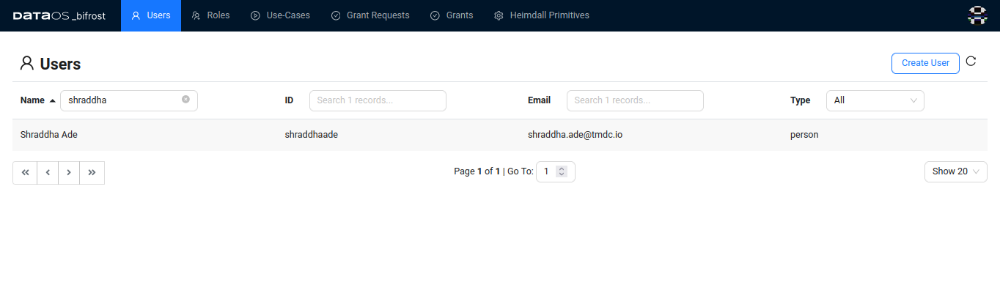</center>
  <center> Users tab </center>

- Click on the user to access their details. Now, proceed to the "Tags" section and click on the "Add Role" button.

  <center>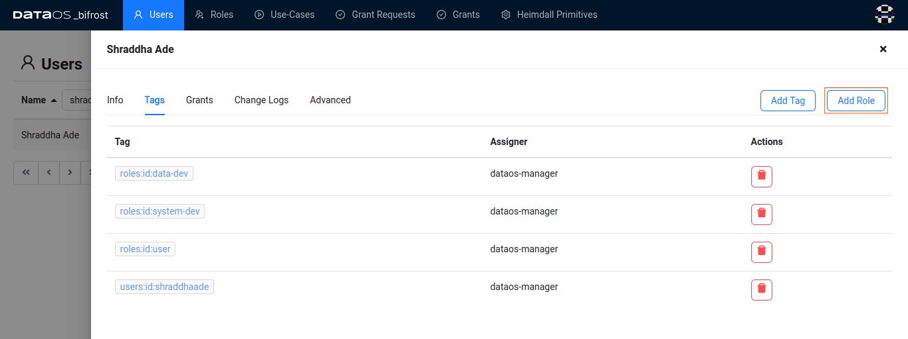</center>
   <center> Tags section under Users tab</center>

- Search for "Role pulsar admin" and select it from the options provided. and click on "Add" to assign the Role.

  <center>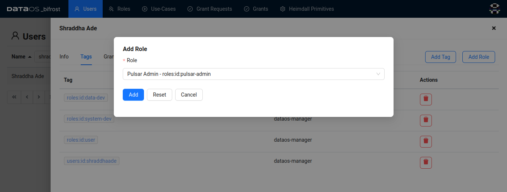</center>
  <center> Add Role button under Tags section of Users tab</center>

- Upon successful assignment, you will see the `roles:id:pulsar-admin` Role added to the list of the user's existing Tags and Roles.

  <center>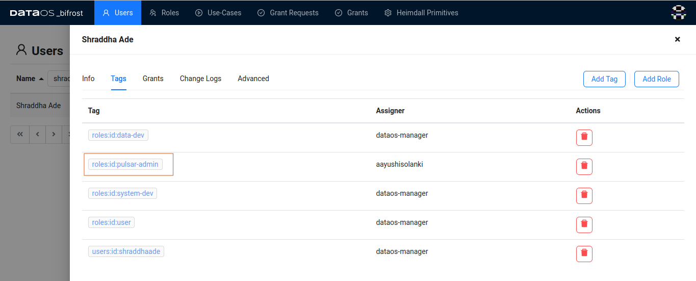</center>
  <center> New Role tag added in the Tags section</center>

As seen, when assigning a Role, a corresponding Tag is assigned to the user. Alternatively, you can also add the Tag directly by following the below steps.

## How to add a Tag to the user?

1. Navigate to the 'Tags' section in the user's profile.
2. Click on the Add Tag button.
3. Type in  the Tag Click “Add”.

You can observe a newly added Tag in the list of existing Tags for the user.

For instance, if you wish to assign the user a Role called "Pulsar Admin," you must add the Tag `roles:id:pulsar-admin`. 

## How to delete a Role-tag of a user?

You can delete a role-tag if it is no longer required for the user to have access corresponding to that particular Role.

To delete the Role or Tag of a particular user, follow these steps:

1. Select the user whose Role you wish to delete.
2. Navigate to the 'Tags' section in the user's profile.
3. Locate the desired Tag to delete.
4. Click on the delete button located in front of the desired Role.
5. Confirm the deletion if prompted.

Following these steps will result in the selected Role or Tag being removed from the user's profile, revoking the associated access permissions.

## How to grant a Use-Case to a user?

- Navigate to the Grants section of the Users tab on Bifrost and select the particular user.

<center>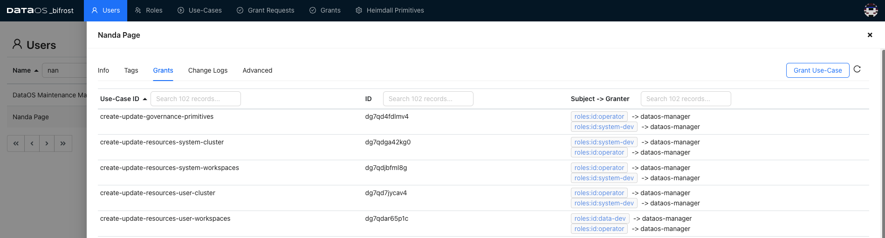</center>
<center>All Use-cases assigned to the user are displayed</center>

- Click on **Grant-Use-case**.
- In the search-box, type in minerva and select **“Minerva Cluster Access”**.
    
<center>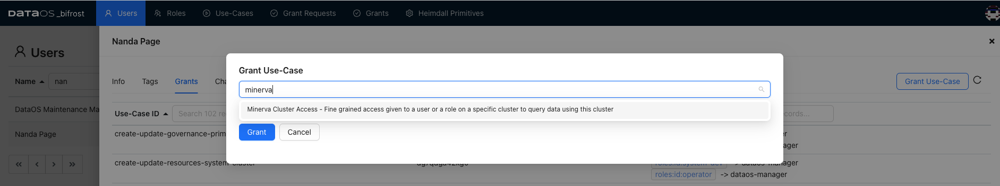</center>
<center>Minerva Cluster Access Use-Case displayed</center>

- Provide values for the feilds according to your use-case. Let’s say you want access to the miniature cluster, its catalog is icebase, under schema retail, which have table city:
    
    | Authorization Atom ID | Variable name | Value |
    | --- | --- | --- |
    | minerva-cluster-access | cluster | miniature |
    | minerva-table-read | catalog | icebase |
    | minerva-table-read | schema | retail |
    | minerva-table-read | table | city |
    | ds-read | depot | icebase |
    | ds-read | collection | city |
    | ds-read | dataset | city |

- Click on **Grant** 
    
!!! Note
    To grant a Use-Case to a Role follow the same steps just instead of going to user now you will go to Roles and select any existing Role.


In addition to granting existing Use-Cases, you can also create a new Use-Case by generating a YAML Use-Case artifact. This is particularly useful if you identify a combination of predicate and object that isn't already present but may be relevant to your organization. To initiate the creation of a new Use-Case manifest file, click [here](../bifrost_new/use_cases.md#how-to-create-a-new-use-case).