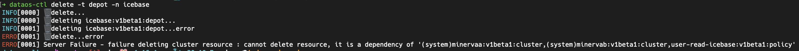

---
search:
  exclude: true
---


# CLI Command Reference

You can get a complete list of all the commands, sub-commands, arguments and flags by using the help command within CLI itself.

### **Apply**

Create and update resources in a DataOS cluster through running *apply command*. A resource in DataOS can mean a policy or depot or workflow/service/etc. This command manages applications through *.yaml* files defining DataOS resources. 

You can use *apply* to recursively create and update DataOS objects as needed.

```bash
Usage:
  dataos-ctl apply [flags]

Flags:
  -h, --help                  help for apply
  -l, --lint                  Lint the files, do not apply
  -f, --manifestFile string   Manifest file location
  -o, --overrideWarnings      Override the warnings and apply
  -R, --recursive             Get manifest files recursively from the provided directory
  -w, --workspace string      Workspace to target resource (default "public")
```

### **Completion**

This mode places you in an interactive mode with auto-completion for the given shell (zsh or bash). To setup autocomplete in current bash shell, bash-completion package should be installed first.

```bash
zsh:
option 1 (speedy prompt startup time):
    $ dataos-ctl completion zsh > ~/.dataos/.dataos-ctl-completion   # for zsh users
    $ source ~/.dataos/.dataos-ctl-completion
option 2 (always gets current commands):
    $ source <(dataos-ctl completion zsh)  # for zsh users

bash:
This depends on the bash-completion binary.  Example installation instructions:
OS X:
    $ brew install bash-completion
    $ source $(brew --prefix)/etc/bash_completion
    $ dataos-ctl completion bash > ~/.dataos/.dataos-ctl-completion  # for bash users
    $ source ~/.dataos/.dataos-ctl-completion
Ubuntu:
    $ apt-get install bash-completion
    $ source /etc/bash-completion
    $ source <(dataos-ctl completion bash)

Additionally, you may want to output the completion to a file and source in your .bashrc 
or .zshrc

Usage:
dataos-ctl completion SHELL [flags]

Flags:
-h, --help   help for completion
```

### **Context**

Manage DataOS Contexts. A context represents the connection to a DataOS cluster/instance/environment and can be used to create depots, jobs, queries etc on that cluster.

> 📌 **Note**: Only one context can be active.
> 

```bash
Usage 
dataos-ctl context [command]

Available Commands:
delete      Delete DataOS Context
list        List DataOS contexts
select      Select DataOS Context

Flags:
-h, --help   help for context

Use "dataos-ctl context [command] --help" for more information about a command.
```

**Context List**

Get the list of environments you have initialized using the *dataos-ctl init* command. The active context will be shown with a star and you can see its URL in the output.

```bash
Usage:
dataos-ctl context select [flags]

Flags:
-h, --help          help for select
-n, --name string   name of context to select
```

Here is the expected output:

```bash
➜  ~ dataos-ctl context list
INFO[0000] * meerkat                                    
INFO[0000]   squirrel                                   
INFO[0000]   wholly-merry-orca                          
INFO[0000] 🔗...https://cleanly-mutual-meerkat.dataos.io
```

**Context Delete**

Delete the context which is pointing to your DataOS environment.

```bash
Usage:
dataos-ctl context delete [flags]

Flags:
-h, --help          help for delete
-n, --name string   name of context to select
```

**Context Select**

Select a new context to point to, from the available environments.

```bash
Usage:
    dataos-ctl context select [flags]

Flags:
-h, --help          help for select
-n, --name string   name of context to select
```

### **Datanet**

Manage the Datanet of the DataOS®

```bash
Usage:
  dataos-ctl datanet [command]

Aliases:
  datanet, catalog

Available Commands:
  create        Create Entry in DataOS® Datanet
  get           Get Entry
  heartbeat     Send Workflow Run Entry Heartbeat
  lifecycle     Manage Run Entry Lifecycle
  map-stack-run Map the Stack Run to a Run Entry

Flags:
  -h, --help   help for datanet

Use "dataos-ctl datanet [command] --help" for more information about a command.
```

**Datanet Create**

Create Entry in the DataOS® Datanet.

```bash
Usage:
  dataos-ctl datanet create [flags]

Flags:
  -h, --help                  help for create
      --idOutputFile string   Id output file location
  -f, --manifestFile string   Manifest file location
  -o, --outputFile string     Yaml output file location
      --parentRunId string    Parent Run Id to associate with the Child Datanet Entry
  -p, --printRequest          Print the request as yaml
  -t, --type string           Type of entry: workflow, workflow_run, job, job_run, service, service_run, topology
  -w, --workspace string      Workspace to target datanet entries (default "public")
```

**Datanet Get**

Get Entry in the DataOS® Datanet.

```bash
Usage:
  dataos-ctl datanet get [flags]

Flags:
  -h, --help                help for get
  -n, --name string         Name or ID of the entry
  -o, --outputFile string   Yaml output file location
  -r, --runId string        Entry run id
  -t, --type string         Type of entry: workflow, workflow_run, job, job_run, service, service_run, topology
  -w, --workspace string    Workspace to target datanet entries (default "public")
```

**Datanet Heartbeat**

Send Workflow Run Entry Heartbeat in the DataOS® Datanet.

```bash
Usage:
  dataos-ctl datanet heartbeat [flags]

Flags:
  -h, --help                help for heartbeat
  -n, --name string         Name of the entry
  -o, --outputFile string   Yaml output file location
  -r, --runId string        Entry run id
  -t, --type string         Type of entry: workflow_run, job_run, service_run
  -w, --workspace string    Workspace to target datanet entries (default "public")
```

**Datanet Lifecycle**

Manage the Datanet of the DataOS®.

```bash
Usage:
  dataos-ctl datanet lifecycle [flags]

Flags:
  -h, --help                help for lifecycle
  -m, --message string      Run state transition message
  -n, --name string         Name of the entry
  -o, --outputFile string   Yaml output file location
  -r, --runId string        Entry run id
  -s, --state string        Run state target transition, can be: start, complete, abort, fail
  -t, --type string         Type of entry: workflow_run, job_run, service_run
  -w, --workspace string    Workspace to target datanet entries (default "public")
```

**Datanet Map-Stack-Run**

Map the Stack Run to a Run Entry in the DataOS® Datanet.

```bash
Usage:
  dataos-ctl datanet map-stack-run [flags]

Flags:
  -h, --help                     help for map-stack-run
  -n, --name string              Name of the entry
  -r, --runId string             Entry run id
  -s, --stackRunId string        Stack run id
  -v, --topologyVersion string   Stack run topology version
  -t, --type string              Type of entry: workflow_run, job_run, service_run
  -w, --workspace string         Workspace to target datanet entries (default "public")
```

### Dataset

Apply toolkit commands in the DataOS®.

```bash
Usage:
  dataos-ctl dataset [command]

Available Commands:
  add-field         Add Field
  add-properties    Add Properties
  create            Create
  drop-field        Drop Field
  get               Get
  metadata          Get Metadata
  properties        Get Properties
  remove-properties Remove Properties
  rename-field      Rename Field
  set-metadata      Set Metadata
  set-nullable      Set Nullable
  set-snapshot      Set Snapshot
  snapshots         List Snapshots
  update-field      Update Field
  update-partition  Update Partition

Flags:
  -h, --help   help for dataset

Use "dataos-ctl dataset [command] --help" for more information about a command.
```

**Dataset Add-Field**

Add field.

```bash
Usage:
  dataos-ctl dataset add-field [flags]

Flags:
  -a, --address string    Dataset Address
  -t, --datatype string   Datatype of field
  -h, --help              help for add-field
  -n, --name string       Name of new field
  -p, --precision int8    --precision 10 (only for decimal type)
  -s, --scale int8        --scale 1 (only for decimal type) (default 1)
```

**Dataset Add-Properties**

Add properties.

```bash
Usage:
  dataos-ctl dataset add-properties [flags]

Flags:
  -a, --address string       The address of Dataset
  -h, --help                 help for add-properties
  -p, --properties strings   --properties <property_name>:<property_value>
```

**Dataset Create**

Create dataset.

```bash
Usage:
  dataos-ctl dataset create [flags]

Flags:
  -a, --address string        Dataset Address
  -h, --help                  help for create
  -f, --manifestFile string   Manifest file location
```

**Dataset Drop-Field**

Drop field.

```bash
Usage:
  dataos-ctl dataset drop-field [flags]

Flags:
  -a, --address string   The dataset address
  -h, --help             help for drop-field
  -n, --name string      Name of field
```

**Dataset Get**

Get dataset address.

```bash
Usage:
  dataos-ctl dataset get [flags]

Flags:
  -a, --address string   Dataset Address
  -h, --help             help for get
```

**Dataset Metadata**

Get dataset metadata.

```bash
Usage:
  dataos-ctl dataset metadata [flags]

Flags:
  -a, --address string   The address of Dataset
  -h, --help             help for metadata
```

**Dataset Properties**

Get dataset properties.

```bash
Usage:
  dataos-ctl dataset properties [flags]

Flags:
  -a, --address string   The address of Dataset
  -h, --help             help for properties
```

**Dataset Remove-Properties**

Remove dataset properties.

```bash
Usage:
  dataos-ctl dataset remove-properties [flags]

Flags:
  -a, --address string           The address of Dataset
  -h, --help                     help for remove-properties
  -p, --properties stringArray   --properties <property_name>
```

**Dataset Rename-Field**

Rename dataset field.

```bash
Usage:
  dataos-ctl dataset rename-field [flags]

Flags:
  -a, --address string   The address of dataset
  -h, --help             help for rename-field
  -n, --name string      Name of existing field
  -m, --newName string   New name for field
```

**Dataset Set-Metadata**

Set metadata for the dataset.

```bash
Usage:
  dataos-ctl dataset set-metadata [flags]

Flags:
  -a, --address string   The address for dataset.
  -h, --help             help for set-metadata
  -v, --version string   set metadata of dataset
```

**Dataset Set-Nullable**

Set nullable.

```bash
Usage:
  dataos-ctl dataset set-nullable [flags]

Flags:
  -a, --address string    The address of Dataset
  -h, --help              help for set-nullable
  -n, --name string       Name of field
  -b, --nullable string   true for nullable field, else false
```

**Dataset Set-Snapshot**

Set snapshot.

```bash
Usage:
  dataos-ctl dataset set-snapshot [flags]

Flags:
  -a, --address string   The address of Dataset
  -h, --help             help for set-snapshot
  -i, --id string        The snapshot id
```

**Dataset Snapshots**

List dataset snapshots.

```bash
Usage:
  dataos-ctl dataset snapshots [flags]

Flags:
  -a, --address string   The address of Dataset
  -h, --help             help for snapshots
```

**Dataset Update-Field**

Update dataset field.

```bash
Usage:
  dataos-ctl dataset update-field [flags]

Flags:
  -a, --address string    The address of Dataset
  -t, --datatype string   Datatype of field
  -h, --help              help for update-field
  -n, --name string       Name of field
  -p, --precision int8    --precision 10 (only for decimal type)
  -s, --scale int8        --scale 1 (only for decimal type) (default 1)
```

**Dataset Update-Partition**

Update partition.

```bash
Usage:
  dataos-ctl dataset update-partition [flags]

Flags:
  -a, --address string       The address of Dataset
  -n, --count int            --count 2
  -h, --help                 help for update-partition
  -p, --partitions strings   --partitions <partition_type>:<column_name>:<partition_name>
```

### **Delete**

Delete resources in the DataOS.

```bash
Usage:
dataos-ctl delete [flags]

Flags:
-h, --help                help for delete
-i, --identifier string   Identifier of resource, like: NAME:VERSION:TYPE
-n, --name string         Name of resource
    --namespace string    Namespace to target resource (default "default")
-t, --type string         The resource type to get, possible values: depot, function, job, 
policy, service, secret
```

DataOS checks resource dependability while deleting resources.



### **Develop**

With this command, manage DataOS Development. You can test the changes on the local machine before directly applying on the server.

```bash
Usage:
dataos-ctl develop [command]

Available Commands:
apply             Apply development resources
get               Get development containers
get-stack-version Get stack versions
log-stream        Create development log-stream
port-forward      Create development port-forward
start             Start development container
stop              Stop development containers

Flags:
-h, --help   help for develop

Use "dataos-ctl develop [command] --help" for more information about a command.
```

**Develop Create**

Create a development container.

```bash
Usage:
dataos-ctl develop create [flags]

Flags:
-d, --dataDir string        Directory containing the data
-h, --help                  help for create
-f, --manifestFile string   Manifest file location
-s, --stack string          Job stack
```

**Develop Get**

Get running development containers.

```bash
Usage:
dataos-ctl develop get [flags]

Flags:
-h, --help   help for get
```

**Develop Port-Forward**

Create development port-forward.

```bash
Usage:
dataos-ctl develop port-forward [flags]

Flags:
-h, --help               help for port-forward
-n, --name string        Name of the Resource
    --pod                Forward specific pod directly
-p, --port string        Port mapping of the Resource (default "3000:3000")
-t, --type string        Type of the Resource (default "service")
-w, --workspace string   Workspace of the Resource (default "public")
```

**Develop Stop**

Stop running development containers.

```bash
Usage:
dataos-ctl develop stop [flags]

Flags:
-i, --containerId string   Container ID
-h, --help                 help for stop
```

### **Get**

Use *get* to pull a list of resources you have currently on your DataOS cluster. The types of resources you can get include-depot, function, job, policy, service, secret.

```bash
Usage:
dataos-ctl get [flags]

Flags:
-a, --all                Get resources for all owners
-d, --details            Set to true to include details in the result
-h, --help               Help for get command
-i, --identifier string  Identifier of resource, like: NAME:VERSION:TYPE
-n, --name string        Name to query
-o, --owner string       Get resources for a specific owner id, defaults to your id.
-r, --refresh            Auto refresh the results
    --refreshRate int    Refresh rate in seconds (default 5)
    --tags               Set to true to include tags in the result
-t, --type string        The resource type to get. Workspace resources: workflow, service, cluster, secret, database, model, synth. Cluster resources: depot, policy, compute.
-w, --workspace string   Workspace to query
```

Examples: All four syntaxes of the command are valid.

```jsx
dataos-ctl get -t workflow -w public -n quality-checks-test-cases
dataos-ctl -t workflow -w public -n quality-checks-test-cases   get
dataos-ctl -i "quality-checks-test-cases | v1beta1 | workflow | public"   get
dataos-ctl get -i "quality-checks-test-cases | v1beta1 | workflow | public"
```

Output:

```bash
INFO[0000] 🔍 workflow...                                
INFO[0002] 🔍 workflow...complete                        

            NAME            | VERSION |   TYPE   | WORKSPACE |   STATUS   |  RUNTIME  |       OWNER         
----------------------------|---------|----------|-----------|------------|-----------|----------------------
  quality-checks-test-cases | v1beta1 | workflow |  public   |   active   | succeeded | rakeshvishvakarma21  
```

### **Get Runtime**

Get the runtime details of a resource in the DataOS.

```bash
Usage:
dataos-ctl get [flags]

Flags:
-d, --details             Set to true to include details in the result
-h, --help                help for get
-i, --identifier string   Identifier of resource, like: NAME:VERSION:TYPE
-n, --name string         Name to query
-r, --runtime             Set to true to include runtime details in the result
    --tags                Set to true to include tags in the result
-t, --type string         The resource type to get. Workspace resources: workflow, service, secret. Cluster resources: depot, policy.
-w, --workspace string    Workspace to query
```

Examples:

```bash
dataos-ctl get runtime -t depot -n icebase
dataos-ctl get runtime -w system -t cluster -n minervaa
dataos-ctl get runtime -w system -t service -n iosa-receiver
dataos-ctl get runtime -w public -t workflow -n cnt-city-demo-01
dataos-ctl -i "quality-checks-test-cases | v1beta1 | workflow | public"  get runtime
```

You can also provide a string to get the runtime information.

```bash
dataos-ctl -i "quality-checks-test-cases | v1beta1 | workflow | public"  get runtime
```

Output:

```bash
INFO[0000] 🔍 workflow...                                
INFO[0002] 🔍 workflow...complete                        

            NAME            | VERSION |   TYPE   | WORKSPACE |     TITLE      |        OWNER         
----------------------------|---------|----------|-----------|----------------|----------------------
  quality-checks-test-cases | v1beta1 | workflow | public    | Quality-Checks | rakeshvishvakarma21  

           JOB NAME          |   STACK    |        JOB TITLE        |    JOB DEPENDENCIES     
-----------------------------|------------|-------------------------|-------------------------
  dataos-tool-quality-checks | toolbox    |                         | quality-checks-summary  
  quality-checks-summary     | flare:1.0  | quality-checks datasets |                         
  system                     | dataos_cli | System Runnable Steps   |                         

  SCHEDULED RUNTIME |    LAST SCHEDULED TIME     
--------------------|----------------------------
  RUNNING           | 2021-11-01T14:30:00+05:30  

  RUNTIME | PROGRESS |          STARTED          | FINISHED  
----------|----------|---------------------------|-----------
  running | 2/3      | 2021-11-01T14:30:00+05:30 |           

                NODE NAME               |        JOB NAME        |                       POD NAME                       |     TYPE     |       CONTAINERS        |   PHASE    
----------------------------------------|------------------------|------------------------------------------------------|--------------|-------------------------|------------
  quality-checks-summary-bviw-driver    | quality-checks-summary | quality-checks-summary-bviw-driver                   | pod-flare    | spark-kubernetes-driver | running    
  quality-checks-summary-execute        | quality-checks-summary | quality-checks-test-cases-bviw-1635757200-996077945  | pod-workflow | main                    | running    
  quality-checks-summary-start-rnnbl    | quality-checks-summary | -checks-test-cases-bviw-1635757200-3571325227 |
```

These commands get the runtime info and display the "node"s that are involved, then you can get the details of a specific node which then gives you the pod details of that node:

```bash
dataos-ctl -i "quality-checks-test-cases | v1beta1 | workflow | public" --node quality
-checks-summary-bviw-driver  get runtime
```

Output:

```bash
INFO[0000] 🔍 node...                                    
INFO[0003] 🔍 node...complete                            

              NODE NAME              |              POD NAME              |    IMAGE PULL SECRETS     |   PHASE    
-------------------------------------|------------------------------------|---------------------------|------------
  quality-checks-summary-bviw-driver | quality-checks-summary-bviw-driver | dataos-container-registry | Succeeded  

      CONTAINER NAME      |         CONTAINER IMAGE          | CONTAINER IMAGE PULL POLICY  
--------------------------|----------------------------------|------------------------------
  spark-kubernetes-driver | docker.io/rubiklabs/flare:5.5.48 | IfNotPresent                 

  POD CONDITION TYPE | POD CONDITION STATUS | MESSAGE |           TIME             
---------------------|----------------------|---------|----------------------------
  Initialized        | True                 |         | 2021-11-01T15:45:26+05:30  
  PodScheduled       | True                 |         | 2021-11-01T15:45:26+05:30  
  Ready              | False                |         | 2021-11-01T15:47:25+05:30  
  ContainersReady    | False                |         | 2021-11-01T15:47:25+05:30  

      CONTAINER NAME      |        CONTAINER STATE         |          STARTED          |         FINISHED           
--------------------------|--------------------------------|---------------------------|----------------------------
  spark-kubernetes-driver | Terminated Reason:Completed    | 2021-11-01T15:45:28+05:30 | 2021-11-01T15:47:25+05:30  
                          | Message: ExitCode: 0           |                           |                            

  EVENT TYPE | EVENT REASON |   EVENT SOURCE    |                    EVENT MESSAGE                    |       LAST OCCURRED       | COUNT  
-------------|--------------|-------------------|-----------------------------------------------------|---------------------------|--------
  Warning    | FailedMount  | kubelet           | MountVolume.SetUp failed for                        | 2021-11-01T15:00:31+05:30 | 1      
             |              |                   | volume "spark-conf-volume-driver"                   |                           |        
             |              |                   | : configmap                                         |                           |        
             |              |                   | "spark-drv-9f60d37cdad602e6-conf-map"               |                           |        
             |              |                   | not found                                           |                           |
```

### **Health**

Get health of DataOS CLI, DataOS resources and services. It checks if server is reachable and helps in troubleshooting.

```bash
Usage:
dataos-ctl health [flags]

Flags:
-h, --help   help for health
```

Here is the expected output of this command:

```bash
% dataos-ctl health
INFO[0000] 🏥...                                         
INFO[0000] DataOS® CLI...OK                             
INFO[0005] DataOS® CK...OK                              
INFO[0005] 🏥...complete                                 
INFO[0005] 🔗...https://formerly-saving-lynx.dataos.io   
INFO[0005] ⛅️...gcp
```

### **Help**

Get help for any command in the application.

```bash
Usage:
dataos-ctl help [command] [flags]

Flags:
-h, --help   help for help
```

### **Init**

Initialize the DataOS environment.

```bash
Usage:
dataos-ctl init [flags]

Flags:
-h, --help   help for init
```

### **Log**

Get the logs for a resource in the DataOS.

```bash
Usage:
dataos-ctl log [flags]

Flags:
-f, --follow              Follow the logs
-h, --help                help for log
-i, --identifier string   Identifier of resource, like: NAME:VERSION:TYPE
-r, --includeRunnable     Include runnable system pods and logs
-n, --name string         Name to query
-t, --type string         The resource type to get, possible values: service, workflow
-w, --workspace string    Workspace to query (default "public")
```

Examples: The log command has been updated to pass a "node" as well as to support getting logs for "cluster" and "depot" types that have runtimes. If you don't pass a "node" to the logs command it will try to display all the "main" logs for all nodes.

```bash
dataos-ctl log -w public -t workflow -n cnt-city-demo-01 --node city-execute
dataos-ctl log -w system -t cluster -n minervab --node minervab-ss-0
```

You can also pass the "-i" command with the string to get the logs.

```bash
dataos-ctl -i "quality-checks-test-cases | v1beta1 | workflow | public" --node quality
-checks-summary-bviw-driver log
```

Output:

```bash
INFO[0000] 📃 log(public)...                             
INFO[0003] 📃 log(public)...complete                     

              NODE NAME              |     CONTAINER NAME      | ERROR  
-------------------------------------|-------------------------|--------
  quality-checks-summary-bviw-driver | spark-kubernetes-driver |        

-------------------LOGS-------------------
2021-11-01 08:32:06,938 INFO  [task-result-getter-1] o.a.s.s.TaskSetManager: Finished task 54.0 in stage 1.0 (TID 69) in 17 ms on 10.212.16.7 (executor 1) (67/200)
2021-11-01 08:32:06,954 INFO  [dispatcher-CoarseGrainedScheduler] o.a.s.s.TaskSetManager: Starting task 57.0 in stage 1.0 (TID 71) (10.212.16.7, executor 1, partition 57, PROCESS_LOCAL, 4472 bytes) taskResourceAssignments Map()
2021-11-01 08:32:06,954 INFO  [task-result-getter-2] o.a.s.s.TaskSetManager: Finished task 56.0 in stage 1.0 (TID 70) in 17 ms on 10.212.16.7 (executor 1) (68/200)
...
...
...
```

you can also pass the "-c" command with the container name you want to see the logs for.

### **Login**

Login to the DataOS.

```bash
Usage:
dataos-ctl login [flags]

Flags:
-h, --help      help for login
```

### **Maintenance**

Maintenance of the DataOS.

```bash
Usage:
dataos-ctl maintenance [command]

Available Commands:
collect-garbage collects garbage on the DataOS.

Flags:
-h, --help   help for maintenance

Use "dataos-ctl maintenance [command] --help" for more information about a command.
```

**Maintenance Collect-garbage**

Collect Garbage on the DataOS.

```bash
Usage:
dataos-ctl maintenance collect-garbage [flags]

Flags:
-d, --duration string     The duration to calculate the age of resources that are eligible for garbage collection (default "168h")
-h, --help                help for collect-garbage
-k, --kubeconfig string   Kubeconfig file location
-l, --layer string        The layer to target in the DataOS, user|system (default "user")
```

### **Operate**

Operate the DataOS.

```bash
Usage:
dataos-ctl operate [command]

Available Commands:
apply        Apply manifest
chart-export Exports a Helm Chart from a Chart Registry
git          Git component manifests
install      Install components
ping         Ping
upgrade      Upgrade components
view         View DataOS® Operator Services
zip          Zip install files

Flags:
  -h, --help   help for operate

Use "dataos-ctl operate [command] --help" for more information about a command.
```

**Operate Apply**

Apply manifest on the DataOS.

```bash
Usage:
dataos-ctl operate apply [flags]

Flags:
-h, --help                  help for apply
-f, --manifestFile string   Single Manifest File Location
-n, --namespace string      Namespace
```

**Operate Chart-Export**

Exports a Helm Chart from a Chart Registry.

```bash
Usage:
dataos-ctl operate chart-export [flags]

Flags:
    --accessKey string      The AWS Access Key for ECR Chart Registry
    --accessSecret string   The AWS Access Secret for ECR Chart Registry
-c, --chart string          The chart ref
-d, --exportDir string      The directory to export the Helm chart
-h, --help                  help for chart-export
    --region string         The AWS Region for ECR Chart Registry
    --registry string       The AWS ECR Chart Registry
```

**Operate Get-Secret**

Gets a secret from Heimdall.

```bash
Usage:
dataos-ctl operate get-secret [flags]

Flags:
-h, --help        help for get-secret
-i, --id string   The secret id
```

**Operate Git**

Git component manifests on the DataOS.

```bash
Usage:
dataos-ctl operate git [flags]

Flags:
-e, --email string   Operator email
-h, --help           help for git
-l, --localOnly      Perform local only
-n, --name string    Operator name
-p, --push           Push changes
-r, --resetGitDir    Reset the local git directory
```

**Operate Install**

When you create a new server, you want to install new applications on the server. Use this command to install one or more applications/components on the server.

```bash
Usage:
dataos-ctl operate install [flags]

Flags:
-h, --help                    help for install
-i, --imagesFile string       Installation Images File Location
-f, --installFile string      Installation Manifest File Location
-n, --noGitOps                Do not push changes to the GitOps repo in DataOS®
    --oldReleaseManifest      Use old install manifest format
    --renderOnly              Render only
-r, --replaceIfExists         Replace existing resources
-s, --secretsFile string      Installation Secrets File Location
    --useExternalPostgresql   Use external postgresql
-v, --valuesFile string       Installation Values File Location
```

**Operate Ping**

```bash
Usage:
dataos-ctl operate ping [flags]

Flags:
-h, --help   help for ping
```

**Operate Upgrade**

Upgrade components on the DataOS.

```bash
Usage:
dataos-ctl operate upgrade [flags]

Flags:
-h, --help                    help for upgrade
-i, --imagesFile string       Installation Images File Location
-f, --installFile string      Installation Manifest File Location
    --oldReleaseManifest      Use old install manifest format
-s, --secretsFile string      Installation Secrets File Location
    --useExternalPostgresql   Use external postgresql
-v, --valuesFile string       Installation Values File Location
```

**Operate View**

View DataOS Operator Services from the local machine without going to server. You can create a data pipe from server to local machine.

```bash
Usage:
dataos-ctl operate view [flags]

Flags:
-h, --help                            help for view
-p, --localPort int                   The starting local port to port-forward services to (default 8081)
-s, --servicesToPortForward strings   The comma separated list of services to port-forward local: 
                                        metis,cerebro,aurora-beanstalkd,git,prometheus,
                                        service-mesh,cruise-control,kibana,spark-history
```

```bash
➜  ~ dataos-ctl operate view -s metis
INFO[0000] 📚 metis view...                              
INFO[0000] 🔭 metis port-forward..                       
INFO[0003] close connections hit enter/return?
INFO[0004] 🔭 metis port-forward.. ready
INFO[0004] : metis http://localhost:8081
```

> 📌 **Note**: Config File ".dataos.ck.config" should be present in the folder  "[/Users/[username]/.dataos/context].
> 

### **TUI**

Dataos-ctl TUI is a Terminal User Interface for DataOS. It shows all the key resources deployed on the server. You can click on the resource menu to see the corresponding details in the Resource Summary section. You can view artefacts and Run time services/resources and and their YAML. You can also view logs for runtime.

!<center>
  <div style="text-align: center;">
    
  </div>
</center>


```bash
Usage:
dataos-ctl tui [flags]

Flags:
-h, --help                help for tui
-w, --workspaces string   list of workspaces to include, comma separated
```

### **Version**

Print the version number of DataOS.

```bash
Usage:
dataos-ctl version [flags]

Flags:
-h, --help   help for version
```

### **View**

Use this command to open GUI applications from the terminal. 

```bash
Usage:
dataos-ctl view [flags]

Flags:
-a, --application string   The application to view in your default browser: apps, datanet, workbench, atlas
-h, --help                 help for view
```

For example,

```jsx
dataos-ctl view -a workbench
#this command will directly take you to the Workbench app in a new tab of the web browser 
```

### **Workspace**

Manage DataOS workspaces.

```bash
Usage:
dataos-ctl workspace [command]

Available Commands:
create      Create workspace
delete      Delete workspaces
get         Get workspaces

Flags:
-h, --help   help for workspace

Use "dataos-ctl workspace [command] --help" for more information about a command.
```

**Workspace Create**

Create workspace.

```jsx
Usage:
dataos-ctl workspace create [flags]

Flags:
-d, --description string   workspace description
-h, --help                 help for create
    --labels strings       The workspace labels
-l, --layer string         workspace layer (default "user")
-n, --name string          workspace name
    --tags strings         The workspace tags
-v, --version string       workspace version (default "v1beta1")
```

**Workspace Delete**

Delete workspaces.

```jsx
Usage:
dataos-ctl workspace delete [flags]

Flags:
-h, --help          help for delete
-n, --name string   workspace name
```

**Workspace Get**

Get workspaces.

```jsx
Usage:
dataos-ctl workspace get [flags]

Flags:
-h, --help           help for get
-l, --layer string   workspace layer (default "user")
```

### **User**

Manage DataOS users.

```bash
Usage:
dataos-ctl user [command]

Available Commands:
apikey      Manage a DataOS® User apikey
delete      Delete a user
get         Get users
tag         Manage DataOS® User's tags

Flags:
-h, --help   help for user

Use "dataos-ctl user [command] --help" for more information about a command.
```

**User Apikey**

Manage a DataOS user apikey.

```bash
Usage:
dataos-ctl user apikey [command]

Available Commands:
create      Create an apikey for a user
delete      Delete the apikey for a user
get         Get the apikey for a user

Flags:
-h, --help   help for apikey

Use "dataos-ctl user apikey [command] --help" for more information about a command.
```

**User Delete**

Delete a user

```bash
Usage:
dataos-ctl user delete [flags]

Flags:
-h, --help        help for delete
-i, --id string   Id of the user
```

**User Get**

Get users

```bash
Usage:
dataos-ctl user get [flags]

Flags:
-a, --all         Get all users
-h, --help        help for get
-i, --id string   Id of the user
```

**User Tag**

Manage DataOS user's tags.

```bash
Usage:
dataos-ctl user tag [command]

Available Commands:
add         Add tags to a user
delete      Delete tags from a user

Flags:
-h, --help   help for tag

Use "dataos-ctl user tag [command] --help" for more information about a command.
```

**User Tag Add**

Add tags to a user.

```bash
Usage:
dataos-ctl user tag add [flags]

Flags:
-h, --help           help for add
-i, --id string      Id of the user
-t, --tags strings   The tags to add
```

**User Tag Delete**

Delete tags from a user.

```bash
Usage:
dataos-ctl user tag delete [flags]

Flags:
-h, --help           help for delete
-i, --id string      Id of the user
-t, --tags strings   The tags to delete
```

