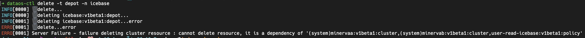

# CLI Command Reference (NEW)

You can get a complete list of all the commands, sub-commands, arguments and flags by using the help command within CLI itself.

## `apply`

Create and update resources in a DataOS cluster through running *apply command*. A resource in DataOS can mean a policy or depot or workflow/service/etc. This command manages applications through *.yaml* files defining DataOS resources. 

You can use *apply* to recursively create and update DataOS objects as needed.

```bash
Usage:
  dataos-ctl apply [flags]

Flags:
  -d, --de-ref                  De-reference the files, do not apply
      --disable-interpolation   Disable interpolation, do not interpolate $ENV|${ENV}
      --disable-resolve-stack   Disable resolve stack
  -h, --help                    help for apply
  -l, --lint                    Lint the files, do not apply
  -f, --manifestFile string     Manifest file location
  -r, --re-run                  Re-run resource after apply
  -R, --recursive               Get manifest files recursively from the provided directory
      --tls-allow-insecure      Allow insecure TLS connections
  -w, --workspace string        Workspace to target resource (default "public")
```

## `collation`
Interact with the Collation Service in the DataOS®

```shell

Usage:
  dataos-ctl collation [command]

Available Commands:
  content     Interact with content items in the DataOS® Collation Service
  metadata    Interact with metadata in the DataOS® Collation Service
  resource    Interact with resources in the DataOS® Collation Service

Flags:
  -h, --help   help for collation

Global Flags:
      --tls-allow-insecure   Allow insecure TLS connections

Use "dataos-ctl collation [command] --help" for more information about a command.

```
To learn more, refer to [Collation Command Group](collation/details.md).

## `completion`

This mode places you in an interactive mode with auto-completion for the given shell (zsh or bash). To setup autocomplete in current bash shell, bash-completion package should be installed first.

```bash
zsh:
option 1 (speedy prompt startup time):
    $ dataos-ctl completion zsh > ~/.dataos/.dataos-ctl-completion   # for zsh users
    $ source ~/.dataos/.dataos-ctl-completion
option 2 (always gets current commands):
    $ source <(dataos-ctl completion zsh)  # for zsh users

bash:
This depends on the bash-completion binary.  Example installation instructions:
OS X:
    $ brew install bash-completion
    $ source $(brew --prefix)/etc/bash_completion
    $ dataos-ctl completion bash > ~/.dataos/.dataos-ctl-completion  # for bash users
    $ source ~/.dataos/.dataos-ctl-completion
Ubuntu:
    $ apt-get install bash-completion
    $ source /etc/bash-completion
    $ source <(dataos-ctl completion bash)

Additionally, you may want to output the completion to a file and source in your .bashrc 
or .zshrc

Usage:
dataos-ctl completion SHELL [flags]

Flags:
-h, --help   help for completion
```

## `context`

Manage DataOS Contexts. A context represents the connection to a DataOS instance/environment and can be used to create depots, jobs, queries etc on that context.

<aside class-callout">Only one context can be active.
</aside>

```bash
Usage 
dataos-ctl context [command]

Available Commands:
  delete      Delete DataOS® Context
  list        List DataOS® contexts
  product     Manage products and releases for the current DataOS® context
  select      Select DataOS® Context

Flags:
-h, --help   help for context

Use "dataos-ctl context [command] --help" for more information about a command.
```

To learn more, refer to [Context Command Group](context/details.md).


## `dataset`

Apply toolkit commands in the DataOS®.

```bash
Usage:
  dataos-ctl dataset [command]

Available Commands:
  add-field         Add Field
  add-properties    Add Properties
  create            Create
  drop              Drop
  drop-field        Drop Field
  get               Get
  list              List Datasets
  metadata          Get Metadata
  properties        Get Properties
  remove-properties Remove Properties
  rename-field      Rename Field
  rollback          Rollback
  set-metadata      Set Metadata
  set-nullable      Set Nullable
  set-snapshot      Set Snapshot
  snapshots         List Snapshots
  update-field      Update Field
  update-partition  Update Partition

Flags:
  -h, --help   help for dataset

Use "dataos-ctl dataset [command] --help" for more information about a command.
```
To learn more, refer to [Dataset Command Group](dataset/details.md).

## `delete`

Delete resources in the DataOS.

```bash
Usage:
dataos-ctl delete [flags]

Flags:
      --force                 Force delete even though dependencies are not allowing it
  -h, --help                  help for delete
      --id string             Resource ID, like: TYPE:VERSION:NAME:WORKSPACE(optional), depot:v1:icebase or service:v1:ping:sandbox
  -i, --identifier string     Identifier of resource, like: NAME:VERSION:TYPE
  -f, --manifestFile string   Manifest file location
  -n, --name string           Name of resource
      --tls-allow-insecure    Allow Insecure TLS connections
  -t, --type string           The resource type to delete. Workspace resources: workflow,service,worker,secret,database,cluster,volume,resource,monitor,pager,lakehouse. Instance resources: policy,depot,compute,dataplane,stack,operator,bundle,instance-secret,grant.
  -v, --version string        Version of resource (default "v1")
  -w, --workspace string      Workspace to target resource (default "public")
```

DataOS checks resource dependability while deleting resources.



## `develop`

With this command, manage DataOS Development. You can test the changes on the local machine before directly applying on the server.

```bash
Manage DataOS® Development

Usage:
  dataos-ctl develop [command]

Available Commands:
  generate    Generate example manifests
  get         Get development containers
  schema      JSON Schema visibility for DataOS® resource types and apis
  stack       Stack specific commands
  start       Start development container
  stop        Stop development containers
  types       DataOS® resource types specific commands

Flags:
  -h, --help   help for develop

Use "dataos-ctl develop [command] --help" for more information about a command.
```
To learn more, refer to [Develop Command Group](develop/details.md).

## `doc`
Generate markdown documentation for every command

```shell

Usage:
  dataos-ctl doc [flags]

Flags:
  -h, --help   help for doc

Global Flags:
      --tls-allow-insecure   Allow insecure TLS connections
```
<aside class="callout">
🗣 The generated .md files are located within the <i>dataos-ctl-docs</i> folder in your machine's default directory.
</aside>
## `domain`
Manage domains in the DataOS®
```shell

Usage:
  dataos-ctl domain [command]

Available Commands:
  apply       Apply DataOS® Domains
  delete      Delete DataOS® Domains
  get         Get DataOS® Domains

Flags:
  -h, --help   help for domain

Global Flags:
      --tls-allow-insecure   Allow insecure TLS connections

Use "dataos-ctl domain [command] --help" for more information about a command.
```
To learn more, refer to [Domain Command Group](domain/details.md).

## `fastbase`
Interact with the FastBase Depot in the DataOS®

```shell

Usage:
  dataos-ctl fastbase [command]

Available Commands:
  namespace   Interact with namespaces in the DataOS® FastBase
  tenant      Interact with tenants in the DataOS® FastBase
  topic       Interact with topics in the DataOS® FastBase

Flags:
  -h, --help   help for fastbase

Global Flags:
      --tls-allow-insecure   Allow insecure TLS connections

Use "dataos-ctl fastbase [command] --help" for more information about a command.
```
To learn more, refer to [Fastbase Command Group](fastbase/details.md).

## `get`

Use *get* to pull a list of resources you have currently on your DataOS cluster. The types of resources you can get include-depot, function, job, policy, service, secret.

```bash
Usage:
  dataos-ctl get [flags]
  dataos-ctl get [command]

Available Commands:
  runtime     Get DataOS® Runtime Details

Flags:
  -a, --all                   Get resources for all owners
  -d, --details               Set to true to include details in the result
  -h, --help                  help for get
      --id string             Resource ID, like: TYPE:VERSION:NAME:WORKSPACE(optional), depot:v1:icebase or service:v1:ping:sandbox
  -i, --identifier string     Identifier of resource, like: NAME:VERSION:TYPE
  -f, --manifestFile string   Manifest File location
  -n, --name string           Name to query
  -o, --owner string          Get resources for a specific owner id, defaults to your id.
  -r, --refresh               Auto refresh the results
      --refreshRate int       Refresh rate in seconds (default 5)
      --tags                  Set to true to include tags in the result
      --tls-allow-insecure    Allow insecure TLS connections
  -t, --type string           The resource type to get. Workspace resources: workflow,service,worker,secret,database,cluster,volume,resource,monitor,pager,lakehouse. Instance resources: policy,depot,compute,dataplane,stack,operator,bundle,instance-secret,grant.
      --unSanitize            Get the resources un-sanitized, this includes sensitive fields.
  -v, --version string        Version to query (default "v1")
  -w, --workspace string      Workspace to query

Use "dataos-ctl get [command] --help" for more information about a command.
```
**Examples:** All four syntaxes of the command are valid.

```jsx
dataos-ctl get -t workflow -w public -n quality-checks-test-cases
dataos-ctl -t workflow -w public -n quality-checks-test-cases   get
dataos-ctl -i "quality-checks-test-cases | v1beta1 | workflow | public"   get
dataos-ctl get -i "quality-checks-test-cases | v1beta1 | workflow | public"
```

**Output:**

```bash
INFO[0000] 🔍 workflow...                                
INFO[0002] 🔍 workflow...complete                        

            NAME            | VERSION |   TYPE   | WORKSPACE |   STATUS   |  RUNTIME  |       OWNER         
----------------------------|---------|----------|-----------|------------|-----------|----------------------
  quality-checks-test-cases | v1beta1 | workflow |  public   |   active   | succeeded | rakeshvishvakarma21  
```

To learn more, refer to [Get Command Group](get/details.md).

## `health`

Get health of DataOS CLI, DataOS resources and services. It checks if server is reachable and helps in troubleshooting.

```bash
Usage:
dataos-ctl health [flags]

Flags:
-h, --help   help for health
```

Here is the expected output of this command:

```bash
% dataos-ctl health
INFO[0000] 🏥...                                         
INFO[0000] DataOS® CLI...OK                             
INFO[0005] DataOS® CK...OK                              
INFO[0005] 🏥...complete                                 
INFO[0005] 🔗...https://formerly-saving-lynx.dataos.io   
INFO[0005] ⛅️...gcp
```

## `help`

Get help for any command in the application.

```bash
Usage:
dataos-ctl help [command] [flags]

Flags:
-h, --help   help for help
```

## `init`

Initialize the DataOS environment.

```bash
Usage:
dataos-ctl init [flags]

Flags:
-h, --help   help for init
-n, --oldInitFlow   Use the old initialization flow

```
## `jq`
JSON filter a manifest using a jq filter

```shell

Usage:
  dataos-ctl jq [flags]

Flags:
      --filter string         jq filter
  -h, --help                  help for jq
  -f, --manifestFile string   Manifest file location
```
## log

Get the logs for a resource in the DataOS®

```bash

Usage:
  dataos-ctl log [flags]

Aliases:
  log, logs

Flags:
  -c, --container string    Container name to filter logs
  -f, --follow              Follow the logs
  -h, --help                help for log
  -i, --identifier string   Identifier of resource, like: NAME:VERSION:TYPE
  -r, --includeRunnable     Include runnable system pods and logs
  -n, --name string         Name to query
      --node string         Node name to filter logs
  -l, --tailLines int       Number of tail lines to retrieve, use -1 to get all logs (default 300)
  -t, --type string         The resource type to get, possible values: service, workflow, cluster, depot
  -v, --version string      Version to query (default "v1")
  -w, --workspace string    Workspace to query (default "public")
```

**Examples: **
The log command has been updated to pass a "node" as well as to support getting logs for "cluster" and "depot" types that have runtimes. If you don't pass a "node" to the logs command it will try to display all the "main" logs for all nodes.

```bash
dataos-ctl log -w public -t workflow -n cnt-city-demo-01 --node city-execute
dataos-ctl log -w system -t cluster -n minervab --node minervab-ss-0
```

You can also pass the "-i" command with the string to get the logs.

```bash
dataos-ctl -i "quality-checks-test-cases | v1beta1 | workflow | public" --node quality
-checks-summary-bviw-driver log
```

**Output:**

```bash
INFO[0000] 📃 log(public)...                             
INFO[0003] 📃 log(public)...complete                     

              NODE NAME              |     CONTAINER NAME      | ERROR  
-------------------------------------|-------------------------|--------
  quality-checks-summary-bviw-driver | spark-kubernetes-driver |        

-------------------LOGS-------------------
2021-11-01 08:32:06,938 INFO  [task-result-getter-1] o.a.s.s.TaskSetManager: Finished task 54.0 in stage 1.0 (TID 69) in 17 ms on 10.212.16.7 (executor 1) (67/200)
2021-11-01 08:32:06,954 INFO  [dispatcher-CoarseGrainedScheduler] o.a.s.s.TaskSetManager: Starting task 57.0 in stage 1.0 (TID 71) (10.212.16.7, executor 1, partition 57, PROCESS_LOCAL, 4472 bytes) taskResourceAssignments Map()
2021-11-01 08:32:06,954 INFO  [task-result-getter-2] o.a.s.s.TaskSetManager: Finished task 56.0 in stage 1.0 (TID 70) in 17 ms on 10.212.16.7 (executor 1) (68/200)
...
...
...
```

## `login`

Log in to DataOS®

```bash
Usage:
dataos-ctl login [flags]

Flags:
-h, --help      help for login
```

## `maintenance`

Maintenance of the DataOS®

```bash

Usage:
  dataos-ctl maintenance [command]

Available Commands:
  collect-garbage      Collect Garbage on the DataOS®
  create-docker-secret Creates a Docker Secret for K8S

Flags:
  -h, --help   help for maintenance
```
To learn more, refer to [Maintenance Command Group](maintenance/details.md).


## `operate`
Operate the DataOS®

```shell

Usage:
  dataos-ctl operate [command]

Available Commands:
  chart-export   Exports a Helm Chart from a Chart Registry
  exec-stream    Execute-stream a command on a specific target
  get-dataplanes Get the dataplanes
  get-secret     Gets a secret from Heimdall
  log-stream     Stream the logs on a specific target
  pulsar         Pulsar management
  tcp-stream     Tcp-stream a specific address

Flags:
  -h, --help   help for operate

Global Flags:
      --tls-allow-insecure   Allow insecure TLS connections

Use "dataos-ctl operate [command] --help" for more information about a command.
```
<aside class="callout"> 🗣 The<i> <b>operate </b></i>command is intended for use by system administrators. If you would like more information about its various subcommands, please reach out to our Customer Success team.</aside>

## `product`
Manage products in the DataOS®

```shell

Usage:
  dataos-ctl product [command]

Available Commands:
  apply       Apply DataOS® Products
  delete      Delete DataOS® Products
  get         Get DataOS® Products

Flags:
  -h, --help   help for product

Global Flags:
      --tls-allow-insecure   Allow insecure TLS connections

Use "dataos-ctl product [command] --help" for more information about a command.
```
To learn more, refer to [Product Command Group](product/details.md).

## `query-gateway`
Interact with the Query Gateway in the DataOS®

```shell

Usage:
  dataos-ctl query-gateway [command]

Available Commands:
  connect     Connect to the DataOS® Query Gateway

Flags:
  -h, --help   help for query-gateway

Global Flags:
      --tls-allow-insecure   Allow insecure TLS connections

Use "dataos-ctl query-gateway [command] --help" for more information about a command.
```
To learn more, refer to [Query-gateway Command Group](query-gateway/details.md).

## `resource`
Manage resources in the DataOS®

```shell

Usage:
  dataos-ctl resource [command]

Available Commands:
  apply       Apply DataOS® Resources
  create      Create DataOS® Resources
  delete      Delete DataOS® Resources
  get         Get DataOS® Resources
  log         Get DataOS® Resource Logs
  run         Run DataOS® Resource
  runtime     DataOS® runtime management commands
  tcp-stream  Open a tcp stream for DataOS® Resources
  update      Update DataOS® Resources

Flags:
  -h, --help   help for resource

Global Flags:
      --tls-allow-insecure   Allow insecure TLS connections

Use "dataos-ctl resource [command] --help" for more information about a command.
```
To learn more, refer to [Resource Command Group](resource/details.md).

## `role`
Manage DataOS® Roles

```shell

Usage:
  dataos-ctl role [command]

Aliases:
  role, roles

Available Commands:
  changes     View a DataOS® Role changes
  get         Get DataOS® Roles

Flags:
  -h, --help   help for role

Global Flags:
      --tls-allow-insecure   Allow insecure TLS connections

Use "dataos-ctl role [command] --help" for more information about a command.
```
To learn more, refer to [Role Command Group](role/details.md).

## `runtime`
DataOS® runtime management commands

```shell

Usage:
  dataos-ctl runtime [command]

Available Commands:
  get         Get DataOS® Runnable Resources
  pause       Pause DataOS® Runnable Resources
  re-run      Re-run DataOS® Runnable Resources
  resume      Resume DataOS® Runnable Resources
  stop        Stop DataOS® Runnable Resources

Flags:
  -h, --help   help for runtime

Global Flags:
      --tls-allow-insecure   Allow insecure TLS connections

Use "dataos-ctl runtime [command] --help" for more information about a command.
```
To learn more, refer to [Runtime Command Group](runtime/details.md).

## `tcp-stream`

Open a tcp stream for resources in the DataOS®
```shell
Open a tcp stream for resources in the DataOS®

Usage:
  dataos-ctl tcp-stream [flags]

Flags:
      --dataplane string       Dataplane name; default=hub (default "hub")
  -h, --help                   help for tcp-stream
  -i, --identifier string      Identifier of resource, like: NAME:VERSION:TYPE
      --listenPort int         Port the local client will listen on to tcp stream (default 14040)
  -n, --name string            Name of resource
      --node string            Node name to open tcp stream in resource runtime
      --servicePort int        Service port to be forwarded (default 4040)
      --serviceSuffix string   Suffix to override default service suffix: ui-svc (default "ui-svc")
      --tls-allow-insecure     Allow Insecure TLS connections
  -t, --type string            The resource type to tcp-stream. Workspace resources: workflow,service,worker,secret,database,cluster,volume,resource,monitor,pager,lakehouse. Instance resources: policy,depot,compute,dataplane,stack,operator,bundle,instance-secret,grant.
  -w, --workspace string       Workspace to target resource (default "public")
```

## `tui`
Terminal UI of the DataOS®
Dataos-ctl TUI is a Terminal User Interface for DataOS®. It shows all the key resources deployed on the server. You can click on the resource menu to see the corresponding details in the Resource Summary section. You can view artefacts and Run time services/resources and their YAML. You can also view logs for runtime.


```bash
Usage:
dataos-ctl tui [flags]

Flags:
-h, --help                help for tui
-w, --workspaces string   list of workspaces to include, comma separated
```

## `update`
Update resources in the DataOS®

```shell

Usage:
  dataos-ctl update [flags]

Flags:
      --disable-interpolation   Disable interpolation, do not interpolate $ENV|${ENV}
      --disable-resolve-stack   Disable resolve stack
  -h, --help                    help for update
  -f, --manifestFile string     Manifest file location
  -R, --recursive               Get manifest files recursively from the provided directory
      --tls-allow-insecure      Allow insecure TLS connections
  -w, --workspace string        Workspace to target resource (default "public")

```

## `user`
Manage DataOS® Users

```shell

Usage:
  dataos-ctl user [command]

Aliases:
  user, users

Available Commands:
  apikey      Manage a DataOS® User apikey
  changes     View a DataOS® User changes
  create      Create a DataOS® User
  delete      Delete a DataOS® User
  get         Get DataOS® Users
  tag         Manage DataOS® User's tags

Flags:
  -h, --help   help for user

Global Flags:
      --tls-allow-insecure   Allow insecure TLS connections

Use "dataos-ctl user [command] --help" for more information about a command.
```
To learn more, refer to [User Command Group](user/details.md).

## `usql`
usql, the universal command-line interface for SQL databases

```shell

Usage:
  usql [OPTIONS]... [DSN]

Arguments:
  DSN                            database url

Flags:
  -c, --command=COMMAND ...    run only single command (SQL or internal) and exit
  -f, --file=FILE ...          execute commands from file and exit
  -w, --no-password            never prompt for password
  -X, --no-rc                  do not read start up file
  -o, --out=OUT                output file
  -W, --password               force password prompt (should happen automatically)
  -1, --single-transaction     execute as a single transaction (if non-interactive)
  -v, --set=, --variable=NAME=VALUE ...  
                               set variable NAME to VALUE
  -P, --pset=VAR[=ARG] ...     set printing option VAR to ARG (see \pset command)
  -F, --field-separator=FIELD-SEPARATOR ...  
                               field separator for unaligned and CSV output (default "|" and ",")
  -R, --record-separator=RECORD-SEPARATOR ...  
                               record separator for unaligned and CSV output (default \n)
  -T, --table-attr=TABLE-ATTR ...  
                               set HTML table tag attributes (e.g., width, border)
  -A, --no-align               unaligned table output mode
  -H, --html                   HTML table output mode
  -t, --tuples-only            print rows only
  -x, --expanded               turn on expanded table output
  -z, --field-separator-zero   set field separator for unaligned and CSV output to zero byte
  -0, --record-separator-zero  set record separator for unaligned and CSV output to zero byte
  -J, --json                   JSON output mode
  -C, --csv                    CSV output mode
  -G, --vertical               vertical output mode
  -q, --quiet                  run quietly (no messages, only query output)
      --version                display version and exit
```

##  `version`

Print the version number of DataOS.

```bash
Usage:
dataos-ctl version [flags]

Flags:
-h, --help   help for version
```

## `view`

Use this command to open GUI applications from the terminal. 

```bash
Usage:
dataos-ctl view [flags]

Flags:
-a, --application string   The application to view in your default browser: apps, datanet, workbench, atlas
-h, --help                 help for view
```

**Example:**

```jsx
dataos-ctl view -a workbench
#this command will directly take you to the Workbench app in a new tab of the web browser 
```

## `workspace`

Manage DataOS workspaces.

```bash
Usage:
dataos-ctl workspace [command]

Available Commands:
create      Create workspace
delete      Delete workspaces
get         Get workspaces

Flags:
-h, --help   help for workspace

Use "dataos-ctl workspace [command] --help" for more information about a command.
```
To learn more, refer to [Workspace Command Group](workspace/details.md).