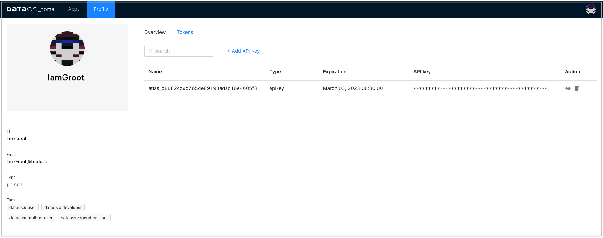
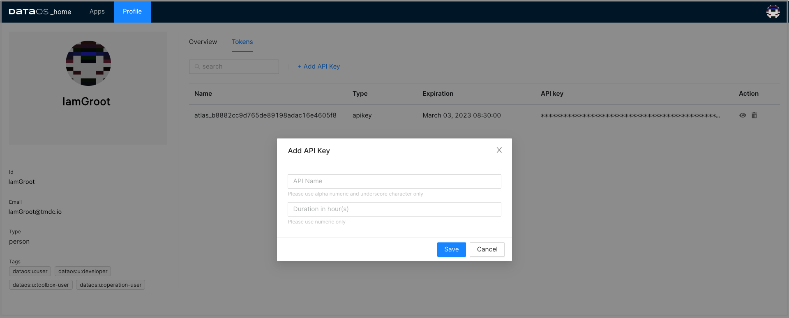
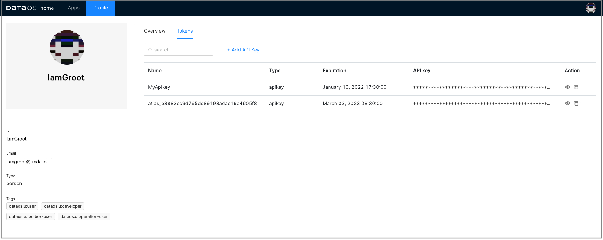

# Create API Key
## Generate API token from DataOS UI

1.  On the 'Profile' page, click on **Tokens**.

2. Click on the **Add API Key** link.
   
   <figcaption align = "center"> Adding API key</figcaption>

3. Type in the name for this token and also set the validity period of your token based on the security requirements as per your business needs. Click **Save** to create one for you.
   
   <figcaption align = "center">Providing name for the token </figcaption>

4. The API key is listed below. Clicking on the “eye icon” will make the full API key visible. Click on the API key to copy it.
   
   <figcaption align = "center"> API key created</figcaption>
 

## Create API Key Using CLI

Use the commands to:

- List existing key
- Create a new API key

### **List Existing Key**

```bash
tmdc@tmdc:~$ dataos-ctl user apikey get
INFO[0000] 🔑 user apikey get...                         
INFO[0000] 🔑 user apikey get...complete                 

                                                 TOKEN                                                 |  TYPE  |      EXPIRATION      |                  NAME                   
-------------------------------------------------------------------------------------------------------|--------|----------------------|-----------------------------------------
  aH9sAY5fcXVpY2tseVXXXXXXXXXXXXppppppppppppppppcXTUzLTgaH999999999sAY5fcXaH9ssssssssssAY5fcX0| apikey | 2023-08-10T23:00:00Z | token_ad9baade458c5c6f3  
  bbbbbbbbbI9sAY5fcXVpY2tseV9ldmVubHlfVjdF9raXQuM2ZiO0000000TI4ZTYaaaaaaaH9sAY5fcXTUzLTgaH9sAY5fcX5fcX0| apikey | 2023-06-19T08:00:00Z | token_bc6hggaa435v8b5f3
```

### **Create a new API key**

```bash
tmdc@tmdc:~$ dataos-ctl user apikey create
INFO[0000] 🔑 user apikey...                             
INFO[0000] 🔑 user apikey...complete                     

                                                   TOKEN                                                   |  TYPE  |      EXPIRATION      |                  NAME                    
-----------------------------------------------------------------------------------------------------------|--------|----------------------|------------------------------------------
  aH9sAY5fcXVpY2tseV9ldmVubHlfY29ycmVjdF9raXQuM2ZiOTI4ZTYaH9sAY5fcXTUzLTgaH9sAY5fcXaH9sAY5fcX0 | apikey | 2022-06-22T12:00:00Z | token_bc6hggaa435v8b5f3
```