# Lens

Lens is a consistent modeling layer capable of accessing and modeling data from disparate sources. It not only supports the ability to connect underlying data to real-world business objects but also enables you to formulate and delineate measures, KPIs, and relationships between different business concepts, thereby facilitating data-driven decision-making. Lens promotes data definition sharing and brings consensus among teams around data definitions, creating a unified and consolidated view of data across the organization. It is designed to break down data silos and foster mutual agreement between data producers and consumers by implementing Data Contracts.

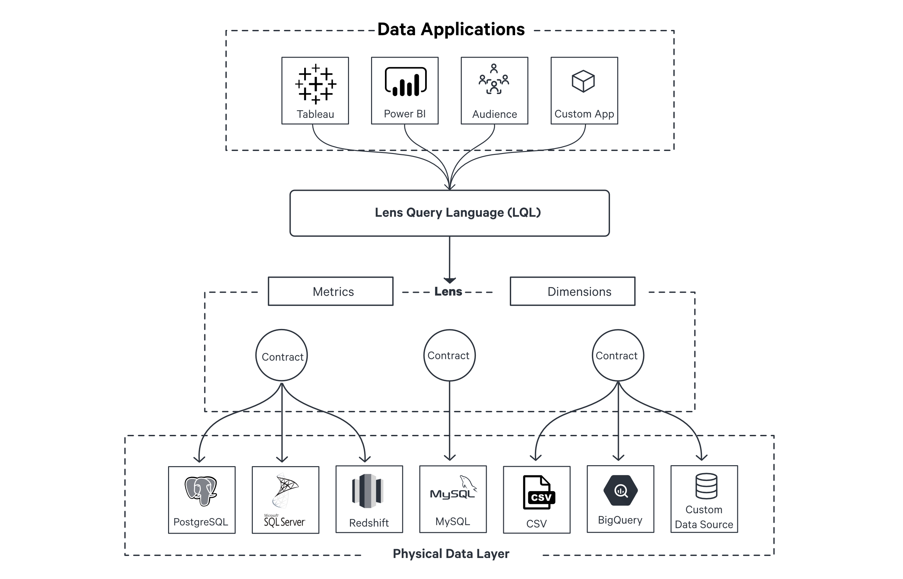

<figcaption align = "center">Placement of Lens Ecosystem between Sources and Data Consumers</figcaption>

> A data modeling layer is an interface that lays over the underlying data and consistently exposes commonly understood business terms (such as product, customer, or revenue) to the end consumers. It allows business users to consume the data how they understand it, get what they need, and realize self-service without constantly relying on data engineers for data requests. 

## Supported data sources in Lens

Lens can be built on all sources that Depots support. Lens lets you connect to and access data from managed and unmanaged object storage like CSV, parquet, Amazon S3, Azure Blob Storage, streaming sources like Pulsar, and relational and non-relational databases like PostgreSQL, MySQL, BigQuery, etc.

## Lens UI
On opening the Lens app, you can view all the Lenses created and available to consume.

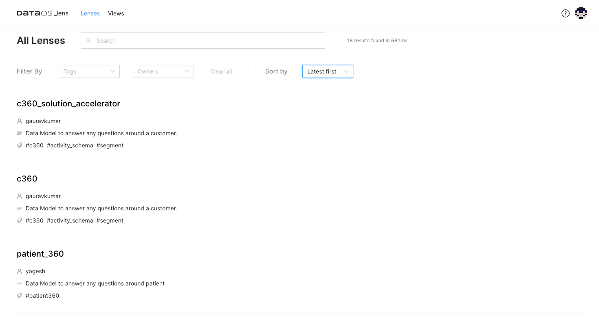

<figcaption align = "center">Lenses</figcaption>
 

Clicking on the specific Lens will open the details where entities and their schema are displayed along with   the tabs to see the relationship of the entities and definitions.
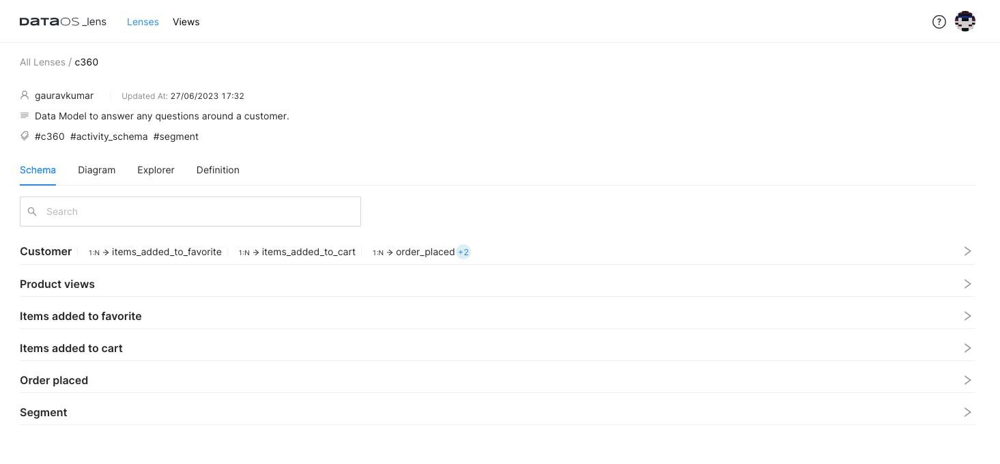

<figcaption align = "center">Lens details</figcaption>

## Lens utilities

Lens Utilities offer additional functionality and tools to enhance the Lens experience, providing support for various operational and analytical use cases.

### **Lens Explorer**

Lens Explorer is a discover and analyze tool for answering questions about anything in the Ontology layer. Its intuitive graphical user interface (GUI) empowers organizations to achieve semantic access to their data, making it possible for everyone to derive insights from it. With Lens Explorer, users can effortlessly explore business ontologies, create visually appealing charts, and generate deep insights using a user-friendly interface.

Lens Explorer's drag-and-drop interface allows users to easily build customized segments, generate insights, and create a comprehensive view for their data from the deployed Lens. They can query Lens to get answers to complex data questions in an exploratory fashion. Lens Explorer can assist personas such as Business Analysts, Product Managers, Product Analysts, and many more to move faster in their data journey. To learn more, refer to [Lens Explorer](lens/lens_explorer/lens_explorer.md).

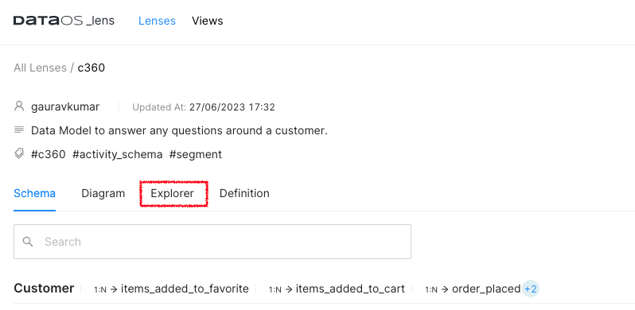

<figcaption align = "center">Lens Explorer</figcaption>
### **Lens Views** 

A View refers to a user-crafted perspective or snapshot formulated atop Lenses. It serves as a readily-shareable compilation of insights and visualizations obtained during the exploration of Lenses.  The Lens Views utility empowers users to store their customized views systematically, facilitating effortless retrieval at their convenience. These views encapsulate a diverse range of use cases and scenarios, providing a comprehensive representation of the user's analytical findings.

Upon publication, the Views become part of a list accessible under the "Views" section. Each published View is listed with the owner's name, Lens name, and the associated time of creation. Users can navigate and filter this list based on ownership or the current state of the views (Draft or Published), allowing for efficient management.

Furthermore, the system supports a dynamic experience, as users can refresh the analysis with updated data by re-executing the query associated with each View. 
 

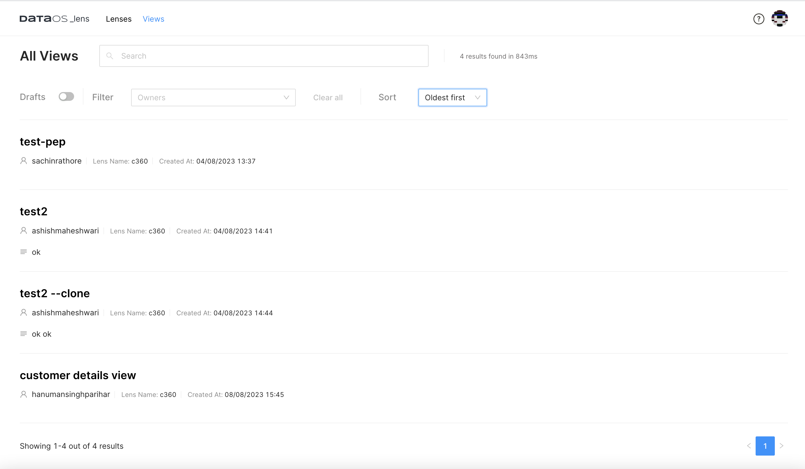

<figcaption align = "center">Graphical User Interface of the Lens Views</figcaption>
#### **Creating a Lens View**

When users compose queries on Lens Explorer and analyze the result sets as a table or a chart, they also get an option to export and save the analysis as a **View**.

1. Open the Lens Explorer and compose a query by selecting the required dimensions and measures.
    
    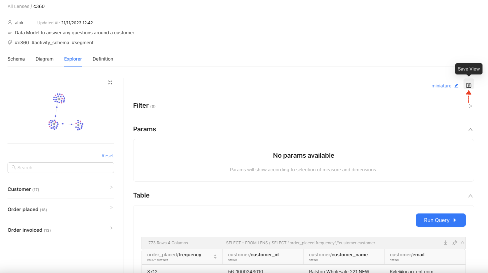
    <figcaption align = "center">Saving option</figcaption>
    
2. Provide a name and description for the Lens View.
    
    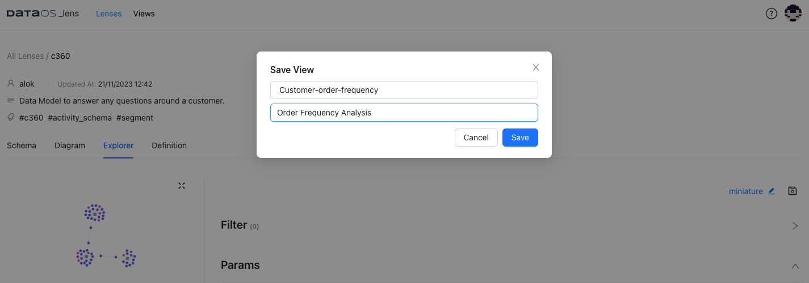
    <figcaption align = "center">Saving Lens View</figcaption>
    
3. The View is successfully created and is currently in Draft mode. In this state, the View is exclusively accessible to its creator;  other users cannot view or access it.
    
    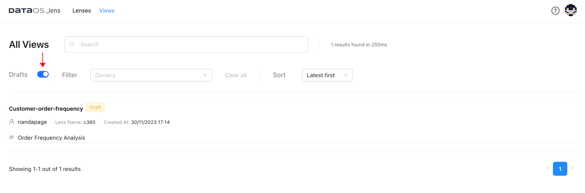
    <figcaption align = "center">Draft view</figcaption>
    
4. To make this View available to other users, you need to publish it. 
    
    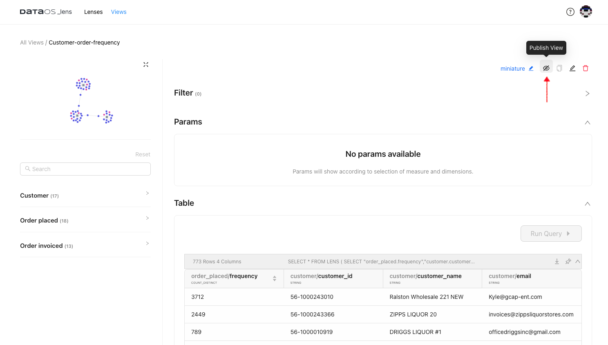
    <figcaption align = "center">Publishing Lens view</figcaption>
    

5. Once published, it will be removed from the draft mode and become available under **Views**. 

    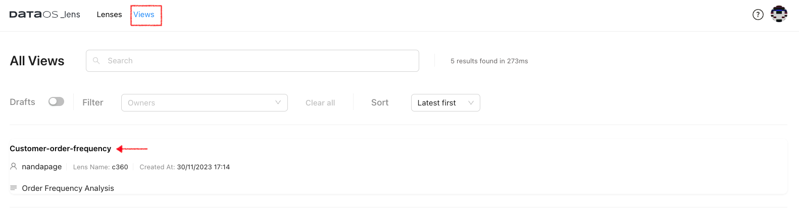
    <figcaption align = "center">Published Lens Views</figcaption>

#### **Editing an Existing View**

Users can edit an existing Lens View that they own.

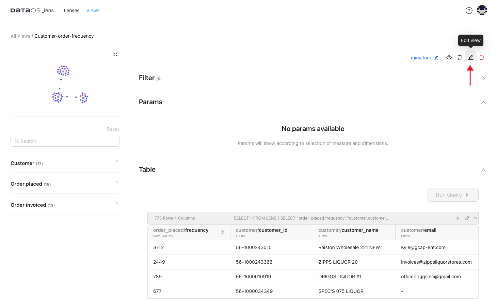
<figcaption align = "center">Editing a Lens View</figcaption>

#### **Cloning a Lens View**

Users can clone a Lens View and customize it according to their requirements. Cloning streamlines the creation of variations of a Lens View, eliminating the need to recreate them from scratch. Users can experiment freely with different dimension and measure selections.

Follow the steps to create a clone of an existing Lens View:

1. Navigate to any published Lens View, then click the **Clone View** icon. Confirm your selection to create a cloned view.
    
    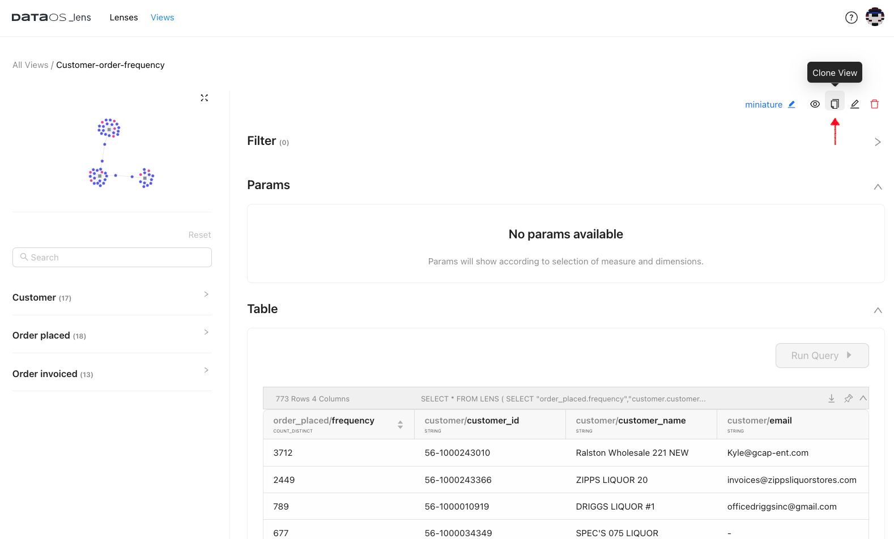
    
    <figcaption align = "center">Clone a Lens view</figcaption>
    
2. Make the required modifications, then click **Run Query** to generate the view. After the query execution is completed, users will be presented with the option to **Save View**.
    
    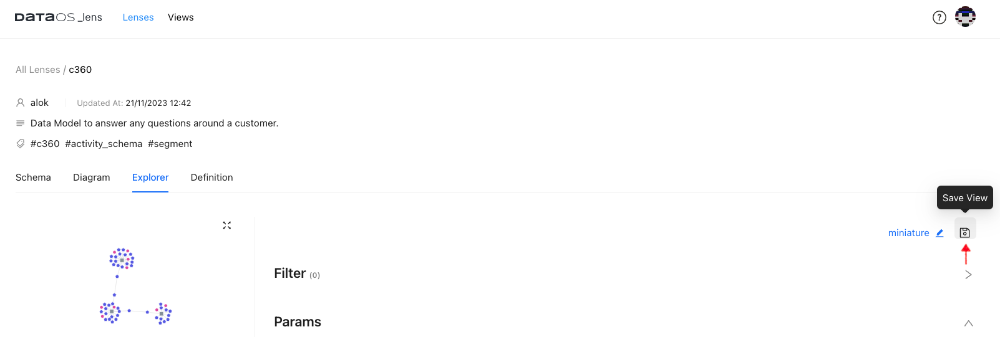
    <figcaption align = "center">Saving cloned Lens View</figcaption>
    
3. Input a new name and description for the cloned view to save it. By default, the cloned view is saved in the draft mode, and to make it available to all the users, it should be published as shown above.

## Lens ecosystem

In addition to the lack of alignment between data producers and consumers, the absence of well-defined APIs can result in siloed data definitions within the tool, hindering collaboration among teams that use various business intelligence tools to model metrics.

To tackle this challenge, the Lens Ecosystem offers a solution by allowing the association of relevant semantics to raw data and subsequently making these ontologies accessible to all downstream consumers. This includes applications, tools, and users, enabling a cohesive and consistent understanding of the data across the entire ecosystem. Refer to [Lens Ecosystem ](lens/lens_ecosystem/lens_ecosystem.md) to discover further details.

## Elements of a Lens

The fundamental constituents of both Lens and contract encompass an amalgamation of data elements: fields, entities, dimensions, and measures. These elements collectively serve the purpose of outlining the composition and logic of data models. To know more about these elements, refer to 
[Elements of Lens](lens/elements_of_lens/elements_of_lens.md).

## Building Lens
For a comprehensive guide on creating and deploying a Lens, refer to the [Building a Lens](/interfaces/lens/building_lens/) section.