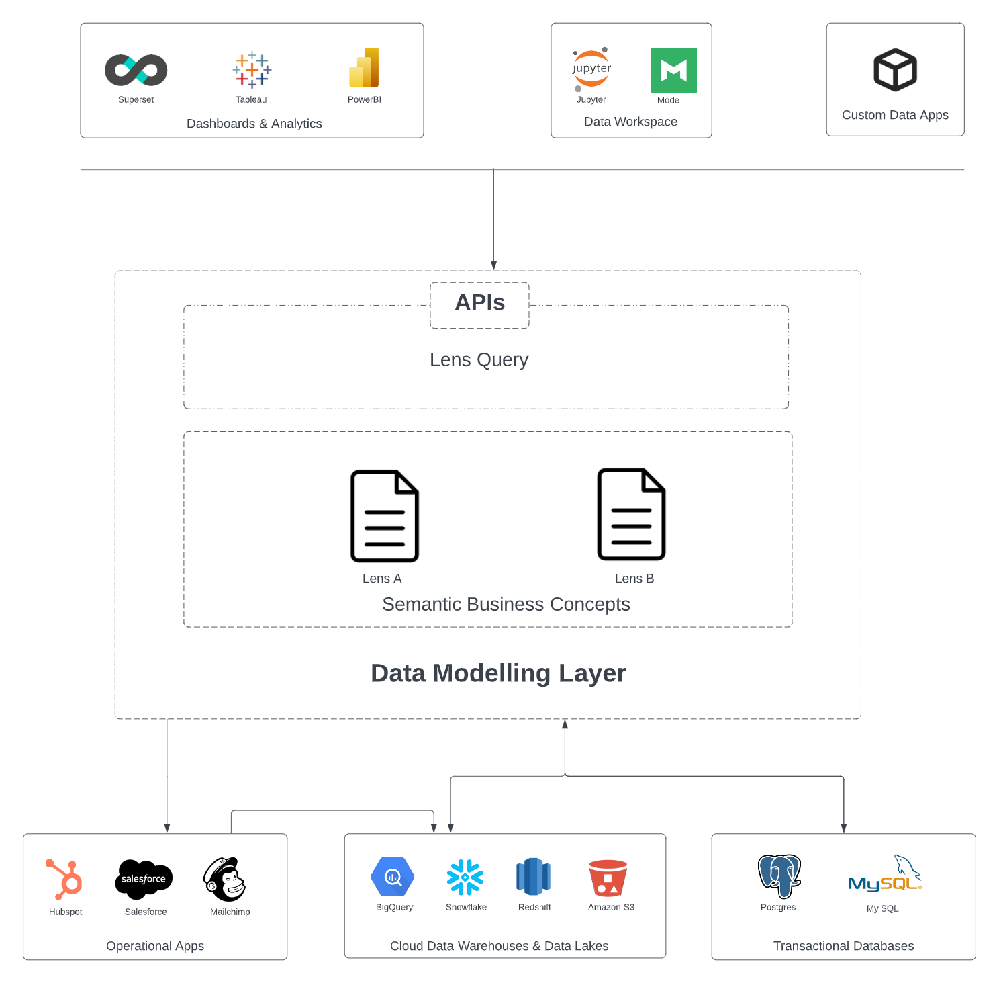

# Lens

Lens is a consistent modeling layer capable of accessing and modeling data from disparate sources. It not only supports the ability to connect underlying data to real-world business objects but also enables you to formulate and delineate measures, KPIs, and relationships between different business concepts, thereby facilitating data-driven decision-making. 

> A data modeling layer is an interface that lays over the underlying data and consistently exposes commonly understood business terms (such as product, customer, or revenue) to the end consumers. It allows business users to consume the data how they understand it, get what they need, and realize self-service without constantly relying on data engineers for data requests. 

Lens fosters data definition sharing and brings consensus among teams around data definitions, creating a unified and consolidated view of data across the organization.

<figcaption align = "center">Placement of Lens Ecosystem between Sources and Data Consumers</figcaption>
 

## Supported Data Sources in Lens

Lens can be built on all sources that Depots support. Lens lets you connect to and access data from managed and unmanaged object storage like CSV, parquet, Amazon S3, Azure Blob Storage, streaming sources like Pulsar, and relational and non-relational databases like PostgreSQL, MySQL, BigQuery, etc.

## Elements of a Lens

The fundamental constituents of Lens encompass an amalgamation of data elements: fields, entities, dimensions, and measures. These elements collectively serve the purpose of outlining the composition and logic of data models. To know more about these elements, refer to 
[Elements of Lens](lens/elements_of_lens/elements_of_lens.md).

## Launching Lens
On opening the Lens app, you can view all the lenses created and available to consume.

<figcaption align = "center">Lenses</figcaption>
 

Clicking on the specific lens will open the details where entities and their schema are displayed along with   the tabs to see the relationship of the entities and definitions.

<figcaption align = "center">Lens details</figcaption>

## Lens Ecosystem

In addition to the lack of alignment between data producers and consumers, the absence of well-defined APIs can result in siloed data definitions within the tool, hindering collaboration among teams that use various business intelligence tools to model metrics.

To tackle this challenge, the Lens Ecosystem offers a solution by allowing the association of relevant semantics to raw data and subsequently making these ontologies accessible to all downstream consumers. This includes applications, tools, and users, enabling a cohesive and consistent understanding of the data across the entire ecosystem. Refer to [Lens Ecosystem ](lens/lens_ecosystem/lens_ecosystem.md) to discover further details.
