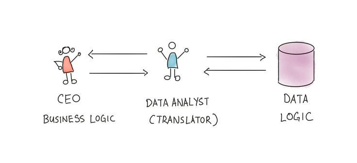
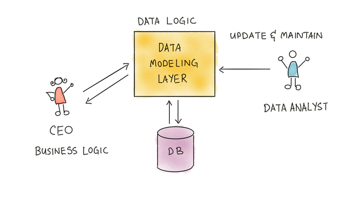
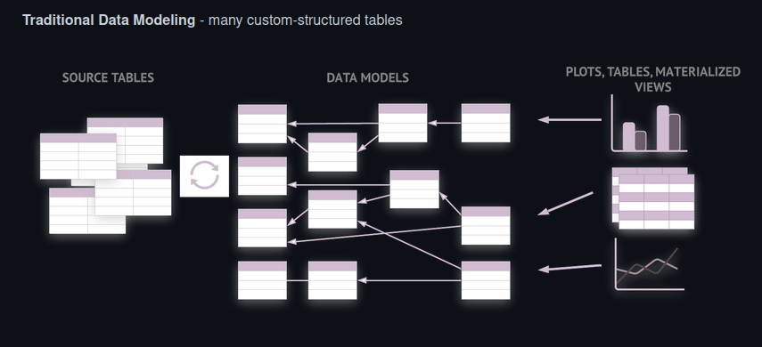
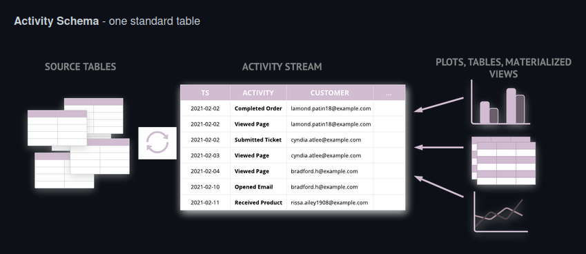
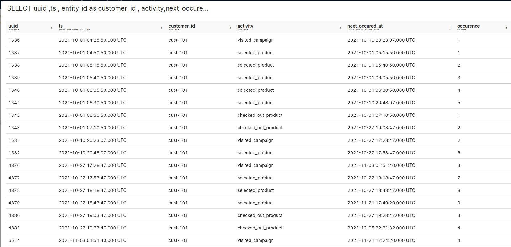
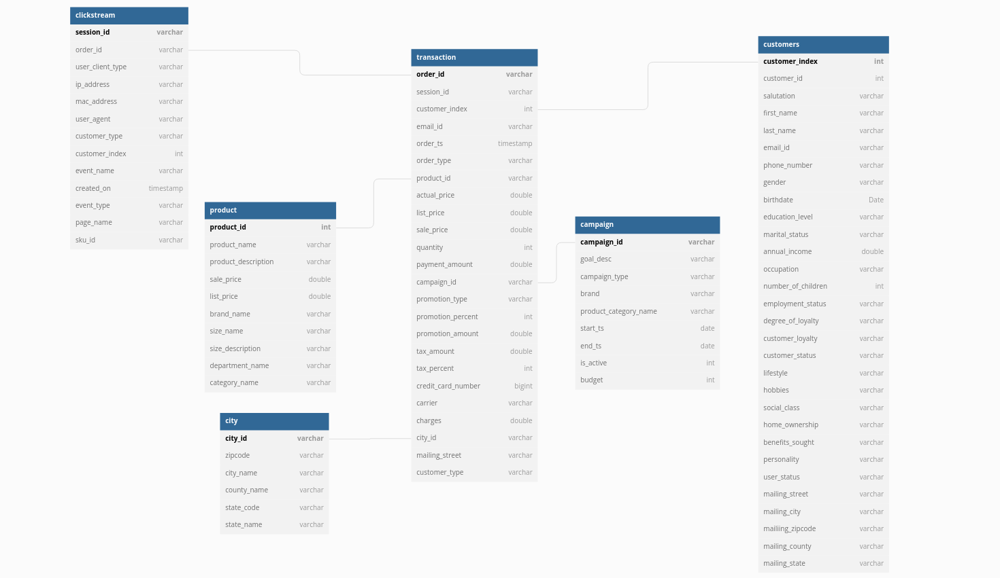
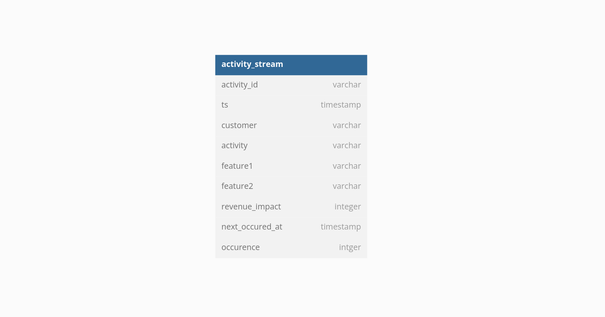

# Data Modeling Concepts

Data modeling concepts are becoming increasingly important as businesses use data-related applications to manage their massive data assets.
Business users largely depend on Data Analysts and Engineers to clean, transform, and model their datasets. Let's say a business user wants "Total revenue generated from California". Data analysts or analytics engineers are always his go-to person to get this answered. Analysts become a bottleneck in the process. Business users can’t get answers to questions by themselves.

Why do business users need a data analyst to answer every such question?

The reason is that business users cannot codify their mental model of the business logic as they lack an understanding of how the data is organized, where it is stored, what the schema is, or how to map things.

And as a result, Data Analyst becomes a translator between business logic and data logic. 

This technique works well for small or few firms, but it won't function in more significant circumstances since it burdens data analysts, who become bottlenecks because everything must pass through them. At one point, a data analyst can be too preoccupied to focus on more worthwhile, long-term impact work because he is too busy crunching data for other stakeholders.

So, there has to be a different approach to solving these issues. We map the knowledge of data analysts somewhere so everyone can use it. 

<aside class="callout">
🗣 Data modeling is the process of conceptually representing data objects, connections between data objects, and the rules that govern them. The data model emphasizes what data is needed and how it should be organized.

</aside>

Of course, there are other reasons to do data modeling. Ease of exploration and performance are two of them. However, at its most basic level, data modeling is transforming raw data into a form that can be used for answering business questions. 

A data modeling layer is a piece of code that contains mappings between data and logic and relationships between datasets. Data modeling is the process of creating and maintaining this layer. 

After creating this data modeling layer, we can solve a lot of business use cases:

- It eliminates the need for data analysts; anyone, whether a business user, CEO, or marketing team member, can access this layer.
- Now, data analysts only need to manage this modeling layer or pipeline and can make changes based on others’ requests.
- In cases like this, when users want to see California's revenue growth after witnessing that growth, what if they drill down to "San Diego"? Data modeling makes such situations easier to face.

## Concreting mental model

- Mapping raw data to a format that business users can easily understand: an abstract view on top of a physical database
- Process of creating a framework that defines the data relationships within a database
- Provides a conceptual representation of data and illustrates the interdependence of datasets within a system
- Provide a Common Language

## Types of Data Models

### **Conceptual Data Model**

- A conceptual data model helps understand the demands or requirements of the database since it provides a high-level description of the database.
- Establishing entities, their quality, and relationships is the goal of developing a conceptual data model.
- The underlying database structure is hardly described at this level of data modeling.

### **The logical data Model**

- Establishes the structure of data elements and the relationships among them
- These demonstrate the links between entities and identify data properties, such as data types and their corresponding lengths.
- In highly procedural implementation settings or naturally data-oriented projects, logical data models can be helpful.

### **Physical Data Model**

- They offer a schema for how the data will be kept in a database physically.
- It represents the tables, columns, data types, etc.
- They provide a completed design that may be used to create a relational database.

#### **Fact Table**

- A fact table for a business process includes measures, metrics, and facts.
- A fact table is at the center of a star or snowflake schema.
- A fact table is defined by its grain or its most atomic level.

#### **Dimension Table**

- The Dimension table is a companion table to the fact table that contains descriptive attributes that can be used to constrain queries.
- Located at the edges of the star or snowflake schema.
- Dimension tables are de-normalized tables.

## Kimball’s approach

Kimball’s approach is a bottom-up approach. 

### **Identify the business process to model**

To build our data model, we must identify the business process around which the data questions revolve. For instance, an eCommerce business process can be ‘received orders,’ ‘returned orders,’ ‘shipped products,’ ‘order processing,’ and others. Based on our use case, i.e. ‘**total revenue generated from California,** we want to model **Received Orders.** 

### **Decide on the grain**

Choosing a grain entails saying precisely what a fact table explains. The data in the fact table should be at the most atomic level possible.

Given that we are determining **Revenue generated**  and are modeling **‘Received Orders’**

Grain -

- In our use case, where we are calculating the revenue generated by a state in California, the grain can be the city so that if in the future a user wants to drill down to the city or to that area from which they are generating the most revenue.

### **Describe fact data**

Choose a dimension that applies to each fact table row; this should be simple if we have carefully selected the grain. You will embellish fact tables with comprehensive dimensions representing all possible descriptions.

Dimensions-

Let’s say you have a measure of revenue. Now, what kind of dimensions can you use to help describe this measure?

- We might want to view the total revenue generated from a country; we can add a country dimension.
- We want to view the top 5 products by revenue; in that case, we can also add a dimension to the product.

### **Adding measures to the fact table**

Choose those measures which can help answer your business questions. A fact belonging to a different grain should live in a separate fact table.

Measures can be like

- average profit margin
- count of users

## Dimensional Schema Modelling

It is specifically designed to address the unique needs of large databases created for analytical purposes (OLAP).

A dimensional schema physically separates the measures that quantify the business from the descriptive elements(also known as dimensions) that describe and categorize the business.

## Star Schema

- Relational database schema
- One fact table and several associated dimension tables
- The structure resembles a star.
- The fact table and each dimension table have a many-to-one relationship, as indicated by the branches at the ends of the links connecting the tables.

.png)

Fact Table: Transaction 

Dimension Table: customers, products, territories

## Snowflake Schema

- An extension of the star schema.
- It contains one fact table connected to numerous dimension tables, each of which can be connected to another table through a many-to-one relationship.
- Dimensional tables are usually normalized to the third standard form resulting in additional sub-dimension tables.
- A snowflake schema can have any number of dimensions, and each dimension can have any number of levels.

.png)

## Activity Schema

As data professionals, we deal with various problems when generating data, manipulating it, building data pipelines, and more. Data modeling can sometimes be challenging as we have to find the correct data among the thousands of datasets, define and untangle relationships between entities, or deal with model updates and maintenance challenges. There are a lot of dependencies on the physical data. And dealing with humongous complex SQL queries add to the laborious effort. It makes the analytics pretty hard. 

Funnel analysis becomes complicated when you are left with just two resources SQL and raw data. That’s where activity schema comes into the picture.

It is a framework for modeling data warehouses. A single time-series table is used to build an activity schema, with the option of adding a small number of enrichment tables for additional metadata.

In simple words, activity schema transforms raw tables into a single time-series table called an activity stream. In an activity stream, we already follow a fixed schema to create activity stream data, which helps reduce effort; we have fewer models to manage, can easily accommodate changes to source data, etc. 

An activity schema models an **entity** taking a sequence of **activities** over time. For example, a **customer**(entity) **viewed a web page** (activity).

<aside class="callout">
🗣 - An activity schema is an open standard for data modeling and transformation in a data warehouse.
- It is intended to simplify, accelerate, and increase the reliability of data modeling and analysis.
- The core objective is to transform raw tables into a single time series table.
- Instead of facts, business concepts are depicted as an entity doing an activity.
- Activities are the only sources of truth for each notion and are constructed directly from source tables, storing only their data.

</aside>

Each Activity schema defines a single business concept. For example, it can be an activity stream where information around the activities performed by every user on a site can be visited_campaign, selected_product(Add to cart), checked_out_product, etc., or there can be information around taxi sharing app where the activities can be view the web page, view taxi availability, book ride, etc. Every model in the activity schema runs around the timestamp.

**For example :**

<aside class="callout">
🗣 We have the time-series data, entity data around which we will generate the activity, and the activity column. Within the time series, we have information about a customer, say "cust-101," and the different actions performed by that customer.

</aside>

Activity Schema consists of two things :

- Modeling - converting raw tables into the activity stream
- Querying - retrieving the data from the activity stream

Let’s assume you have a use case with six tables and have to create a dashboard that solves a client's demand.

Consider writing SQL queries for funnel analysis like no. of times the user did ‘Add to cart before making a ‘Purchase.’ Additionally, imagine grasping the 6-table schema and figuring out the joins or writing 100–200 lines of SQL to achieve your goal.
Despite only having six tables, it's confusing when the real-world data become increasingly disorganized.

Now while using activity schema, we have to model the raw data and create a table, say activity_stream 

We can see that we now have an activity table listing different activities(checkout, page view) performed by customers. This can help us write SQL queries to build funnel analysis.