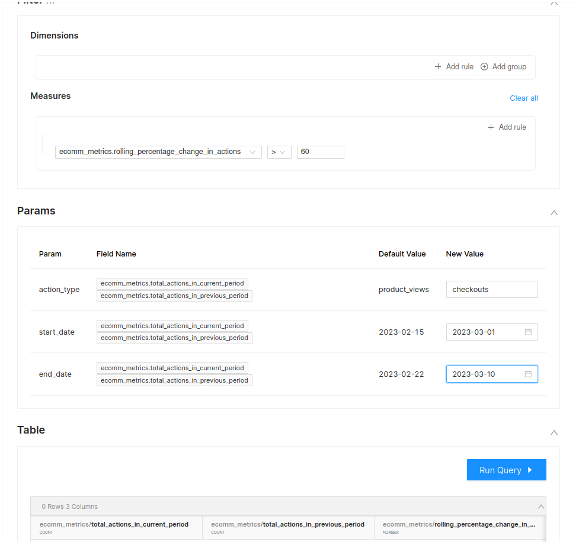
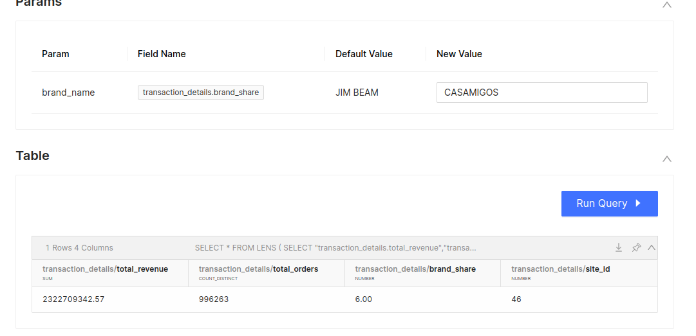
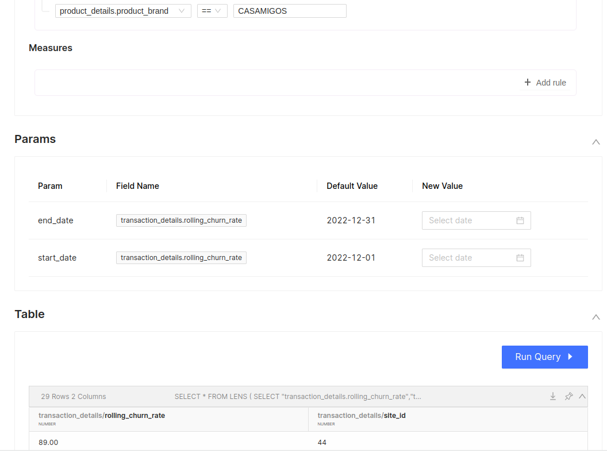

# Scenarios: Dynamic Parameters in Query

When analyzing data, it may be beneficial to consider multiple input perspectives. This can be achieved through the use of parameters. Parameters introduce flexibility and reusability in measures and dimensions, allowing the users to vary results on basis of inputs. 

## Scenario - 1

**Understanding the sudden spike in user activities on E-commerce website**

**Use Case:** *Identifying unexpected product interest by monitoring specific metrics, including product views, add-to-carts, checkouts, and checkout revenue as compared to previous periods*


When users interact with an e-commerce product, various user events are triggered, including adding items to their cart, checking out, viewing products, and others. It is not uncommon to observe sudden spikes in these events, which could be attributed to marketing campaigns or data-related issues. Therefore, it is essential to monitor such anomalies closely.

In the absence of parameters, powering this use case would be challenging. It would require creating multiple dimensions and corresponding measures to monitor each event and its sudden changes compared to the previous period. For each new use case, new dimensions and measures would need to be created to meet the user's request. This approach provides users with the flexibility to observe events based on their preferences.

To effectively detect unexpected changes in metric values, it is essential to compare the current period's metric value with the previous period. In this context, let’s explore how parameters can significantly simplify the process and provide users with greater flexibility in observing event spikes of their choice.

### **The Parameterized Way**

You start by defining three measures:

1. **Total actions in the current period:** calculates the total actions for the current time period. While performing analysis with this Lens, users have the independence to define the action type and the month (e.g., January, February, etc.)
2. **Total actions in the previous period: c**alculates the total actions for the previous time period using the same parameter but with a time offset (e.g., March, April).
3. **Rolling percentage change in actions: c**alculates the percentage change in total actions between the current and previous periods using the two previous measures.
    
    ```yaml
    - name: total_actions_in_current_period
      sql_snippet: >
    		case when kpi_action_type = '{{action_type:product_views}}' and date(${ecomm_metrics.date_time}) between date('{{start_date:2023-02-15}}') and date('{{end_date:2023-02-22}}') then ${ecomm_metrics.records} else null end 
      type: count
    
    - name: total_actions_in_previous_period
      sql_snippet: >          
        case when kpi_action_type = '{{action_type:product_views}}' and ${ecomm_metrics.date_time} between  date_add('day',-(day(date('{{end_date:2023-02-22}}') - date('{{start_date:2023-02-15}}')))-1,date('{{start_date:2023-02-15}}')) and date('{{start_date:2023-02-15}}') - interval '1' day ),2)
      type: count
    
    - name: rolling_percentage_change_in_actions
      sql_snippet: >          
        round(cast((${ecomm_metrics.total_actions_in_current_period} - ${ecomm_metrics.total_actions_in_previous_period}) as decimal(20,2)) /  nullif(${ecomm_metrics.total_actions_in_previous_period} ,0),2)*100
      type: number
    ```
    

> *Just three measures and we can now view %age change for any event type compared to the previous period. Giving Lens consumer greater flexibility to vary the result*
> 



### **The Traditional Way**

If you adopt the traditional route(without Params), you would end up defining 12+ measures one for each action type.

If you fail to imagine, then here is a sneak peek into the list of measures you would end up defining -

1. Total product views in the current period (e.g., February)

1. Total add-to-carts in the current period (e.g., February)

1. Total checkouts in the current period (e.g., February)

1. Total checkout revenue in the current period (e.g., February)

1. Total product views in the previous period (e.g., January)

1. Total add-to-carts in the previous period (e.g., January)

1. Total checkouts in the previous period (e.g., January)

1. Total checkout revenue in the previous period (e.g., January)

1. Rolling percentage change in product views

1. Rolling percentage change in total add-to-carts

1. Rolling percentage change in total checkouts

1. Rolling percentage change in total checkout revenue.Assessing the brand's performance in comparison to other brands

## Scenario - 2

**Assessing the brand's performance in comparison to other brands**

**Use Case:**  *Let's say you want to check the brand's performance against its competitors and market position so that the marketing team changes its strategies accordingly.* 

Basically, the Brand share metric allows for a more specific analysis of the market share of a brand over different periods of time, or for different products within a brand. Checking by both the ways to achieve the goal.

### **The Parameterized Way**

1. You can find any brand share against all your brands based on the given value in parameters. 

> The brand share metric is calculated as the total revenue of a specific brand divided by the total revenue of all the products sold by all brands, multiplied by 100 to get a percentage.
> 

```yaml
- name: brand_share_orders_wise
  sql_snippet: >
	 count(distinct case when b_name = '{{brand_name:JIM BEAM}}' THEN ${transaction_details.order_no} else null end)/ cast(nullif(count(distinct ${transaction_details.order_no}),0) as decimal(20,2)) *100
  type: number

- name: brand_share_revenue_wise
  sql_snippet: >
		sum(case when b_name = '{{brand_name:JIM BEAM}}' THEN ${transaction_details.order_value} else null end)/ cast(nullif(sum(${transaction_details.order_value}),0) as decimal(20,2)) *100
  type: number
```



### **The Traditional Way**

Let’s say you want to check the market share of CASAMIGOS then this provides only the Casamigos brand over a period of time. So you’ll end up creating multiple metrics.

## Scenario - 3
**Retention Campaign Strategy to Combat Increased Churn Rates Among Specific Brands**
**Use Case:** *Planning a campaign to address the issue of increased churn rates among certain brands. The strategy is to target loyal customers of these brands offering discounts, exclusive rewards, or other incentives to prevent them from switching to competitors.*


To achieve this goal there is a need to create a metric i.e churn rate so here the concept of rolling comes into the picture using parameters you’ll give the flexibility to the marketing team to check the churn rate over a specific period of time.

```yaml
- name: rolling_churn_rate
  sql_snippet: >            
      cardinality(array_except(array_agg(customer_id) filter (WHERE ${transaction_details.order_date} between date_add('day',-(day(date('{{end_date:2022-12-15}}') - date('{{start_date:2022-12-01}}')))-1,date('{{start_date:2022-12-01}}')) and date('{{start_date:2022-12-01}}') - interval '1' day),
            array_agg(customer_id) filter (WHERE ${transaction_details.order_date} between date('{{start_date:2022-12-01}}') and date('{{end_date:2022-12-30}}') 
            )))
       / nullif(cast(
        count(DISTINCT customer_id) filter(
          WHERE
           ${transaction_details.order_date} between date_add('day',-(day(date('{{end_date:2022-12-15}}') - date('{{start_date:2022-12-01}}')))-1,date('{{start_date:2022-12-01}}')) and date('{{start_date:2022-12-01}}') - interval '1' day
        ) AS decimal(20,2)
      ),0) * 100
  type: number
```



## Conclusion

This document discusses the benefits of using parameters in data analysis and highlights three scenarios where parameters can be used to create more efficient and effective metrics. The first scenario involves monitoring product interest, the second involves checking a brand's performance against its competitors, and the third involves reducing churn rates through targeted marketing campaigns. 

By using parameters in these scenarios, it is possible to reduce the number of metrics needed to achieve a specific goal, customize the date range of metrics, and gain more nuanced insights into market trends.

Overall, the use of parameters can save time and effort in data analysis while providing more valuable insights.