# Tutorial: Step-by-Step Lens Creation

## **Scenario: Sports Retail Data Analysis**

The Sports Retail Store, specializing in sports apparel, equipment, and gear, is interested in gaining deeper insights into its sales and customer data. They aim to optimize their product offerings and marketing strategies by answering the following data questions during the analysis:

## **Analytical Objectives and Questions**

- To understand customers, find the average annual income of the customers and customers who are homeowners.
- Sales analysis: total_revenue,by country, average  order value, average purchase frequency, revenues for the given month, profit from each product
- What is the most frequent order?
- Who is the customer with the maximum lifespan in months?
- How do product category-wise sales by year?
- Can we visualize date-wise orders?
- Compare the revenue for the given two months by sub-category.
- How many purchased items were returned country-wise?

By addressing these data questions, data-driven decisions can be made to enhance customer satisfaction, optimize product offerings, and improve overall business performance.

## Developing a Conceptual Data Model

| Entity | Fields and Dimensions | Derived Dimensions | Measure | Related To | Relationship |
| --- | --- | --- | --- | --- | --- |
| Customer | first_name, last_name,<br>birth_date,<br>marital_status,<br>gender,<br>email_address,<br>annual_income,<br>total_children,<br>education_level,<br>occupation,home_owner,dob | full_name,<br>customer_lifespan_in_year, <br>customer_lifespan_in_month, <br>average_order_value,<br> average_purchase_frequency_rate,<br> customer_lifetime_value, <br>home_owner_bool_value | total_customer,<br>average_annual_income,<br>count_home_owner |  |  |
| Sales | order_number, customer_key, <br>order_date, <br>inline_item_number, product_key, <br>territorry_key, <br>order_quantities, order_line_item, <br>category_name |  | total_revenue, number_of_orders, number_of_customer, <br>first_order, last_order,<br> last_order, <br>lifespan_in_year, lifespan_in_month, <br>avg_order_value, <br>avg_purchase_freq_rate, month1_revenue,<br> month2_revenue, <br>product_category_share_orders, <br>date_wise_orders | Customer <br>Territory | N:1 <br>N:1 |
| Product | product_key,<br> product_subcategory_key, <br>product_name, <br>product_description, <br>product_sku, Product_color, <br>product_size,<br> product_style, product_cost, <br>product_price  |  | profit | Sales | 1:N |
| Returns | return_date, product_key, <br>territory_id, <br>return_quantity|  |  | Product<br>Territory | N:1<br>N:1 | |
| Territory | sales_territory_key, <br>region, country |  |  |  |  |

## Defining Lens for Sports Data Analysis

Let’s start defining the Lens. We will create the ‘Sports Retail Data Analysis’ Lens to power our use case. Start defining metadata for your Lens.

**Metadata**

```yaml
name: sportsdata
description: Sports Retail Data Model Lens
owner: tmdc
tag:
  - retail
  - return
  - sports
  
```

**Elements of Lens** 

Now define all the data elements with their attributes.

.png)

### **Entities**
We will start with mapping the `Customer` entity.

**Customer**

Write the SQL to extract the entity table and list all the columns that are selected  from the underlying table in the SQL statement.

```yaml
entities:
  - name: customer
    sql:
      query: >
        SELECT * , cast(birth_date as timestamp) as dob FROM icebase.sports.sample_customer 
      columns:
        - name: customer_key
        - name: prefix
        - name: first_name
        - name: last_name
        - name: birth_date
        - name: marital_status
        - name: gender
        - name: email_address
        - name: annual_income
        - name: occupation
        - name: home_owner
        - name: dob
```

### **Fields and Dimensions**

We should include all the necessary fields and their respective data types to effectively address inquiries related to the customer entity. Additionally, it's important to designate the primary key field, and some fields may be hidden from the entity when displayed on the Lens Explorer UI.

```yaml
fields:        
  - name: customer_key
    description: unique identifier of a customer
    type: number
    column: customer_key
    primary: true

  - name: first_name 
    type: string
    column: first_name
    hidden: true

  - name: last_name 
    type: string
    column: last_name
    hidden: true

  - name: birth_date 
    type: date
    column: birth_date
    hidden: true

  - name: email_address 
    type: string
    column: email_address

  - name: home_owner 
    type: string
    column: home_owner

  - name: dob
    type: date
    column: dob

  - name: marital_status 
    type: string
    column: marital_status

  - name: gender 
    type: string
    column: gender
 
  - name: annual_income 
    type: number
    column: annual_income

  - name: occupation 
    type: string
    column: occupation
```

### **Derived Dimensions**

The choice of dimensions greatly depends on the specific goals of your analysis and the questions you want to answer. They provide the context and categorization for analysis and can be created using calculations or expressions.  Therefore, it's essential to carefully consider and define dimensions that align with your analytical objectives. Consider the following: 

1. The following derived dimensions have been created to enhance the granularity of our analysis. Each derived dimension is associated with a specific data type. It's important to note that we utilize SQL snippets with variable expressions `${tablename.column_name }`.  
    
    ```yaml
    dimensions:
      - name: full_name
        type: string
        sql_snippet: concat(${customer.first_name},' ',${customer.last_name})
        description: full name of the customer
    
      - name: customer_lifetime_value
        type: number
        sql_snippet: round(${customer.average_order_value}*${customer.average_purchase_frequency_rate}*${customer.customer_lifespan_in_year},2)
    
      
    ```
    
2. You can perform type conversions for your data to facilitate the analysis.
    
    ```yaml
    dimensions:
      - name: home_owner_bool_value
        type: bool
        sql_snippet: case when home_owner = 'Y' then 'true' else 'false' end
    ```
    
3. You have a Sales dataset containing transaction records, including a "order_date" column. You can create a new dimension, let's say "quarter," by applying a calculation to the order_ date to extract the quarter in which each transaction occurred. This new "quarter" dimension is not a direct column in your data but is derived from the existing column.
    
    ```yaml
    dimensions:
      - name: quarter
        type: number  
        sql_snippet: ${((month(sales.order_date))-1)/3 + 1)}
    ```
    
4. To enhance the user experience and provide a comprehensive view of all dimensions within a single entity, subqueries have been employed to reference attributes from other tables. This approach simplifies access to relevant data and facilitates a more intuitive analysis for business users.
    
    ```yaml
    dimensions:
        ...
        ...
    
      - name: customer_lifespan_in_year
        type: number
        sql_snippet: ${sales.lifespan_in_year}
        sub_query: true   
        
      - name: customer_lifespan_in_month
        type: number
        sql_snippet: ${sales.lifespan_in_month}
        sub_query: true   
    
      - name: average_order_value
        type: number
        sql_snippet: ${sales.avg_order_value}
        sub_query: true 
    
      - name: average_purchase_frequency_rate
        type: number  
        sql_snippet: ${sales.avg_purchase_freq_rate}
        sub_query: true
    ```
    

### **Measures**

Defining measures for analysis involves specifying the quantitative metrics or calculations you want to perform on your data to gain insights and make informed decisions. Measures help answer specific questions and provide valuable information about your dataset. These measures can be as simple as counting the number of records or as complex as calculating advanced statistical indicators.

Let’s define the required measures for `Customer` entity using SQL snippets. You can see the aggregate type mentioned here.

```yaml
measures:
  - name: total_customer
    sql_snippet: ${customer.customer_key}
    type: count
    description: total number of customers

  - name: average_annual_income
    sql_snippet: ${customer.annual_income}
    type: avg
    description: average annual income of the customers

  - name: count_home_owner
    type: number
    sql_snippet: count(${customer.customer_key}) filter (where ${customer.home_owner_bool_value} = {{value:true}})
```

Now we will add other entities to our use case.

**Entity: Product**

The product-related data is currently stored in separate physical tables, including product, product_category, and product_subcategory.

To streamline and consolidate, a join operation is performed that combines the category and sub-category attributes with the Product entity when mapping it to the physical tables, creating a unified representation for the product entity in our Lens. This consolidation simplifies data management and enhances the overall efficiency of the system.

```yaml
- name: product
    sql:
      query: >
        SELECT product_key , product_name , category_name  as product_category_name ,
          subcategory_name as product_subcategory_name , product_description , 
          product_color , product_size , product_style , product_cost , product_price 
        from
          icebase.sports.sample_product_category
        inner join
          icebase.sports.sample_product_sub_category
        using (product_category_key)
        inner join
          icebase.sports.sample_product
        using(product_subcategory_key)
      columns:
        - name: product_key
        - name: product_subcategory_key
        - name: product_sku
        - name: product_name
        - name: model_name
        - name: product_description
        - name: product_color
        - name: product_size
        - name: product_style
        - name: product_cost
        - name: product_price
        - name: product_category_name
        - name: product_subcategory_name
```

Now add fields, dimensions, and measures to the definition of the Product entity.

- **Product Entity YAML Code**
    
    ```yaml
    - name: product
        sql:
          query: >
            SELECT product_key , product_name , category_name  as product_category_name ,
              subcategory_name as product_subcategory_name , product_description , 
              product_color , product_size , product_style , product_cost , product_price 
            from
              icebase.sports.sample_product_category
            inner join
              icebase.sports.sample_product_sub_category
            using (product_category_key)
            inner join
              icebase.sports.sample_product
            using(product_subcategory_key)
          columns:
            - name: product_key
            - name: product_subcategory_key
            - name: product_sku
            - name: product_name
            - name: model_name
            - name: product_description
            - name: product_color
            - name: product_size
            - name: product_style
            - name: product_cost
            - name: product_price
            - name: product_category_name
            - name: product_subcategory_name
    
        fields:
          - name: product_key
            type: number
            column: product_key
            primary: true
    
          - name: product_subcategory_key
            type: number
            column: product_subcategory_key
            hidden: true
    
          - name: product_sku
            type: string
            column: product_sku
            hidden: true
            
          - name: product_name
            type: string
            column: product_name
    
          - name: product_category_name
            type: string
            column: product_category_name
    
          - name: product_subcategory_name
            type: string
            column: product_subcategory_name
    
          - name: model_name
            type: string
            column: model_name
            hidden: true
    
          - name: product_description
            type: string
            column: product_description
        
          - name: product_color
            type: string
            column: product_color
    
          - name: product_size
            type: string
            column: product_size
    
          - name: product_style
            type: string
            column: product_style
    
          - name: product_cost
            type: number
            column: product_cost
    
          - name: product_price
            type: number
            column: product_price
    
        measures:
          - name: profit
            type: sum
            sql_snippet: round(${product.product_price}-${product.product_cost},2)
            description: profit from each product 
            
          - name: total_products
            type: count_distinct
            sql_snippet: (${product.product_key})
            description: Total number of distinct products
    ```
    

**Entity: Sales**

To incorporate sales details into our data model, we will define a new entity called "Sales." This entity will encompass all the relevant measures and dimensions related to user transactions.

- **Sales Entity YAML Code**
    
    ```yaml
    - name: sales
        sql:
          query: >
            SELECT * , cast(order_date as timestamp) as date_of_order , 
              cast(stock_date as timestamp) as date_of_stock 
            from
              icebase.sports.sample_product
            inner join
              icebase.sports.sample_sales
            using (product_key) 
            inner join
              icebase.sports.sample_customer
            using(customer_key)
          columns:
            - name: order_date
            - name: stock_date
            - name: order_number 
            - name: product_key
            - name: customer_key
            - name: territory_key
            - name: order_line_item
            - name: order_quantity
            - name: date_of_order
            - name: date_of_stock
            - name: year
            - name: product_price
            - name: customer_key
    
        fields:
          - name: order_date 
            type: date
            column: order_date
            description: date of order
            hidden: true
    
          - name: date_of_order
            type: date
            column: date_of_order
          
          - name: stock_date
            type: date
            column: stock_date
            description: date of stock
            hidden: true
    
          - name: order_number
            type: string
            column: order_number
            description: order number
            primary: true
    
          - name: product_key
            type: number
            column: product_key
            description: unique identifier of a product
            hidden: true
    
          - name: customer_key
            type: number
            column: customer_key
            description: unique identifier of a customer
            hidden: true
    
          - name: territory_key
            type: number
            column: territory_key
            description: unique identifier of a territory
            hidden: true
        
          - name: order_line_item
            type: number
            column: order_line_item
            hidden: true
    
          - name: order_quantity
            type: number
            column: order_quantity
    
          - name: year
            type: number
            column: year
          
          - name: selling_price
            type: number
            column: product_price
            hidden: true
    
          - name: customer_id
            type: number
            column: customer_key
            hidden: true
    
        dimensions:
          - name: category_name
            sql_snippet: ${product.product_category_name}
            type: string
            
        measures:
          - name: total_revenue
            sql_snippet: sum(${sales.order_quantity}*${sales.selling_price})
            type: number
    
          - name: number_of_orders
            sql_snippet:  ${sales.order_number}
            type: count_distinct
    
          - name: number_of_customers
            sql_snippet: ${sales.customer_id}
            type: count_distinct
    
          - name: first_order
            sql_snippet: ${sales.order_date}
            type: min
    
          - name: last_order
            sql_snippet: ${sales.order_date}
            type: max
    
          - name: lifespan_in_year
            sql_snippet: case when date_diff('year', ${sales.first_order} , ${sales.last_order}) = 0 then 1 else date_diff('year', ${sales.first_order} , ${sales.last_order}) +1 end
            type: number
            hidden: true
          
          - name: lifespan_in_month
            sql_snippet: date_diff('month', ${sales.first_order} , ${sales.last_order})
            type: number
            hidden: true
    
          - name: avg_order_value
            sql_snippet: ${sales.total_revenue}/${sales.number_of_orders}
            type: number
            description: average order value is the average transaction value
            hidden: true
    
          - name: avg_purchase_freq_rate
            sql_snippet: ${sales.number_of_orders}/${sales.number_of_customers}
            type: number  
            hidden: true
    
          - name: month1_revenue          # integer params 
            sql_snippet: count(${sales.order_quantity}) filter (where month(${sales.order_date}) = {{first_month_no:1}})
            type: number
    
          - name: month2_revenue          # integer params
            sql_snippet: count(${sales.order_quantity}) filter (where month(${sales.order_date}) = {{second_month_no:2}})
            type: number
    
          - name: rolling_percentage_change_in_orders
            sql_snippet: >          
              round(cast((${sales.month1_revenue} - ${sales.month2_revenue}) as decimal(20,2)) /  nullif(${sales.month1_revenue} ,0),2)*100
            type: number
    
          - name: product_category_share_orders         # string params
            sql_snippet: count(distinct case when ${sales.category_name} = '{{product_category_name:Bikes}}' THEN ${sales.order_number} else null end) / cast(nullif(count(distinct ${sales.order_number}),0) as decimal(20,2)) *100
            type: number
    
          - name: date_wise_orders          # date params
            sql_snippet: count(${sales.order_number}) filter (where ${sales.order_date} = date('{{start_date:2015-01-01}}'))
            type: number
            
        relationships:
          - type: N:1
            field: customer_key
            target:
              name: customer
              field: customer_key
    
          - type: N:1
            field: territory_key
            target:
              name: territory
              field: sales_territory_key
    ```
    

**Entity: Returns**

As we want to analyze customer dissatisfaction and issues with product quality and services, we will need records of purchased item returns.

- **Returns Entity YAML Code**
    
    ```yaml
    - name: return
        sql:
          query: >
            SELECT * , cast(return_date as timestamp) as date_of_return FROM icebase.sports.sample_return
          columns:
            - name: return_date
            - name: territory_key
            - name: product_key
            - name: return_quantity
            - name: date_of_return
    
        fields:        
          - name: return_date
            type: date
            column: return_date
            hidden: true
    
          - name: date_of_return
            type: date
            column: date_of_return
            primary: true
            
          - name: territory_key 
            type: number
            sql_snippet: territory_key
    
          - name: product_key 
            type: number
            sql_snippet: product_key
    
          - name: return_quantity 
            type: number
            sql_snippet: return_quantity
    
        relationships:
          - type: N:1
            field: product_key
            target:
                name: product
                field: product_key
    
          - type: N:1
            field: territory_key
            target:
              name: territory
              field: sales_territory_key
    ```
    

**Entity: Territory**

Territory table includes various attributes or columns that provide details about each territory. It is helpful when conducting regional or geographical analyses. This table can be joined or linked to other data tables to enrich the analysis with geographical context. For example, it can be linked to a Sales Table to analyze sales data by region, or to a Customer Table to understand the distribution of customers across territories.

- **Territory Entity YAML Code**
    
    ```yaml
    - name: territory
        sql:
          query: >
            SELECT *  FROM icebase.sports.sample_territory
          columns:
            - name: sales_territory_key
            - name: region
            - name: country
            - name: continent
    
        fields:        
          - name: sales_territory_key
            type: number
            column: sales_territory_key
            primary: true
    
          - name: region 
            type: string
            sql_snippet: region
    
          - name: country
            type: string
            column: country
    
          - name: continent
            type: string
            column: continent
    ```
    

### **Relationships**

So far we have defined all the entities; now we need to create a link between these entities. Relationships define how entities are connected, enabling cross-entity analysis. For example,  you can perform analyses that involve customer transactions and product sales and also purchased items returns by territory by defining relationships for Customer, Product, Returns, Territory entites defined for the usecase.

Here are the details for the relationship, target table, and fields to join:

- **Type of Relationship:** The relationship between the "Sales" entity and other entities will likely be a primary-foreign key relationship. The primary key from the "Sales" entity will likely link to a foreign key in the "Customer" entity (e.g., "customer_key") and another foreign key in the "Product" entity (e.g., "product_key").
- **Target Table:** The target table for the "Product" entity will be a dedicated table in the database, likely named "Sales" or something similar. This table will store all the transactional data related to sales.
- **Fields to Join:** To establish the relationship between the "Sales" entity and the "Customer" and "Product" entities, you will need to use common fields that exist in both the "Sales" table and the respective target tables of the "Customer" and "Product" entities. These fields may include "customer_key" and "product_key" as mentioned earlier.

> Remember that the specific fields for joining will depend on your database schema and how you've designed the "Customer," "Product," and "Sales" entities. The goal is to create a link between these entities so you can perform analyses that involve customer transactions and product sales.
> 

```yaml
- name: product
    ...
    ...
    relationships:
      - type: 1:N
        field: product_key
        target:
          name: sales
          field: product_key
```

```yaml
- name: sales
    ...
    ...
    relationships:
      - type: N:1
        field: customer_key
        target:
          name: customer
          field: customer_key

      - type: N:1
        field: territory_key
        target:
          name: territory
          field: sales_territory_key
```

```yaml
- name: returns
    ...
    ...
    relationships:
      relationships:
      - type: N:1
        field: product_key
        target:
            name: product
            field: product_key

      - type: N:1
        field: territory_key
        target:
          name: territory
          field: sales_territory_key
```

## Using Dynamic Parameters (Params)

To empower users to analyze data and obtain answers to their queries with the inputs provided at runtime, we'll establish parameters. Parameters are placeholders for values that users can input during analysis. They provide a means to customize and refine data analysis based on specific inputs. 

For example, a parameter `{{start_date:2015-01-01}}` is defined to calculate `date_wise_orders` for a specific date, which is '2015-01-01' by default in this example. This parameter allows you to provide any date as input, and it will return the count of sales orders for that date as specified by the user.

Likewise, a measure is defined to calculate the count of sales order quantities for a specific month, with the numeric value for the month `{{first_month_no:1}}` being provided by the user.

```yaml

  - name: sales
    sql:
      query: >
        SELECT * , cast(order_date as timestamp) as date_of_order , 
          cast(stock_date as timestamp) as date_of_stock 
        from
          icebase.sports.sample_product
        inner join
          icebase.sports.sample_sales
        using (product_key) 
        inner join
          icebase.sports.sample_customer
        using(customer_key)
      columns:
        

    fields:
      ...
      ...
    dimensions:
      ...
      ...
    measures:
      - name: month1_revenue          # integer params
        sql_snippet: count(${sales.order_quantity}) filter (where month(${sales.order_date}) = {{first_month_no:1}})
        type: number

      - name: month2_revenue          # integer params
        sql_snippet: count(${sales.order_quantity}) filter (where month(${sales.order_date}) = {{second_month_no:2}})
        type: number

      - name: product_category_share_orders         # string params
        sql_snippet: count(distinct case when ${sales.category_name} = '{{product_category_name:Bikes}}' THEN ${sales.order_number} else null end) / cast(nullif(count(distinct ${sales.order_number}),0) as decimal(20,2)) *100
        type: number

      - name: date_wise_orders          # date params
        sql_snippet: count(${sales.order_number}) filter (where ${sales.order_date} = date('{{start_date:2015-01-01}}')))
        type: number
```

## Sports Retail Lens

Here is the complete example for the sports retail data lens.

<details><summary>Lens YAML</summary>
    
    ```jsx
    name: sportsdata
    description: Sports Data Model Lens
    owner: tmdc
    contract: sample
    entities:
      - name: customer
        sql:
          query: >
            SELECT *, cast(birth_date as timestamp) as dob FROM icebase.sports.sample_customer 
          columns:
            - name: customer_key
            - name: first_name
            - name: last_name
            - name: birth_date
            - name: marital_status
            - name: gender
            - name: email_address
            - name: annual_income
            - name: total_children
            - name: education_level
            - name: occupation
            - name: home_owner
            - name: dob
    
        fields:        
          - name: customer_key
            description: unique identifier of a customer
            type: number
            column: customer_key
            primary: true
    
          - name: first_name 
            type: string
            column: first_name
            hidden: true
    
          - name: last_name 
            type: string
            column: last_name
            hidden: true
    
          - name: birth_date 
            type: date
            column: birth_date
            hidden: true
    
          - name: marital_status 
            type: string
            column: marital_status
    
          - name: gender 
            type: string
            column: gender
    
          - name: email_address 
            type: string
            column: email_address
    
          - name: annual_income 
            type: number
            column: annual_income
    
          - name: total_children 
            type: number
            column: total_children
          
          - name: education_level 
            type: string
            column: education_level
    
          - name: occupation 
            type: string
            column: occupation
        
          - name: home_owner 
            type: string
            column: home_owner
        
          - name: dob
            type: date
            column: dob
    
        dimensions:
          - name: full_name
            type: string
            sql_snippet: concat(${customer.first_name},' ',${customer.last_name})
            description: full name of the customer 
    
          - name: customer_lifespan_in_year
            type: number
            sql_snippet: ${sales.lifespan_in_year}
            sub_query: true   
            
          - name: customer_lifespan_in_month
            type: number
            sql_snippet: ${sales.lifespan_in_month}
            sub_query: true   
    
          - name: average_order_value
            type: number
            sql_snippet: ${sales.avg_order_value}
            sub_query: true 
    
          - name: average_purchase_frequency_rate
            type: number  
            sql_snippet: ${sales.avg_purchase_freq_rate}
            sub_query: true
    
          - name: customer_lifetime_value
            type: number
            sql_snippet: round(${customer.average_order_value}*${customer.average_purchase_frequency_rate}*${customer.customer_lifespan_in_year},2)
    
          - name: home_owner_bool_value
            type: bool
            sql_snippet: case when home_owner = 'Y' then 'true' else 'false' end
    
        measures:
          - name: total_customer
            sql_snippet: ${customer.customer_key}
            type: count
            description: total number of customers
    
          - name: average_annual_income
            sql_snippet: ${customer.annual_income}
            type: avg
            description: average annual income of the customers
    
          - name: count_home_owner
            type: number
            sql_snippet: count(${customer.customer_key}) filter (where ${customer.home_owner_bool_value} = {{value:true}})
    
        
    
      - name: sales
        sql:
          query: >
            SELECT * , cast(order_date as timestamp) as date_of_order , 
              cast(stock_date as timestamp) as date_of_stock 
            from
              icebase.sports.sample_product
            inner join
              icebase.sports.sample_sales
            using (product_key) 
            inner join
              icebase.sports.sample_customer
            using(customer_key)
          columns:
            - name: order_date
            - name: stock_date
            - name: order_number 
            - name: product_key
            - name: customer_key
            - name: territory_key
            - name: order_line_item
            - name: order_quantity
            - name: date_of_order
            - name: date_of_stock
            - name: year
            - name: product_price
            - name: customer_key
    
        fields:
          - name: order_date 
            type: date
            column: order_date
            description: date of order
            hidden: true
    
          - name: date_of_order
            type: date
            column: date_of_order
          
          - name: stock_date
            type: date
            column: stock_date
            description: date of stock
            hidden: true
    
          - name: order_number
            type: string
            column: order_number
            description: order number
            primary: true
    
          - name: product_key
            type: number
            column: product_key
            description: unique identifier of a product
            hidden: true
    
          - name: customer_key
            type: number
            column: customer_key
            description: unique identifier of a customer
            hidden: true
    
          - name: territory_key
            type: number
            column: territory_key
            description: unique identifier of a territory
            hidden: true
        
          - name: order_line_item
            type: number
            column: order_line_item
            hidden: true
    
          - name: order_quantity
            type: number
            column: order_quantity
    
          - name: year
            type: number
            column: year
          
          - name: selling_price
            type: number
            column: product_price
            hidden: true
    
          - name: customer_id
            type: number
            column: customer_key
            hidden: true
    
        dimensions:
          - name: category_name
            sql_snippet: ${product.product_category_name}
            type: string
            
        measures:
          - name: total_revenue
            sql_snippet: sum(${sales.order_quantity}*${sales.selling_price})
            type: number
    
          - name: number_of_orders
            sql_snippet:  ${sales.order_number}
            type: count_distinct
    
          - name: number_of_customers
            sql_snippet: ${sales.customer_id}
            type: count_distinct
    
          - name: first_order
            sql_snippet: ${sales.order_date}
            type: min
    
          - name: last_order
            sql_snippet: ${sales.order_date}
            type: max
    
          - name: lifespan_in_year
            sql_snippet: case when date_diff('year', ${sales.first_order} , ${sales.last_order}) = 0 then 1 else date_diff('year', ${sales.first_order} , ${sales.last_order}) +1 end
            type: number
            hidden: true
          
          - name: lifespan_in_month
            sql_snippet: date_diff('month', ${sales.first_order} , ${sales.last_order})
            type: number
            hidden: true
    
          - name: avg_order_value
            sql_snippet: ${sales.total_revenue}/${sales.number_of_orders}
            type: number
            description: average order value is the average transaction value
            hidden: true
    
          - name: avg_purchase_freq_rate
            sql_snippet: ${sales.number_of_orders}/${sales.number_of_customers}
            type: number  
            hidden: true
    
          - name: month1_revenue          # integer params
            sql_snippet: count(${sales.order_quantity}) filter (where month(${sales.order_date}) = {{first_month_no:1}})
            type: number
    
          - name: month2_revenue          # integer params
            sql_snippet: count(${sales.order_quantity}) filter (where month(${sales.order_date}) = {{second_month_no:2}})
            type: number
    
          - name: product_category_share_orders         # string params
            sql_snippet: count(distinct case when ${sales.category_name} = '{{product_category_name:Bikes}}' THEN ${sales.order_number} else null end) / cast(nullif(count(distinct ${sales.order_number}),0) as decimal(20,2)) *100
            type: number
    
          - name: date_wise_orders          # date params
            sql_snippet: count(${sales.order_number}) filter (where ${sales.order_date} = date('{{start_date:2015-01-01}}')))
            type: number
            
        relationships:
          - type: N:1
            field: customer_key
            target:
              name: customer
              field: customer_key
    
          - type: N:1
            field: territory_key
            target:
              name: territory
              field: sales_territory_key 
      - name: product
        sql:
          query: >
            SELECT product_key , product_name , category_name  as product_category_name ,
              subcategory_name as product_subcategory_name , product_description , 
              product_color , product_size , product_style , product_cost , product_price 
            from
              icebase.sports.sample_product_category
            inner join
              icebase.sports.sample_product_sub_category
            using (product_category_key)
            inner join
              icebase.sports.sample_product
            using(product_subcategory_key)
          columns:
            - name: product_key
            - name: product_subcategory_key
            - name: product_sku
            - name: product_name
            - name: model_name
            - name: product_description
            - name: product_color
            - name: product_size
            - name: product_style
            - name: product_cost
            - name: product_price
            - name: product_category_name
            - name: product_subcategory_name
    
        fields:
          - name: product_key
            type: number
            column: product_key
            primary: true
    
          - name: product_subcategory_key
            type: number
            column: product_subcategory_key
            hidden: true
    
          - name: product_sku
            type: string
            column: product_sku
            hidden: true
            
          - name: product_name
            type: string
            column: product_name
    
          - name: product_category_name
            type: string
            column: product_category_name
    
          - name: product_subcategory_name
            type: string
            column: product_subcategory_name
    
          - name: model_name
            type: string
            column: model_name
            hidden: true
    
          - name: product_description
            type: string
            column: product_description
        
          - name: product_color
            type: string
            column: product_color
    
          - name: product_size
            type: string
            column: product_size
    
          - name: product_style
            type: string
            column: product_style
    
          - name: product_cost
            type: number
            column: product_cost
    
          - name: product_price
            type: number
            column: product_price
    
        measures:
          - name: profit
            type: sum
            sql_snippet: round(${product.product_price}-${product.product_cost},2)
            description: profit from each product
    
        relationships:
          - type: 1:N
            field: product_key
            target:
              name: sales
              field: product_key 
    
      - name: return
        sql:
          query: >
            SELECT * , cast(return_date as timestamp) as date_of_return FROM icebase.sports.sample_return
          columns:
            - name: return_date
            - name: territory_key
            - name: product_key
            - name: return_quantity
            - name: date_of_return
    
        fields:        
          - name: return_date
            type: date
            column: return_date
            hidden: true
    
          - name: date_of_return
            type: date
            column: date_of_return
            primary: true
            
          - name: territory_key 
            type: number
            sql_snippet: territory_key
    
          - name: product_key 
            type: number
            sql_snippet: product_key
    
          - name: return_quantity 
            type: number
            sql_snippet: return_quantity
    
        relationships:
          - type: N:1
            field: product_key
            target:
                name: product
                field: product_key
    
          - type: N:1
            field: territory_key
            target:
              name: territory
              field: sales_territory_key
    
      - name: territory
        sql:
          query: >
            SELECT *  FROM icebase.sports.sample_territory
          columns:
            - name: sales_territory_key
            - name: region
            - name: country
            - name: continent
    
        fields:        
          - name: sales_territory_key
            type: number
            column: sales_territory_key
            primary: true
    
          - name: region 
            type: string
            sql_snippet: region
    
          - name: country
            type: string
            column: country
    
          - name: continent
            type: string
            column: continent
    
    ```
    
</details>

## Deploying Lens

After defining the Lens, the next step is to deploy it into the DataOS environment.

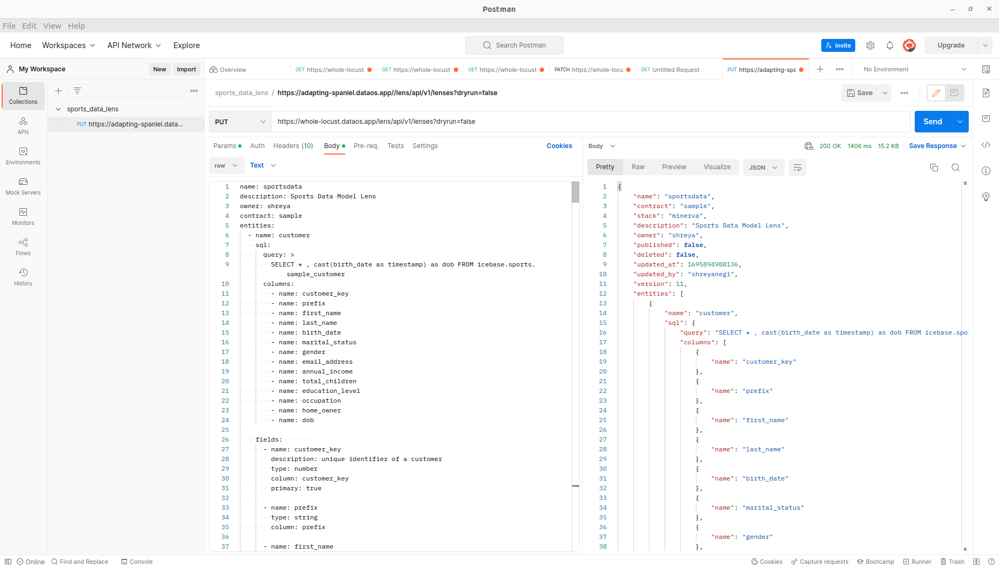

For the deployment process, the Lens YAML code is copied into the body section and the headers are selected in Postman. Finally, "Send" button is clicked to initiate the deployment.

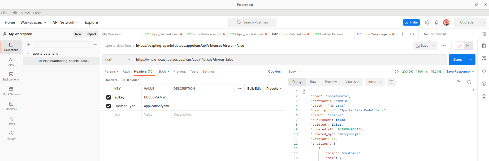

## Accessing Lens

Lens is created in DataOS environment, you can use it to gain insights from your data, run queries, generate visualizations, and perform various analyses.

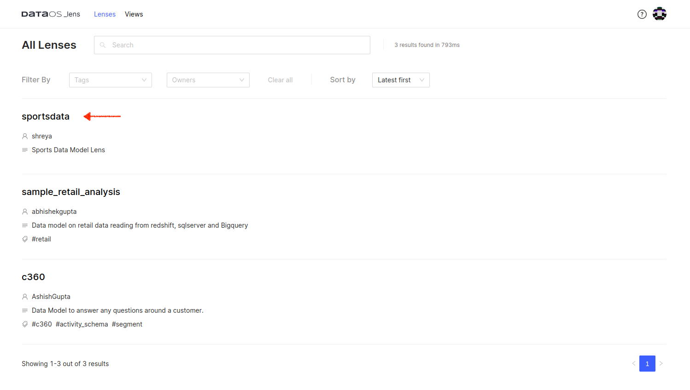

Click on the Lens to see its schema, various entities and relationships which you defined in YAML.

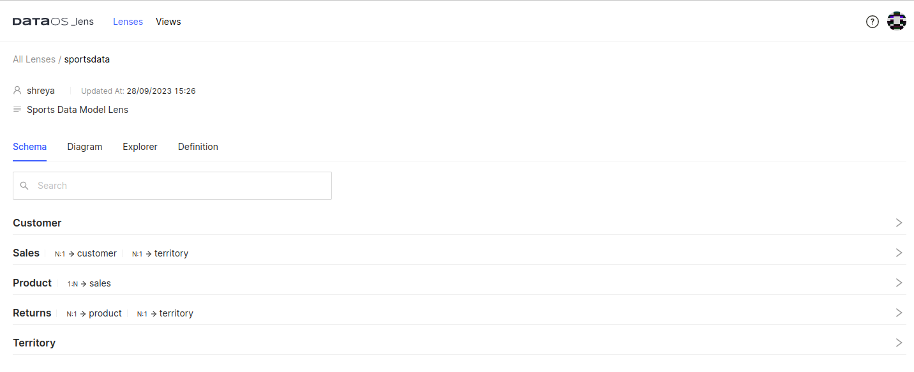

Below is a graphical diagram illustrating the relationships between different entities:

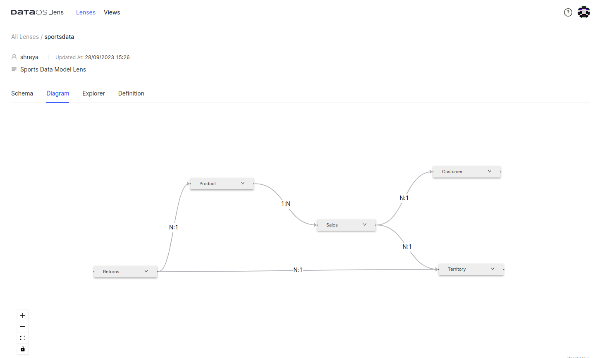

Next, let's dive into the analysis of date-wise orders.

1. Open **Lens Explorer**, where you will find a list of entities along with their fields, dimensions, and measures.
2. Start by selecting the entities and the specific fields, dimensions, or measures you want to analyze.
3. Run your query, and if necessary, provide any parameter values required for your analysis.
4. You will see the results and charts displayed on the screen. Behind the scenes, Lens will automatically generate a Lens query for your selection and also generate the corresponding SQL query.

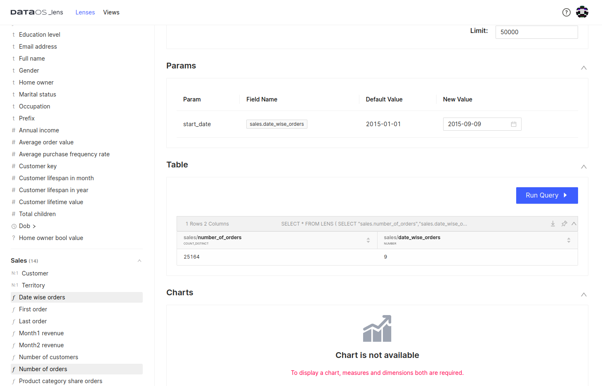

## Running Queries

As we have fields, dimensions, and measures in place, it is very easy to use Lens to answer data questions by just selecting data elements on the Lens Explorer UI. You will also get the charts that can be exported to create dashboards.

### **Purchased Items Return by Country Analysis**

Select the number of returns (**Returns**) and execute the query. You can also visualize the data using a chart. This analysis is valuable for identifying customer dissatisfaction and assessing product performance. It enables proactive measures to address any issues.

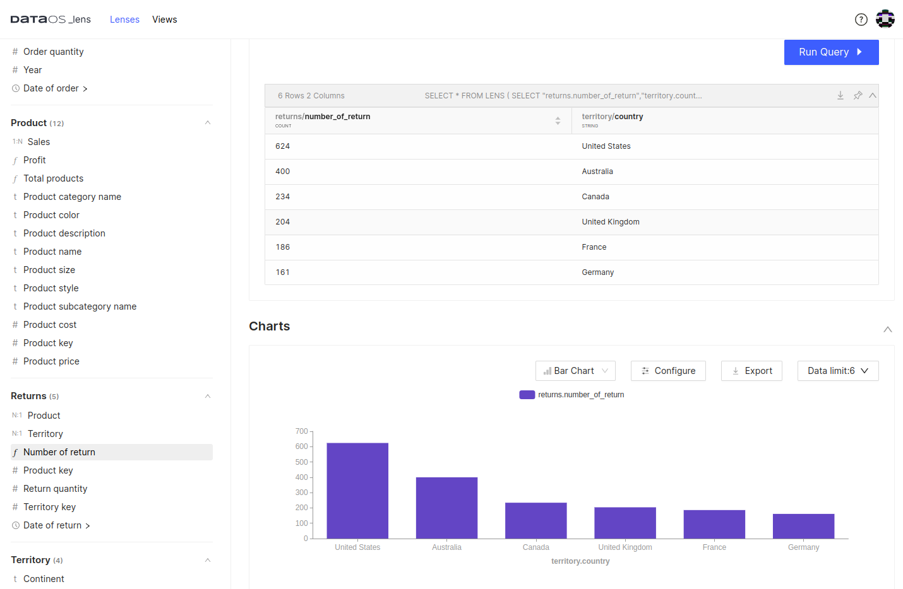

Automatically Generated Lens Query:

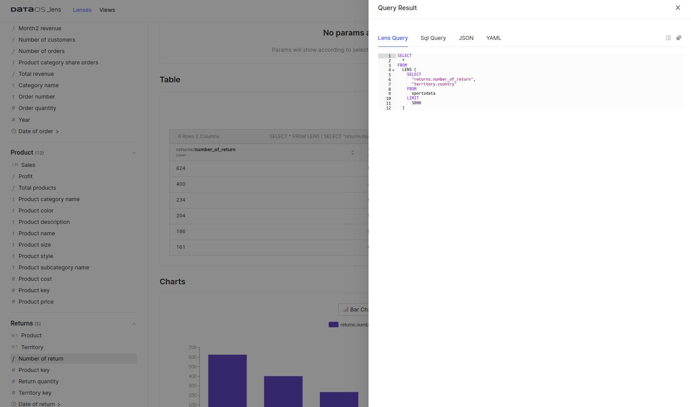

The corresponding SQL query was generated for the Lens query.

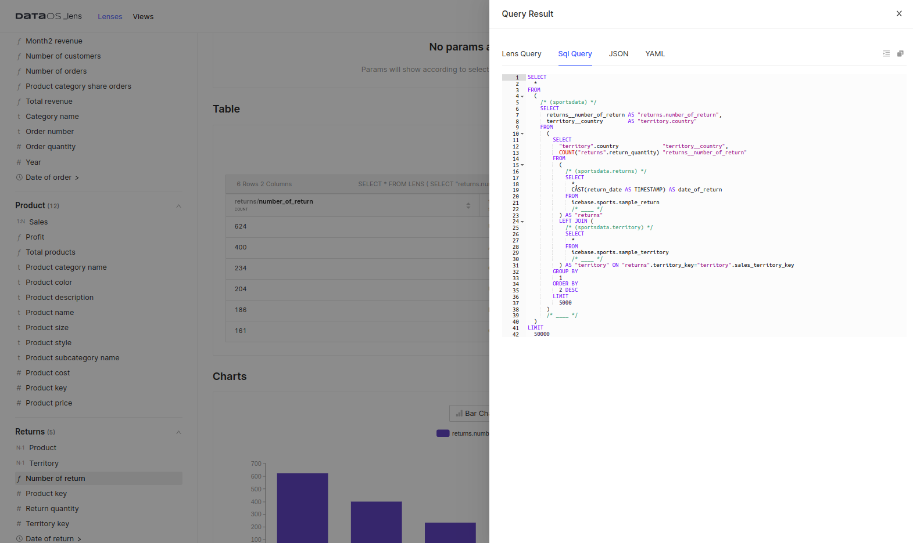

### **Most Frequent Order Analysis**

Select customer_key(**Customer**) and number of orders (**Sales**) for the running query.  You can choose the sorting order and limit the number of records in the user interface.


### **Customer with Maximum Lifespan in Months**

Select the customer key, customer lifespan in months, and email address from the **Customer** entity. This query helps run email campaigns targeting loyal customers.

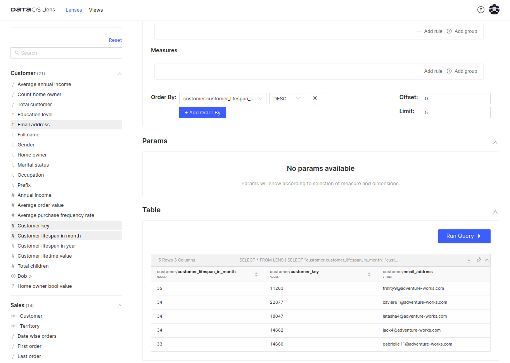

### **Product Category Share Order by Year**

Select the product category share order and year from **Sales** entity.  Set the new value for the product category.

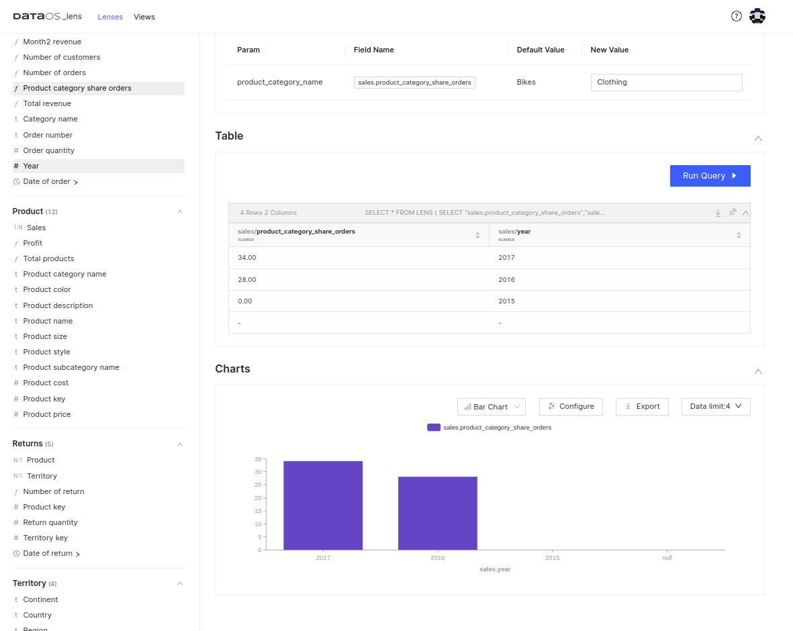

### **Date-Wise Orders Analysis**

Select date-wise order (**Sales)** and the number of orders (**Sales**). Specify a specific date as input and execute the query.


### **Compare Two Months' Revenue by Sub-Category**

Select month1 revenue and month2 revenue (Sales) along with Product sub-category (Product). View the  query results for default values, or input your desired months and run the query. 

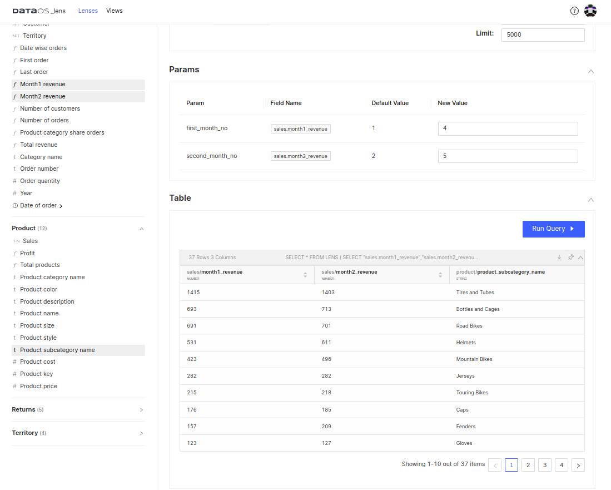