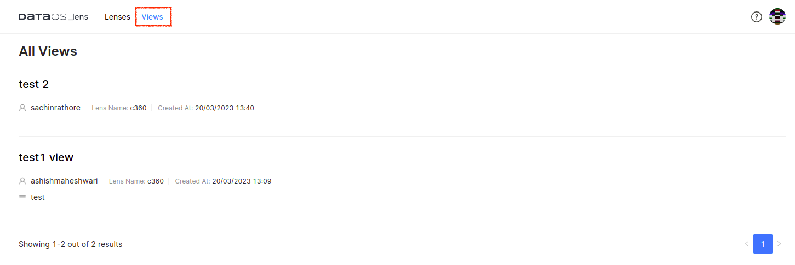

# Lens Ecosystem

The Lens Ecosystem consists of the following components:

1. **Lens Query**:  enables end users to query Lens using the lens grammar
2. **Lens Service**: facilitates the execution of lens queries, providing the necessary infrastructure and resources for efficient data processing.
3. **Lens Utilities**: offer additional functionality and tools to enhance the Lens experience, providing support for various operational and analytical use cases.

Collectively, these applications and services form a robust platform that supports a wide range of data-related tasks and scenarios.

## Lens Query
The Lens can be queried by the end-user using Lens Queries which are essentially abstracted SQL queries. These queries can be executed from various interfaces like Lens Explorer, Workbench, Atlas, Tableau, Power BI, etc., The query API exposes the Lens, enabling the end-user to query it. Upon defining and deploying a data model, you can start querying the model. Users with limited SQL proficiency can explore the model using Lens Explorer - a low code, intuitive, drag-and-drop data exploration utility. To know more about Lens queries and Grammar, refer to the [Lens Query Language(LQL)](lql/lql.md) document.

## Lens Service

Lens Service is a transpiler. It converts Lens Query to SQL Query. Currently, the Lens serviceis accessed via Gateway. Gateway analyses each incoming query and sends the query text to Lens Service, and the transpiler within the Lens Service will return the expanded SQL query to the Gateway. After receiving the expanded SQL query, Gateway sends it to Minerva query engine for execution. Query results are returned to Gateway with the data governance policies implemented. 

## Lens Utilities

### **Lens Explorer**

Lens Explorer is a discover and analyze tool for answering questions about anything in the Ontology layer. Its intuitive graphical user interface (GUI) empowers organizations to achieve semantic access to their data, making it possible for everyone to derive insights from it. With Lens Explorer, users can effortlessly explore business ontologies, create visually appealing charts, and generate deep insights using a user-friendly interface.

Lens Explorer's drag-and-drop interface allows users to easily build customized segments, generate insights, and create a comprehensive view for their data. They can query Lens to get answers to complex data questions in an exploratory fashion. Lens Explorer can assist personas such as Business Analysts, Product Managers, Product Analysts, and many more to move faster in their data journey. To learn more, refer to [Lens Explorer](./lens_explorer/lens_explorer.md).

### **Lens Views**

The Lens Views utility encompasses readily-shareable views formulated atop Lenses. This tool enables users to store their crafted views while exploring Lenses, and seamlessly retrieve them at their convenience. These views include a diverse array of use cases and scenarios. Every view listed an owner’s name, Lens name, and associated time of creation. Users can view the analysis with refreshed data by re-executing the query. 
 

<figcaption align = "center">Graphical User Interface of the Lens Views</figcaption>
