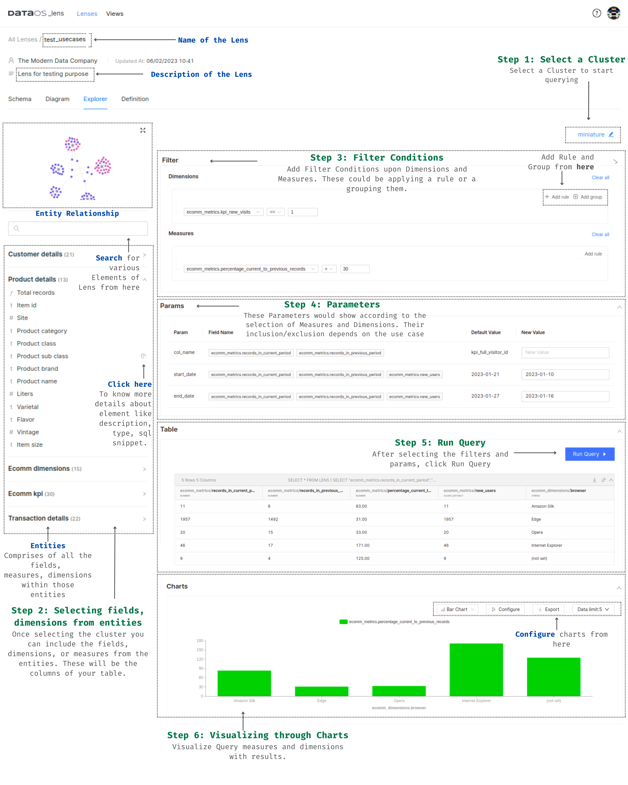

# Lens Explorer

Lens Explorer allows users to examine the same data model from diverse perspectives and contexts, enabling them to effortlessly analyze data at various levels of detail. This flexibility allows for slicing and dicing data to gain insights from different angles. Additionally, Lens Explorer simplifies complex calculations through a low-code approach, enabling users to perform intricate computations swiftly and with ease.

## How to Guide for Lens Explorer
Users can visually compose search queries ranging from simple filters to using params for the fields of interest. From there, they can explore the result sets as a table of results or a chart. Additionally,  users can export and save the analysis as a view.

Here is a quick guide for navigating through Lens Explorer.
 

<figcaption align = "center">A graphical how to guide for Lens Explorer</figcaption>
 

## Procedure

Follow the steps to explore a Lens within the Lens Explorer:

- Step 1: Select a Cluster
- Step 2: Select the fields, dimensions, and measures from the entities
- Step 3: Apply Filter Conditions
- Step 4: Apply Params
- Step 5: Run the Query
- Step 6: Visualize the Results