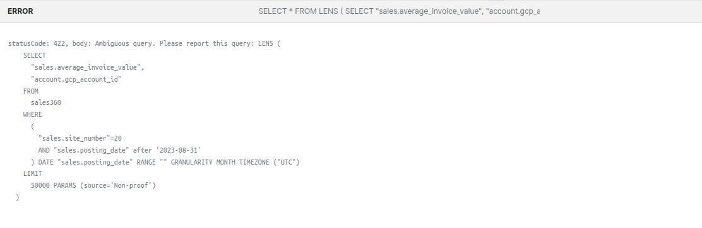
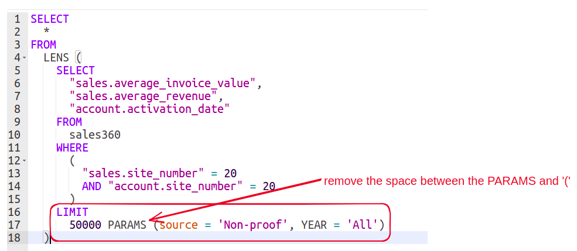
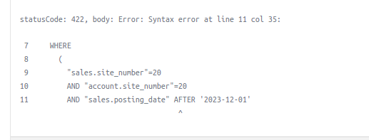
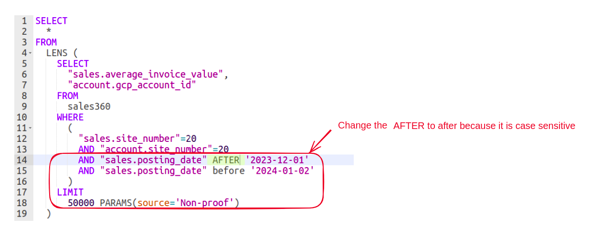
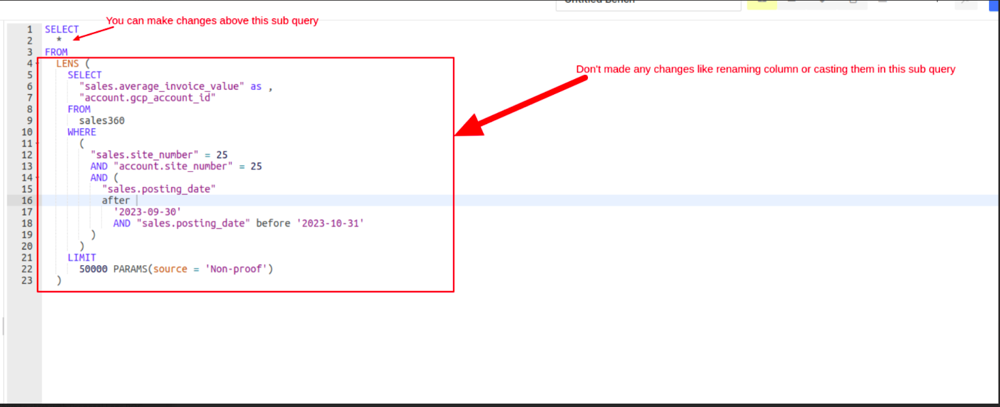
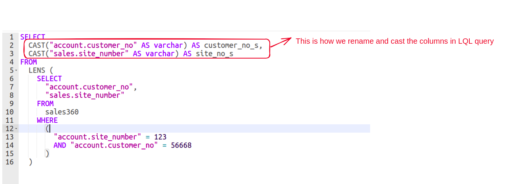
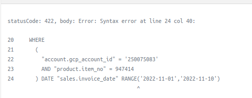
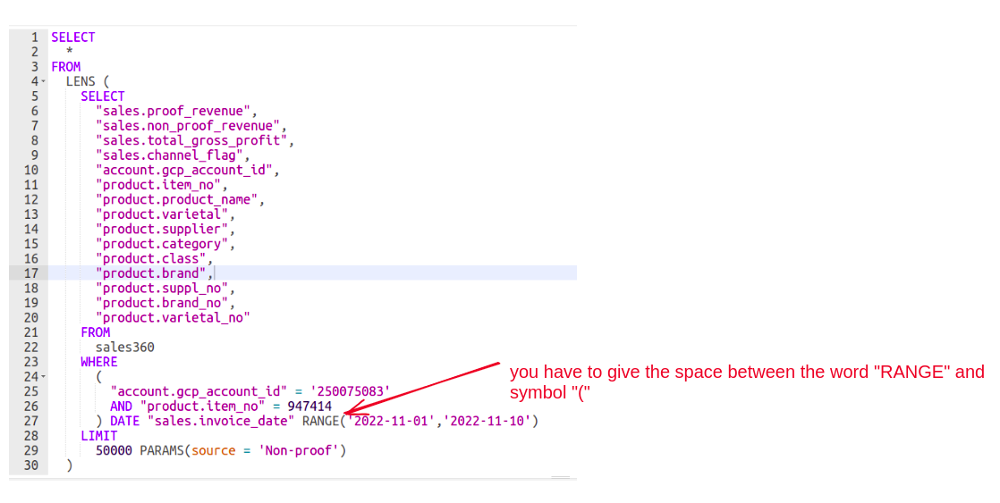

<aside class=callout>
🗣 Copying an unformatted Lens query instead of a formatted one decreases the chances of encountering errors.

</aside>

This documentation aims to help users understand and address common errors encountered while working with LQL (Lens Query Language). By addressing specific issues such as case sensitivity in date filters, and syntax errors, users can easily troubleshoot and optimize LQL queries.

## Ambiguous Query Error

An ambiguous error may occur when copying LQL containing measures/dimensions, typically due to a space between the "(" symbol and the word "PARAMS." This can result in syntax errors, impacting query functionality.



Ambiguous error due to space

### **Suggested Solution**

To resolve this error, remove the space between the "(" symbol and the word "PARAMS" in the LQL query. This modification should rectify the syntax error and make the query functional again. 



Here's how the LQL query should look after this modification:

```sql

SELECT
  *
FROM
  LENS (
    SELECT
      "sales.average_invoice_value",
      "sales.average_revenue",
      "account.activation_date"
    FROM
      sales360
    WHERE
      (
        "sales.site_number" = 20
        AND "account.site_number" = 20
      )
    LIMIT
      50000 PARAMS (source = 'Non-proof', YEAR = 'All')
  )

```

## Date Filter: Case Sensitive

In LQL, using uppercase keywords like "AFTER" in date filters may lead to errors, as the system expects these keywords to be in lowercase.



Error due to uppercase keywords

### **Suggested Solution**
Ensure keywords like "AFTER" and “BEFORE” are in lowercase. Modify the LQL query accordingly:



Here's how the LQL query should look after this modification:

```sql
SELECT
  *
FROM
  LENS (
    SELECT
      "sales.average_invoice_value",
      "account.gcp_account_id"
    FROM
      sales360
    WHERE
      (
        "sales.site_number"=20
        AND "account.site_number"=20
        AND "sales.posting_date" after '2023-12-01'
        AND "sales.posting_date" before '2024-01-02'
      )
    LIMIT
      50000 PARAMS(source='Non-proof')
  )
```

## Syntax Error

Performing operations inside LQL subqueries from the DataOS Workbench can result in syntax errors, especially if not using the specified syntax for LQL queries.



Error due to renaming of column inside the sub query

### **Suggested Solution**

Follow the correct syntax for operations like renaming columns, casting functions, or using range functions in LQL queries. Ensure these operations are executed outside the sub-query to avoid syntax errors.



Rename and cast operations outside the sub-query

**a) Renaming Column**

   We need to follow the below syntax to rename the column name in the LQL query.

```sql
SELECT
  "account.customer_no" AS customer_no_2,
  "sales.site_number" AS site_number_2
FROM
  LENS (
    SELECT
      "account.customer_no",
      "sales.site_number"
    FROM
      sales360
    WHERE
      (
        "account.site_number" = 123
        AND "account.customer_no" = 56668
      )
  )
```

     

  **b) Cast Function**

We need to follow the below syntax for casting the columns in LQL query.

```sql
SELECT
  CAST("account.customer_no" AS varchar) AS customer_no_s,
  CAST("sales.site_number" AS varchar) AS site_no_s
FROM
  LENS (
    SELECT
      "account.customer_no",
      "sales.site_number"
    FROM
      sales360
    WHERE
      (
        "account.site_number" = 123
        AND "account.customer_no" = 56668
      )
  )
```

## **Error while using Range Function**

The problem seems to be arising due to there being no space between the "(" symbol and the word "RANGE". The presence of this space is likely causing a syntax error, resulting in an ambiguous error message. By simply adding the space, you should be able to rectify the error and make the LQL query functional again. 

The issue likely arises because there is no space between the "(" symbol and the word "RANGE." This absence of space can cause a syntax error. 



Error due to no space after RANGE keyword



### **Suggested Solution**

Simply adding the space should rectify the error and restore functionality to the LQL query.

Here's how the LQL query should look after this modification:

```sql
SELECT
  *
FROM 
  LENS (
    SELECT
      "sales.proof_revenue",
      "sales.non_proof_revenue",
			"sales.total_gross_profit",
			"sales.channel_flag",
			"account.gcp_account_id",
			"product.item_no",
			"product.product_name",
			"product.varietal",
			"product.supplier",
			"product.category",
			"product.class",
			"product.brand",
			"product.varietal_no",
			
    FROM
      sales360
    where
      (
        "account.gcp.account_id" = '250075083'
				AND "product.iem_no" = 947414
      )DATE "sales.invoice_date" RANGE ('2022-11-01','2022-11-10')
    LIMIT
			50000 PARAMS(source='Non-proof')
)
```

### **How to Make Use of the Range Function**

The syntax for the RANGE function in a LQL query is as follows. It allows you to specify a time frame for retrieving data. You can adjust it to show data for specific durations, such as the 'last 2 quarters', 'last 5 days', or custom dates as needed.

**Conditions for modifying range Function:**

- Mention the date in single quotes **`' '`,** start and end date should be separated by comma**`,`**
    
    ```sql
    DATE "sales.invoice_date" RANGE ('2022-11-01','2022-11-10')
    ```
    
- To retrieve data for the last 6 months
    
    ```jsx
    DATE "sales.invoice_date" RANGE ('last 5 month')
    ```
    
- To retrieve data in a particular duration (range in `month`, `year` etc ..).
    
    Below are the keywords you can use in range.
    
    ```sql
    - last [0-9] days | week | year | month | quarter
    - next [0-9] days | week | year | month | quarter
    - today
    - yesterday
    - this days | week | year | month | quarter
    - last days | week | year | month | quarter
    ```