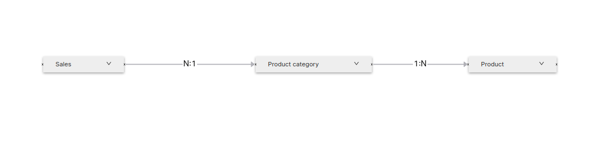
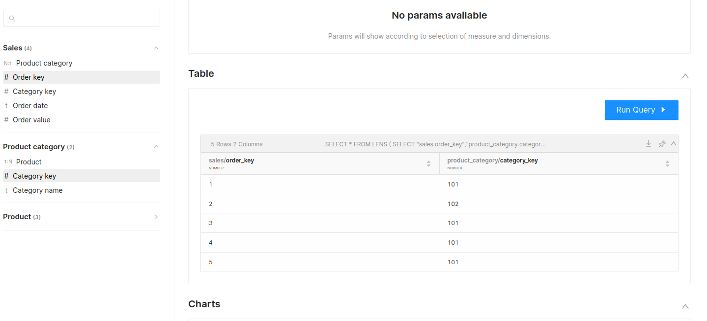
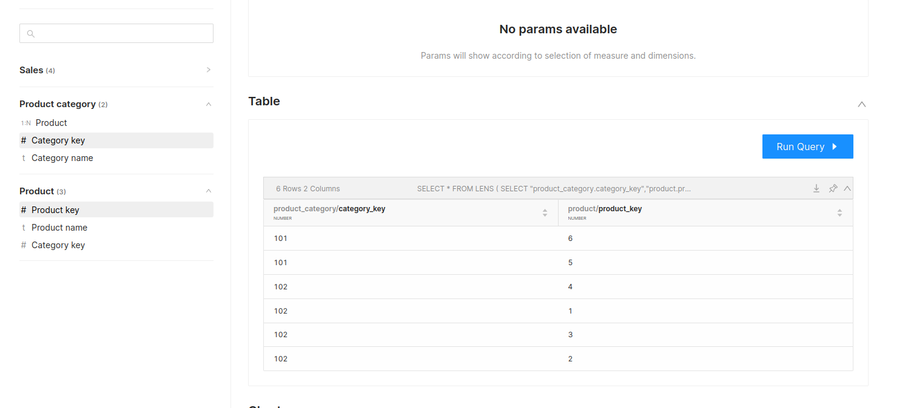
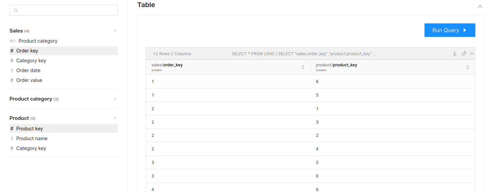

# Powering Many-to-Many joins with Lens

## Understanding Many-to-Many Join

There are two scenarios in which you would want to implement many-to-many joins. 

1. When there is a many-to-many relationship between the data in two tables, such that one row in one table can be related to multiple rows in the other table and vice versa. This can happen due to non-unique values in one or more columns, or due to the nature of the data itself.
2. When there is no common column between two tables, there is a many-to-many relationship between them. In this case, a bridge table is used to connect the two tables based on a shared column(s) in the bridge table, which represents the many-to-many relationship.

When thinking of practical use cases of many to many join you can think of product affinity, where you want to identify which products are frequently purchased together. More examples can include mapping relationships between students and classes, linking employees to the departments they work in, and connecting patients to their prescribed medications

Essentially, many-to-many joins should be leveraged whenever you need to associate multiple records from one table with multiple records in another table. 

A Many-to-Many join is a powerful tool for gaining valuable insights into the complex relationships within your data.

## Implementing Many-to-Many Join

Cross-join is leveraged whenever we perform a many-to-many join. You cannot directly perform cross-join within Lenses. Instead, we will use a bridge/junction table to perform a many-to-many join. 

> 🗣 When implementing a many-to-many relationship, a third table is often created to link the two tables together, typically referred to as a junction table or bridge table.

Let’s understand how you can achieve a many-to-many relationship within Lenses

We have three entities `Sales`, `Product Category,` and  `Product`. Our goal is to see all products purchased within an order. As there is no direct relationship between `Sales` and `Product`, we cannot answer this question.

But, we can answer,

- How many categories were sold and,
- All the products that belong to that category

As there is a relationship between the Sales and Product Category entity, as well as the Product Category and Product entity.

So, how do we answer ‘All products purchased within an order?’

To answer it, we would need a junction table that can pave the path of the join for these two tables. For us, the `Product Category` table is the junction table that has a direct relationship with both tables. We cannot directly apply a cross-join in lenses. But, we may do it indirectly by constructing an entity(Bridge table) that is directly related to both of the other entities and then applying many to one transitive join between them.

The Direction of Join

> 🗣 Note: The direction of the join will always be the
[transitive join](../working_with_transitive_joins.md).
 
<center>



</center>

To define this within Lens you would need  →

- N: 1 join from `Sales` to `Product_Category`
- 1: N join from `Product Category`  to `Product`

Eventually leading to N: N join between `Sales` and `Product`. The result will be a cartesian product(cross-join) of the two entities.

The sample Lens below depicts how you can achieve cross-join using Lens →

```yaml
name: retail_lens01
description: Implementing Cross Join
owner: iamgroot
contract: sample
entities:
  - name: sales
    sql:
      query: >
				..........
    fields:
      - name: order_key
        type: number
        column: order_key
        primary: true
      - name: category_key
        type: number
        column: category_key
      - name: order_date
        type: string
        column: order_date      
      - name: order_value
        type: number
        column: order_value

    # defining N:1 join from sales table to product category table
    relationships:
      - type: N:1
        field: category_key
        target:
          name: product_category
          field: category_key

  - name: product_category
    sql:
      query: >
					.......
    fields:
      - name: category_key
        type: number
        column: category_key
        primary: true
      - name: category_name
        type: string
        column: category_name
        
    # defining 1:N join from product_category to product table
    relationships:
      - type: 1:N
        field: category_key
        target:
          name: product
          field: category_key

  - name: product
    sql:
      query: >
						......
    fields:        
      - name: product_key
        type: number
        column: product_key
        primary: true
      - name: product_name
        type: string
        column: product_name        
      - name: category_key 
        type: number
        column: category_key
```

Below are the screenshots, depicting how you can answer the different questions once you have successfully defined N : N join between `Sales` and `Product Entity`

1. All orders placed for different product_category
 
    <center>

    

    </center>

    <figcaption align = "center">Order key with category key</figcaption>
    <br>

1. All products belonging to a category
 
    <center>

    

    </center>


    <figcaption align = "center">Category with product</figcaption>
    <br>

1. Combining sales and product to view all products placed for an order
    
    *Can only be answered if you have a many-to-many join*
         
    <center>

    

    </center>

    <figcaption align = "center">Set of combinations of orders with product</figcaption>

    <br>

## Managing cases without a junction table

In the context of managing many-to-many relationships between two entities, it is possible that a junction table may not be present. In such scenarios, it is recommended to create a junction entity that establishes a direct relationship with the two entities that need to be related. This approach involves the creation of a proxy entity, which is composed of the entities that need to be related, and ensuring that there is a dummy dimension(if confused try remembering the concept of the foreign key) referring to the primary key of each entity. 

By adopting this strategy, it is possible to effectively manage relationships between entities in the absence of a junction table.