# Explore Metis UI

Metis UI is a collaborative interface for diverse data users to navigate through the data ecosystem in an enterprise. Metis UI helps users search, discover, understand, and trust data assets that exist for the entire organization. Data assets include datasets, tables, columns,  dashboards, workflows, etc. Users can easily collaborate with other team members, inform them about the updates on the data assets, observe the changes in the metadata through versions and accomplish more.

## Metis UI Homepage

Metis UI homepage displays all the activities around your data assets. You can navigate to the different pages by clicking on the **Tabs** given at the top. You can explore the data assets listed on the left panels.

Metis UI - landing page

This document will cover the essential details about the Metis UI and tutorials on how to perform various functionalities, such as adding a glossary, starting conversations for collaboration, and many more.

## Adding Tag Categories, Tags, and Glossary

Tags and glossary terms are two distinct and impactful features, each serving a unique purpose. Although they may appear similar at first glance, they are designed for different applications. Tags are labels that provide valuable assistance to individuals and groups, acting as helpful aids. On the other hand, glossary terms play a crucial role in maintaining consistency across the entire company, ensuring the usage of common vocabulary.

To maintain a well-organized business glossary, we recommend limiting the creation permissions for glossary terms to administrators or a designated Data Governance lead. Enabling this permission for too many end-users could potentially lead to a disorganized and cluttered glossary.

Here are some scenarios where using these terms can be powerful:

- Labeling datasets with concepts that are relevant to the business/industry - Glossary
- Labeling a data asset with sensitivity information (PII, Highly sensitive, etc.)- Tag Category
- Applying Gold/Silver/Bronze data-tier labels based on centrally defined standards- Tag Tier

### How to Define Tag Categories

1. On Metis UI, click on the Tags tab. You will see the following.
    
    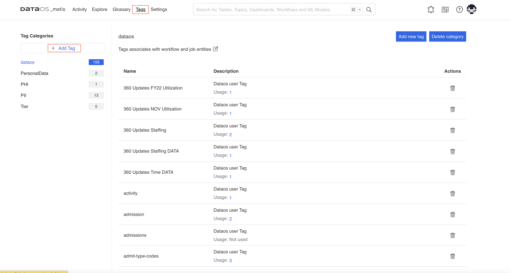
    
    Adding tag category
    
2. Clicking on the + Add Tag will open up the screen to add a new tag category and its description. 
    
    The following screen shows the new tag category created. 
    
3. For the newly added category, add new tags with proper descriptions and save it. Now, these tags can be added to the user assets. 

<aside style="background-color:#FFE5CC; padding:15px; border-radius:5px;">
🗣 You can define new tag categories as per business requirements, but some of the tag categories, such as tag tiers, are pre-defined by the Metis administrator with special business importance terms, Gold, Silver, etc. Click **here** to learn more about it.

</aside>

### How to Create a Glossary of Terms

1. On Metis UI, navigate to the **Glossary** Tab.
2. Clicking on + Add Glossary will open up the following form:

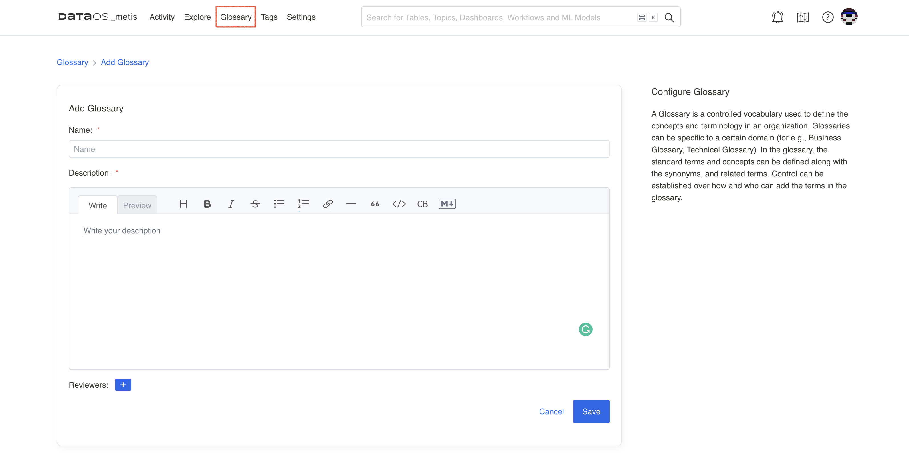

Adding glossary

1. Add reviewers and save it. Your glossary will appear on the left pane.
2. To create a glossary term, select the newly added glossary on the left pane, and then select the **Add term** button on the page.
3. Give this new term a name, which must be unique in the glossary. 
    
    
    
    Adding references and synonyms for the glossary term 
    
    <aside style="background-color:#FFE5CC; padding:15px; border-radius:5px;">
🗣 Metis enables you to add rich formatting to glossary term. For example, you can add `bold`, `underline`, or `italic` formatting to the text. You can also create tables, bulleted lists, or hyperlinks to external resources.
</aside> 
4. You can add synonyms, the other terms used for the same term, such as for customer, you can add client, buyer, etc.
5. You can add related terms for the term, such as for customer, you can add related terms ‘loyal’, ‘preferred’, ‘high-importance’, etc.
6. A term also has a set of **Reviewers** who review and accept the changes to the Glossary. This is to ensure the consistent use of terms across the organization. 

<aside style="background-color:#FFE5CC; padding:15px; border-radius:5px;">
🗣 Once tag categories and glossary terms are defined, users can attach them to various data assets.

</aside>

### How to Add Tags to Data Assets

On the data asset information page, click on the highlighted Edit icon. Choose a tag from a list of tags defined in Metis for various categories.

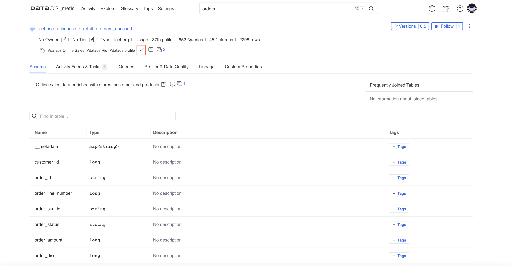

Adding tags to data asset

### How to Add Tag Tiers

On the data asset information page, click on the edit icon next to the Tag Tier.

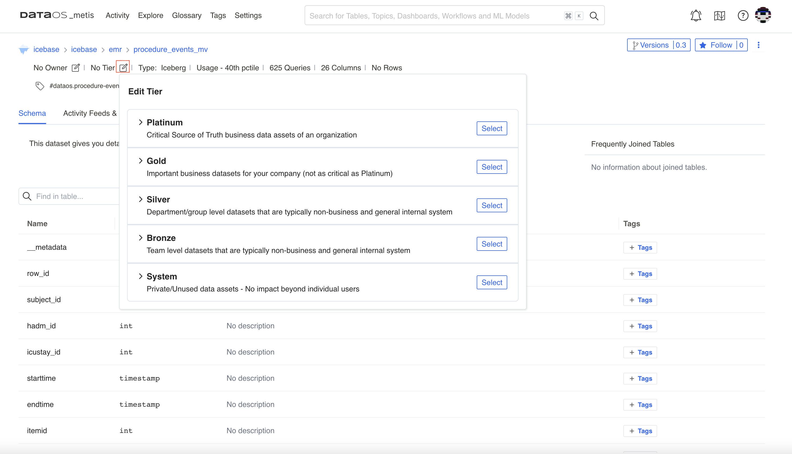

Edit tag tier

## How to Collaborate with Team Members

### Start Conversations

You can collaborate with your team by starting conversation threads and asking for dataset descriptions or tags for an entity by clicking the chat icon. Metis enables you to easily ask any questions that you might have about a data asset.

You can create and reply to entire conversation threads around various activities across any data asset. You can also add reactions with emojis.

1. On the data asset information page, click on the highlighted icon for conversations. The number on it denotes the messages in the conversation thread. The right pane will show the conversations.
    
    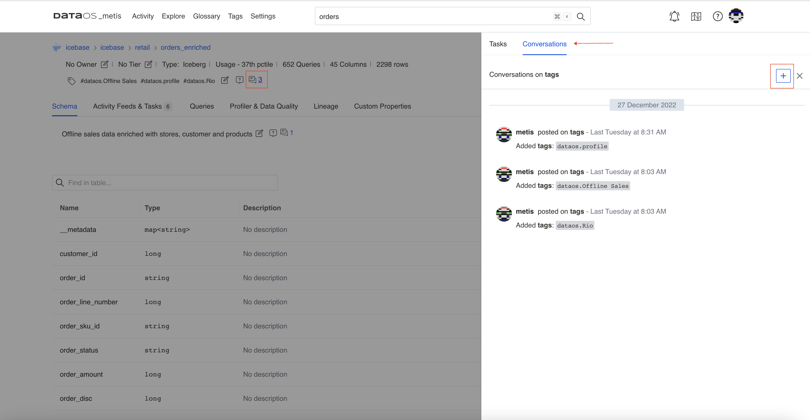
    
    Conversations around data asset
    
2. Clicking on the **+** sign will open the editor for the new conversation.
    
    <aside style="background-color:#FFE5CC; padding:15px; border-radius:5px;">
    🗣 Metis enables you to add rich formatting to conversations. For example, you can add bold, underlined, or italic formatting to the text. You can also create tables, bulleted lists, or hyperlinks to external resources.
    
    </aside>
    
3. You can also add conversation threads on the columns of your dataset.
    
    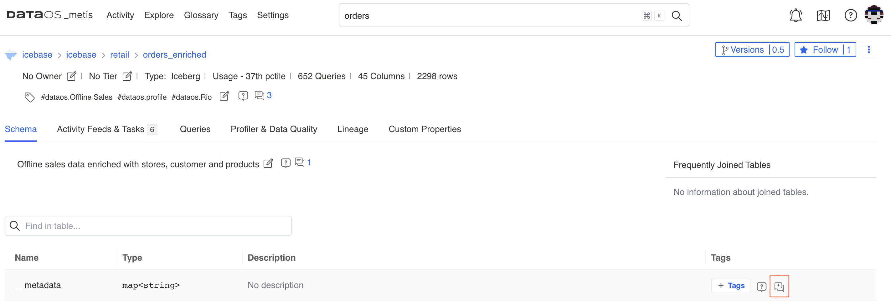
    
    Conversation thread on the column
    

### Create Announcements

This feature helps in informing the entire team (or other users) about the changes to the data, such as deprecation, deletion, or schema changes, so that other team members are prepared to handle the impact. 

These announcements can be scheduled with a start date and an end date. All the users following your data are notified in Activity Feeds about the announcement.

1. On the data asset information page, click on the vertical three dots menu to get the option to add an announcement for the asset.

Creating announcements to inform team members about data asset updates

1. Clicking on the Add Announcements button will open the dialog box to enter the details.
2. On Metis UI, under ‘All Activity’, users can view the announcements. Users can add reactions using emojis and reply to the announcement.

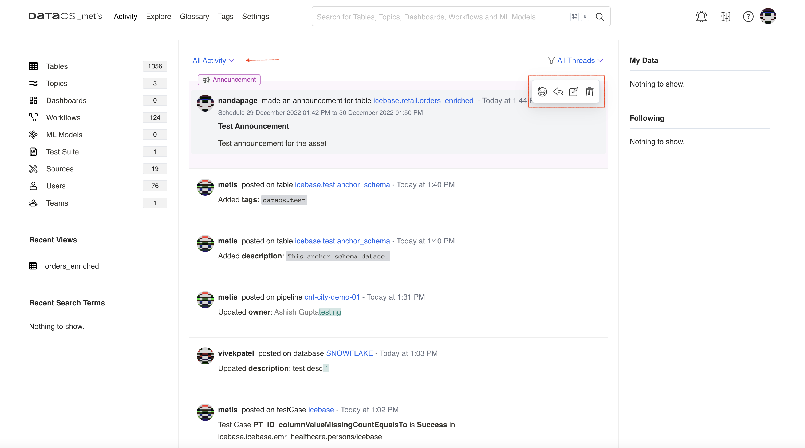

Announcements in user’s activity

### Create Tasks for Team Members

You can create tasks for requesting updates on data assets, such as creating tags or updating the description of a data asset and assigning the task to an appropriate user or team.

1. On the data asset information page, click on the highlighted icon to get the option to add a task.
    
    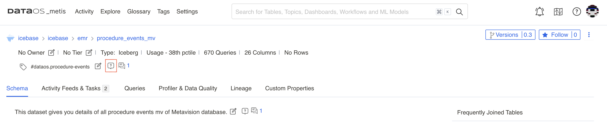
    
    Create task option
    
2. Create the task and provide the description for it. You also need to assign team members by adding @ symbol. This task will appear in Activities for the assignee.

## How to Manage Ownerships

On the data asset information page, click on the edit icon next to **No Owner.** You can add the team or individual person as an owner of the data asset.

## How to create Roles and Policies

The Metis administrator has to decide on the roles users must be given along with the set of permissions for the roles. Permissions are a set of rules pertaining to various metadata operations that can be performed using Metis UI and APIs. These permissions are part of the policies corresponding to each role. When users are assigned roles, they automatically get the permissions defined for the roles.

[Pre-defined Roles and Policies](explore_metis_ui/pre-defined_roles_and_policies.md)

<aside style="background-color:#FFE5CC; padding:15px; border-radius:5px;">
🗣 Metis Admins have access to define new roles and their associated permissions. Once roles and permissions are in line with organization/business requirements, Metis admin can assign Roles to Users.

</aside>

## How to Add Configured Roles for Users

Roles can be assigned from the user profile on Metis UI.

1. On the Metis UI page, navigate to the **Settings** tab. 
    
    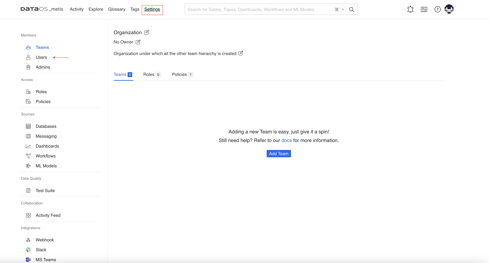
    
    Metis settings page
    
2. Clicking on the **Users** in the left pane will show the list of users. Click on the user name to open the user profile. In the left pane, edit the roles given to the user. Click on the edit icon, and a drop-down list will show the configured roles to choose from.

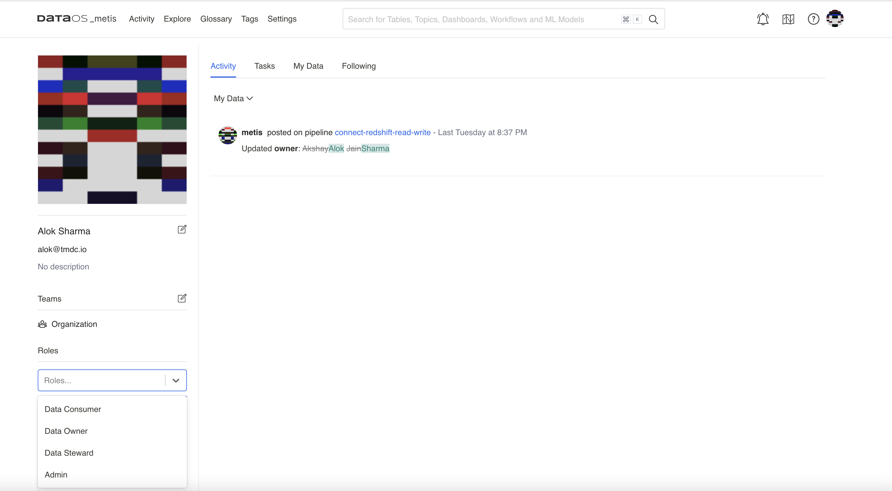

Adding roles to the user

<aside style="background-color:#FFE5CC; padding:15px; border-radius:5px;">
🗣 Metis Admin role can be given from the Metis UI by a user with ‘Admin’ privileges. 

</aside>

## How to Get Data Profile Information

Data profiling workflow analyzes the valid formats, null and inconsistent values within data to uncover anomalies and redundancies to achieve higher data quality. It uses basic statistics to gain insight about the validity of the data. The Data Profile scan workflow reads data profiling statistics and saves this information into Metis DB, which can be accessed on Metis UI.

1. Search the dataset for which you want to view the data profiling results.
2. On the data asset information page, click on the **Profiler & Data Quality** tab.
3. You will see the data profiling statistics for the columns. It gives data types, null values %, distinct value %, and unique values % for each column. It also shows you ‘value count’, which helps you to know the completeness and missing values for the column before you use the data for critical business use cases.
4. Click on a column to see more details on the statistical distribution of its values.  You need to select the time period to see all the test results run for the particular column of the dataset.

## How to Get Fingerprinting Information

Fingerprinting analyzes the data to know that a column of data has a signature or a pattern. By examining the data values in a column, it can identify what type of data is there and determine what business terms or labels can be attached to this data. Fingerprinting automates identifying sensitive data (PII tag)that needs to be secured and to comply with government regulations like the GDPR. 

This information is shown on the Metis UI for your dataset.

On the data asset information page, you will see the following fingerprinting data for your dataset.

- Column names for which fingerprinting is performed.
- Label showing the labels identified in the data. These labels are defined as system labels or according to business value.
- For each label, you will get an option to **accept** the label to tag the fingerprint to the column or **discard** the label.
- The confidence score reflects the system's degree of certainty that the identified label/classification is correct.
- Once you accept the label, it will be added as a tag to the column.

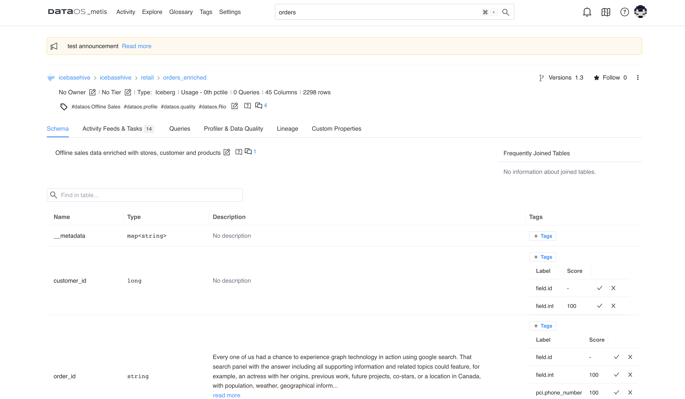

Automatically identified columns

## How to Visualize Data Quality Tests

You can view the list of quality tests (assertions)created for the columns of your dataset to monitor the data quality and trends charts for each run. The trend charts also show whether the checks are passed or failed.

### Test Suite View

1. On the Metis UI page, navigate to the **Settings** tab. Click on **Test Suits** in the left pane to get the  list of test suits.
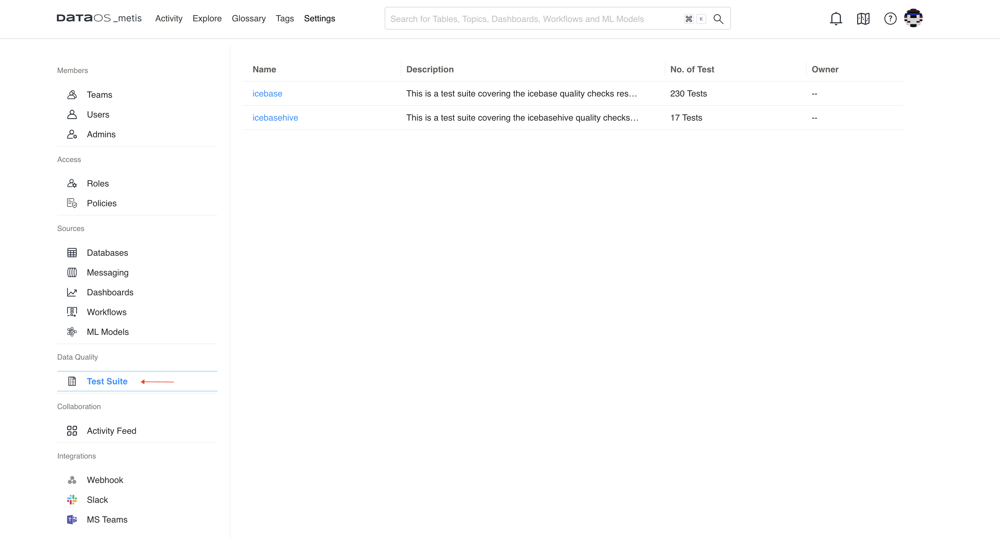
Test suits 
2. Select the test suit for which you want to see quality test results. The list shows the latest test run results for all the datasets and their columns. 
3. Expand to see all the test results for a dataset column for the particular time period.

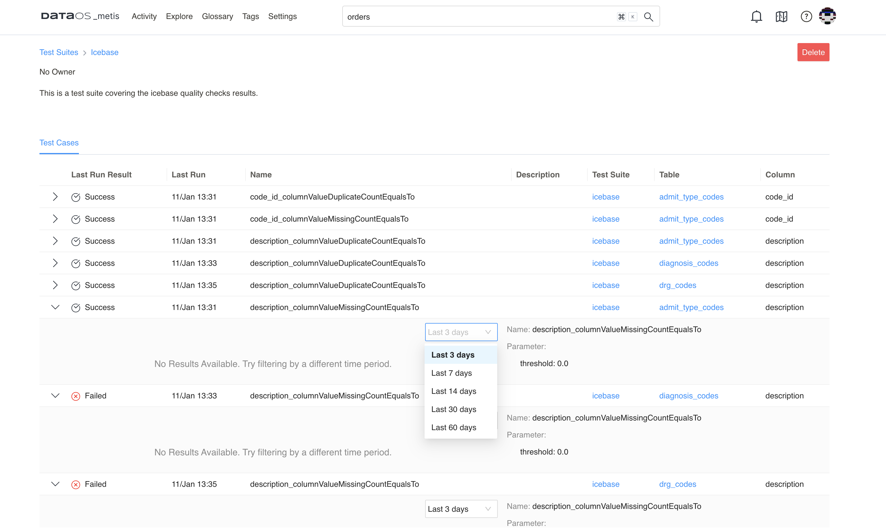

Test results for the dataset for selected time period

### Dataset View

1. Search the dataset for which you want to view quality tests result.
2. On the data asset information page, click on the **Profiler & Data Quality** tab.    
3. You will see the summary. In the summary for quality test runs for the columns, click on the **Data Quality** tab to see a list of results of the last test run for the dataset. You can expand and select the time period to see all the test results for the particular column of the dataset.