# Metis Key Features

Metis collects metadata by utilizing the Scanner stack and connecting with other components’ exposed APIs to gather information about the historical and current state of the DataOS artifacts (Data Products, Assets, Resources), ensuring comprehensive metadata coverage. It includes the following set of featuress to facilitate discovery, governance, observability, and collaboration.

## Activity Feeds

This feature lets you see summaries of data change events around data entities whenever they are modified. You can view these changes across all data products, assets and Resources that you own or focus on specific ones. Follow datasets, topics, or Resources relevant to your work to stay updated. You can view the latest updates, conversations, and tasks assigned in the ‘**All Activity**’ section.

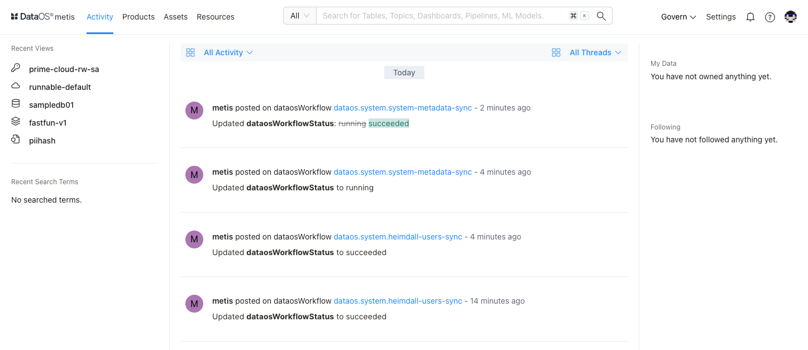

Activities around Assets and Resources 

With activity feeds, you can easily accomplish the following:

- Inform stakeholders about the important changes in data assets by adding announcements.
- Follow users, accounts, and conversations that have mentions.
- Learn, in a timely manner, about updates regarding data products, assets, and Resources related to you.
- Take quick actions on specific updates to fix things in time.

## Discovery

### **Search and Filter**

Metis's search experience surfaces results across data assets, ML models, pipelines, dashboards, Resources, and more. 

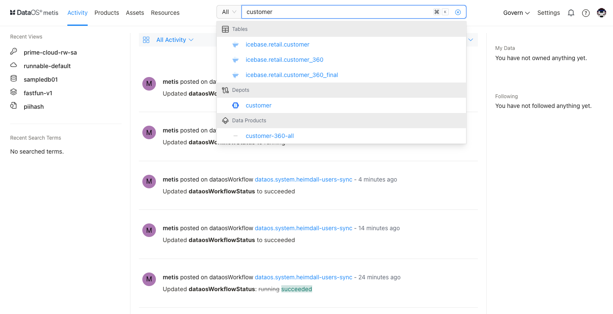

Metis not only helps you find and access data using search criteria for your data products, assets and Resources, but it also allows you to **filter** them based on attributes such as tier, domain, source name, schema databases, tags, owners, etc. 

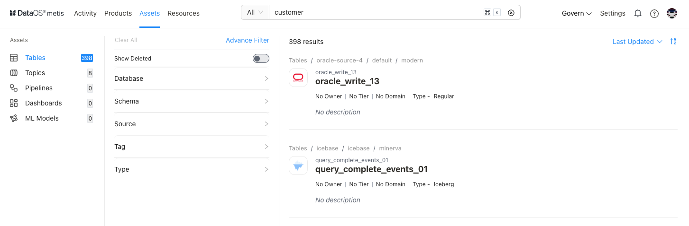

### **Advance Filter**
This option empowers you to define complex search criteria, allowing you to find data products, assets and Resources that precisely match specific metadata properties using **And/OR** operators.

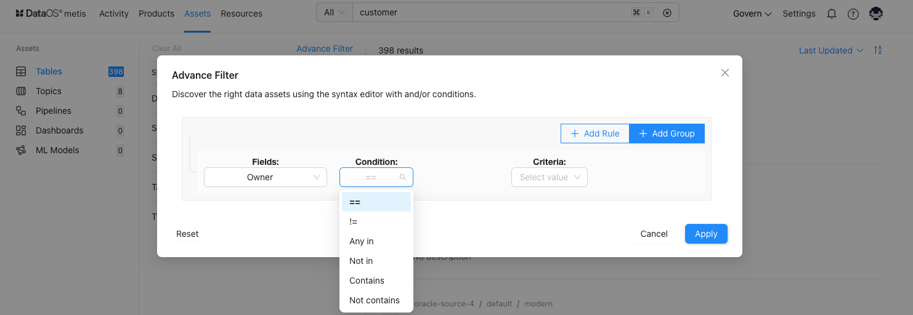

## Exploration

### Data Products Details

### **Data Asset Details**

Users can get a quick preview of asset information on the side panel. 

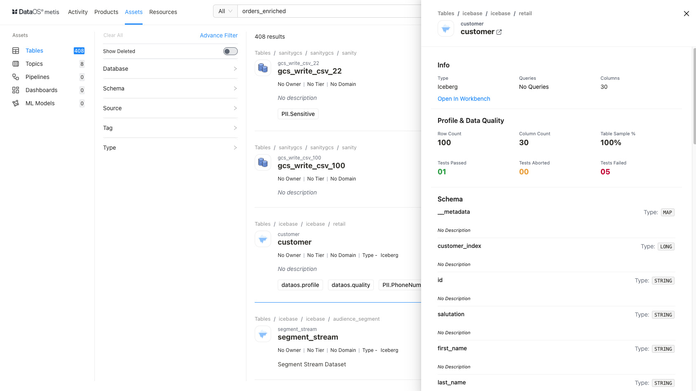

Quick information for data asset

By clicking on the dataset name, a **dataset details** page opens up to further deep-dive into schemas, configuration, lineage, etc. Suppose you want to know more about the tables; you can further drill down to answer questions such as who created/updated it, what each column means, what type of data it contains, what transformations are applied, and which datasets participated in the transformations, etc. From there, Metis offers the option to explore your data further by navigating to the workbench.

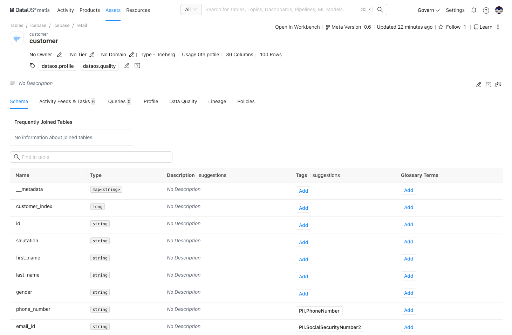

### **DataOS Resource Details**

Metis lists all Resources, providing overviews and specific information about each instance. Users can further view more details about the Resource, such as its configuration and runtime information. For example, in the case of workflow, information such as topology and operational information on jobs, nodes, logs, resource utilization, and the status of jobs is available.

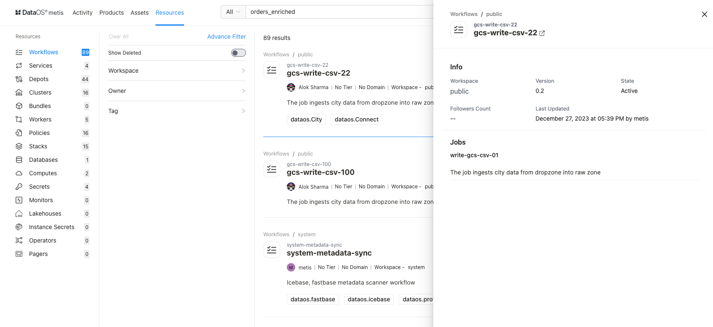

<aside class="callout">
🗣 Access to the Resource details can be configured by the Metis admin, such as giving **View Minimal**/**View All** permissions configured in policies for roles for metadata management.

</aside>

For detailed information about each resource, please refer to [metis ui- resources](metis_ui_resources.md) 

To gain an understanding of DataOS Resources, users can access the documentation with the ‘**Learn**’ option on Metis UI.

<aside class="callout">
🗣 In Metis, the metadata extracted from the data integration (Pipeline) services, such as Airbyte, Airflow, etc., can be viewed under **Assets** as **Pipelines**. The metadata for the workflows, which are built using DataOS data processing stacks, will be listed under **Resources** as **Workflows**.

</aside>

## Collaboration

### **Adding Descriptive Metadata**

Tags are labels that you attach to your data assets and their attributes, which help in asset discovery. Metis allows you to define tag categories to organize and group the created tags. it facilitates advanced search.

You and your data team can attach additional information to data assets, such as providing detailed descriptions for datasets & columns, adding owners and relevant glossary terms as tags, etc. Descriptive Metadata then helps in faster asset discovery and filtering. With ownership information, you can contact the right person in your organization to get help with datasets for more understanding or in case of any irregularities or discrepancies. Descriptions added to the complex/nested data types will help in understanding and discovering. Announcements keep the stakeholders/owners informed about the latest updates. 

Data team members can also add comments and tasks to data assets, facilitating smooth collaboration among stakeholders.

### **Defining Tag Tiers**

To capture the business importance of data, a tag category ‘tag tier’ is used. 

The concept of data transitioning and value enhancement through the Bronze, Silver, and Gold stages has gained recognition and implementation. As data quality and value improve, it progresses from Bronze data, representing raw and basic ingestion, to Silver data, which undergoes transformation, and ultimately to **Gold** data, where it reaches its final stage with comprehensive aggregations and enriched context.

When a data asset is tagged with a tier tag, say **Gold**, all the upstream assets used for producing it will also be given the same tag. This will help upstream data asset owners to understand the critical purpose for which their data is being used.

### **Defining Domains**

Users can now associate domains like Marketing, Finance, etc., with data products, assets and Resources. These domains are critical to the organization's operations. Each domain requires unique management and governance to ensure data accuracy, consistency, and completeness across the enterprise. 

### **Adding Glossaries**

Glossaries describe business definitions and context for data. With the help of glossaries, Metis helps establish a common business language for your data assets.    

Once you add a category for your glossary as per the business requirement, you can add terms and descriptions to it and declare their synonyms. All these terms are available to be added as tags for your assets in the drop-down. This facilitates self-service analytics, as business users do not depend on data teams to identify their relevant data assets.

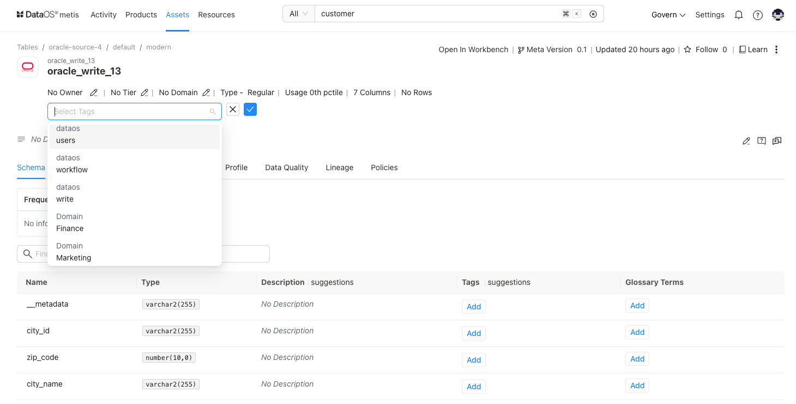

Adding business terms to your dataset

<aside class="callout">
🗣 Glossaries can be imported and exported in CSV format, facilitating simplified glossary management.

</aside>

### **Mutually Exclusive Tag Groups**

The Mutually Exclusive Property in the system enables users to designate tag groups and glossaries as mutually exclusive. When a tag group `domain` is marked as mutually exclusive, it implies that a metadata entity can be tagged to belong to either a finance, marketing, or sales domain.  It cannot belong to two or more domains simultaneously. This ensures that the entity's categorization remains distinct and avoids overlapping categories.

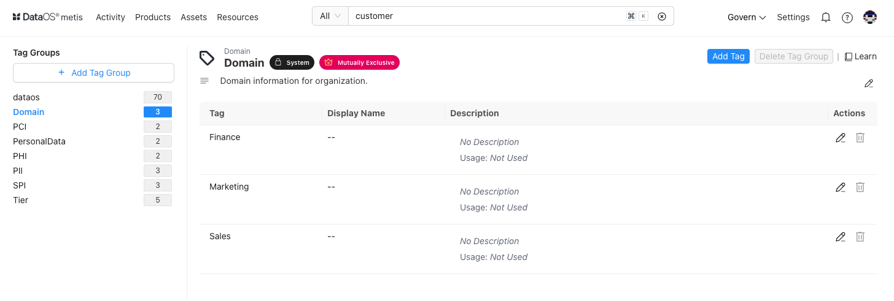

## Deleted Entity Metadata

Metis keeps rich metadata for the entities, about their structures, descriptions, tags, owners, importance, etc. This metadata is also about lineage, usage, and profiling data. When an entity is deleted, you may lose all this valuable information and experience broken metadata. Metis supports soft deletion, so these entities are not removed from the Metis DB but marked as deleted. Metis lets you choose to show deleted entities’ metadata to understand dependencies and fix broken metadata issues. Once deleted, these entities will not surface in search and exploration.

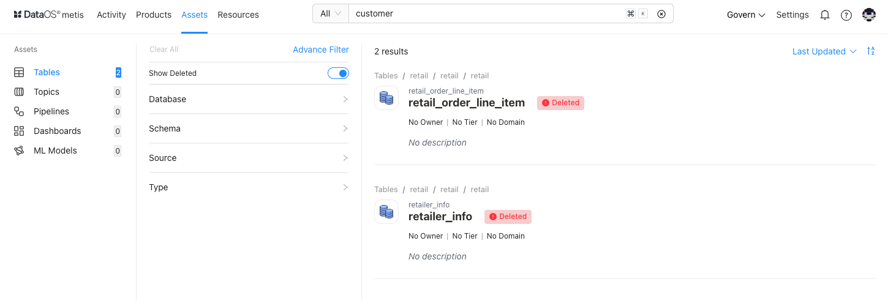

Deleted data on Metis UI

## Lineage

Quickly understand the end-to-end journey of data by tracing its lineage across datasets. This lineage gives a **granular job-level view** to help you get the details of data flow across workflows/jobs and the datasets they produce. Additionally, you can learn about the other dependent datasets. Users can edit the lineage view to include other connected assets and Resources.

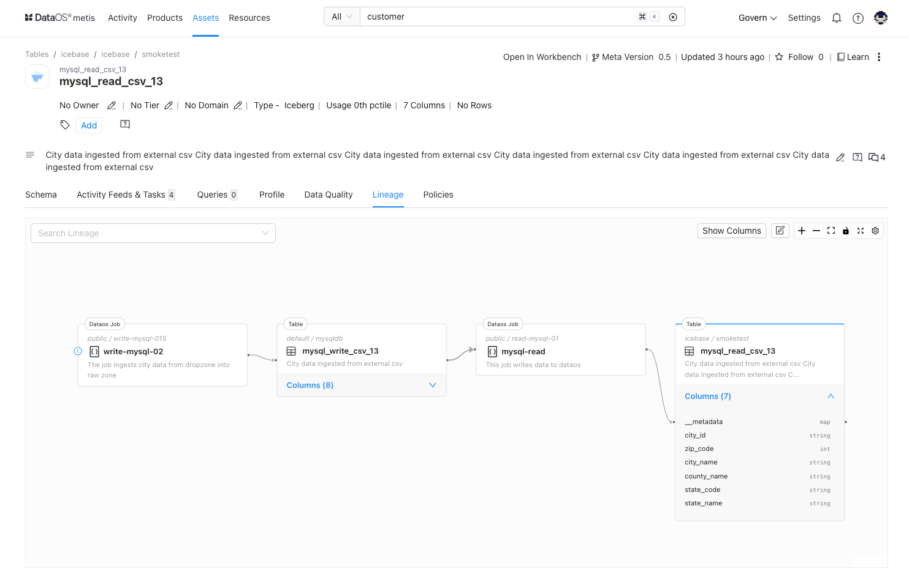

## Notifications

Metis allows users to define fine-grain notifications for alerts when a change is made to data assets. You can select owners and various roles to be notified. It provides native integration with Teams, Slack, MS Webhook, etc. that receives all the data changes happening in your organization through APIs. This will generate organization-specific notifications when a change is made to data assets.  It also introduces the ability to send email alerts. For example, send an email to the governance team when a "PII" tag is added to any data asset, or you find a change in the schema that can impact other datasets.

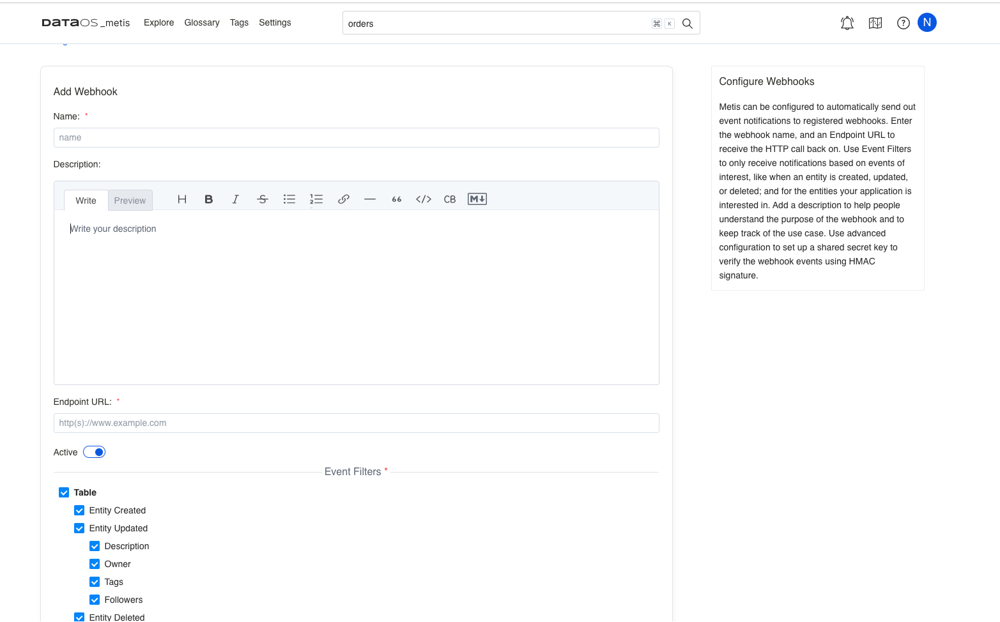

> Only users having Metis admin roles can configure the SMTP settings for sending emails.
> 

## Profile

Metis leverages Deequ, a Spark-powered profiling engine, for data monitoring, quality checks, and profiling at scale. DataOS now also extends support to other profiling engines, such as SQL-powered SODA.

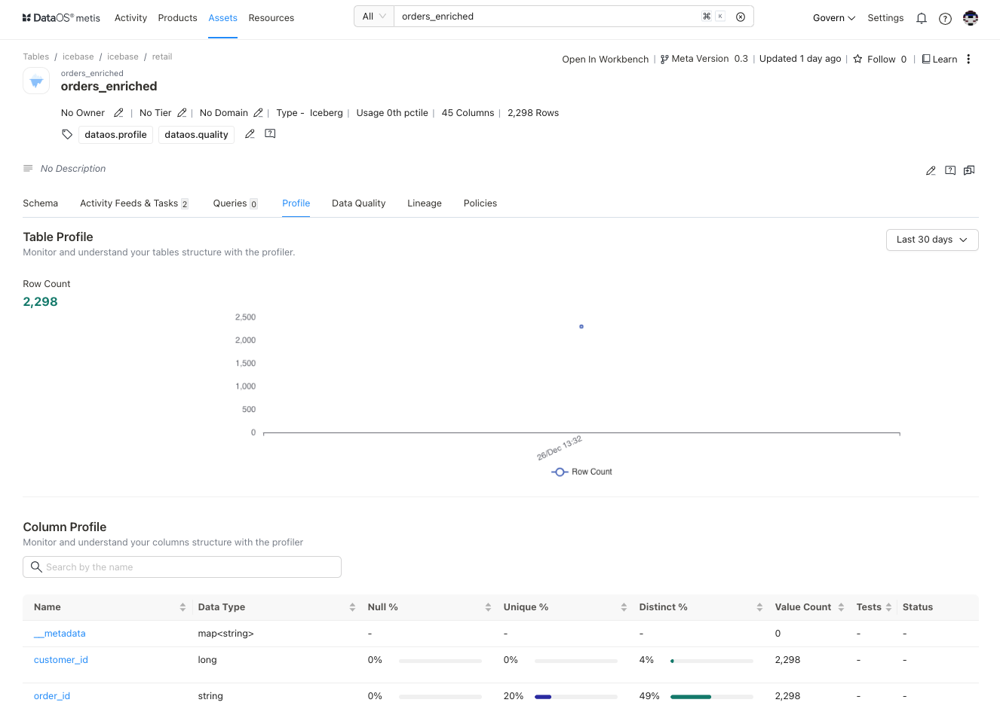

## Data Quality

It is important to ensure that you are working with trusted and appropriate data. Sometimes, input data sources contain invalid or incorrect data. You need to validate the captured data to determine whether it meets business requirements. Before going ahead with the analysis, you can understand the quality of the dataset to ensure the correctness and completeness of the data.

On Metis UI, You can check the quality of your datasets by viewing information about the business-specific validation rules applied, passed, or failed.

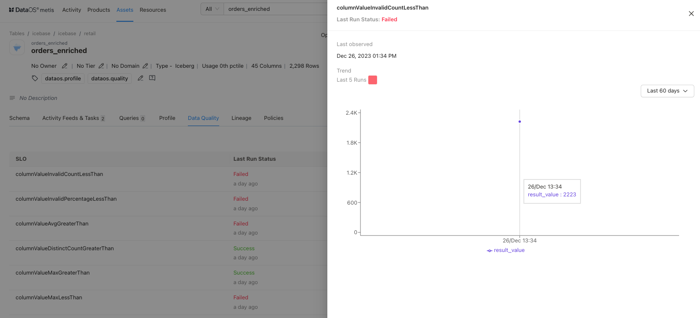

## Queries

Now you can have more insights around your queries, such as query run date & time, duration, user, and number of lines (you have the option to view the full query). Delete queries directly from the Metis interface.

## Roles and Policies

You can build roles and policies at the user and team levels. It involves grouping users and entitlements, called roles, according to business functions or activities as teams. Metis enables you to create multi-level teams and assign owners and roles. You can create new roles and assign multiple policies for accessing metadata.

Metis maps the role to a set of permissions (policies) for metadata operations, allowing role-based actions like updating descriptions, tags, owners, and glossary terms. 

## Topology

Metis also provides in-depth topology information for your workloads, enabling users to analyze and troubleshoot critical data operations. 

**Topology** focuses on the logic applied to transform data and can be accessed through **Logical Plan** and **Physical Plan** options. For instance, a Flare job typically comprises Input sources, transformations (tasks), and Output sources. The links between Input and Output sources contribute to Lineage, while the steps within transformations are part of Topology. 

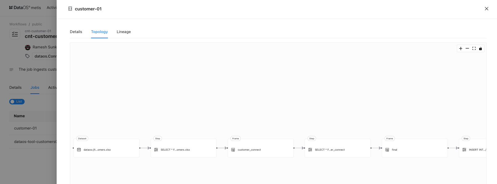

With the **Usage** option, you can find resource utilization when resources are over-allocated or underutilized, enhancing observability.

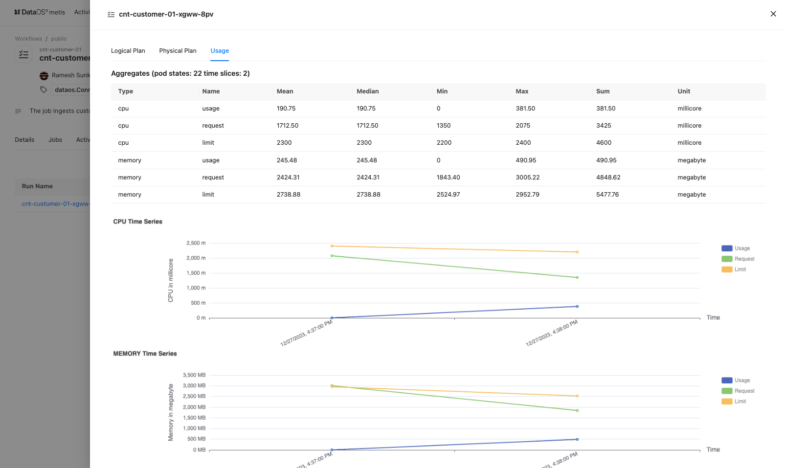

## Metadata Versioning

This feature records the changes in metadata. Metis maintains the version history for data products, assets and Resources that can help in the debugging process. You can view the version history to see if a recent change led to some inconsistencies in the data.

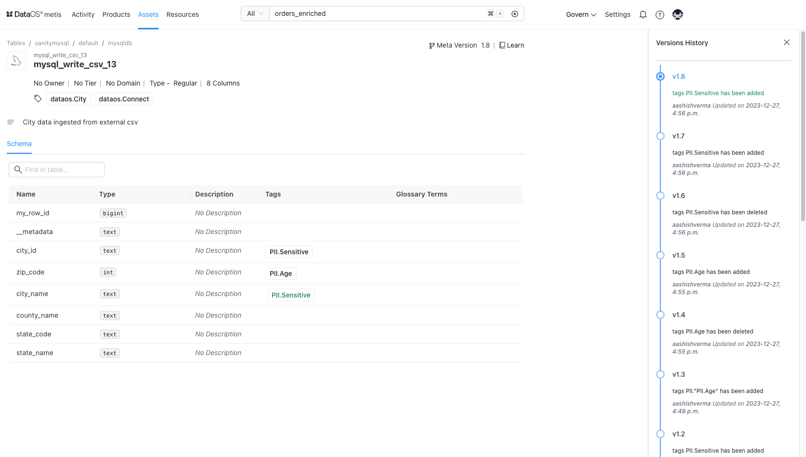