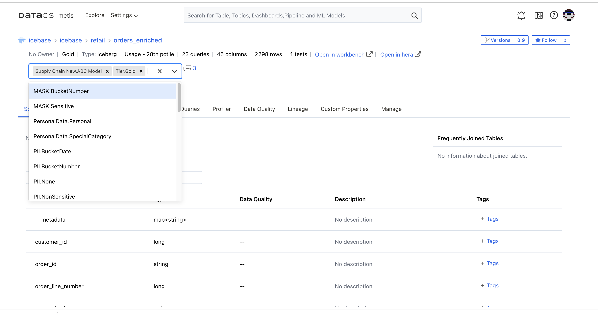
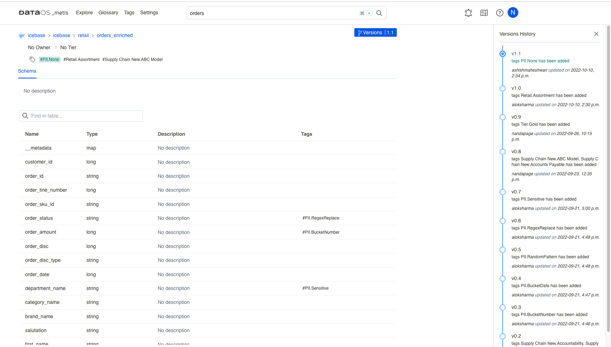

# Metis Features

Metis includes the following set of features to address all your metadata needs to facilitate discovery, governance, observability, and collaboration.

## Activity Feeds

This feature enables you to view a summary of data change events whenever your data assets are modified. You can view these changes for all the data assets of your ownership or for specific assets you are interested in. You can follow datasets or topics relevant to your work.  

Keeping track of activities for your data assets 

With activity feeds, you can easily accomplish the following:

- Inform stakeholders about the important changes in data assets by adding announcements.
- Follow users, accounts, and conversations having mentions.
- Learn, in a timely manner, about updates regarding data assets related to you.
- Take quick actions on specific updates to fix things in time.

## Asset Discovery

### Search and Filter

Metis's Advanced Search experience surfaces results across data assets, ML models, pipelines, dashboards, and more. Metis not only helps you to find and access data using search criteria for your assets, but it also allows you to **filter** these assets based on columns, schema, databases, tags, owner, etc. 

## Asset Exploration

### Deep Understanding of Data Assets

It gives a complete overview of the organization’s data assets in one place. Metis UI lets you know more about different kinds of assets: tables, topics, dashboards, workflows, ML models, services, users, teams, etc. You can view the latest updates, conversations, and tasks assigned in the ‘All Activity’ section.

Suppose you want to know more about the tables; you can further drill down to answer the questions such as who created/updated it, understand what each column means, what type of data it contains, what transformations are applied and which datasets participated in the transformations, etc. For all your data assets, you can manage ownership. 

## Collaboration

### Adding Descriptive Metadata

Tags are labels that you attach to your data assets and their attributes which help in asset discovery. Metis allows you to define tag categories to organize and group the created tags and facilitates the advanced search.

You and your data team can attach additional information with data assets, such as you can provide detailed descriptions for datasets & columns, add owners and relevant glossary terms as tags, etc. Descriptive Metadata then helps in faster asset discovery and filtering. With ownership information, you can contact the right person in your organization to get help with datasets for more understanding or in case of any irregularities or discrepancies. Descriptions added to the complex/nested data types will help in understanding and discovering. Announcements keep the stakeholders/owners informed about the latest updates. 

Data team members can also ****add comments and tasks to data assets facilitating smooth collaboration among stakeholders. 

To learn more, click on the link below.

[**Explore Metis UI**](explore_metis_ui.md) 

### Defining Tag Tiers

To capture the business importance of data, a tag category ‘tag tier’ is used. 

The concept of data transitioning and value enhancement through Bronze, Silver, and Gold stages has gained recognition and implementation. As data quality and value improve, it progresses from Bronze data, representing raw and basic ingestion, to Silver data, which undergoes transformation, and ultimately to Gold data, where it reaches its final stage with comprehensive aggregations and enriched context.

When a data asset is tagged with a tier tag, say Gold, all the upstream assets used for producing it, will also be labeled with the same tag. This will help upstream data asset owners to understand the critical purpose of their data being used.

To learn how to add tag tiers, navigate to the link below.

[**Explore Metis UI**](explore_metis_ui.md) 

### Adding Glossaries

Glossaries describe business definitions and context for data. With the help of glossaries, Metis enables you to establish a common business language for your data assets.    

Once you add a category for your glossary as per the business requirement, you can add terms and descriptions to it and declare their synonyms. All these terms are available to be added as tags for your assets in the drop-down. This facilitates self-service analytics as business users do not depend on data teams to identify their relevant data assets.

Adding business terms to your dataset

To learn more about how to create a Glossary, navigate to the link below.

[**Explore Metis UI**](explore_metis_ui.md) 

## Deleted Entity Metadata

Metis keeps rich metadata for the entities, about their structures, descriptions, tags, owners, importance, etc. This metadata is also about lineage, usage, and profiling data. When an entity is deleted, you may lose all this valuable information and may experience broken metadata. Metis supports soft deletion, so these entities are not removed from the Metis DB but marked as deleted. Metis lets you choose to show deleted entities’ metadata to understand dependencies and fix broken metadata issues. Once deleted, these entities will not surface in search and exploration. 

Deleted data on Metis UI

## Lineage Information

Quickly understand the end-to-end journey of data by tracing lineage across datasets. You can get the details of data flow across workflows and the datasets they produce. Additionally, you can learn about the other dependent datasets.

## **Notifications**

Metis allows you to integrate with tools such as Slack, Webhook, Microsoft Teams, etc., that receive all the data changes happening in your organization through APIs. This will generate organization-specific notifications when a change is made to data assets. For example, send an email to the governance team when a "PII" tag is added to any data asset, or you find a change in the schema which can impact other datasets.

Configuring Webhook for event-driven notification

## Roles and Policies

You can build roles and policies at the user and team levels. It involves grouping users and entitlements, called roles, according to business functions or activities as teams. Metis enables you to create multi-level teams and assign owners and roles. You can create new roles and assign multiple policies for accessing metadata.

Metis maps the role to a set of permissions (policies) for metadata operations — i.e., what the role is allowed to do, like updating descriptions, tags, owners, and adding glossary terms. 

To learn more about creating and managing teams, roles, policies, and rules, click here.

[**Explore Metis UI**](explore_metis_ui.md) 

## Validity and Reliability

It is important to ensure that you are working with trusted and appropriate data. Sometimes input data sources contain invalid data or incorrect data. You need to validate the captured data to determine whether the data meets business requirements. It is critical for generating valuable, correct insights. Before going ahead with the analysis, you can understand the quality of the dataset to ensure the correctness and completeness of the data. 

On Metis UI, You can check the reliability of your datasets by viewing information about the business-specific validation rules applied, passed, or failed.

## Versioning

This feature records the changes in metadata. Metis maintains the version history that can help in the debugging process. You can view the version history to see if a recent change led to some inconsistencies in the data. 

Tracking changes in metadata