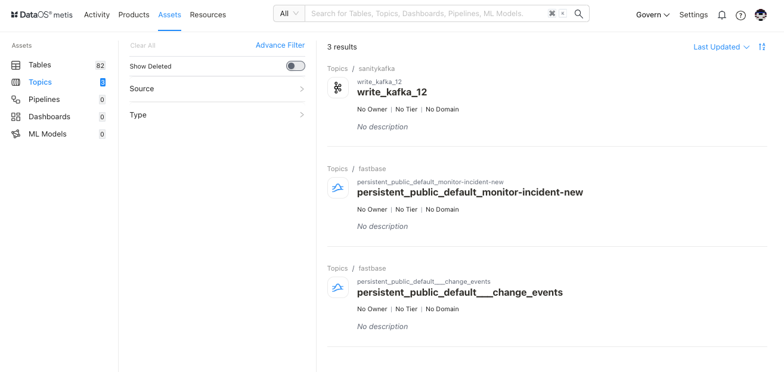
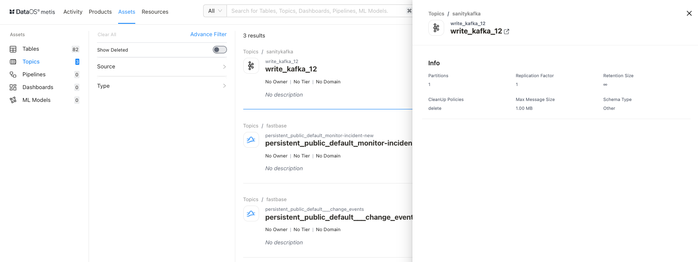
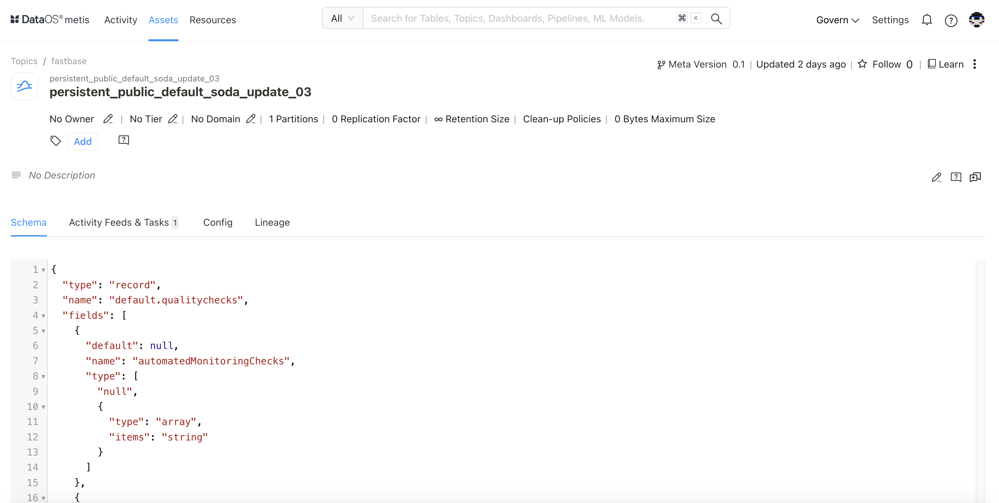

# Metadata of Topics on Metis UI

The Scanner workflow extracts information from streaming data sources about the topic, sender/recipient, and message content elements (message size, message types such as text, audio, or video). The collected metadata is stored in the Metis DB, and the Metis UI presents this wealth of information under the '**Topics**' section. Users can efficiently locate, access, and interpret these assets and their associated data.

On selecting **Topics,** the following information will appear on the screen:

<figcaption align = "center">List of Topics </figcaption>

## Filter pane

The filter pane allows you to filter the topics list on the basis of the following attributes:

| Attribute | Description |
| --- | --- |
| Advance Filter | Filter streaming data topics using the syntax editor, applying various criteria with 'and/or' conditions for a more refined search. |
| Show Deleted | Set the toggle to list deleted topics. |
| Owner | Filter the list on the basis of owners of the data asset |
| Source | Filter the list based on the origin or location from which the streaming data is obtained. |
| Tag | Filter the list for associated tags. |
| Tier | Filter the topic list based on the tier associated with the importance and criticality of the asset, such as Gold, Silver, etc. |
| Type |  |

## Result pane

Here, assets will be listed. Users have the following options to customize how the list is displayed:

| Option | Description |
| --- | --- |
| Sorting | Choose the Sorting order
- Last updated
- Relevance |
|  | Ascending/Descending order |

Each topic in the list will feature a Card view that displays the following information for that particular topic:

| Attribute | Description |
| --- | --- |
| Name | Topic name  |
| Owner | Name of the user who created the topic. |
| Source |  |
| Tags | Associated tags |
| Tier | Tier associated with the importance and criticality of asset, such as Gold, Silver, etc. |
| Domain | Associated domain, such as Finance, Marketing etc. |
| Type |  |
| Description | A description, added to the topic for its purpose. |

## Overview pane

In the card view, click anywhere except the **topic** name to get the overview.

<figcaption align = "center"> Quick information for a topic </figcaption>

This includes the following quick reference information:

| Attribute | Description |
| --- | --- |
| Name | Name of the topic/dataset, clicking on it will open its detail view in the new tab. |
| Partitions | The number of partitions for parallel processing and scalability. |
| Replication Factor | The number of copies of each partition to ensure data redundancy and fault tolerance. |
| Retention Size | The maximum size of data that can be retained within the stream, influencing storage and data management |
| CleanUp Policies | Policy for removing outdated or unnecessary data from the stream, ensuring efficient resource utilization. |
| Max Message Size | The upper limit for the size of individual messages within the stream, affecting data transmission and processing. |
| Schema Type | Specifies the format and structure for the data schema within the stream |

## Details Page

In the Result or Overview pane, click on the name of the topic to open the Asset Details page, which includes:

<figcaption align = "center"> Comprehensive details about a topic  </figcaption>

### **Topic Information**

In addition to basic information on the topic, the following details and options are provided.

| Attribute | Description |
| --- | --- |
| Asset Type | Topic |
| Meta Version | Provides information on the latest Meta version. Click to see the version history and corresponding updates.  |
| Updated | Provides last updated time  |
| Follow | Gives the user an option to follow the topic to receive updates and view its follower count. |
| Learn | Link to documentation |
| Delete | Gives the user the option to delete the topic (click on three dots to access this option). |
| Announcements | Option to create an announcement for quick updates about topic |
| Owner | Allow the user to edit the owner’s name. |
| Tier | Gives the user an option to add/edit the tier information. |
| Domain | Allows the user to add a predefined domain name. |
| Tags | Add/Remove tags/glossary terms/tag groups. |
| Request Tags Update (?) | Request updates in tags and assign users to do it. |
| Description | Allows the user to edit the description |
| Request Description Update (?) | Request updates in the description and assign users to do it. |
| Tasks | Option to view tasks created. In the side pane, the user will get the option to create a new task. |
| Conversations | View conversations in the side pane. The user will get the option to start a new conversation by clicking on the ‘+’ sign. |

The subsequent **tabs** will provide you with more detailed information, as explained in the following sections.

### **Schema**

The schema defines the **structure of message data**. It defines allowed data types, their format, and their relationships. 

### **Activity Feeds & Tasks**

This section compiles all activities, including tasks and conversations about the underlying topic, providing users with a comprehensive overview.

### **Config**

### **Lineage**

Lineage represents the movement of stream data from source to destination and how it is transformed as it moves. It also gives you the option to configure upstream and downstream depth and nodes per layer.