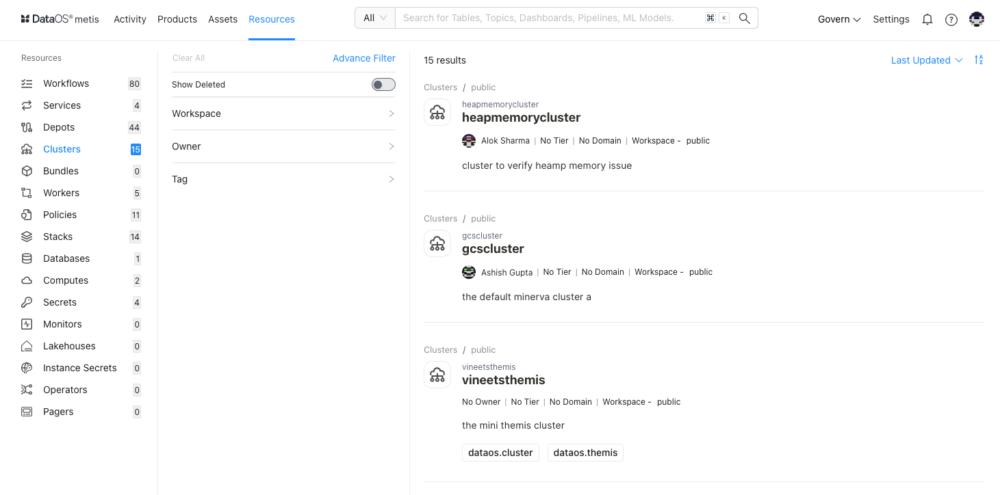
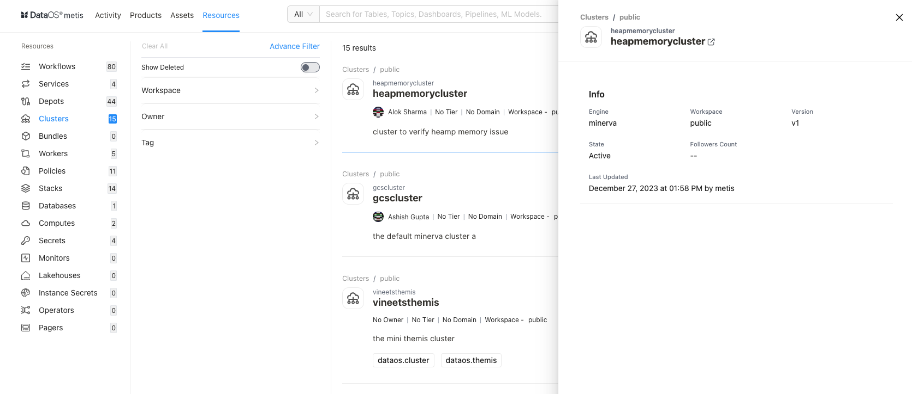
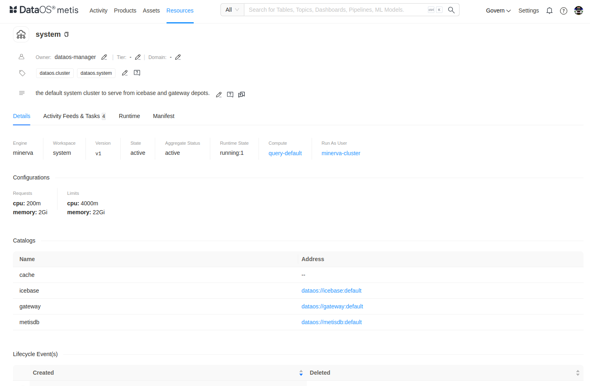
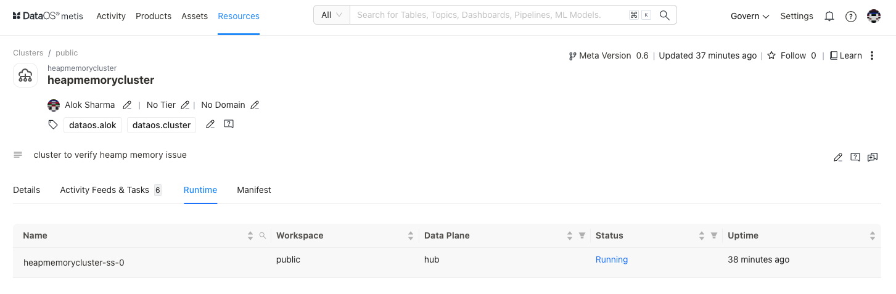
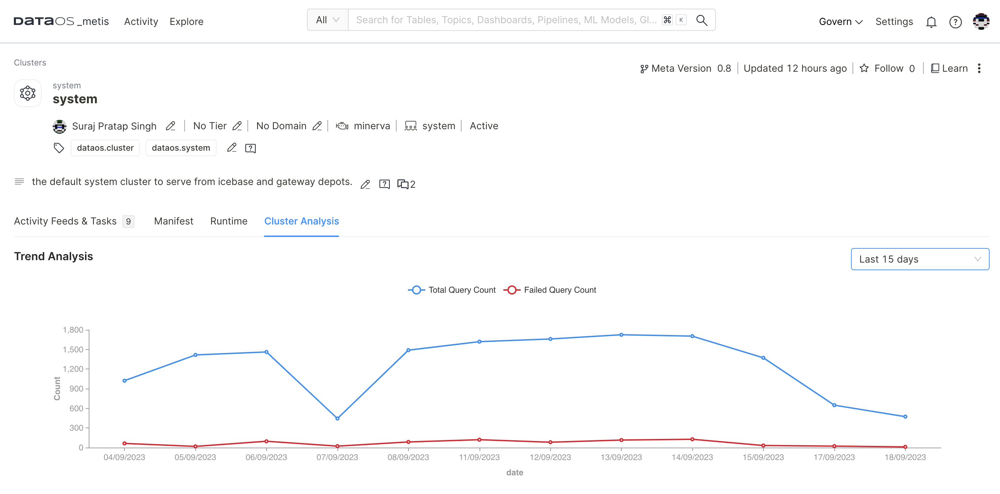

# Metadata of Clusters on Metis UI

<aside class="callout">
⚠️ This page guides you on exploring and managing metadata for Clusters on Metis. To learn in detail about the Cluster as a Resource, refer to this <a href="/resources/cluster/">link</a>.

</aside>

Metis has integrated "**Cluster**" as a "Resource type" entity for storing metadata related to its Compute and configuration settings, Cluster analysis to view the query load distribution along with failed queries for each of the clusters up and running within the DataOS instance. On selecting **Clusters,** the following information will appear on the screen:

<figcaption align = "center"> List of Clusters  </figcaption>

## Filter pane

The filter pane allows you to filter the list of Clusters on the basis of the following attributes:

| Attribute | Description |
| --- | --- |
| Advance Filter | Filter Clusters using the syntax editor, applying various criteria with 'and/or' conditions for a more refined search. |
| Show Deleted | Set the toggle to list deleted Cluster. |
| Workspace | Workspace where the Cluster is created, like public or user-specific. |
| Domain | Select a domain like Marketing, or Finance, etc., to filter the Cluster list for associated domains. |
| Owner | Name of the user who created the Cluster. |
| Tag | Filter the list for tags. |
| Tier | Tier associated with the importance and criticality of Cluster, such as Gold, Silver, etc. |

## Result pane

Here, Clusters will be listed. You can customize how the list is displayed. On top of the page, there are two options:

| Option | Description |
| --- | --- |
| Search Result | Count of Clusters |
| Sorting | Choose the Sorting order
- Last updated
- Relevance
- Ascending/Descending order. |

Each Cluster in the list will display the following information:

| Attribute | Description |
| --- | --- |
| Name | Cluster name defined in the resource YAML. |
| Owner | Name of the user who created the Cluster. |
| Tier | Tier associated with the importance and criticality of Cluster, such as Gold, Silver, etc. |
| Domain | Associated domain, such as Finance, Marketing etc. |
| Workspace | Workspace where the Cluster is created like public or user-specific. |
| Description | A description added to the Cluster for its purpose. |
| Tags | Associated tags |

## Overview pane

Click anywhere except the Cluster name to view the overview. 

<figcaption align = "center"> Quick information  </figcaption>

This includes the following quick reference information:

| Attribute | Description |
| --- | --- |
| Name | Name of Cluster, clicking on it will open its detail view in the new tab. |
| Engine | Name of the query engine, default is DataOS Minerva. |
| Workspace | Workspace where Cluster is created like public or user-specific. |
| Version | Metadata version. |
| State | Cluster state such as Active or Deleted. |
| Followers Count | Count of users who are following this Cluster. |
| Last updated | Date and time information when the Cluster was last updated. |

## Details Page

In the Result or Overview pane, click on the name of the Cluster to open the Resource Details page, which includes:

<figcaption align = "center"> Comprehensive details  </figcaption>

### **Cluster Information**
In addition to basic Cluster information, the following details and options are provided.

| Attribute | Description |
| --- | --- |
| Resource Type | Cluster |
| Meta Version | Provides information on the latest Meta version. Click to see the version history and corresponding updates.  |
| Last updated | Date and time information when the Cluster was last updated  |
| Follow | Gives the user an option to follow the Cluster to receive updates and view its follower count. |
| Learn | Provides an option to learn more about this specific resource type |
| Delete | Gives the user the option to delete the Cluster (click on three dots to access this option). |
| Owner | Allow the user to edit the owner’s name. |
| Tier | Gives the user an option to add/edit the tier information. |
| Domain | Allows the user to add the predefined domain name. |
| State | Cluster state  |
| Tags | Add/Remove tags/glossary terms/tag groups. |
| Request Tags Update (?) | Request updates in tags and assign users to do it. |
| Description | Allows the user to edit the description |
| Request Description Update (?) | Request updates in the description and assign users to do it |
| Tasks | Option to view tasks created. In the side pane, the user will get the option to create a new task |
| Conversations | View conversations in the side pane. The user will get the option to start a new conversation by clicking on the ‘+’ sign |

The subsequent tabs will provide you with more detailed information, as explained in the following sections.

### **Details**

| Attribute | Description |
| --- | --- |
| Engine | Name of query engine, default is DataOS Minerva. |
| Workspace | Workspace where Cluster is created like public or user-specific |
| Version | The specific version or release of the DataOS Depot Resource |
| State | Current state of the Resource such as Active or Deleted. |
| Aggregate Status |  |
| Compute | Compute resources used for allocating processing power; default is query-default |
| Run As User | Authority granted to perform operations on behalf of the assigned user ID |
| Configurations
- Requests
- Limits | CPU and Memory allocation |
| Life Cycle Events | Logs significant occurrences such as creation and deletion |

### **Activity Feeds & Tasks**

This space lists all activities, including tasks and conversations around the specific cluster.

### **Manifest**

This section offers comprehensive information regarding the cluster's manifest. A manifest file, in this context, takes the form of a YAML configuration file. This file serves as the blueprint that defines the configuration settings for various DataOS Resources. 

### **Runtime**

This section provides an overview of the cluster's execution history. It offers a concise summary of past runs, allowing users to quickly access information about the cluster's previous operations and performance.

<figcaption align = "center">Runtime information  </figcaption>

You can access more details by clicking on the link.

**Pod Details** 

This option provides information about the cluster's underlying pods, including their configuration and status.

**Pod Manifest**

View a YAML configuration file defining the pod's settings and attributes, providing a clear view of its setup.

**Pod Logs**

Users can access logs generated by the cluster's pods, helping to troubleshoot issues and monitor activity.

**Pod Usage**

This option will provide insights into how the pods are utilized, including resource consumption and performance metrics.

### **Cluster Analysis**

This option empowers you to gain valuable insights into the performance and efficiency of your Minerva query engine cluster.

**Failed Queries Analysis**

The cluster analysis provides visibility into any failed queries within the cluster running within the DataOS instance. This information is invaluable for troubleshooting issues and ensuring the smooth operation of your data processing infrastructure.

<figcaption align = "center"> Cluster analysis </figcaption>