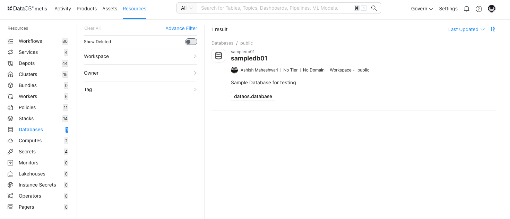
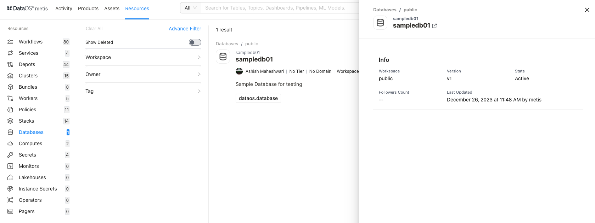
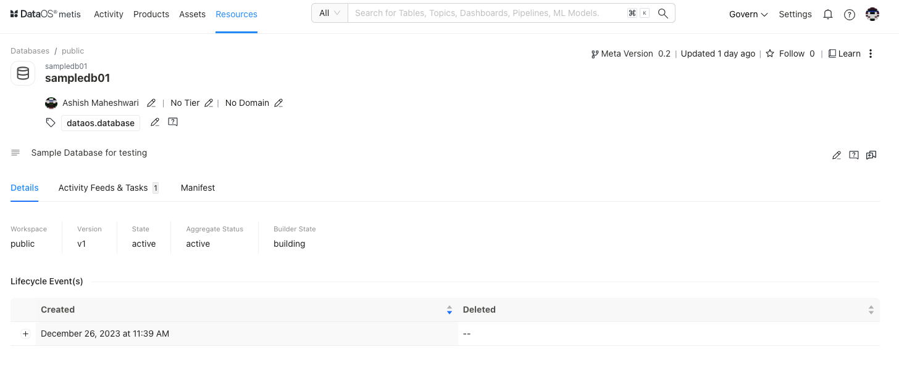

# Databases Metadata On Metis UI

<aside class="callout">
⚠️ This page guides you on exploring and managing metadata for databases on Metis. To learn in detail about the Database as a DataOS Resource, refer to this <a href="/resources/database/">link</a>.

</aside>

Metis has integrated "Database" as a "Resource” type entity for storing metadata related to its configurations such as migration SQL etc. On selecting **Databases,** the following information will appear on the screen:

## Filter pane

The filter pane allows you to filter the list of Databases on the basis of the following attributes:

| Attribute | Description |
| --- | --- |
| Advance Filter | Filter databases using the syntax editor, applying various criteria with 'and/or' conditions for a more refined search. |
| Show Deleted | Set the toggle to list deleted Databases. |
| Workspace | Workspace where the Database is created, like public or user-specific. |
| Owner | Filter the list based on the user who created the Database Resource. |
| Tag | Filter the list for tags. |
| Tier | Filter the list based on the importance defined as Tiers |

## Result pane

Here, database resources will be listed. Users have the following options to customize how the list is displayed:

| Option | Description |
| --- | --- |
| Sorting | Choose the Sorting order
- Last updated
- Relevance |
| Sorting order | Ascending/Descending order. |

Each database resource in the list will have a Card view that displays the following information for that specific database:

| Attribute | Description |
| --- | --- |
| Name | Database name defined in the resource YAML. |
| Owner | Name of the user who created the Database. |
| Tier | Tier associated with the importance and criticality of Databases, such as Gold, Silver, etc. |
| Domain | Associated domain, such as Finance or Marketing etc. |
| Workspace | Workspace where the Database is created like public or user-specific. |
| Description | A description added to the Database for its purpose. |
| Tags | Associated tags |

## Overview pane

In the card view, click anywhere except the resource name to get the overview.

<figcaption align = "center"> Quick information  </figcaption>

This includes the following information for quick reference:

| Attribute | Description |
| --- | --- |
| Name | Name of Database, clicking on it will open its detail view in the new tab. |
| Workspace | Workspace where Database is created like public or user-specific. |
| Version | Metadata version. |
| State | Database state such as Active or Deleted. |
| Followers Count | Count of users who are following this Database. |
| Last updated | Date and time information when the Database was last updated. |

## Details Page

In the Result or Overview pane, click on the name of the Database to open the Resource Details page, which includes:

<figcaption align = "center"> Comprehensive details  </figcaption>

### **Databases Information**

In addition to basic Database information, the following details and options are provided.

| Attribute | Description |
| --- | --- |
| Resource Type | Database |
| Meta Version | Provides information on the latest Meta version. Click to see the version history and corresponding updates.  |
| Last updated | Date and time information when the Database was last updated. |
| Follow | Gives the user an option to follow the Database to receive updates and view its follower count. |
| Learn | Provides an option to learn more about this specific resource type. |
| Delete | Gives the user the option to delete the Database (click on three dots to access this option). |
| Owner | Allow the user to edit the owner’s name. |
| Tier | Gives the user an option to add/edit the tier information. |
| Domain | Allows the user to add the predefined domain name. |
| Tags | Add/Remove tags/glossary terms/tag groups. |
| Request Tags Update (?) | Request updates in tags and assign users to do it. |
| Description | Allows the user to edit the description. |
| Request Description Update (?) | Request updates in the description and assign users to do it. |
| Tasks | Option to view tasks created. In the side pane, the user will get the option to create a new task. |
| Conversations | View conversations in the side pane. The user will get the option to start a new conversation by clicking on the ‘+’ sign. |

The subsequent tabs will provide you with more detailed information, as explained in the following sections.

### **Details**

| Attribute | Description |
| --- | --- |
| Workspace | Workspace where Database is created like public or user-specific. |
| Version | The specific version or release of the Resource |
| State | The current state of the Resource such as Active or Deleted. |
| Aggregate Status
 |  |
| Builder State |  |
| Bundles | List of Bundle Resources containing the Database |
| Lifecycle Events | Records the creation and deletion events related to the DataOS Database Resource. |

### **Activity Feeds & Tasks**

This space lists all activities, including tasks and conversations around the specific database resource.

### **Manifest**

This section offers comprehensive information regarding the database's manifest. A manifest file, in this context, takes the form of a YAML configuration file. This file serves as the blueprint that defines the configuration settings for various DataOS Resources.