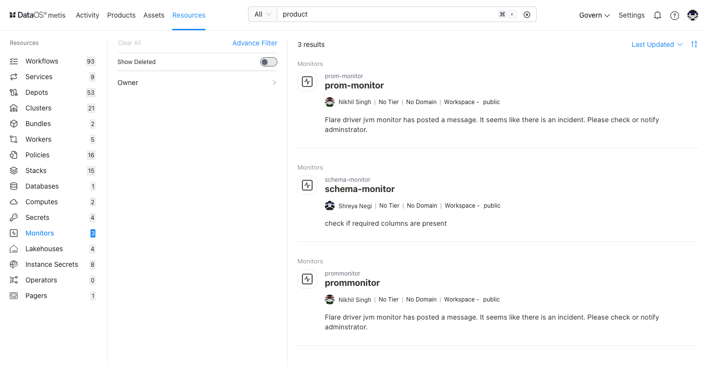
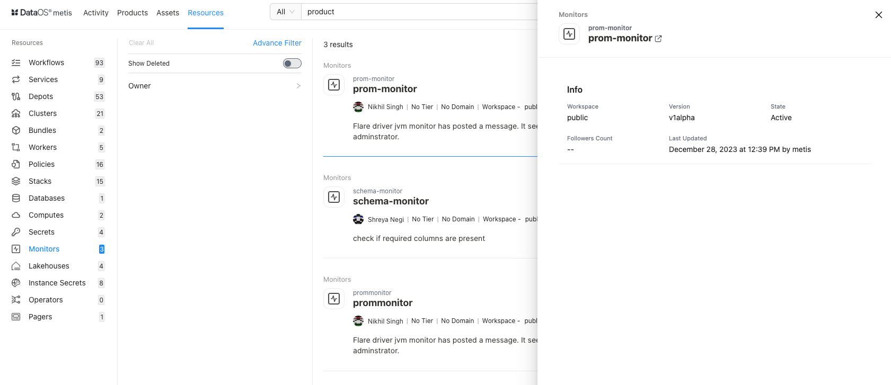
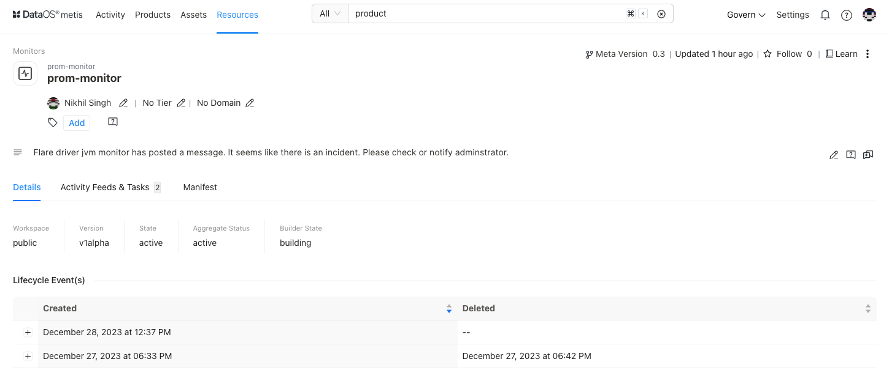

# Metis Resources- Monitors

<aside class="callout">
⚠️ This page guides you on exploring and managing metadata for Monitors on Metis. To learn in detail about the Monitor as a DataOS Resource, refer to this link.

</aside>

Metis has integrated "Monitor" as a "Resource" type entity for storing metadata related to events, metrics, and incidents that are raised when the defined condition does not meet the specified criterion for an asset within DataOS. On selecting **Monitors,** the following information will appear on the screen:

## Filter pane

The filter pane allows you to filter the list of Monitors on the basis of the following attributes:

| Attribute | Description |
| --- | --- |
| Advance Filter | Discover specific Monitors using the syntax editor with and/or conditions. |
| Show Deleted | Set the toggle to list deleted Monitors. |
| Owner | Filter the list for the owner. |
| Tag | Filter the list for associated tags. |

## Result pane

Here, Monitors will be listed. Users have the following options to customize how the list is displayed:

| Option | Description |
| --- | --- |
| Sorting | Choose the Sorting order
- Last updated
- Relevance |
| Sorting order | Ascending/Descending order. |

Each Monitor resource in the list will have a Card view that displays the following information for that specific Monitor:

| Attribute | Description |
| --- | --- |
| Name | Monitor name defined in the resource YAML. |
| Owner | Name of the user who created the Monitor. |
| Tier | Tier associated with the importance and criticality of Monitors, such as Gold, Silver, etc. |
| Domain | Associated domain, such as Finance, Marketing etc. |
| Workspace | Workspace where the Monitor is created, like public or user-specific. |
| State | State of the Monitor resource, such as Active or Deleted. |
| Description | A description, added to the Monitor for its purpose. |

## Overview pane

In the Card view, click anywhere except the resource name to get the overview.

This includes the following information for quick reference:

| Attribute | Description |
| --- | --- |
| Name | Name of Monitor created; clicking on it will open its detail view in the new tab. |
| Workspace | Workspace where Monitor is created like public or user-specific. |
| Version | Resource version. |
| State | Resource state such as Active or Deleted. |
| Followers Count | Count of users who are following this Resource. |
| Last updated | Date and time information when the Monitor was last updated. |

## Details Page

In the Result or Overview pane, click on the name of the Monitor to open the Resource Details page, which includes:

### **Monitors Information**

In addition to basic Monitor information, the following details and options are provided.

| Attribute | Description |
| --- | --- |
| Resource Type | Monitor. |
| Meta Version | Provides information on the latest Meta version. Click to see the version history and corresponding updates.  |
| Last updated | Date and time information when the Monitor resource was last updated. |
| Follow | Gives the user an option to follow the specific resource type to receive updates and view its follower count. |
| Learn | Provides an option to learn more about this specific resource type. |
| Delete | Gives the user the option to delete the Metadata of Resource (click on three dots to access this option). |
| Owner | Allow the user to edit the owner’s name. |
| Tier | Gives the user an option to add/edit the tier information. |
| Domain | Allows the user to add the predefined domain name. |
| Tags | Add/Remove tags/glossary terms/tag groups. |
| Request Tags Update (?) | Request updates in tags for the resource and assign users to do it. |
| Description | Allows the user to edit the description. |
| Request Description Update (?) | Request updates in the description and assign users to do it. |
| Tasks | Option to view tasks created. In the side pane, the user will get the option to create a new task. |
| Conversations | View conversations in the side pane. The user will get the option to start a new conversation by clicking on the ‘+’ sign. |

The subsequent **tabs** will provide you with more detailed information, as explained in the following sections.

### **Details**

| Attribute | Description |
| --- | --- |
| Workspace | Workspace where Monitor is created like public or user-specific. |
| Version | The specific version or release of the Resource |
| State | The current state of the Resource such as Active or Deleted. |
| Aggregate Status
 |  |
| Builder State |  |
| Lifecycle Events | Records the creation and deletion events related to the DataOS Monitor Resource. |

### **Activity Feeds & Tasks**

This space lists all activities, including tasks and conversations around the specific Monitor.

### **Manifest**

This section offers comprehensive information regarding the Monitor's manifest. A manifest file, in this context, takes the form of a YAML configuration file. This file serves as the blueprint that defines the configuration settings for various DataOS Resources.