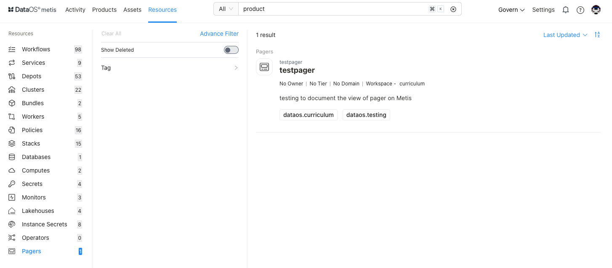
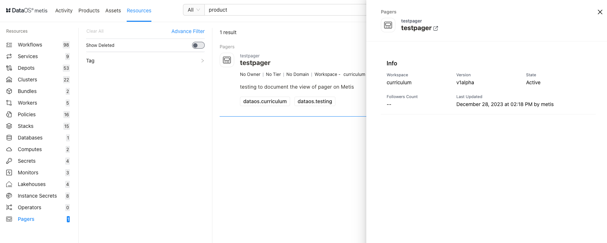
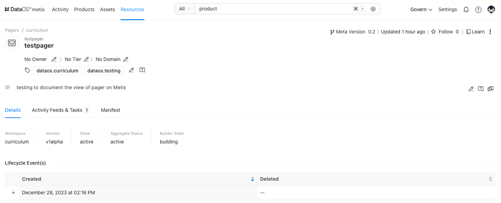

# Metadata of Pagers on Metis UI

<aside class="callout">
🗣 This page guides you on exploring and managing metadata for Pagers on Metis. To learn in detail about the Pager as a  DataOS Resource, refer to this <a href="/resources/pager/">link</a>.

</aside>

Metis has integrated "Pager" as a "Resource" type entity for storing metadata related to its configuration and state, such as conditions that the incident must meet to raise a notification. ,  destinations, etc. On selecting **Pagers,** the following information will appear on the screen:

<figcaption align = "center"> List of Pagers  </figcaption>

## Filter pane

The filter pane allows you to filter the list of Pagers on the basis of the following attributes:

| Attribute | Description |
| --- | --- |
| Advance Filter | Filter Pagers using the syntax editor, applying various criteria with 'and/or' conditions for a more refined search. |
| Show Deleted | Set the toggle to list deleted Pagers. |
| Domain | Select the domain(s) like Marketing, Finance, etc., to filter the Pagers list for associated domains. |
| Owner | Filter the Pagers list by Owner |
| Tag | Filter the list for associated tags. |

## Result pane

Here, Pagers will be listed. Users have the following options to customize how the list is displayed:

| Option | Description |
| --- | --- |
| Sorting | Choose the Sorting order
- Last updated
- Relevance |
| Sorting order | Ascending/Descending order. |

Each Pager resource in the list will have a Card view that displays the following information for that specific Pager:

| Attribute | Description |
| --- | --- |
| Name | Pager name, defined in the resource YAML. |
| Owner | Name of the user who created the Pager. |
| Tier | Tier associated with the importance and criticality of Pager, such as Gold, Silver, etc. |
| Domain | Associated domain, such as Finance, Marketing etc. |
| State | State of the Pager resource, such as Active or Deleted. |
| Description | A description added to the Pager for its purpose. |

## Overview pane

In the card view, click anywhere except the resource name to get the overview.

<figcaption align = "center"> Quick information  </figcaption>

This includes the following information for quick reference:

| Attribute | Description |
| --- | --- |
| Name | Name of Pager created, clicking on it will open its detail view in the new tab. |
| Version | Metadata version. |
| State | Pager state such as Active or Deleted. |
| Followers Count | Count of users who are following this Pager. |
| Last updated | Date and time information when the Pager was last updated. |

## Details Page

In the Result or Overview pane, click on the name of the Pager to open the Resource Details page, which includes:

<figcaption align = "center"> Comprehensive details  </figcaption>

### **Pager Information**

In addition to basic information, the following details and options are provided.

| Attribute | Description |
| --- | --- |
| Resource Type | Pager. |
| Meta Version | Provides information on the latest Meta version. Click to see the version history and corresponding updates.  |
| Last updated | Date and time information when the Pager resource was last updated. |
| Follow | Gives the user an option to follow the specific resource type to receive updates and view its follower count. |
| Learn | Provides an option to learn more about this specific resource type. |
| Delete | Gives the user the option to delete the Pager(click on three dots to access this option). |
| Owner | Allow the user to edit the owner’s name. |
| Tier | Gives the user an option to add/edit the tier information. |
| Domain | Allows the user to add the predefined domain name. |
| Tags | Add/Remove tags/glossary terms/tag groups. |
| Request Tags Update (?) | Request updates in tags for the resource and assign users to do it. |
| Description | Allows the user to edit the description. |
| Request Description Update (?) | Request updates in the description and assign users to do it. |
| Tasks | Option to view tasks created. In the side pane, the user will get the option to create a new task. |
| Conversations | View conversations in the side pane. The user will get the option to start a new conversation by clicking on the ‘+’ sign. |

The subsequent tabs will provide you with more detailed information, as explained in the following sections.

### **Details**

| Attribute | Description |
| --- | --- |
| Version | Indicates the specific version or release of the DataOS Workflow Resource |
| State | Represents the current state of the DataOS Workflow Resource |
| Aggregate Status | Consolidated status of Workflow Resource |
| Builder State |  |
| Configuration |  |
| Lifecycle Event(s) | Logs significant occurrences such as creation and deletion |

### **Activity Feeds & Tasks**

This space lists all activities, including tasks and conversations around the specific Pager.

### **Manifest**

This section offers comprehensive information regarding the Pager's manifest. A manifest file, in this context, takes the form of a YAML configuration file. This file serves as the blueprint that defines the configuration settings for various DataOS Resources.