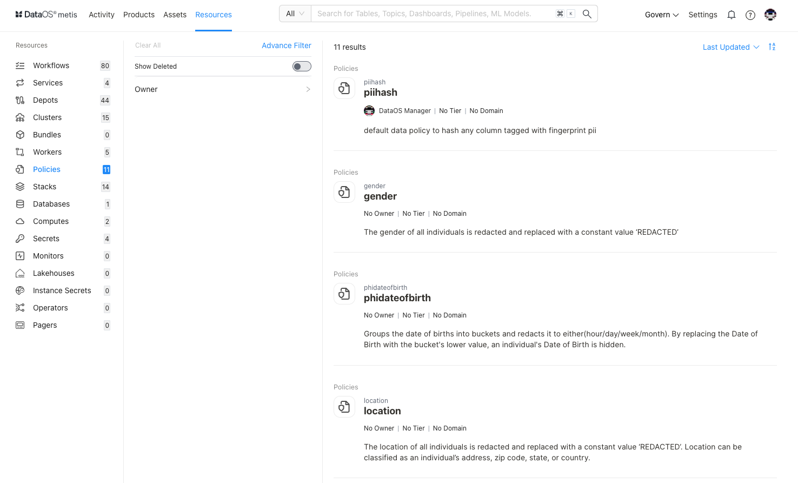
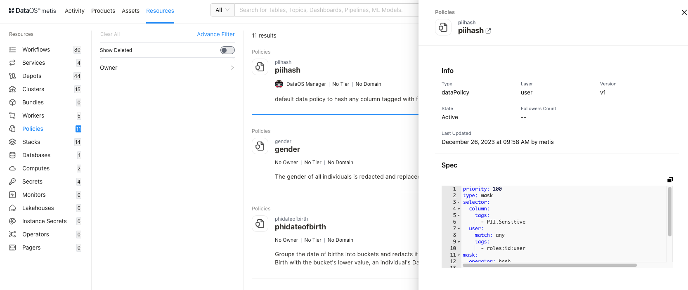
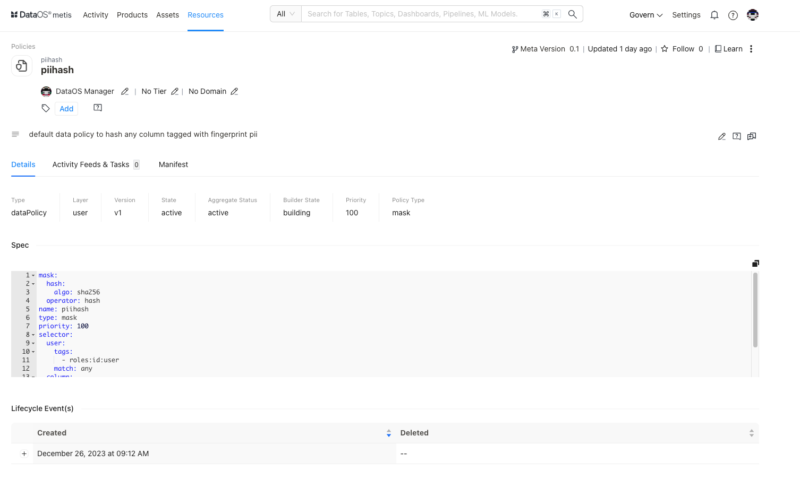

# Metadata of Policies on Metis UI

<aside class="callout">
⚠️ This page guides you on exploring and managing metadata for Policies on Metis. To learn in detail about the Policy as a  DataOS Resource, refer to this <a href="/resources/policy/">link</a>.

</aside>

Metis has integrated "Policy" as a "Resource” type entity for storing metadata related to Access and data Policies. On selecting **Policies,** the following information will appear on the screen:

<figcaption align = "center"> List of Policies  </figcaption>

## Filter pane

The filter pane allows you to filter the list of Policies on the basis of the following attributes:

| Attribute | Description |
| --- | --- |
| Advance Filter | Filter the Policies using the syntax editor, applying various criteria with 'and/or' conditions for a more refined search. |
| Show Deleted | Set the toggle to list deleted Policies. |
| Owner | Filter Policies based on the users who created the Resource. |
| Tag | Filter Policies for tags. |

## Result pane

Here, Policy resources will be listed. Users have the following options to customize how the list is displayed:

| Option | Description |
| --- | --- |
| Sorting order | Choose the Sorting order
- Last updated
- Relevance |
| Sorting order | Ascending/Descending order. |

Each policy resource in the list will have a Card view that displays the following information for that specific policy:

| Attribute | Description |
| --- | --- |
| Name | Policy name defined in the resource YAML. |
| Owner | Name of the user who created the Policy. |
| Tier | Tier associated with the importance and criticality of Policies, such as Gold, Silver, etc. |
| Domain | Associated domain, such as Finance, Marketing etc. |
| Description | Description added to the Policy for its purpose. |

## Overview pane

In the card view, click anywhere except the resource name to get the overview.

<figcaption align = "center"> Quick information  </figcaption>

This includes the following information for quick reference:

| Attribute | Description |
| --- | --- |
| Name | Name of Policy, clicking on it will open its detail view in the new tab. |
| Type | Type of Policy. |
| Layer | Name of the layer in which the Resource is deployed. |
| Version | Resource version. |
| State | Policy state such as Active or Deleted. |
| Followers Count | Count of users who are following this Policy. |
| Last updated | Date and time information when the Policy was last updated and the username who updated the Resource. |
| Specs | Details about the configuration fields in Policy YAML. |

## Details Page

In the Result or Overview pane, click on the name of the Policies to open the Resource Details page, which includes:

<figcaption align = "center"> Comprehensive details  </figcaption>

### **Policy Information**

In addition to basic Policy information, the following details and options are provided.

| Attribute | Description |
| --- | --- |
| Resource Type | Policy |
| Meta Version | Provides information on the latest Meta version. Click to see the version history and corresponding updates.  |
| Last updated | Date and time information when the Policy was last updated. |
| Follow | Gives the user an option to follow the Policy to receive updates and view its follower count. |
| Learn | Provides an option to learn more about this specific resource type. |
| Delete | Gives the user the option to delete the Policy (click on three dots to access this option). |
| Owner | Allow the user to edit the owner’s name. |
| Tier | Gives the user an option to add/edit the tier information. |
| Domain | Allows the user to add the predefined domain name. |
| Tags | Add/Remove tags/glossary terms/tag groups. |
| Request Tags Update (?) | Request updates in tags and assign users to do it. |
| Description | Allows the user to edit the description |
| Request Description Update (?) | Request updates in the description and assign users to do it |
| Tasks | Option to view tasks created. In the side pane, the user will get the option to create a new task |
| Conversations | View conversations in the side pane. The user will get the option to start a new conversation by clicking on the ‘+’ sign |

The subsequent **tabs** will provide you with more detailed information, as explained in the following sections.

### **Details**

| Attribute | Description |
| --- | --- |
| Type | Policy type, Access /Data Policy |
| Layer | Name of the layer in which the Resource is deployed |
| Version | The specific version or release of the DataOS Worker Resource |
| State | Current state of the Resource such as Active or Deleted. |
| Aggregate Status | In the case of the Access policy, |
| Builder State | In the case of Access policy, |
| Priority | Priority defined for the Policy: The policy with the lower value of priority attribute will take precedence over all other policies associated with the same resources. |
| Policy Type | In the case of Data Policy, Masking or Filtering type |
| Spec | Details about the configuration fields in Policy YAML. |
| Life Cycle Events | Logs significant occurrences such as creation and deletion |

### **Activity Feeds & Tasks**

This space lists all activities, including tasks and conversations around the specific policy.

### **Manifest**

This section offers comprehensive information regarding the policy’s manifest. A manifest file, in this context, takes the form of a YAML configuration file. This file serves as the blueprint that defines the configuration settings for various DataOS Resources.