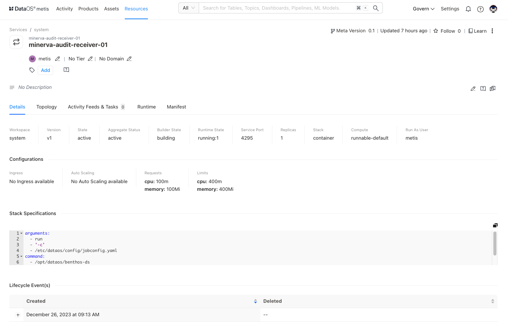

# Metadata of Services on Metis UI

<aside class="callout">
🗣 This page guides you on exploring and managing metadata for Services on Metis. To learn in detail about the Service as a Resource, refer to this <a href="/resources/service/">link</a>.

</aside>

Metis has integrated "Service" as a "Resource type" for storing metadata related to its port, socket, replicas, stack, etc., within DataOS. On selecting **Services,** the following information will appear on the screen:

  

    
    <figcaption>List of Services</figcaption>
  

## Filter pane

The filter pane allows you to filter the list of Services based on the following attributes:

| Attribute | Description |
| --- | --- |
| Show Deleted | Set the toggle to list deleted Services. |
| Workspace | Workspace where the Service is created, like public or user-specific. |
| Owner | Name of the user who created the Workflow. |
| Tag | Filter the list for tags. |

## Result pane

Here, Services will be listed. Users have the following options to customize how the list is displayed:

| Option | Description |
| --- | --- |
| Sorting | Choose the sorting:
- Last updated
- Relevance |
| Sorting order | Ascending/Descending order. |
| Advance Search | Discover specific Services using the syntax editor with and/or conditions. |

Each service in the list will feature a **Card view** that displays the following information for that particular service:

| Attribute | Description |
| --- | --- |
| Name | Service name defined in the resource YAML. |
| Owner | Name of the user who created the service. |
| Tier | Tier associated with the importance and criticality of service, such as Gold, Silver, etc. |
| Domain | Associated domain, such as Finance or Marketing, etc. |
| Workspace | Workspace where the service is created like public or user-specific. |
| Description | A description is added to the Service for its purpose. |

## Overview pane

In the card view, click anywhere except the resource name to get the overview.

  

    
    <figcaption>Quick information</figcaption>
  

This includes the following quick reference information:

| Attribute | Description |
| --- | --- |
| Name | Name of service, clicking on it will open its detail view in the new tab. |
| Workspace | Workspace where service is created like public or user-specific. |
| Version | Metadata version. |
| State | Service state such as Active or Deleted. |
| Followers Count | Count of users who are following this Service. |
| Last updated | Date and time information when the Service was last updated. |

## Details Page

In the Result or Overview pane, click on the name of the Service to open the Resource Details page, which includes:

<figcaption align = "center"> Comprehensive details  </figcaption>

### **Service Information**

In addition to basic service information, the following details and options are provided.

| Attribute | Description |
| --- | --- |
| Resource Type | Service |
| Meta Version | Provides information on the latest Meta version. Click to see the version history and corresponding updates.  |
| Last Updated | Information about the last update. |
| Follow | Gives the user an option to follow the service to receive updates and view its follower count. |
| Learn | Provides an option to learn more about this specific resource type. |
| Delete | Gives the user the option to delete the service (click on three dots to access this option). |
| Owner | Allow the user to edit the owner’s name. |
| Tier | Gives the user an option to add/edit the tier information. |
| Domain | Allows the user to add the predefined domain name. |
| Tags | Add/Remove tags/glossary terms/tag groups. |
| Request Tags Update (?) | Request updates in tags and assign users to do it. |
| Description | Allows the user to edit the description. |
| Request Description Update (?) | Request updates in the description and assign users to do it. |
| Tasks | Option to view tasks created. In the side pane, the user will get the option to create a new task. |
| Conversations | View conversations in the side pane. The user will get the option to start a new conversation by clicking on the ‘+’ sign. |

The subsequent tabs will provide you with more detailed information, as explained in the following sections.

### **Details**

| Attribute | Description |
| --- | --- |
| Workspace | Indicates workspace within DataOS instance where Service is created |
| Version | Indicates the specific version or release of the DataOS Service Resource |
| State | Represents the current state of the DataOS Workflow Resource |
| Aggregate Status | Consolidated status of Workflow Resource |
| Builder State |  |
| Service Port |  |
| Replicas |  |
| Stack | Data processing stack used for creating Service |
| Compute | Compute resource for allocating processing power for data processing |
| Run As User | Authority granted to perform operations on behalf of the assigned user ID |
| Stack Specification |  |
| Lifecycle Event(s) | Logs significant occurrences such as creation and deletion |

### **Topology**

A Directed Acyclic Graph (DAG) is a conceptual representation of a sequence of activities. For the Service, this shows the input and processing steps and output.

  

    
    <figcaption>Dag of activities</figcaption>
  

  

    
    <figcaption>Input details</figcaption>
  

| Attribute | Description |
| --- | --- |
| Name | Name of the underlying selected entity |
| Type | Type of selected entity such as input, processor, etc. |
| Doc | Details provided in the configuration  |
| SQL | SQL statement to transform data |
| Properties |  |
| Content-Type | Specifies that the input expects data in the "application/octet-stream" format. |
| DropEmptyBodies | If set to "false," meaning it won't discard responses with empty bodies. |
| EnableRenegotiation | If set to "false," it indicates that renegotiation is disabled for TLS connections. |
| Enabled | If set to "false," it indicates that this input is currently disabled. |
| InsecureSkipVerify | If set to "false," ensures that SSL certificate verification is enabled for secure connections. |
| MaxBuffer | If set to "0," indicating no maximum buffer size for responses. |
| NumRetries | if set to "0," meaning no retries will be attempted for failed requests. |
| Reconnect | If set to "false," it indicates that the input will not automatically reconnect in case of a connection failure. |
| URL | Specifies the URL (https://randomuser.me/api/) to which the GET request is sent. |
| Verb | Specifies the HTTP method used for the request, in this case, "GET." |

Clicking on the processor will display the following details in the side pane:

  
  <figcaption>Processor details</figcaption>

| Attribute | Description |
| --- | --- |
| Name | Name of the underlying selected entity |
| Type | Type of selected entity such as input, processor, output etc. |
| Doc | Details provided in the configuration  |
| bloblang | Refer to the Bento processors, functions that will be applied to each message passing through a pipeline. |
| Depends | States dependency if any. In this case, log |

Clicking on the output will display the following details in the side pane:

  
  <figcaption>Output details</figcaption>

| Attribute | Description |
| --- | --- |
| Name | Name of the underlying selected entity |
| Type | Type of selected entity such as input, processor, output etc. |
| Doc | Details provided in the configuration  |
| Properties | Properties such as cases, retry_until_success, strict_mode |
| Depends | States dependency if any. In this case, log |

### **Activity Feeds & Tasks**

This space lists all activities, including tasks and conversations around the specific service.

### **Runtime**

This section provides an overview of the service's execution history. It offers a concise summary of past service runs, allowing users to quickly access information about the service's previous operations and performance.

  
  <figcaption>Run history</figcaption>

| Attribute | Description |
| --- | --- |
| Run ID | The unique identifier for the service run |
| Workspace | Workspace in which service is deployed, such as public or user-defined |
| Data Plane | DataOS’s data plane- hub  |
| Status | Runtime status of the service, such as Running, Aborted, Failed, Deleted, or Pending |
| Uptime | Duration since service running |

Clicking on a service run will display the following options:

**Pod Details** 

This option provides information about the service's underlying pods, including their configuration and status.

**Pod Manifest**

View a YAML configuration file defining the pod's settings and attributes, providing a clear view of its setup.

**Pod Logs**

Users can access logs generated by the service's pods, helping to troubleshoot issues and monitor activity.

**Pod Usage**

This option will provide insights into how the pods are utilized, including resource consumption and performance metrics.

### **Manifest**

This section offers comprehensive information regarding the service's manifest. A manifest file, in this context, takes the form of a YAML configuration file. This file serves as the blueprint that defines the configuration settings for various DataOS Resources. Users will get details about ports and sockets, ingress, replicas, output schema, and how the service operates within the DataOS ecosystem.