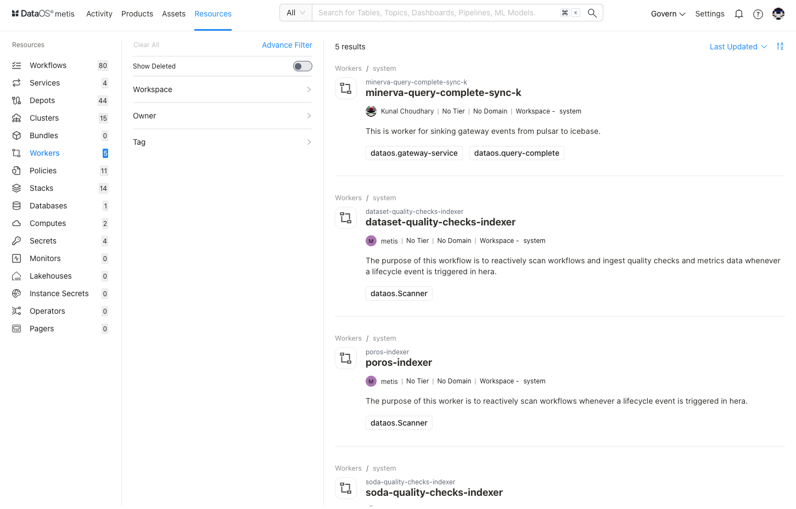
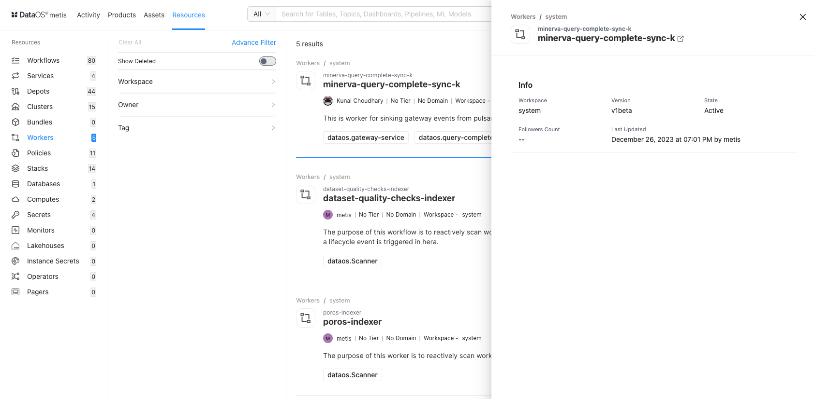
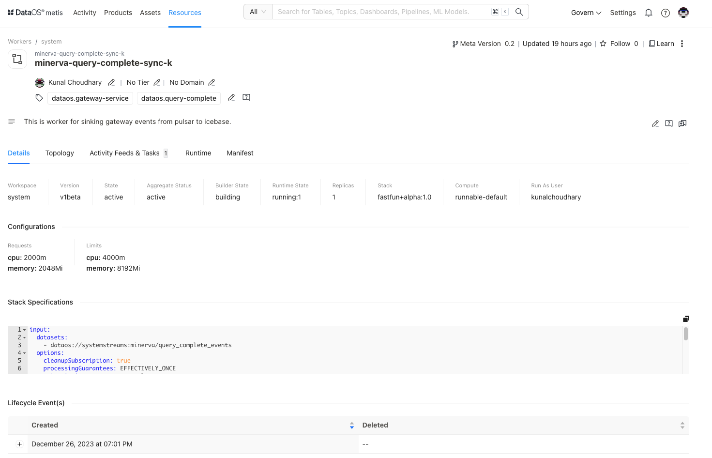
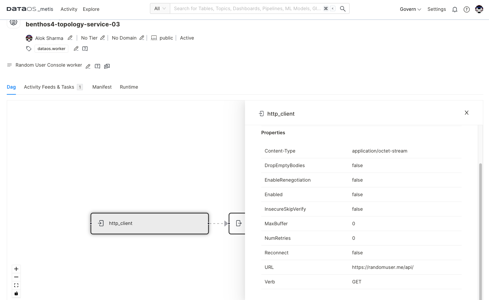
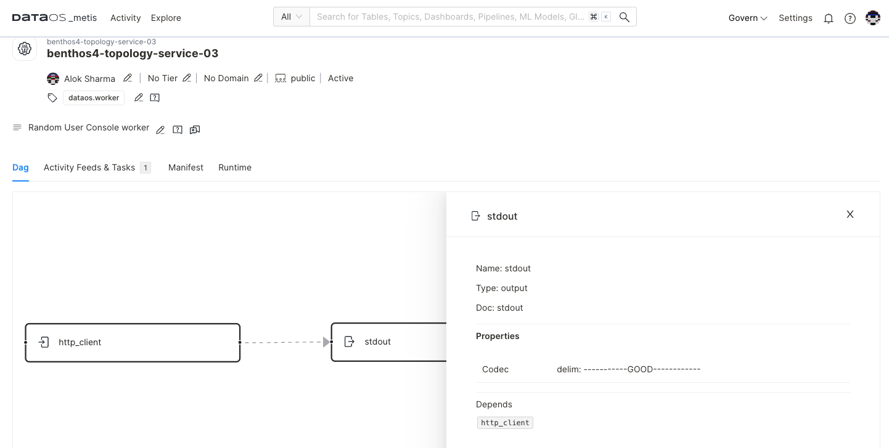
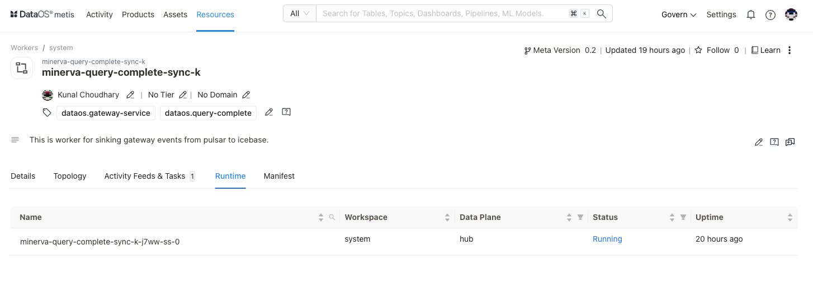

# Metadata of Workers on Metis UI

<aside class="callout">
⚠️ This page guides you on exploring and managing metadata for Workers on Metis. To learn in detail about the Worker as a  DataOS Resource, refer to this <a href="/resources/">link</a>.

</aside>

Metis has integrated "Worker" as a "Resource” type entity for storing metadata related to the long-running process within DataOS to perform specific tasks or computations. On selecting **Workers,** the following information will appear on the screen:

<figcaption align = "center"> List of Workers </figcaption>

## Filter pane

The filter pane allows you to filter the list of Workers on the basis of the following attributes:

| Attribute | Description |
| --- | --- |
| Advance Filter | Filter Workers using the syntax editor, applying various criteria with 'and/or' conditions for a more refined search. |
| Show Deleted | Set the toggle to list deleted Workers. |
| Workspace | Workspace where the Worker is created, like public or user-specific. |
| Owner | Filter the list based on the user who created the Worker Resource. |
| Tag | Filter the list for tags. |

## Result pane

Here, Worker resources will be listed. Users have the following options to customize how the list is displayed:

| Option | Description |
| --- | --- |
| Sorting Order | Choose the Sorting order
- Last updated
- Relevance |
| Sorting Order | Ascending/Descending order. |

Each worker resource in the list will have a Card view that displays the following information for that specific worker:

| Attribute | Description |
| --- | --- |
| Name | Worker name defined in the resource YAML. |
| Owner | Name of the user who created the Worker. |
| Tier | Tier associated with the importance and criticality of Workers, such as Gold, Silver, etc. |
| Domain | Associated domain, such as Finance, Marketing etc. |
| Workspace | Workspace where the Worker is created like public or user-specific. |
| Description | A description added to the Worker for its purpose. |

## Overview pane

In the card view, click anywhere except the resource name to get the overview.

<figcaption align = "center"> Quick information  </figcaption>

This includes the following quick reference information:

| Attribute | Description |
| --- | --- |
| Name | Name of Workers, clicking on it will open its detail view in the new tab. |
| Workspace | Workspace where Worker is created like public or user-specific. |
| Version | Metadata version. |
| State | Worker state such as Active or Deleted. |
| Followers Count | Count of users who are following this Worker. |
| Last updated | Date and time information when the Worker was last updated. |

## Details Page

In the Result or Overview pane, click on the name of the Worker to open the Resource Details page, which includes:

<figcaption align = "center"> Comprehensive details  </figcaption>

### Workers Information

In addition to the basic Worker's information, the following details and options are provided:

| Attribute | Description |
| --- | --- |
| Resource Type | Workers |
| Meta Version | Provides information on the latest Meta version. Click to see the version history and corresponding updates.  |
| Last updated | Date and time information when the Worker was last updated. |
| Follow | Gives the user an option to follow the Worker to receive updates and view its follower count. |
| Learn | Provides an option to learn more about this specific resource type |
| Delete | Gives the user the option to delete the Worker (click on three dots to access this option). |
| Owner | Allow the user to edit the owner’s name. |
| Tier | Gives the user an option to add/edit the tier information. |
| Domain | Allows the user to add the predefined domain name. |
| Tags | Add/Remove tags/glossary terms/tag groups. |
| Request Tags Update (?) | Request updates in tags and assign users to do it. |
| Description | Allows the user to edit the description. |
| Request Description Update (?) | Request updates in the description and assign users to do it. |
| Tasks | Option to view tasks created. In the side pane, the user will get the option to create a new task. |
| Conversations | View conversations in the side pane. The user will get the option to start a new conversation by clicking on the ‘+’ sign. |

The subsequent tabs will provide you with more detailed information, as explained in the following sections.

### Details

| Attribute | Description |
| --- | --- |
| Workspace | Workspace where Worker is created like public or user-specific |
| Version | The specific version or release of the DataOS Worker Resource |
| State | Current state of the Resource such as Active or Deleted. |
| Bundles | List of Bundle Resources containing the Worker |

### Topology

A Directed Acyclic Graph (DAG) is a conceptual representation of a sequence of activities. For the Worker, this shows the input and processing steps and output.

Clicking on the **Input** will display the following details in the side pane:

<figcaption align = "center"> dag of activities </figcaption>

| Attribute | Description |
| --- | --- |
| Name | Name of the underlying selected entity |
| Type | Type of selected entity such as input, processor, etc. |
| Doc | Details provided in the configuration  |
| SQL | SQL statement to transform data |
| Properties |  |
| Content-Type | Specifies that the input expects data in the "application/octet-stream" format. |
| DropEmptyBodies | If set to "false," meaning it won't discard responses with empty bodies. |
| EnableRenegotiation | If set to "false," it indicates that renegotiation is disabled for TLS connections. |
| Enabled | If set to "false," it indicates that this input is currently disabled. |
| InsecureSkipVerify | If set to "false," ensures that SSL certificate verification is enabled for secure connections. |
| MaxBuffer | If set to "0," indicating no maximum buffer size for responses. |
| NumRetries | if set to "0," meaning no retries will be attempted for failed requests. |
| Reconnect | If set to "false," it indicates that the input will not automatically reconnect in case of a connection failure. |
| URL | Specifies the URL (https://randomuser.me/api/) to which the GET request is sent. |
| Verb | Specifies the HTTP method used for the request, in this case, "GET." |

Clicking on the **Output** will display the following details in the side pane:

<figcaption align = "center"> Output details </figcaption>

| Attribute | Description |
| --- | --- |
| Name | Name of the underlying selected entity |
| Type | Type of selected entity such as input, processor, output etc. |
| Doc | Details provided in the configuration  |
| Codec | Refers to a configuration or setting within the stdout output resource, which helps interpret or format the data that is sent to the standard output stream |
| Depends | States dependency if any. In this case, http_client |

### Activity Feeds & Tasks

This space lists all activities, including tasks and conversations around the specific Worker resource.

### Runtime

This section provides an overview of the Worker's execution history. It offers a concise summary of past runs, allowing users to quickly access information about the Worker's previous operations and performance.

<figcaption align = "center">Run history  </figcaption>

You can further access:

**Pod Details** 

This option provides information about the Worker resource's underlying pods, including their configuration and status.

**Pod Usage**

This option will provide insights into how the pods are utilized, including resource consumption and performance metrics.

**Pod Logs**

Users can access logs generated by the Worker resource's pods, helping to troubleshoot issues and monitor activity.

**Pod Manifest**

View a YAML configuration file defining the pod's settings and attributes, providing a clear view of its setup.

### Manifest

This section offers comprehensive information regarding the Worker's manifest. A manifest file, in this context, takes the form of a YAML configuration file. This file serves as the blueprint that defines the configuration settings for various DataOS Resources.