# Navigating Metis UI

Metis is a one-stop solution for data discoverability and managing all aspects of the data ecosystem. Metis UI  helps users search, discover, understand, and trust **data** **assets** (tables, topics, dashboards, etc.), **DataOS Resources** (Workflows, Services, Stacks, etc.) and Data Products that exist for the entire organization. Users can easily collaborate with other team members, inform them about the updates on these assets, observe the changes in the metadata through versions, and accomplish more.

## Metis UI Homepage

The homepage of Metis UI showcases a comprehensive overview of activities related to your data entities (Data products, data assets and DataOS Resources). Users can navigate through and interact with these entities for further exploration and management.

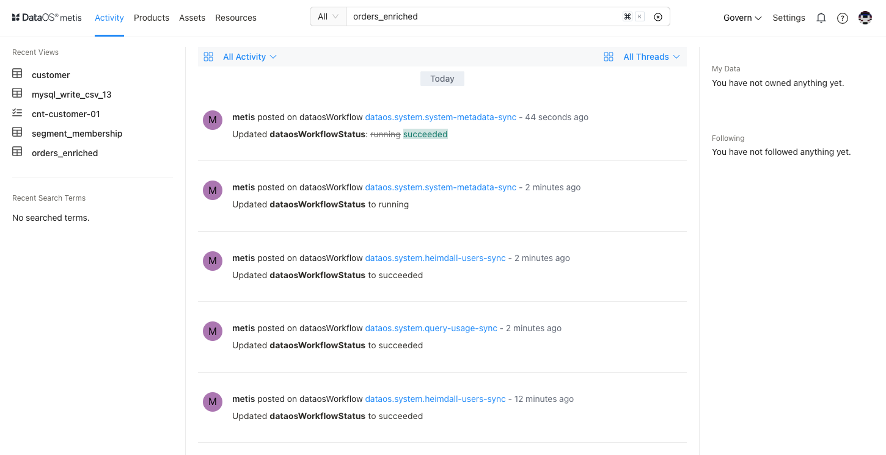
<figcaption align = "center">Metis UI - landing page  </figcaption>

Metis UI - landing page

This document will cover the essential details about how to perform various functionalities, such as adding a glossary, starting conversations for collaboration, and many more.

## Adding Tag Categories, Tags, and Glossary

Tags and glossary terms are two distinct and impactful features, each serving a unique purpose. Although they may appear similar at first glance, they are designed for different applications. Tags are labels that provide valuable assistance to individuals and groups, acting as helpful aids in discoverability. On the other hand, glossary terms play a crucial role in maintaining consistency across the entire company, ensuring the usage of common vocabulary.

Here are some scenarios where using these terms can be powerful:

- Labeling datasets with concepts that are relevant to the business/industry - Glossary
- Labeling a data asset with sensitivity information (PII, Highly sensitive, etc.)- Tag Category
- Applying Gold/Silver/Bronze data-tier labels based on centrally defined standards- Tag Category

<aside class="callout">
🗣 To maintain a well-organized business glossary, we recommend limiting the creation permissions for glossary terms to administrators or a designated Data Governance lead. Enabling this permission for too many end-users could potentially lead to a disorganized and cluttered glossary.

</aside>

### **How to Define Tag Groups**

1. On Metis UI, click on **Govern →Tag Groups**. 
    
    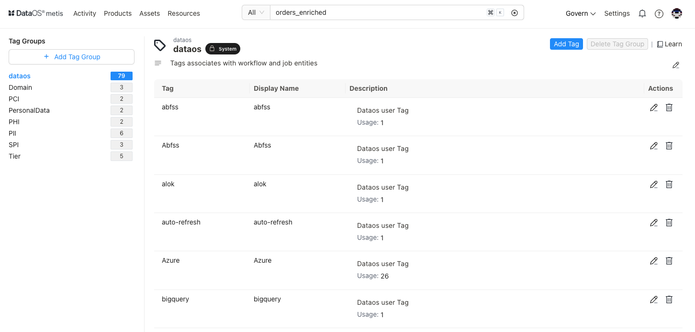
    <figcaption align = "center"> Tag groups </figcaption>
    
2. Clicking on the + Add Tag will open the screen to add a new tag group and its description.
    
     
    
    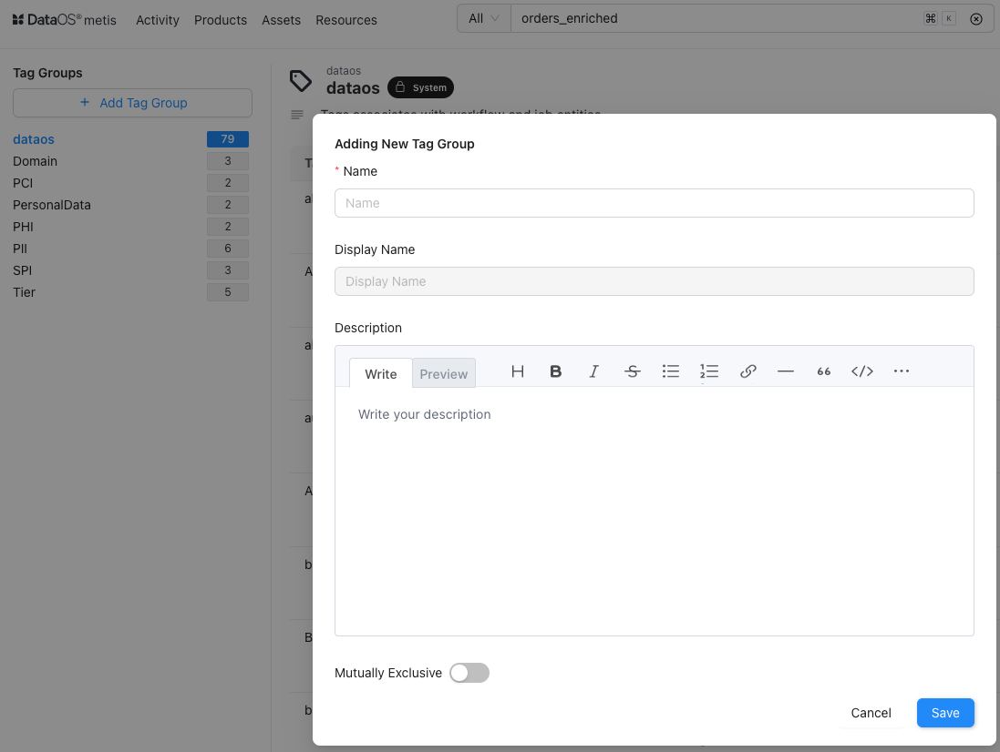
    <figcaption align = "center"> New tag group creation </figcaption>
    
3. Enable **Mutually Exclusive** Property to designate tag groups as mutually exclusive. When a tag group is marked as mutually exclusive, it implies that a metadata entity can be tagged to belong to one of the available tags defined in the group.  To learn more, refer to [**Mutually Exclusive Tag Groups**](metis_features.md). 
4. Add new tags with proper descriptions for the newly added category and save them. Now, these tags can be added to the data entities.

<aside class="callout">
🗣 You can define new tag categories as per business requirements, but some of the tag categories, such as tag tiers, are pre-defined by the Metis administrator with special business importance terms, Gold, Silver, etc. Click **here** to learn more about it.

</aside>

### **How to Create a Glossary of Terms**

1. On Metis UI, click on **Govern →** **Glossary**.
2. Clicking on + Add Glossary will open up the following form:
    
    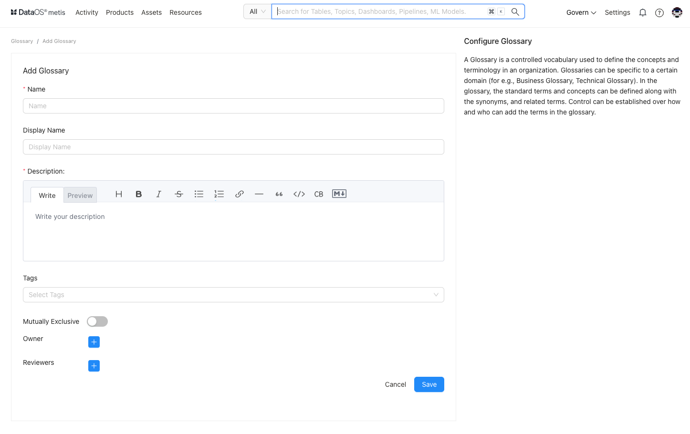
    
    <figcaption align = "center"> Adding glossary </figcaption>
    
3. Enable Mutually Exclusive Property to designate the glossary as mutually exclusive. When a Glossary is marked as mutually exclusive, it implies that a metadata entity can be tagged to any of the single glossary terms.  It can not have two or more glossary terms attached to it simultaneously.
4. Add owners and reviewers and save it. Your glossary will appear on the left pane.
5. To create a glossary term, select the newly added glossary on the left pane and then select the **Add term** button on the page.
6. Give this new term a name, which must be unique in the glossary. 
    
    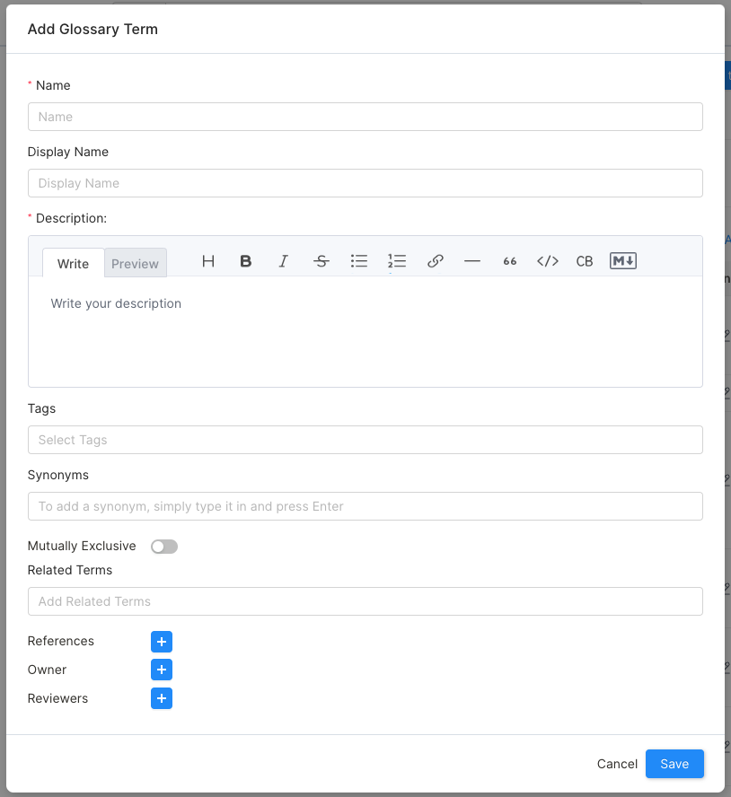
    
    <figcaption align = "center"> Adding references and synonyms for the glossary term  </figcaption>
    
    > Metis enables you to add rich formatting to glossary term. For example, you can add `bold`, `underline`, or `italic` formatting to the text. You can also create tables, bulleted lists, or hyperlinks to external resources.
    > 
    
7. You can add synonyms, the other terms used for the same term, such as for customer, you can add client, buyer, etc.
8. You can add related terms for the term, such as for customer, you can add related terms ‘loyal’, ‘preferred’, ‘high-importance’, etc.
9. A term also has a set of **Reviewers** who review and accept the changes to the Glossary. This is to ensure the consistent use of terms across the organization. 

<aside class="callout">
🗣 Once tag categories and glossary terms are defined, users can attach them to various entities such as data assets, DataOS Resources and products.
</aside>

### **How to Add Tags to DataOS entities**

On the DataOS entity detailspage, click on the highlighted Edit icon. Choose a tag from a list of tags defined in Metis for various categories.

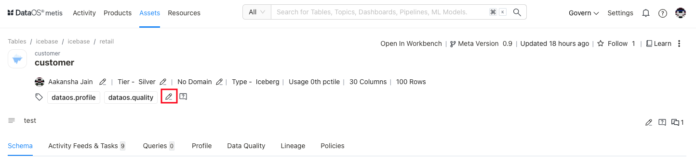

<figcaption align = "center"> Adding tags to data asset </figcaption>

### **How to Add Tag Tiers**

On the DataOS entity detailspage, click on the edit icon next to the Tag Tier.

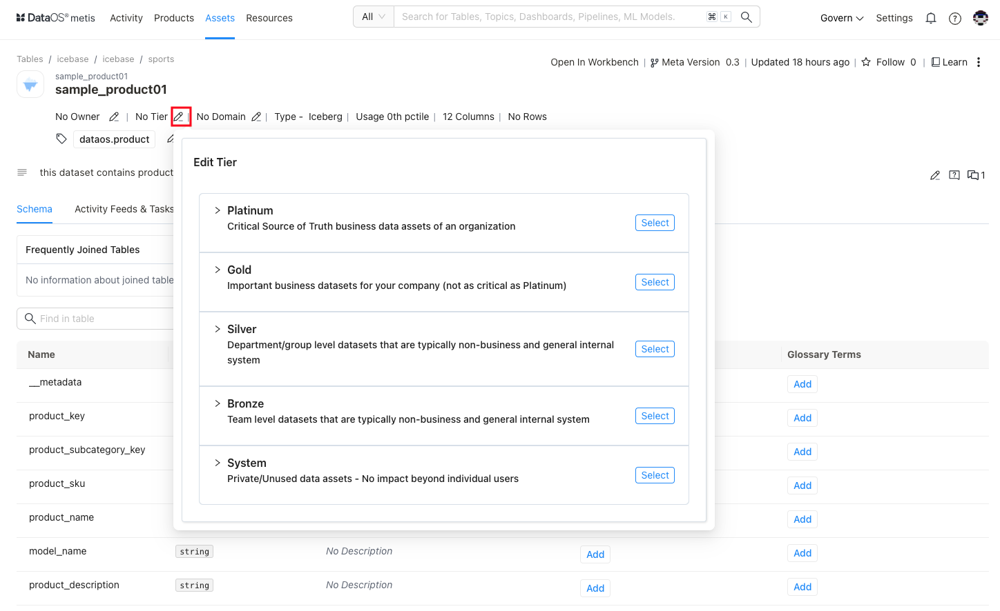

<figcaption align = "center"> Edit tag tier </figcaption>

## How to Collaborate with Team Members

### **Start Conversations**

You can collaborate with your team by starting conversation threads and asking for dataset descriptions or tags for an entity by clicking the chat icon. Metis enables you to easily ask any questions that you might have about an entity.

You can create and reply to entire conversation threads around various activities across any data asset. You can also add reactions with emojis.

1. On the entity DataOS entity detailspage, click on the highlighted icon for conversations. The number on it denotes the messages in the conversation thread. The right pane will show the conversations.
    
    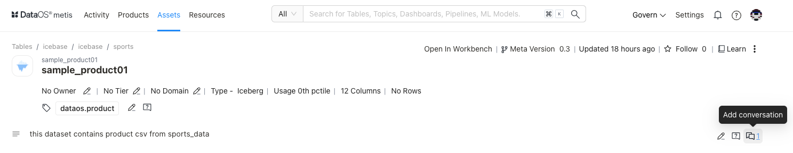
    
    <figcaption align = "center"> Conversations around data asset </figcaption>
    
2. A side pane will open.
    
    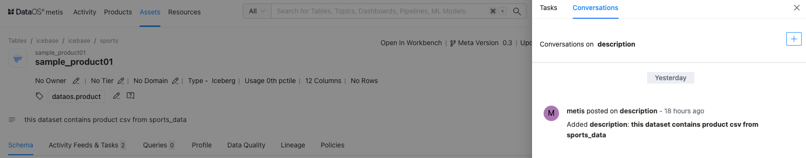
    <figcaption align = "center"> Conversation </figcaption>
    
3. Clicking on the **+** sign will open the editor for the new conversation.
    
    <aside class="callout">
    🗣 Metis enables you to add rich formatting to conversations. For example, you can add bold, underlined, or italic formatting to the text. You can also create tables, bulleted lists, or hyperlinks to external resources.
    
    </aside>
    
4. You can also add conversation threads to the columns of your dataset.
    
    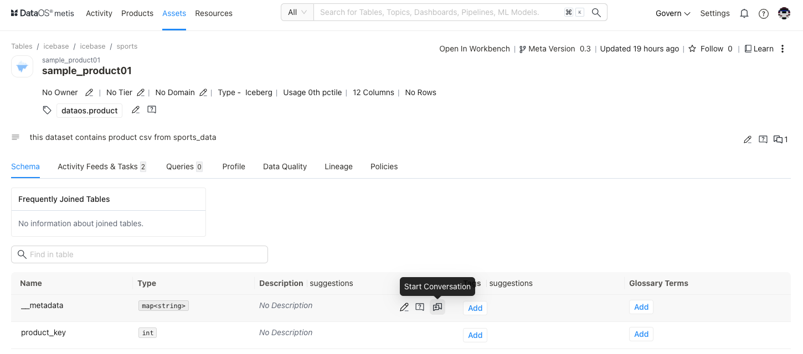
    
    <figcaption align = "center"> Conversation thread on the column </figcaption>
    

### **Create Announcements**

This feature helps in informing the entire team (or other users) about the changes to the data, such as deprecation, deletion, or schema changes so that other team members are prepared to handle the impact. 

These announcements can be scheduled with a start date and an end date. All the users following your data are notified in Activity Feeds about the announcement.

1. On the DataOS entity details page, click on the vertical three-dot menu to get the option to add an announcement for the asset.

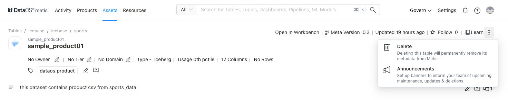
<figcaption align = "center">Creating announcements to inform team members about updates  </figcaption>

1. Clicking on the **Add Announcements** button will open the dialog box to enter the details, such as title, description, start and end date.
2. On Metis UI, under ‘All Activity’, users can view the announcements. Users can add reactions using emojis and reply to the announcement.

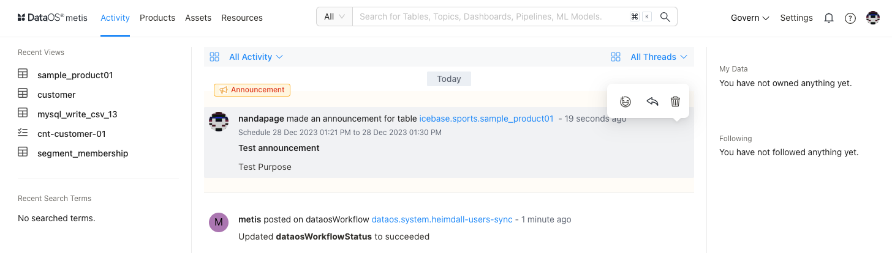

<figcaption align = "center"> Announcements in user’s activity </figcaption>

### **Create Tasks for Team Members**

You can create tasks for requesting updates on data assets, such as creating tags or updating the description of a data asset and assigning the task to an appropriate user or team.

1. On the DataOS entity detailspage, click on the highlighted icon to get the option to add a task.
    
    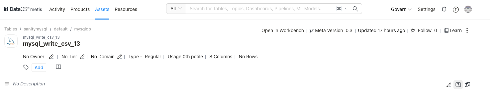
    
    <figcaption align = "center">  </figcaption>Create task option
    
2. Create the task and provide the description for it. You also need to assign team members by adding @ symbol. This task will appear in Activities for the assignee.
    
    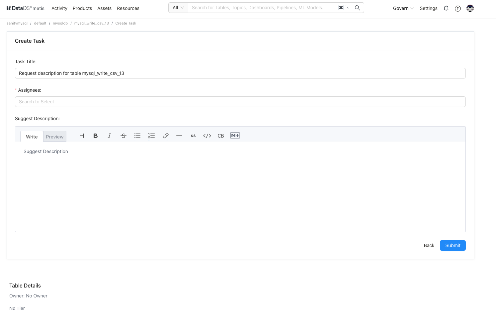
    

## How to Manage Ownerships

On the DataOS entity detailspage, click on the edit icon next to **No Owner.** You can add the team or individual person as an owner of the data asset.

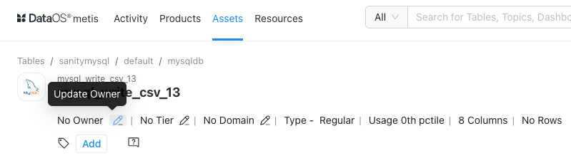
<figcaption align = "center">Adding owner  </figcaption>

## How to Create Roles and Policies

The Metis administrator has to decide on the roles users must be given along with the set of permissions for the roles. Permissions are a set of rules pertaining to various metadata operations that can be performed using Metis UI and APIs. These permissions are part of the policies corresponding to each role. When users are assigned roles, they automatically get the permissions defined for the roles.

[Pre-defined Roles and Policies](navigating_metis_ui_how_to_guide/pre_defined_roles_and_policies.md)

<aside class="callout">
🗣 Metis Admins have access to define new roles and their associated permissions. Once roles and permissions are in line with organization/business requirements, Metis admin can assign Roles to Users.

</aside>

## How to Add Configured Roles for Users

Roles can be assigned from the user profile on the Metis UI.

1. On the Metis UI page, navigate to the **Settings** tab. 
2. Clicking on the **Users** in the left pane will show the list of users. Open the specific user’s profile. In the left pane, edit the roles given to the user. A drop-down list will show the configured roles to choose from.
    
    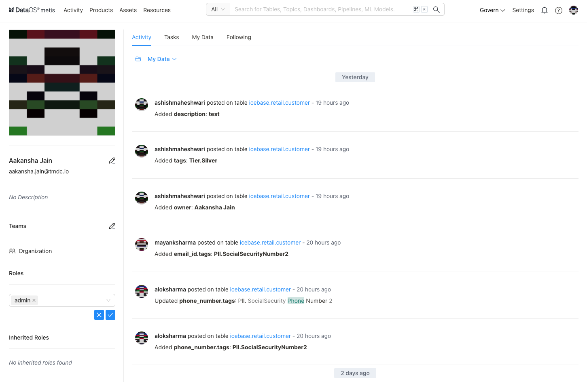
    
    <figcaption align = "center"> Adding roles to the user </figcaption>
    

<aside class="callout">
🗣 The Metis Admin role can be given from the Metis UI by a user with ‘Admin’ privileges. You can also contact the DataOS system administrator to assign you the ‘**Admin**’ role by adding the `roles:direct:metis` tag to your DataOS user profile.

</aside>

## How to Get Data Profile Information

Data profiling workflow analyzes the valid formats, null and inconsistent values within data to uncover anomalies and redundancies to achieve higher data quality. It uses basic statistics to gain insight about the validity of the data. The Data Profile scan workflow reads data profiling statistics and saves this information into Metis DB, which can be accessed on Metis UI.

1. Search the dataset for which you want to view the data profiling results.
2. Click on the **Profiler & Data Quality tab on the DataOS entity detailspage**.
3. You will see the data profiling statistics for the columns. It gives data types, null values %, distinct value %, and unique values % for each column. It also shows you ‘value count’, which helps you to know the completeness and missing values for the column before you use the data for critical business use cases.
4. Click on a column to see more details on the statistical distribution of its values.  You need to select the time period to see all the test results run for the particular column of the dataset.

## How to Get Fingerprinting Information

Fingerprinting analyzes the data to know that a column of data has a signature or a pattern. By examining the data values in a column, it can identify what type of data is there and determine what business terms or labels can be attached to this data. Fingerprinting automates identifying sensitive data (PII tag)that needs to be secured and to comply with government regulations like the GDPR. 

This information is shown on the Metis UI for your dataset.

On the DataOS entity detailspage, you will see the following fingerprinting data for your dataset.

1. Column names for which fingerprinting is performed.
2. Label showing the labels identified in the data. These labels are defined as system labels or according to business value.
3. For each label, you will get an option to **accept** the label to tag the fingerprint to the column or **discard** the label.
4. The confidence score reflects the system's degree of certainty that the identified label/classification is correct.
5. Once you accept the label, it will be added as a tag to the column.
    
    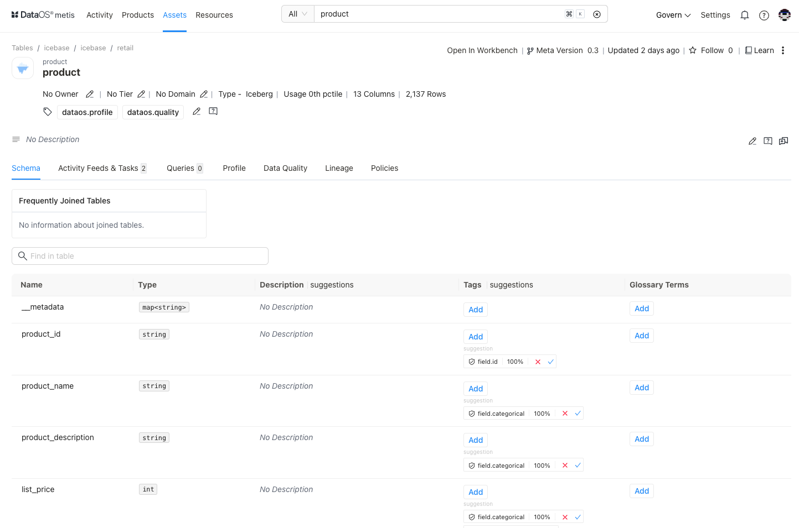
    
    <figcaption align = "center"> Automatically identified columns </figcaption>
    

## How to Visualize Data Quality Tests

You can view the list of quality tests (SLOs)created for the columns of your dataset to monitor the data quality and trends charts for each run. The trend charts also show whether the checks are passed or failed.

### **Test Suite View**

1. On the Metis UI page, click on **Govern > Quality**. You will see the list of test suits appeared on the screen.

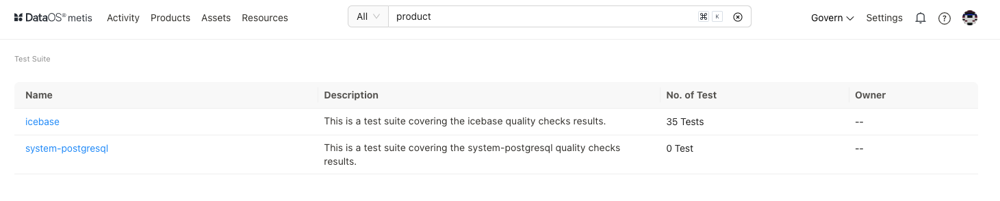

<figcaption align = "center"> Test suits  </figcaption>

1. Select the test suit for which you want to see quality test results. The list shows the latest test run results for all the datasets and their columns. 
2. Expand to see all the test results for a dataset column for the particular time period.

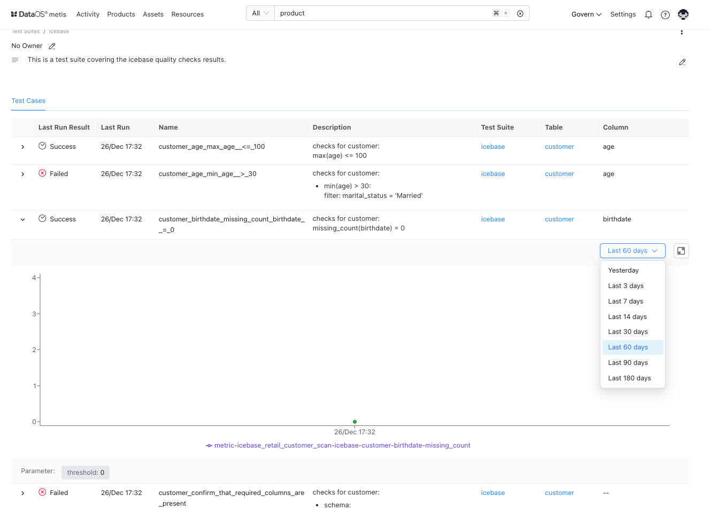

<figcaption align = "center"> Test results for the dataset for a selected time period </figcaption>

### **Dataset View**

1. Search the dataset for which you want to view quality test results.
2. Click on the **Profiler & Data Quality tab on the DataOS entity details page**.
3. You will see the summary. In the summary for quality test runs for the columns, click on the **Data Quality** tab to see a list of results of the last test run for the dataset. You can expand and select the time period to see all the test results for the particular column of the dataset.

## How to configure **Alerts and Notifications**

Metis allows users to define fine-grain notifications for alerts. You can select owners and various roles to be notified. It provides native integration with Teams, Slack, MS Webhook, etc. It also introduces the ability to send email alerts. 

1. On the Metis UI page, navigate to the **Settings** tab. Click on **Alerts** in the left pane to get the configuration options.
2. To configure the alert, you will first need to add a Name and a Description for your alert.
3. Provide Alert settings:
- **Trigger:** Choose when your alert should activate. You can select all existing assets or specific ones.
- **Filter:** Add event filters to specify which events trigger an alert. Use "Allow" to send an alert when the condition is met and "Deny" to silence it.
- **Destination:** Decide where your alert should be sent. We offer four options: Slack, MS Teams, Email, and Webhook.
    
    **Configuration Details for Destinations (Webhook, Slack, MS Teams):**
    
- **Webhook, Slack, Ms Team:**
    - Endpoint URL of the channel where you want to send alerts.
    - Set parameters for:
        - Batch Size: The size of the batch sent to the endpoint.
        - Connection Timeout: The timeout for the connection.
        - Secret Key: This key can be used to secure the connection.
- **Email:**
    - For email alerts, provide configure settings for SMTP Server.
    
    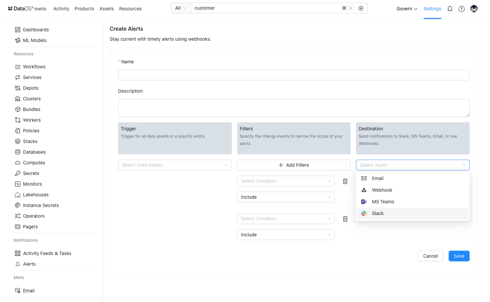
    <figcaption align = "center"> Configurations for mails </figcaption>

<aside class="callout">
🗣 Only users having Metis admin roles can configure the SMTP settings for sending emails.

</aside>