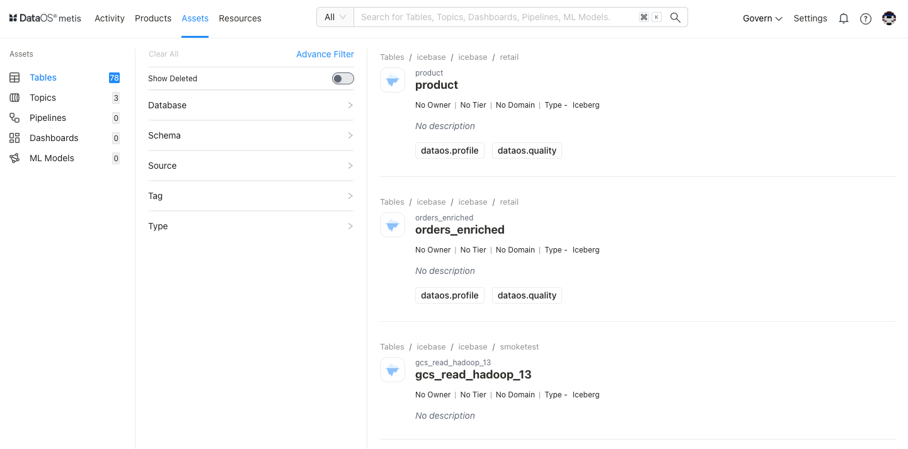
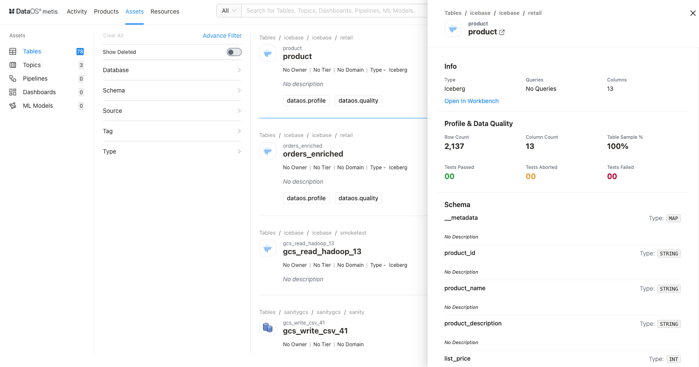
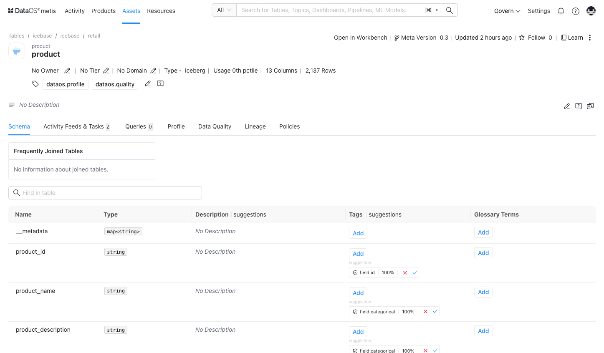
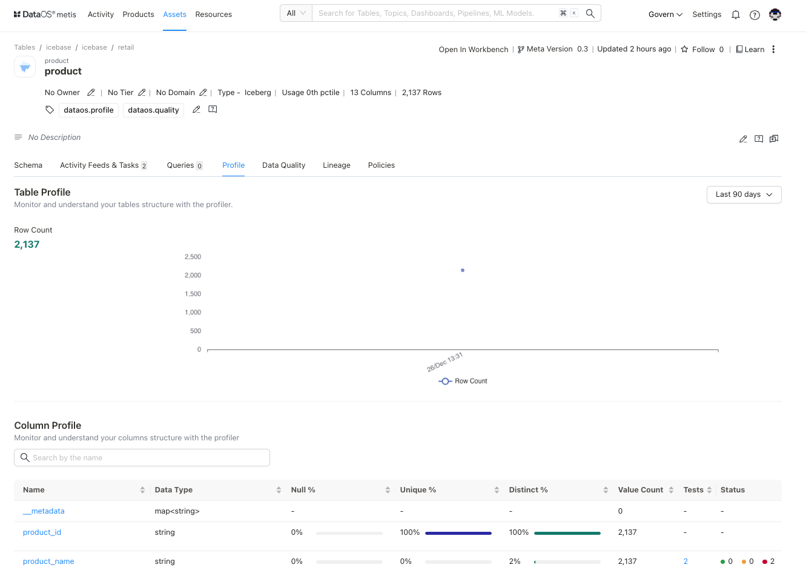
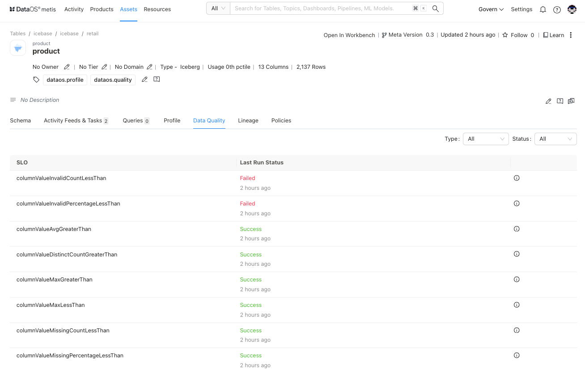
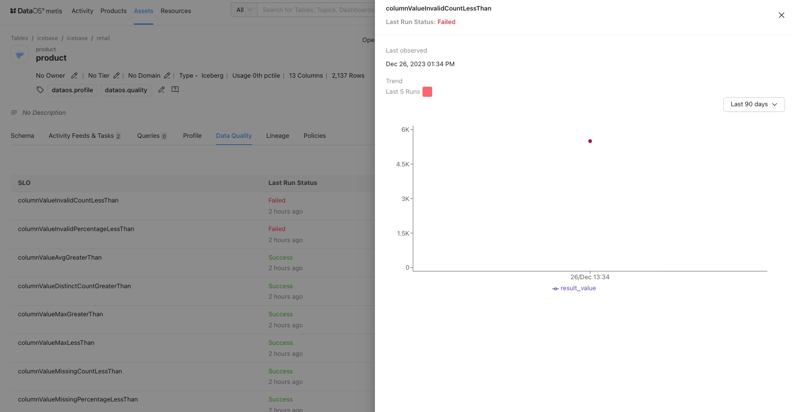
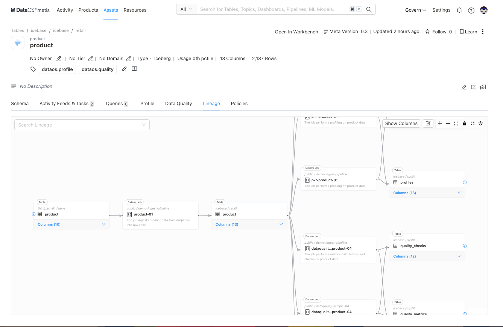
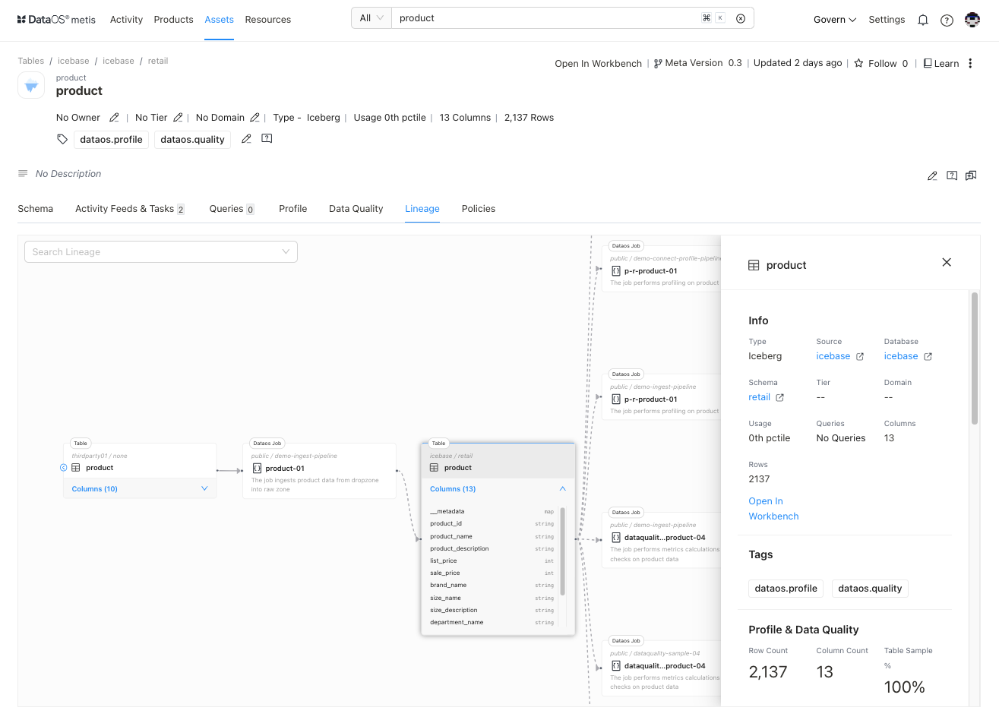
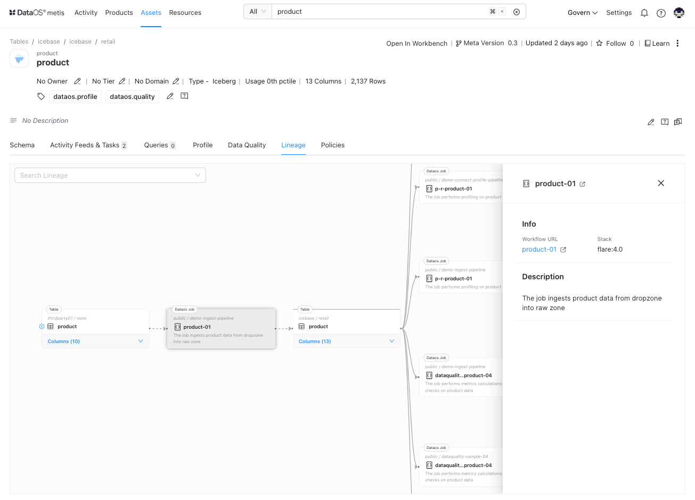

# Metis Assets- Tables

The Scanner workflow extracts both general and detailed information from structured data sources, about datasets/tables. This includes general details like names, owners, and tags, along with more intricate metadata such as table schemas, column names, descriptions, data types, quality, transformations, and relationships. The collected metadata is stored in the Metis DB, and the Metis UI presents this wealth of information under the '**Tables**' section. Users can efficiently locate, access, and interpret these assets and their associated data.

On selecting **Tables,** the following information will appear on the screen:

## Filter pane

The filter pane allows you to filter the tables list on the basis of the following attributes:

| Attribute | Description |
| --- | --- |
| Advance Filter | Filter Tables using the syntax editor, applying various criteria with 'and/or' conditions for a more refined search. |
| Show Deleted | Set the toggle to list deleted Tables. |
| Database | Choose database(s) to filter the list |
| Domain | Select a domain like Marketing, or Finance, etc., to filter the tables list for associated domains. |
| Owner | Name of the user for the data asset |
| Schema | Choose schema(s) to filter the list |
| Source | Select the source(s) to filter the list |
| Tag | Filter the list for tags. |
| Tier | Tier associated with the importance and criticality of the asset, such as Gold, Silver, etc. |
| Type |  |

## Result pane

Here, assets will be listed. Users have the following options to customize how the list is displayed:

| Option | Description |
| --- | --- |
| Sorting | Choose the Sorting order
- Last updated
- Relevance |
|  | Ascending/Descending order |

Each table in the list will feature a Card view that displays the following information for that particular table:

| Attribute | Description |
| --- | --- |
| Name | Table name  |
| Owner | Name of the user who created the table. |
| Tier | Tier associated with the importance and criticality of asset, such as Gold, Silver, etc. |
| Domain | Associated domain, such as Finance, Marketing etc. |
| Usage percentile |  |
| Type |  |
| Description | A description added to the tabelfor its purpose. |

## Overview pane

In the Card view, click anywhere except the table name to get the overview for quick reference.

This includes the following quick reference information:

| Category | Attribute | Description |
| --- | --- | --- |
| Info |  |  |
|  | Name | Name of the table/dataset, clicking on it will open its detail view in the new tab. |
|  | Type | Data Source |
|  | Queries | Information about the queries executed on this specific table. |
|  | Columns | Total number of columns in the table |
| Profile and Data Quality |  |  |
|  | Row Count | The total number of rows or records in the table or sample taken for profiling |
|  | Column Count | The total number of columns in the table or sample taken for profiling |
|  | Table Sample % | The percentage of the table's data that is represented in a sample. |
|  | Tests Passed | The number of tests that were successfully passed for the data in the table.
 |
|  | Tests Aborted | The number of tests that were terminated or aborted. |
|  | Test Failed | The number of tests that failed for the table. |
| Schema |  |  |
|  | Column | Columns in the table |
|  | Type | The data type of the columns |

## Details Page

In the Result or Overview pane, click on the name of the table to open the Asset Details page, which includes comprehensive details such as asset type, meta version, last update time, follower count, documentation link, delete option, and various editing options for owner, tier, domain, tags, and description.:

### **Table Information**

In addition to basic table information, the following details and options are provided.

| Attribute | Description |
| --- | --- |
| Asset Type | Table |
| Meta Version | Provides information on the latest Meta version. Click to see the version history and corresponding updates.  |
| Updated | Provides last updated time  |
| Follow | Gives the user an option to follow the table to receive updates and view its follower count. |
| Learn | Link to documentation |
| Delete | Gives the user the option to delete the table (click on three dots to access this option). |
| Announcements | Option to create an announcement for quick updates about table |
| Owner | Allow the user to edit the owner’s name. |
| Tier | Gives the user an option to add/edit the tier information. |
| Domain | Allows the user to add a predefined domain name. |
| Tags | Add/Remove tags/glossary terms/tag groups. |
| Request Tags Update (?) | Request updates in tags and assign users to do it. |
| Description | Allows the user to edit the description |
| Request Description Update (?) | Request updates in the description and assign users to do it. |
| Tasks | Option to view tasks created. In the side pane, the user will get the option to create a new task. |
| Conversations | View conversations in the side pane. The user will get the option to start a new conversation by clicking on the ‘+’ sign. |

The subsequent **tabs** on the Details Page provide more detailed information on schema, activity feeds and tasks, executed queries, data profiling, and data quality. These tabs offer in-depth insights into the structure, execution history, and quality of the selected table.

### **Schema**

### **Activity Feeds & Tasks**

This section compiles all activities, including tasks and conversations, providing users with a comprehensive overview.

### **Queries**

Here, you can access information about the queries executed on a specific table/dataset. The details include the query's source, the date and time it was executed, the user, and the runtime duration of the query.

### **Profile**

This tab shows the data profiling information for your table/dataset and data types, null values %, distinct value %, and unique values % for each column., which will help you to assess the accuracy, completeness, and validity of the data. 

### **Data Quality**

You can view the list of quality tests (assertions)created for your dataset to monitor the data quality and the status of each run. 

Here, you will get the information about the tests designed as per the quality objectives set for your datasets and ots columns.

| Attribute | Description |
| --- | --- |
| Last Run Result | Outcome of the most recent quality test run for the specified attribute |
| Last Run | Date and time of the last execution of the quality test for the attribute. |
| Name | Identifying label or title for the quality test attribute. |
| Description | Brief explanation or details about the quality test and validations defined. |
| Test Suite | Collection or set of related quality tests |
| Table | The table or dataset to which the quality test is applied. This involves dataset level metrics or schema related validations. |
| Column | The specific column or field within the table to which the quality test attribute pertains. |

Click on the test result to see the details of 

### **Lineage**

The lineage graph illustrates the relationships between workflows and derived datasets, providing a clear representation of how data entities are related and how they may have changed over time. You can get the details of data flow across workflows and the datasets they produce. Additionally, you can learn about the other dependent datasets. You can explore more by clicking on the dataset/workflow nodes of the lineage graph.

You can explore more by clicking on the dataset/workflow nodes of the lineage graph.

***Dataset***

It opens up the side pane to display additional information. It gives you links for Source, Database, Schema to further explore them. Users also get the option to switch to the Workbench app to run queries and explore the dataset.

***Job***

Users will get the Workflow information on the side pane and link to Workflow Resource to know more about.

