# Operations

The Operations app serves as a centralized hub for understanding and managing activity on the DataOS platform. It provides administrators with insights into cluster and job performance, user actions, access tags, and resource utilization in real-time. With its observability capabilities, the Operations app empowers users to monitor the health and status of the DataOS platform, troubleshoot issues, and resolve issues related to consumption of resources. Teams can centrally monitor and analyze events/logs generated by different tools of the data stack.
the Operations app seamlessly integrates with Grafana, a tool for creating insightful dashboards for assessing health of Kubernetes clusters, pods usage etc.

Operations app enables you to do the following:

- **Resources**: Keep track of user, core and cloud kernel level resources, their utilization and allocation.
- **Resource creation**: Create Resources from its UI, for example, a user can create a minerva cluster from operations app now.
- **Query Analysis**: Get a complete overview of the completed/failed/running queries. Cluster and user wise queries can be observed/debugged from this app's UI.
- **Cluster Analysis**: View cluster analysis, giving users valuable insights into available clusters.
- **Grafana**: Leverage Grafana's capabilities to visualize and explore metrics, logs, and traces in the DataOS environment, enabling effective cluster assessment and data analysis.
- **Bifrost**: Utilize Bifrost's efficient graphical user interface for creating and managing policies to provide flexible and fine-grained access control for  across various applications, users, services, stacks, and use cases. To learn more, refer to [Bifrost](./bifrost.md).

## Launching Operations App

On the DataOS home page, click on 'Operations'. The following type of resources can be monitored:

- **User Space** - These are the resources that DataOS users can create and manage within the platform. This includes various primitives such as workflows, services, secrets, depots, clusters, and computes. These resources are utilized during data processing jobs, services, and analytics workloads performed by users. Operations UI provides a way for users to observe and monitor these resources and their runtimes to debug if any issues.

- **Core Kernel** - The Core Kernel consists of system resources that are essential for the smooth operation of the DataOS platform. It provides low-level services and functionalities used by the core components of DataOS to ensure its proper functioning. Monitoring the Core Kernel resources and accessing their logs helps track the health and performance of these critical components, ensuring the overall stability and reliability of the DataOS platform.

- **Cloud Kernel** - The Cloud Kernel encompasses resources specifically designed for running and managing workloads in a cloud environment. These resources include virtual machines (VMs), container services, and other cloud-based infrastructure components. Monitoring the health and usage of the Cloud Kernel resources allows users to optimize their cloud-based workloads, ensure efficient resource utilization, and maintain the availability and performance of their applications and services.

- **Product** - In this section, you can find information about the release name and version of the DataOS platform and its associated components. This helps users keep track of the software versions they are working with and stay updated on the latest releases and features offered by DataOS.

## User Kernel 
### **Resources and their runtime**

By navigating to the "Resources" tab, the detailed information about the DataOS primitives created  by users can be accessed such as workflows, services, secrets, depots, clusters, compute, etc. This includes insights into the current running status of these resources, as well as the owner or creator of each resource. The "Resources" tab provides a centralized view of the user-created components, allowing users to monitor and manage their resources effectively. 
 

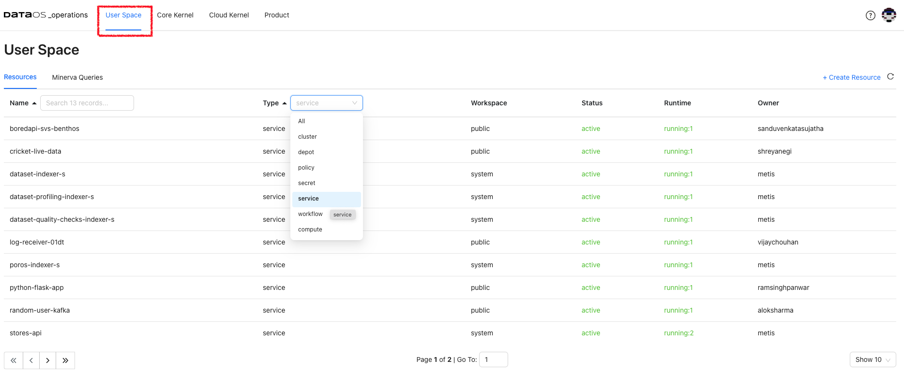

<figcaption align = "center"> User kernel resources</figcaption>

**Resource Runtime**

Click on the resource to get its details, YAML, and runtime information. Here, the details of the pods, their status and the nodes selected for running these pods is displayed. Clicking on `Refresh On` will update the information automatically.
 

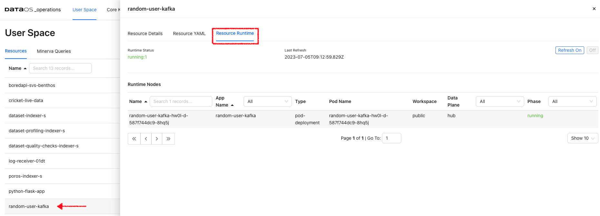

<figcaption align = "center">Runtime information </figcaption>

**Resource YAML**

It serves as a configuration file that defines the desired state of the resource within the DataOS environment. By examining the Resource YAML, users can gain insights into the specific configurations and settings applied to each resource. It includes the resource type, metadata, and specific properties associated with each resource. The Resource YAML is created by the user and resource is typically created using the DataOS CLI command **`apply`**. 

All these YAMLs also have the auto-generated section ‘status’ that conveys information about the build state, runtime state, and the required cloud kernel resources and web resources.
 

**Runtime Node Details**

Under Runtime Nodes, click on a node to get the runtime YAML, Logs, and Runtime Node Usage. Here you will get the container details, their state, and pod lifecycle conditions(Ready, PodScheduled…) with a status (True, False or Unknown) that make up the ‘computed state’ of a pod at any time.
 

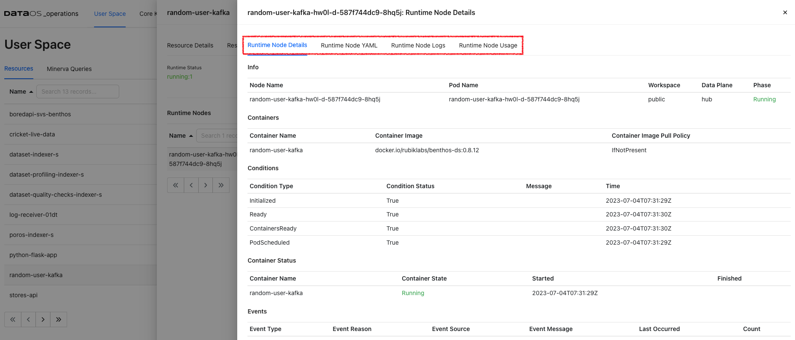

<figcaption align = "center">Node details </figcaption>

**Runtime Node Logs**

Runtime Node Logs provide a near real-time view. These logs provide insights into the current health of the node environment and can be helpful for debugging issues.

<aside style="background-color:#FFE5CC; padding:15px; border-radius:5px;">
🗣 Logs are not guaranteed to persist for any length of time and may be cleared as needed.</aside>

**Runtime Node Usage**
Check how much memory and CPU is utilized by a Node.

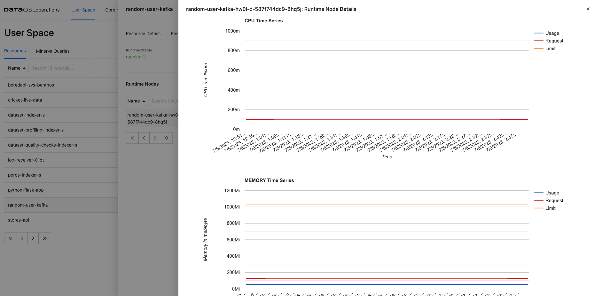

<figcaption align = "center">Node usage </figcaption>

### **Minerva Queries**
Here, users can view Minerva queries and perform various tasks related to query monitoring, and analysis. Once a query is submitted, the information such as query ID, source from where query is submitted (such as trino python client, Workbench or Flare), cluster used, user who submitted the query along with creation time is shown. Queries can be analyzed selecting source/cluster/userof interest.

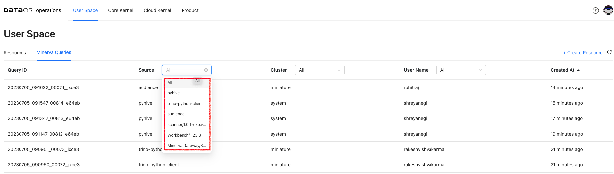
<figcaption align = "center">Minerva queries </figcaption>

Additionally, it enables query profiling, allowing users to analyze query performance, identify bottlenecks, and optimize their queries if needed. It offers detailed execution plans, resource utilization information, and other performance-related metrics.
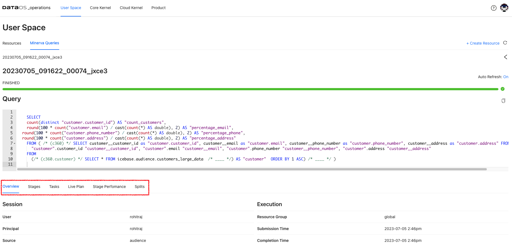
<figcaption align = "center">Query details </figcaption>

### **Cluster Analysis**
Select `Cluster` resource for User Space resources. Cluster analysis option appears on the screen. View the query load distribution along with failed queries for each of the clusters up and running within DataOS instance.
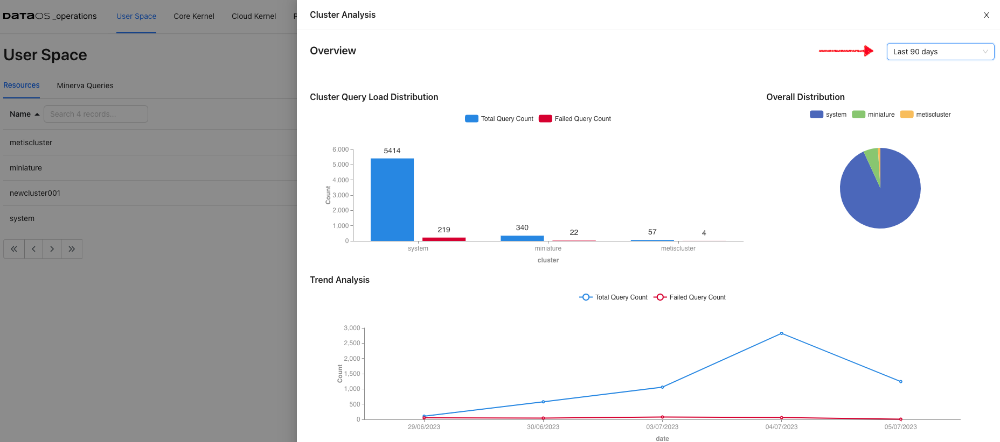
<figcaption align = "center">Query load distribution </figcaption>

### **Create Resources**
Operations app provides users with the ability to easily create resources directly from the user interface. This functionality eliminates the need to rely on writing YAML for the resource and using CLI for resource creation, thus helps streamlining the resource management process within the DataOS platform.
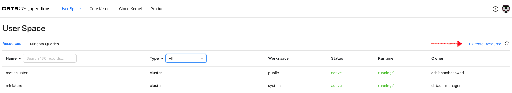
<figcaption align = "center">Create Minerva cluster </figcaption>

<aside style="background-color:#FFE5CC; padding:15px; border-radius:5px;">
🗣 You need ‘Operator’ level permissions to view the Core kernel and Cloud kernel resources.</aside>

## Core Kernel
Here you will get the resource details responsible for running the core components. These resources are isolated in groups as namespaces within a single cluster. These namespaces help different projects, teams, or customers to share a Kubernetes cluster. Names of resources need to be unique within a namespace but not across namespaces. Namespace-based scoping is applicable only for name-spaced objects *(e.g. Pods(Deployments), Services, workloads, Ingresses etc).* 

### **Pods**

When DataOS components are deployed in Kubernetes, that Deployment creates Pods with containers inside them  Each Pod is tied to the Node where it is scheduled and remains there until termination or deletion. In case of a Node failure, identical Pods are scheduled on other available Nodes in the cluster.

*DataOS components are deployed in separate namespaces.* After selecting the namespace, you can see components deployed in that namespace. Here you will get the pod details for the  DataOS components for the selected namespace and the phase. 

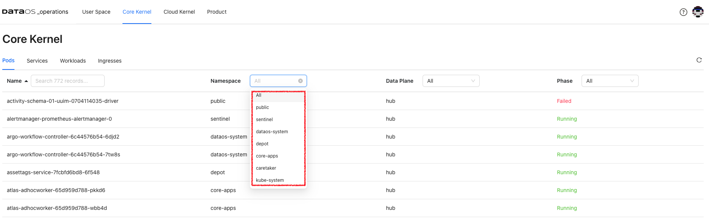
<figcaption align = "center"> Core kernel pods</figcaption>

The phase of a Pod is a simple, high-level summary of where the Pod is in its lifecycle.

Here are the possible values for `phase`.

| Value | Description |
| --- | --- |
| Pending | The Pod has been accepted by the Kubernetes cluster, but one or more of the containers has not been set up and made ready to run. This includes the time a Pod spends waiting to be scheduled as well as the time spent downloading container images over the network. |
| Running | The Pod has been bound to a node, and all of the containers have been created. At least one container is still running or is in the process of starting or restarting. |
| Succeeded | All containers in the Pod have terminated in success, and will not be restarted. |
| Failed | All containers in the Pod have terminated, and at least one container has terminated in failure. That is, the container either exited with non-zero status or was terminated by the system. |
| Unknown | For some reason, the state of the Pod could not be obtained. This phase typically occurs due to an error in communicating with the node where the Pod should be running. |
 

Clicking on a particular pod will give you Pod details, Pod YAML, Pod logs, and Pod usage.

**Pod Details**

This gives you pod and container details and container status. You will also get pod lifecycle conditions(Ready, PodScheduled…). A Pod has a PodStatus, which has an array of PodConditions through which the Pod has or has not passed:

- `PodScheduled`: the Pod has been scheduled to a node.
- `ContainersReady`: all containers in the Pod are ready.
- `Initialized`: all init containers have completed successfully.
- `Ready`: the Pod is able to serve requests.

The pod lifecycle conditions are with a status (True, False, or Unknown) that makes up a pod's ‘computed state’ at any time. You can track the state of each container inside a Pod.
 

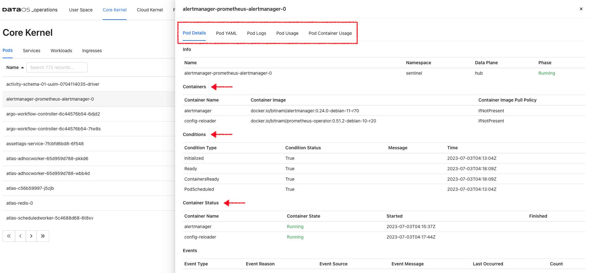
<figcaption align = "center">Pod details </figcaption>

**Pod YAML**

This is Kubernetes generated YAML for this resource where you can see the metadata information such as API version, resource version, its unique id, labels, deployment type, etc. You will also find the ‘spec’ property, which includes containers(image, ports, env, etc), memory requirements, storage volumes, tolerations and runtime status, etc.

**Pod Logs**

This option will enable you to access live stream logs produced by a named Pod to your terminal, letting you inspect the output from your application and diagnose a problem with your cluster’s workloads.

**Pod Usage**

This gives you the aggregate of the CPU use of all containers for the selected pod. Likewise, pod memory utilization refers to the total aggregate of memory used by all containers in the pod.

### **Services**

DataOS services are a means to interact with the Kubernetes system for running the core functionality/components. Select a namespace to get the list of services with their fully qualified domain name. All these services are deployed in the separate logical grouping called namespaces. 

**Service Details**

Click on the service from the selected namespace to view the port details, service and pod endpoints, etc.

### **Workloads**

A workload is a DataOS application running in one or more Kubernetes pods. You have the following workload types.

- **Deployments** are useful for stateless applications. Deployments create and manage identical pods called replicas, based on a pod template. If a pod stops or becomes unresponsive, the deployment's controller will replace it.

- **Stateful sets** live up to their name, they're useful for stateful applications, that's things such as a database. Stateful sets create and manage pods that are expected to have a level of persistence. They allow for stable network identifiers and persistent storage.

- **Daemon sets** are useful for background tasks such as monitoring by creating one pod per node.

### **Ingresses**
Ingresses are configured within the DataOS platform for specific namespaces such as core apps, Poros, network gateway etc. These ingresses enable external access to the services and applications running within these namespaces, providing a secure and controlled entry point for incoming traffic. By defining and managing these ingresses, administrators can effectively control and direct the flow of network traffic to the respective namespaces, ensuring proper connectivity and access to the deployed resources.

## Cloud Kernel 
### **Resources**

Within a cloud environment, compute nodes form a core of resources. They supply the processing, memory, network, and storage that virtual machine instances need. When an instance is created, it is matched to a compute node with the available resources. Here you will access the details about these compute nodes, their creation time, and cloud service provider.
 

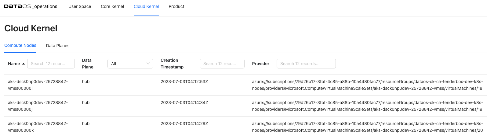

<figcaption align = "center">Compute node details </figcaption>

### **Compute Node Details**

Clicking on the compute node will display the detailed information about the node, including its general details and status. Accessing these compute node details allows you to gain a comprehensive understanding of the node's configuration, status, and available resources, enabling effective management and optimization of your compute infrastructure.

- **General Information**: Information about the compute node, such as the operating system it uses, the OS image, the Kubernetes version, and the architecture.
- **Addresses**- Host IP and hostname. This information varies depending on the cloud provider.
- **Conditions**- Status of all running computing nodes.It provides insights into the health and availability of the nodes.
- **Capacity and allocatable**- Available resources on the compute node, including CPU, memory, and the maximum number of pods that can be scheduled onto the node. It helps in understanding the capacity and limits of the node.
- **Taints**- Automatically created by the Kubernetes control plane when problems occur on nodes,  that match the conditions affecting the node.

## Product

You can see the deployed DataOS products and their release information here. Click on the product name to view the release details of all the installed DataOS components. 
 
<aside style="background-color:#FFE5CC; padding:15px; border-radius:5px;">
🗣 You need ‘Operator’ level permissions to view the installed DataOS components.</aside>

## Use Cases

### **Monitoring Query Execution and Performance**

The **Minerva Queries** option provides an intuitive, user-friendly interface to monitor query execution in a Minerva cluster. Here are some use cases where Minerva query information can be valuable for monitoring query execution:

1. **Query Performance Optimization**:  to monitor the performance of running queries in real time. Detailed information about query execution, including query plans, stages, and resource utilization, can be viewed. This information helps in identifying performance bottlenecks, optimizing query execution, and improving overall query performance.
2. **Query Troubleshooting**: When a query encounters errors or takes longer than expected to execute, the query's progress and execution stages can be observed. You can examine query details, such as the number of rows processed, the duration of each stage, and any error messages. This helps in troubleshooting and diagnosing issues that may arise during query execution.
3. **Resource Utilization Monitoring**: To view a resource utilization summary for running queries, including CPU and memory usage. You can track resource consumption at the query level and identify queries that are consuming excessive resources. This helps in optimizing resource allocation, identifying resource-intensive queries, and ensuring efficient cluster utilization.

### **Troubleshoot Data Processing Workloads**

One use case for utilizing resource runtime logs is to troubleshoot problems with data processing workloads. These logs provide valuable insights into the execution of data movement tasks, allowing you to identify and resolve any issues that may arise during the process. 

Let's say you have a Flare job that moves data from a source system to a destination system. During the execution of the pipeline, you encounter unexpected errors or data discrepancies. One effective way to achieve this is by analyzing the logs generated by the driver and executor nodes. By accessing the resource runtime logs, you can:

1. **Identify errors**: The logs can provide detailed error messages, stack traces, or warnings that help pinpoint the specific issue causing the problem. You can look for any exceptions or error codes that indicate potential data movement issues.
2. **Trace data flow**: The logs allow you to track the flow of data through the pipeline. You can see the input data, intermediate transformations, and output data at each stage. This helps in understanding how the data is being processed and if any transformations or mappings are causing the problem.
3. **Analyze performance**: Resource runtime logs provide insights into the performance of the data movement workload. You can check for any delays, bottlenecks, or high resource utilization that may impact the efficiency of the process. This information can help you optimize and tune the workload for better performance.
4. **Debug transformations**: If you have data transformations or mappings within the workflow,you can inspect the intermediate data at various stages and verify if the transformations are producing the expected results.
**Analyzing the Driver Logs**: Look for progress indicators (such as completed stages, tasks, or data processing operations) and for any warning or error/exception messages that might indicate potential issues or failures. 
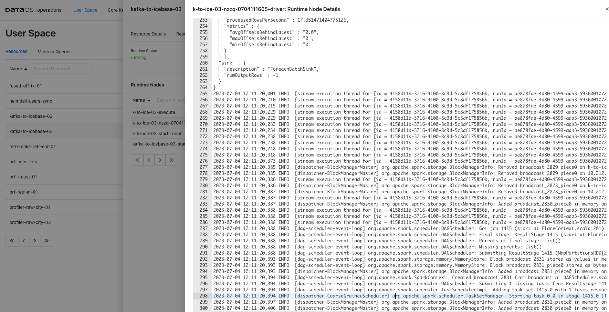
<figcaption align = "center">Driver logs </figcaption>
**Analyzing the Driver Logs**: - Access the logs of individual executor nodes. These logs provide insights into the specific tasks performed by each executor. Look for task-level progress updates, including completed, failed, or ongoing tasks or any error/exceptions.
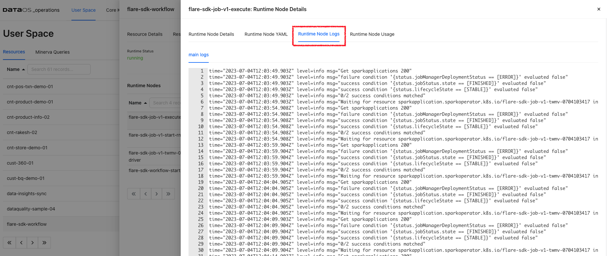
<figcaption align = "center">Executor logs</figcaption>

Use the insights gained from the logs to fine-tune the configuration and parameters of the workload, if applicable.

### **Optimizing Resource Utilization**

One use case for utilizing the runtime usage and runtime node logs of the driver and executor is to tweak resource allocation for data processing jobs. These logs provide valuable insights into the resource utilization and performance of the driver and executor nodes during the execution of data processing tasks. Here's an example scenario:

Let's say you have a data processing job that involves complex computations and transformations on large datasets. You notice that the job is taking longer than expected to complete or is experiencing resource-related issues. By accessing the runtime usage and runtime node logs, you can:

1. **Analyze resource utilization**: Observe the CPU, memory, and disk usage of the driver and executor nodes. You can monitor the resource consumption patterns and identify any bottlenecks or resource constraints that may be impacting the job performance. This information helps you determine if the allocated resources are sufficient for the workload or if adjustments need to be made.
2. **Optimize resource allocation**: Based on the insights gained from the usage graphs, you can make informed decisions about resource allocation for your data processing job. If you observe that the job is CPU-intensive, you might allocate more CPU resources to the executor nodes. If memory usage is high, you can adjust the memory allocation to ensure optimal performance. Fine-tuning the resource allocation can help improve job execution time and overall efficiency.

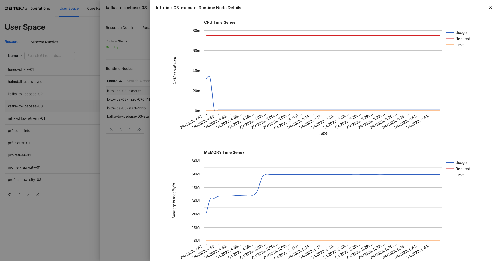

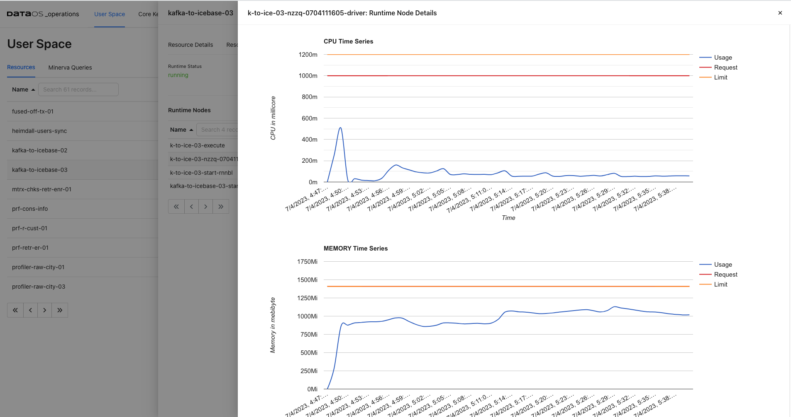

<figcaption align = "center">usage </figcaption>
