# workbench

DataOS Workbench is a web-based data exploration tool that allows you to run SQL queries to analyze big data from various heterogeneous data sources. It is backed by the Minerva query engine (which has been built on top of Trino), hence it is ANSI SQL compliant. Workbench allows you to run simple & complex queries on all sorts of relational databases.

The first thing you do, once you open the Workbench app is to choose the Minerva cluster you want to use. This cluster is committed to executing SQL scripts. You choose this cluster according to your computing requirements. The on-demand compute provisioning in Minerva enables you to meet the fluctuating computational requirements on your data assets. The datasets available to you will depend on the depots & catalogs included in the Minerva cluster. 

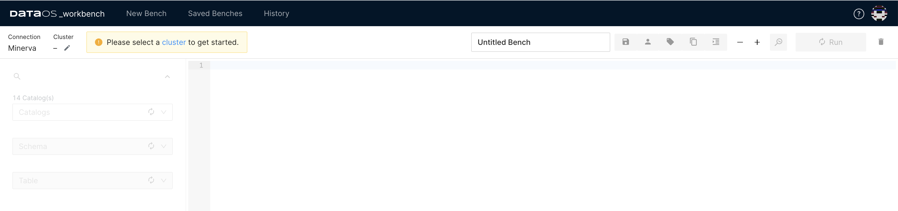

<figcaption align = "center">Cluster selection</figcaption>

You can select a cluster from the available ones. 

The next step is to select the names of the `Catalog`, `Schema`, and `Table` where the data is located. The `Catalog` includes the names of the depots and catalogs (data sources for which the depot has not been created, but which you can still query through DataOS). You can also find  the desired dataset using ‘Search’ feature.

If you do not see the requisite name in the list of Catalogs, ask the admin, or a person with the operator tag to add it to the Minerva cluster you are using. An operator/admin can also create a new cluster just for the data sources you want to use; this way, the complex queries you run would not affect the computation resources of existing clusters.

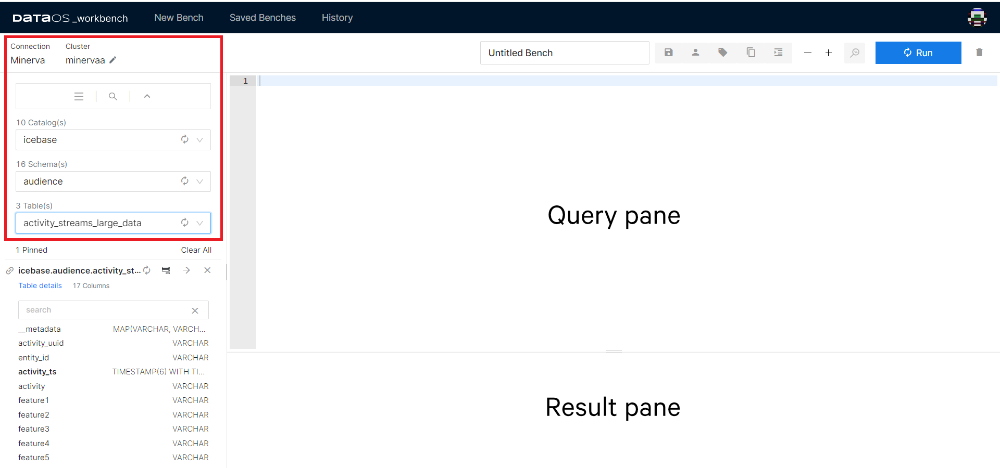

<figcaption align = "center">Query and result panes</figcaption>
Once you select a table from the list of tables, its columns and data types appear on the screen. The mapping from source data to tables is defined by the connector. For relational databases, depot translates to `Catalog` in Workbench, while Collection to `Schema`, and Dataset to `Table`.

The  a fully-qualified table name such as icebase.audience.customers_large_data refers to the Table customers_large_data in the Schema audience which is in the Catalog icebase.

Use Query Pane to edit scripts, save them, and run scripts. When you run a script, results are shown in the Result pane.

 Now you are ready to start writing and running the queries. Workbench uses TrinoSQL syntax. If you need help getting started, here is a list of the commonly used queries:

[Popular SQL Query Syntax](workbench/sql_query_syntax.md)

## Workbench Features

### Studio Feature

The Studio feature is designed to streamline the process of writing complex and time-consuming SQL queries. With its intuitive interface, you can effortlessly generate SQL statements by selecting the desired Aggregates and Measures, or Raw Records and columns.

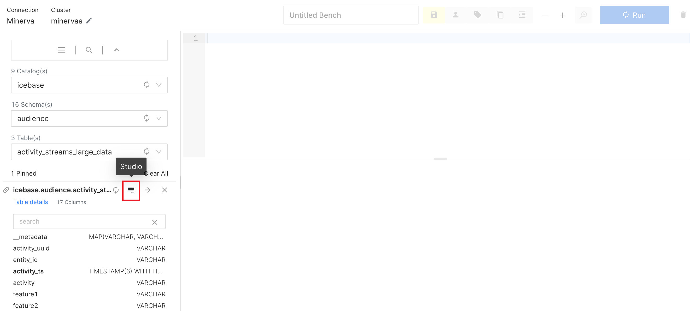

<figcaption align = "center">Studio feature</figcaption>

Now choose the fields per your intentions. Once done, click Generate SQL.

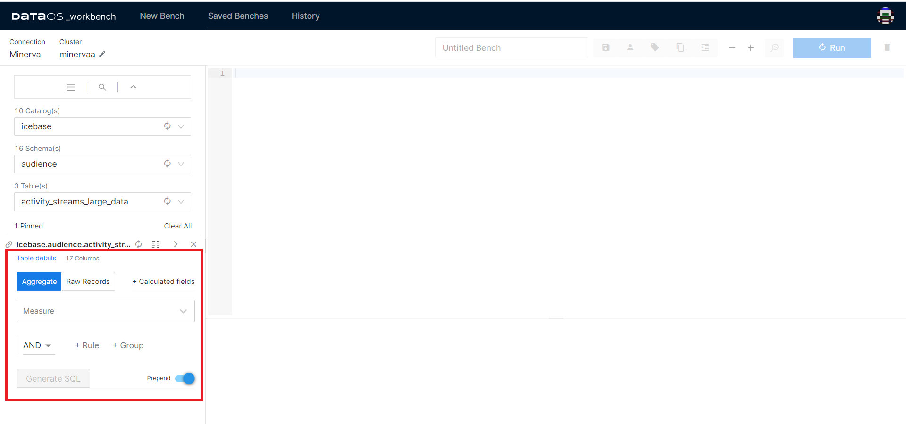

<figcaption align = "center">Perform aggregations, calculate measures</figcaption>

The prepend toggle allows you to keep the previous SQL statements in the query pane while generating the new statements. To remove previously generated SQL statements, disable prepend.

You can now directly export the results of the query to a BI tool. Check out the Atlas section.

### Atlas

Atlas is an in-built BI solution that enables you to create customized reports/dashboards on any datasets with visualizations. In the result pane, hover over the three vertically aligned dots. Click it, and go to the Atlas option.

<figcaption align = "center">Atlas option</figcaption>

When you select the Atlas option, the pop-up will ask you for the query name. Type a name for your query and click export. It will immediately take you to Atlas in a new tab. 

To start using Atlas, check out the Analytics section: Link to Atlas 

### Analyze

Use this feature to get the Query Plan. It gives you access to both the Raw Data as well as the DAG of the distributed query plan.

To analyze, select the entirety of your query and click the little magnifying glass with the lightning symbol on it (shortcut key: ctrl/cmd + shift + enter).

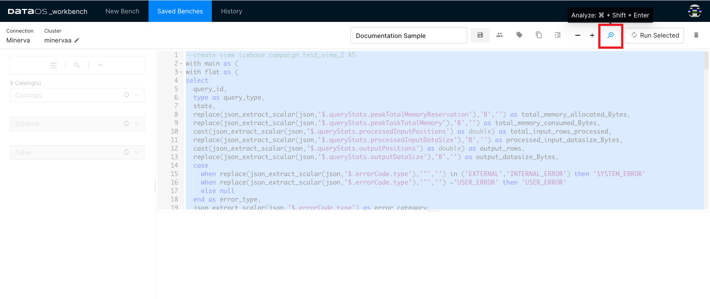

<figcaption align = "center">Analyze query</figcaption>

Clicking on the ℹ️  button will take you to the detailed Query Plan

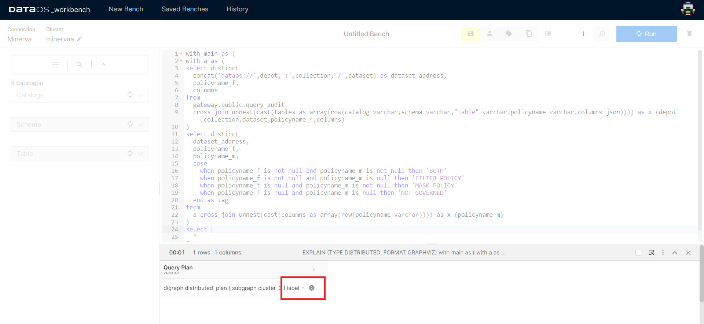

<figcaption align = "center">Detailed Query Plan</figcaption>

### Runtime Stats

The Runtime Stats option appears while the query is still running. It will not be available once the query has been completed.

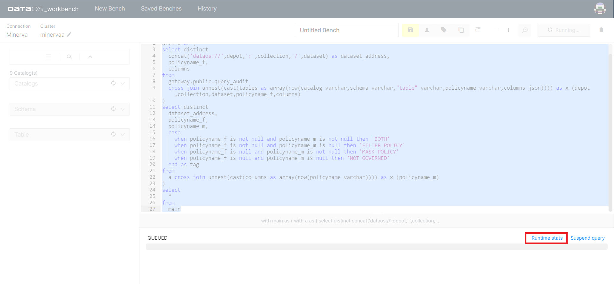

<figcaption align = "center">Runtime Stats option can be seen in the result pane</figcaption>

Clicking on the Runtime Stats tab will take you to a new tab in the web browser that will hold vital information about the query you ran.

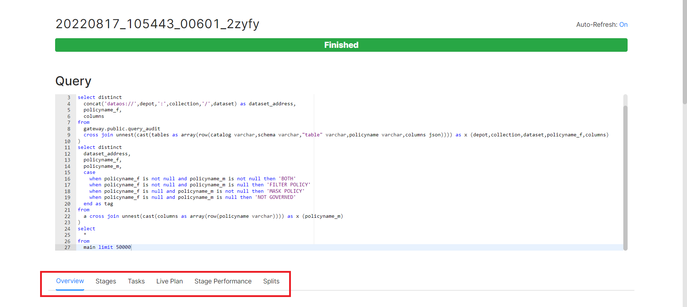

<figcaption align = "center">Available options</figcaption>

**Overview**

The overview section is further divided into four sub-sections - Session, Execution, Resource Utilization Summary, and Timeline. 

*Session* tells you about the source of the query. 

*Execution* will provide you with crucial information on the time taken to plan, analyse and execute the query, among other details. 

*Resource Utilization Summary* not only tells you about the CPU & Memory usage but also holds information on the number of input/output rows and data.

*Timeline* holds the information on Parallelism and updates other details such as rows and bytes per second, as the query runs.

**Stages**

A query is executed by breaking up its execution into a hierarchy of stages. Each stage is designed to implement a different section of the distributed query plan. The output from these stages is aggregated into a root stage. The Minerva (query engine) coordinator is responsible for the modelling of the query plan into stages.

Here you can see detailed information on the stages in which your query has been segregated for faster results. It cues you in on the time and resources to be consumed for each section of the query. 

**Tasks**

Each stage of the distributed query plan is implemented as a series of tasks. These tasks are distributed over a network of Minerva worker nodes.

Tasks themselves operate on Splits - check the Split section below.  Upon execution of all the tasks, a stage is marked completed. Minerva assigns an ID to every task and tracks its progress on parameters like host, state, CPU time, and buffering details.

**Live Plan**

This will give you a graphical representation of the Tasks completed to execute the query. Starting from query input, analysis of the table, returning to the user with accurate output, to giving CPU and memory consumed to run the query. You can check this only after the query has completed running.

**Stage Performance**

Graphically represents each stage as a flowchart. The information here will be available only after the execution of the query is finished.

<figcaption align = "center">An example of flowchart of a Stage</figcaption>

**Splits**

Splits are sections of a larger data set. Minerva coordinator retrieves a list of all the splits that are available for a table, through the connector for a particular `Catalog`. As mentioned earlier, Tasks operate on Splits, which is to say that at the lowest level Stages retrieve data via Splits.

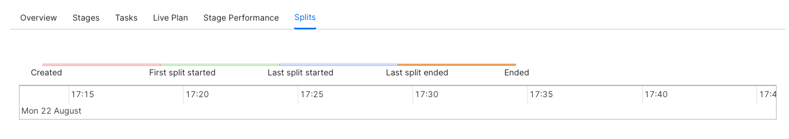

<figcaption align = "center">Splits </figcaption>

### Query Details

You can see the details of the query after it has run. Click the bar showing the result of a particular query.

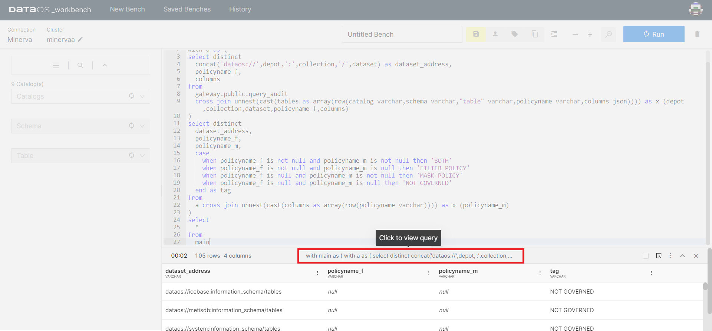

<figcaption align = "center">Query and its output</figcaption>

**Query**

This will show you the query you just ran. 

**Stats**

Stats will give you information relating to the status of the query, query id, CPU time, processed rows and splits, among other things.

**Governance**

This will display all the policies that are applied to the dataset you have queried. If a governance policy has been applied to the table being queried, you will see the cautionary triangle in the result bar of the result pane.

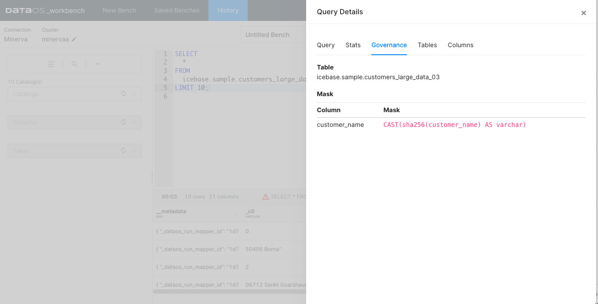

<figcaption align = "center">Limited permission to query this Table</figcaption>

You can create data policies (mask and filter) to guide what data the user sees once they access a dataset. To learn more, refer to Data Policies.

**Tables**

Tables will show you the fully qualified address of the input datasets. You can get more intricate and essential information on the table being queried in the Metis. Click on the arrow button on the right-hand side of the pop-up screen.

**Columns**

Here you can see the metadata of the output dataset.

### Compare

Workbench interface allows you to compare the results of two queries without having to execute additional SQL statements to do this. 

Select the two query results as shown in the image and click Compare option.

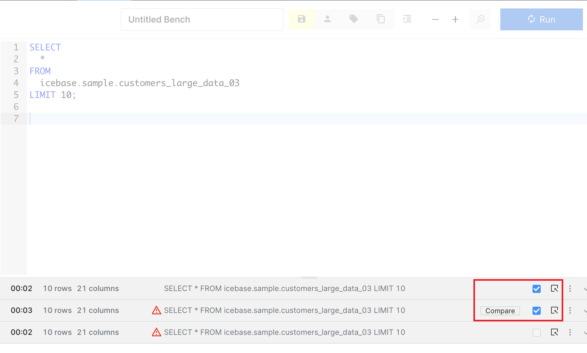

<figcaption align = "center">Results of 2 queries at a time to compare</figcaption>

Scroll each output dataset horizontally to compare specific columns

In the example shown, we have compared the results of two queries where one of them had customer names masked in the input dataset. 

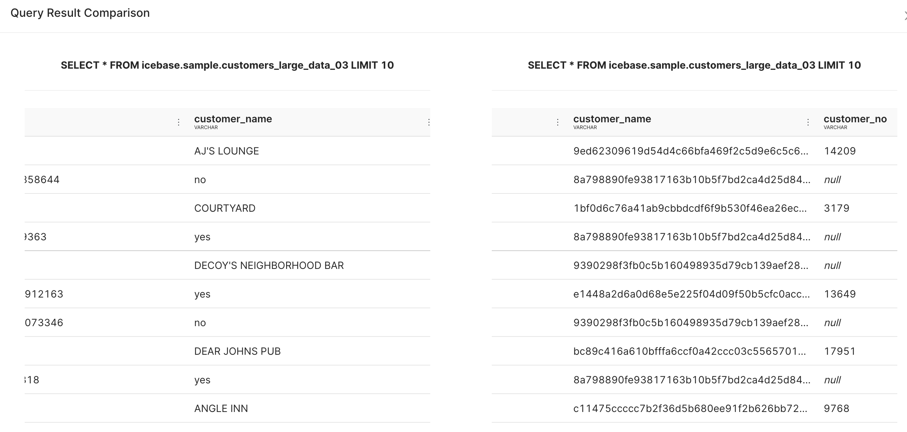

<figcaption align = "center">Query compare result</figcaption>

### Pivot

With DataOS workbench, you can pivot your output tables/datasets through a click-and-drag interface instead of having to execute it as a SQL statement.

Click the option for More, and go to the Pivot option.

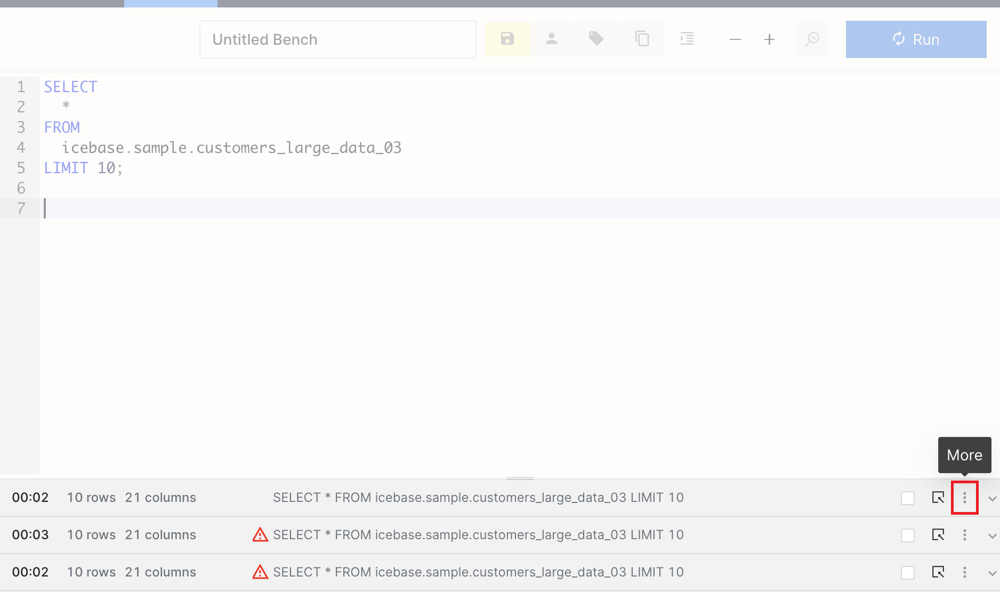

<figcaption align = "center">Pivot and other option</figcaption>

Pivot option opens up a new pop-up window where you can find all the columns (where at least one row doesn’t have the null value) listed at the top.

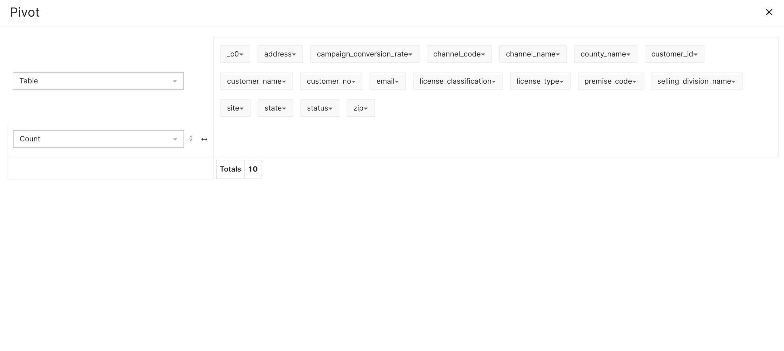
<figcaption align = "center">Applying filters </figcaption>

You can now pick and drop these attributes to the empty space as either row names or column names for a new table/dataset. In the example, we have picked ‘customer_no’ and ‘site’ as the row values, while ‘channel_code’ as the columnar values.

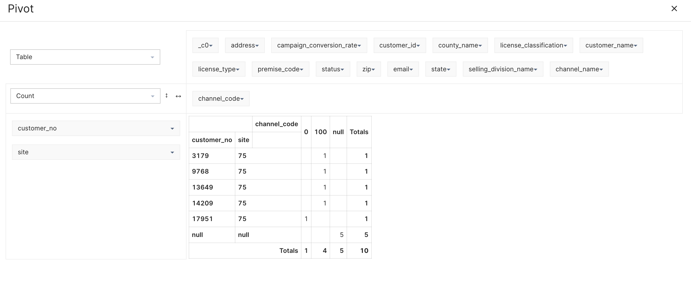

<figcaption align = "center">Pivot table created</figcaption>

You can do a lot more in Pivot, such as create charts and heat-maps, perform aggregations, among other things. 

## Additional Features

There are lots of more features that make the Workbench interface user-friendly. Some of these features have been listed below.

### History

This stores the SQL statements executed by you in the last 4 weeks.

### Saved Benches

The saved SQL scripts appear in the Saved benches list. 

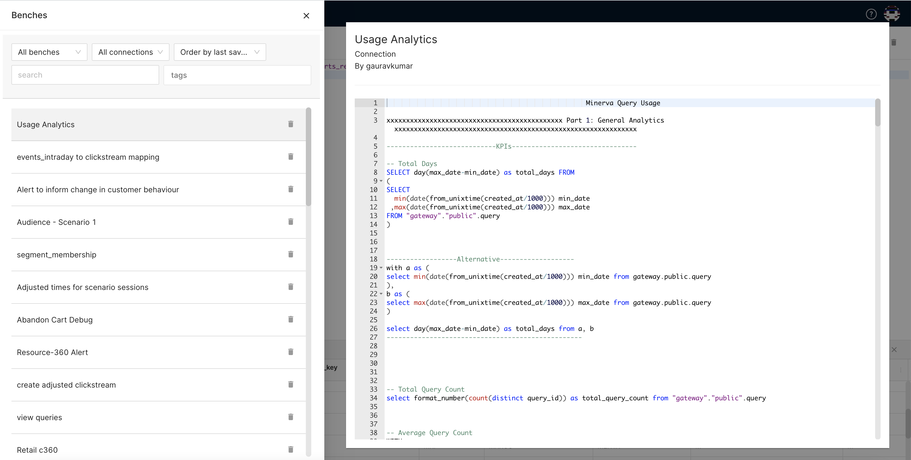

<figcaption align = "center">Saved benches</figcaption>
### Private/Shared Bench

SQL statements that you save are available to you only. You can choose to share your SQL statements with other members of your enterprise. Simply save the bench, and click on the Private button to share a bench with other users.

### Format

It rearranges/restructures your SQL statements so they are readable and legible to everyone else. Think of it like someone with better calligraphy, rewriting your chicken feet-like handwriting.

### Tags

It’s part of the best practice to declare tags for your saved benches, so they are searchable and discoverable later.

Features like New Bench, Saved Benches, Zoom, Save, etc. are pretty straightforward, and we will not bore you with their details.