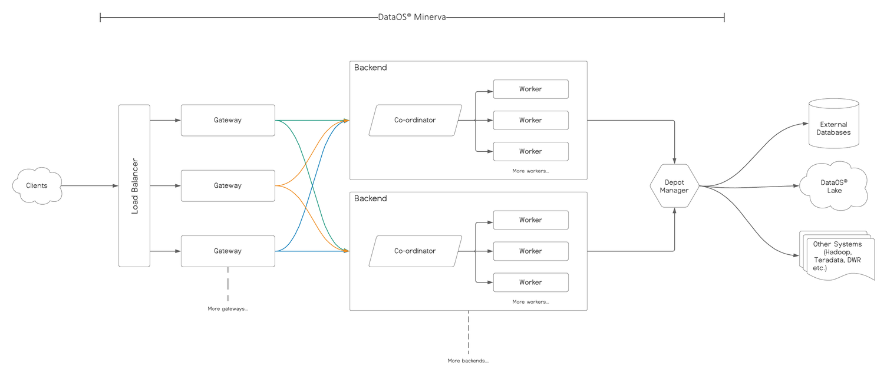

# DataOS® Minerva 
Modern SQL query engine
> Minerva [/mɪˈnɜːrvə/](https://en.wikipedia.org/wiki/Help:IPA/English) `(Latin: [mɪˈnɛrwa]; Etruscan: Menrva)` is the Roman goddess of wisdom and strategic warfare, justice, law, victory, and the sponsor of arts, trade, and strategy.

## Architecture

## Component Layout
_Coming soon..._

## Scaling Primitives
_Coming soon..._

## Supported Depot Types
_Coming soon..._

## Support Clients
_Coming soon..._