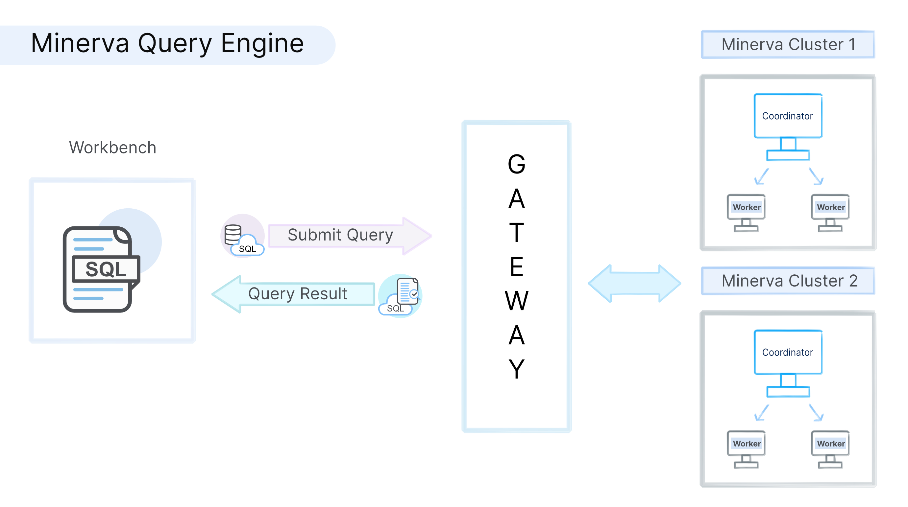

# Introduction

Minerva is an interactive query engine that makes it easy to analyze big data using standard SQL. It enables high-performance SQL access to a large variety of data sources, including traditional relational databases Oracle, PostgreSQL, MySQL, and Redshift and other data sources such as Kafka, Cassandra. You can query and explore data from these data sources without bringing it to DataOS. 

You can set up Minerva clusters that can process data from many different data sources even within a single query. This capability reduces the complexity of integrating multiple systems, which means that you can query different databases with different schemas in the same SQL statement simultaneously.

A Minerva cluster consists of a single coordinator node and one or more worker nodes, and Minerva uses its own coordinator within the cluster to schedule queries among its workers. The coordinator is responsible for submitting, parsing, planning, and optimizing queries and query orchestration, and worker nodes are responsible for query processing. Minerva enables you to concurrently run hundreds of memory, I/O, and CPU-intensive queries. For such query load, a single Minerva cluster is not sufficient and you need to create multiple clusters. It can scale to hundreds of worker nodes while efficiently utilizing cluster resources.

Minerva uses Gateway, a query router that sits in front of single or multiple Minerva clusters and becomes the interface for all the queries executed across the clusters. These queries are submitted from the Workbench.  Gateway also ensures high availability in case of downtime and balances the load across the clusters.

