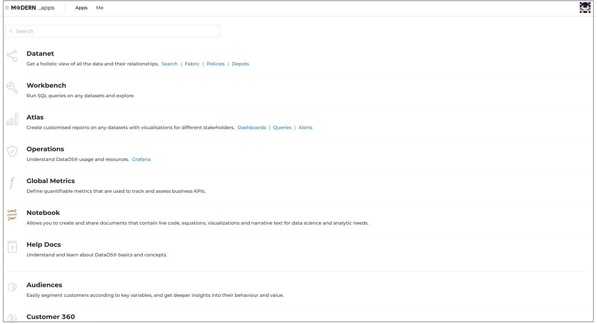
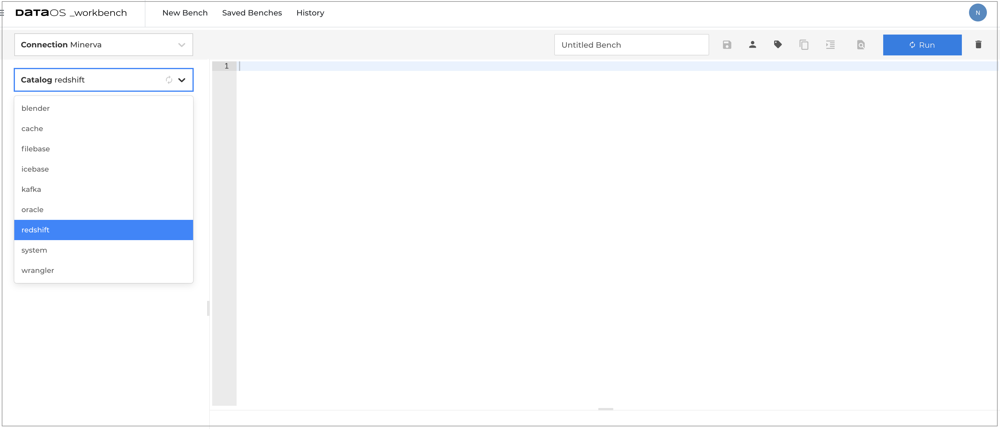
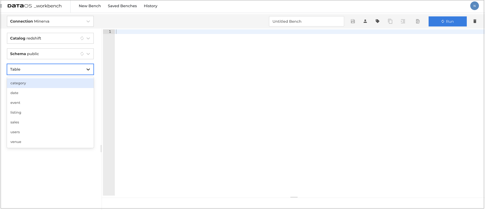

# Minerva Cluster Tuning

This article describes how you can create the Minerva clusters with optimized resources and configure it to connect to relational databases and various other data sources.

## Tune Minerva cluster

To create and tune Minerva cluster, provide the configuration properties for the Minerva cluster and connectors. These properties are saved in a DataOS setup YAML file stored in the DataOS configuration directory.
 
### Cluster properties
The default Minerva settings should work well for most workloads. You may adjust the following properties such as replicas, resources to ensure optimal performance:

```yaml
        - version: v1beta1
          name: minervab                                   # Name of the Minerva cluster
          type: cluster
          description: the default minerva cluster b
          tags:
            - cluster
            - minerva
          cluster:                                        # Minerva cluster properties 
            nodeSelector:
              "dataos.io/purpose": "query"
            toleration: query
            runAsApiKey: api-key
            minerva:                                      # Tune these values for optimal performance
              replicas: 2
              resources:
                limits:
                  cpu: 2000m
                  memory: 4Gi
                requests:
                  cpu: 2000m
                  memory: 4Gi
              debug:
                logLevel: INFO
                trinoLogLevel: ERROR
              
```
## Configure connectors

Minerva query engine offers a large variety of connectors, for example MySQL, PostgreSQL, Oracle, Redshift. These properties in DataOS setup file will mount the connector as the **Catalog**. This catalog contains schemas and references your data source via a connector. 

For Minerva, you can define connectors for data sources in the following ways:

1. **Depot:** If you have already defined Depots to access data sources then you can include the address of these Depots in the DataOS setup YAML file to confifure connectors. You can also include additional properties to optimize the Minerva performance.

2. **Catalog:** Here you can provide the name and properties such as connection url, user name and password to access the data source.


The following is an example of connector configuration using Depot definition and catalog properties. All these definitions will be converted to catalogs which you can access on DataOS Workbench.

> :material-alert: **Note**: Replace the connection properties as appropriate for your setup.

```yaml
cluster:
    nodeSelector:
        "dataos.io/purpose": "query"
    toleration: query
    runAsApiKey: api-key
    minerva:
        replicas: 2
        resources:
        limits:
            cpu: 2000m
            memory: 4Gi
        requests:
            cpu: 2000m
            memory: 4Gi
        debug:
        logLevel: INFO
        trinoLogLevel: ERROR
        depots:                           # Pre-defined Depots and their properties 
        - address: dataos://icebase:default         
            properties:
            iceberg.file-format: PARQUET
            iceberg.compression-codec: GZIP
            hive.config.resources: "/usr/trino/etc/catalog/core-site.xml"
            hive.parquet.use-column-names: "true"
        - address: dataos://filebase:default
            properties:
            hive.config.resources: "/usr/trino/etc/catalog/core-site.xml"
            hive.parquet.use-column-names: "true"
        
        catalogs:                           # Data source connectors and their properties              
        - name: redshift
            type: redshift
            properties:
            connection-url: "jdbc:redshift://URL:PORT/DB"
            connection-user: "USERNAME"
            connection-password: "PASSWORD"
        - name: oracle
            type: oracle
            properties:
                connection-url: "jdbc:oracle:thin:@URL:PORT/DB"
                connection-user: "USERNAME"
                connection-password: "PASSWORD"
        - name: cache
            type: memory
            properties:
            memory.max-data-per-node: "128MB"
        - name: wrangler
            type: wrangler
```

### Connector properties
You can find the configuration properties for a connector from the following table.

**Connector Name** | **Property** | **Description** |
-------- | -------- | -------- |
Kafka    |          |          |
MySql    |          |          |
Oracle   |          |          |
Redshift |          |          |

## Multi cluster setup
You can  add more clusters when a single cluster can not not handle the query load or If your cluster is facing a specific performance problem. The following YAML file is an example of a typical Minerva multi cluster configuration. Replicate the complete code in the DataOS installation setup file(dataos.install.core.kernel.values.yaml) as shown. Give **unique name** to each cluster. 
```yaml
        - version: v1beta1                             # cluster- 1
          name: minervab
          type: cluster
          description: the default minerva cluster b
          tags:
            - cluster
            - minerva
          cluster:
            nodeSelector:
              "dataos.io/purpose": "query"
            toleration: query
            runAsApiKey: api-key
            minerva:
              replicas: 2
              resources:
                limits:
                  cpu: 2000m
                  memory: 4Gi
                requests:
                  cpu: 2000m
                  memory: 4Gi
              debug:
                logLevel: INFO
                trinoLogLevel: ERROR
              depots:
                - address: dataos://icebase:default
                  properties:
                    iceberg.file-format: PARQUET
                    iceberg.compression-codec: GZIP
                    hive.config.resources: "/usr/trino/etc/catalog/core-site.xml"
                    hive.parquet.use-column-names: "true"
                - address: dataos://filebase:default
                  properties:
                    hive.config.resources: "/usr/trino/etc/catalog/core-site.xml"
                    hive.parquet.use-column-names: "true"
                - address: dataos://kafka:default
                  properties:
                    kafka.empty-field-strategy: "ADD_DUMMY"
                    kafka.table-description-supplier: "confluent"
                    kafka.default-schema: "default"
                    kafka.confluent-subjects-cache-refresh-interval: "5s"
                    kafka.confluent-schema-registry-url: "http://schema-registry.caretaker.svc.cluster.local:8081"
              catalogs:               
                - name: redshift
                  type: redshift
                  properties:
                    connection-url: "jdbc:redshift://URL:PORT/DB"
                    connection-user: "USERNAME"
                    connection-password: "PASSWORD"
                - name: oracle
                   type: oracle
                   properties:
                     connection-url: "jdbc:oracle:thin:@URL:PORT/DB"
                     connection-user: "USERNAME"
                     connection-password: "PASSWORD"
                - name: cache
                  type: memory
                  properties:
                    memory.max-data-per-node: "128MB"
                

        - version: v1beta1
                name: minervabc                               # cluster- 2
                type: cluster
                description: the default minerva cluster c
                tags:
                    - cluster
                    - minerva
                cluster:
                    nodeSelector:
                    "dataos.io/purpose": "query"
                    toleration: query
                    runAsApiKey: api-key
                    minerva:
                    replicas: 2
                    resources:
                        limits:
                        cpu: 2000m
                        memory: 4Gi
                        requests:
                        cpu: 2000m
                        memory: 4Gi
                    debug:
                        logLevel: INFO
                        trinoLogLevel: ERROR
                    depots:
                        - address: dataos://icebase:default
                        properties:
                            iceberg.file-format: PARQUET
                            iceberg.compression-codec: GZIP
                            hive.config.resources: "/usr/trino/etc/catalog/core-site.xml"
                            hive.parquet.use-column-names: "true"
                        - address: dataos://filebase:default
                        properties:
                            hive.config.resources: "/usr/trino/etc/catalog/core-site.xml"
                            hive.parquet.use-column-names: "true"
                    catalogs:               
                        - name: redshift
                        type: redshift
                        properties:
                            connection-url: "jdbc:redshift://URL:PORT/DB"
                            connection-user: "USERNAME"
                            connection-password: "PASSWORD"
                        - name: oracle
                        type: oracle
                        properties:
                            connection-url: "jdbc:oracle:thin:@URL:PORT/DB"
                            connection-user: "USERNAME"
                            connection-password: "PASSWORD"
                        - name: cache
                        type: memory
                        properties:
                            memory.max-data-per-node: "128MB"
                       
```


## Access catalogs from Workbench
Once the connector configuration setup is completed, you can access your data assets for a specific data source from DataOS Workbench. Workbench uses Minerva with full SQL support and provides you an interface, allowing you to access your data sources as catalogs and discover schemas. 


1. Sign in to your DataOS instance with your username and password.
2. Go to DataOS Wokbench.

3. Select catalog from the drop-down.

3. Specify the schemas, or tables that you want to access.
 
4. Write SQL queries.
 

