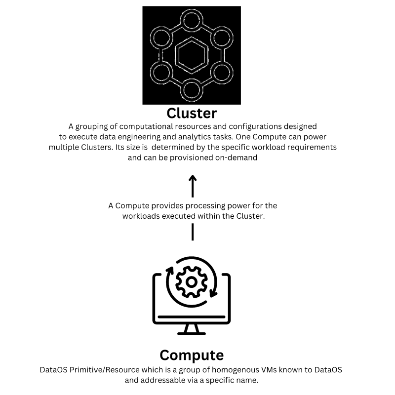

# **Cluster**

In DataOS, a Cluster is a Primitive/resource that encompasses a set of computational resources and configurations used to run data engineering and analytics tasks. A Cluster is powered by a Compute, another resource, which provides the necessary processing power for the workloads executed on the Cluster.

> 🗣️ To establish a Cluster, `roles:id:operator` tag is required. If you do not possess this tag, contact the DataOS administrator within your organization or any other individual with `roles:id:operator` tag to grant you the tag.
 

<figcaption align = "center">Diagrammatic representation of a Cluster</figcaption>
 

DataOS primarily has just one type of Cluster, known as **"Minerva"**. For exploratory, querying, and ad-hoc analytics workloads, Minerva Clusters can be created and attached to the desired Compute. DataOS provides flexibility to connect Compute of different configurations with different Minerva Clusters. Multiple such clusters can be made of diverse configurations to meet various analytics requirements.

A Cluster refers to a Compute, which is essentially a node pool of homogenous Virtual Machines (VMs) belonging to the same cloud provider. All VMs (or nodes) within a node pool should have the same CPU, RAM, Storage Capacity, Network Protocols, and Storage Drive Types. 

As an example, a recommended minimum specification could be:

| CPU | RAM | Hard Disk | Type of Storage |
| :--- | :--- | :--- | :--- |
| 16 cores | 128 GB | 2 TB | Local Storage |

However, these specifications should be adjusted based on the workloads and amount of data being processed. 

# **Creating a Cluster within DataOS**

Within DataOS, we can create a Cluster via two mechanisms: either by creating a YAML file and applying it via CLI or using the Operation App UI. Check out the pages below to explore how you create a cluster via these two methods.

1. [Creating a Cluster Using CLI](Cluster/Creating%20a%20Cluster%20Using%20CLI.md)

2. [Creating Cluster Using Operations App UI](Cluster/Creating%20Cluster%20Using%20Operations%20App%20UI.md)

# **Building Blocks of Cluster**

| Property | Description | Example | Default Value | Possible Value | Rules/ Additional Details | Field (Optional / Mandatory) |
| :--- | :--- | :--- | :--- | :--- | :--- | :--- |
| `version` | Version allows iteration on the schema.  | `version: v1`  | NA | `v1` | Configure all the properties according to the manifest version. Currently, it's `v1`. | Mandatory |
| `name` | Defines the name of the resource (Here, it’s the name of the cluster) | `name: query-default` | `runnable-default` , `query-default` | Any string that conforms to the rule given in the next cell. | The name must be less than 48 characters and conform to the following regex: `[a-z]([a-z0-9]*)` | Mandatory |
| `type` | Resource type is declared here. In the current case, it’s a cluster. | `type: cluster` | NA | Any of the available resources in DataOS | The name of the primitive/resource should be only in lowercase characters. Else it will throw an error. | Mandatory |
| `description` | Text describing the Cluster. | `description: default query compute` | NA | Any string | There is no limit on the length of the string | Optional |
| `tags` | Tags are arrays of strings. These are attributes and keywords. They are used in access control and for quick searches within Metis. | `tags:`   &nbsp;&nbsp;&nbsp;&nbsp;`- Connect`   &nbsp;&nbsp;&nbsp;&nbsp;`- Customer` | NA | NA | The tags are case-sensitive, so `Compute` and `COMPUTE` will be different tags. There is no limit on the length of the `tag`.  | Optional |
| `cluster` | Cluster specific section | `cluster:` &nbsp;&nbsp;&nbsp;&nbsp;`{}` | NA | NA | NA | Mandatory |
| `compute` | Compute to be referred within the Cluster | `compute:runnable-default` | NA | `runnable-default, query-default`, or any other custom compute that you have created | NA | Mandatory |
| `runAsApiKey` | Prime API Key of the User | `runAsApiKey:` `<api-key>` | NA | DataOS API Key  | To get API Key execute, `dataos-ctl apikey get` in the Terminal after logging into DataOS. | Mandatory |
| `minerva` | Minerva specific section | `minerva:`   &nbsp;&nbsp;&nbsp;&nbsp;`{}` | NA | NA | NA | Mandatory |
| `replicas` | Number of replicas | `replicas: 2` | NA | A minimum value of 1 and a maximum value of 4 | NA | Mandatory |
| `resources` | The CPU and memory resources, to be allocated. This includes the requested ones as well as the maximum limits. | `resources:`  &nbsp;&nbsp;&nbsp;&nbsp;`limits:`  &nbsp;&nbsp;&nbsp;&nbsp;&nbsp;&nbsp;&nbsp;&nbsp;`cpu: 4000m`   &nbsp;&nbsp;&nbsp;&nbsp;&nbsp;&nbsp;&nbsp;&nbsp;`memory: 8Gi`  &nbsp;&nbsp;&nbsp;&nbsp;`requests:`   &nbsp;&nbsp;&nbsp;&nbsp;&nbsp;&nbsp;&nbsp;&nbsp;`cpu: 2000m`   &nbsp;&nbsp;&nbsp;&nbsp;&nbsp;&nbsp;&nbsp;&nbsp;`memory: 4Gi` | `resources:`   &nbsp;&nbsp;&nbsp;&nbsp;`limits:`   &nbsp;&nbsp;&nbsp;&nbsp;&nbsp;&nbsp;&nbsp;&nbsp;`cpu: NA`  &nbsp;&nbsp;&nbsp;&nbsp;&nbsp;&nbsp;&nbsp;&nbsp;`memory: NA`   &nbsp;&nbsp;&nbsp;&nbsp;`requests:`   &nbsp;&nbsp;&nbsp;&nbsp;&nbsp;&nbsp;&nbsp;&nbsp;`cpu: NA`   &nbsp;&nbsp;&nbsp;&nbsp;&nbsp;&nbsp;&nbsp;&nbsp;`memory: NA` | `resources:`   &nbsp;&nbsp;&nbsp;&nbsp;`limits:`   &nbsp;&nbsp;&nbsp;&nbsp;&nbsp;&nbsp;&nbsp;&nbsp;`cpu: # Maximum value of 6000m`   &nbsp;&nbsp;&nbsp;&nbsp;&nbsp;&nbsp;&nbsp;&nbsp;`memory: # Maximum value of 6Gi`   &nbsp;&nbsp;&nbsp;&nbsp;`requests:`   &nbsp;&nbsp;&nbsp;&nbsp;&nbsp;&nbsp;&nbsp;&nbsp;`cpu: # Maximum value of 6000m`   &nbsp;&nbsp;&nbsp;&nbsp;&nbsp;&nbsp;&nbsp;&nbsp;`memory: # Maximum value of 6Gi` | `limits:` The maximum limit of the CPU and memory   `requests`: The maximum requested CPU and memory | Mandatory (All Properties) |
| `debug` | The debug level. This includes both the logLevel and the trinoLoglevel | `debug:`   &nbsp;&nbsp;&nbsp;&nbsp;`logLevel: INFO`   &nbsp;&nbsp;&nbsp;&nbsp;`trinoLogLevel: ERROR` | `debug:`   &nbsp;&nbsp;&nbsp;&nbsp;`logLevel: INFO`   &nbsp;&nbsp;&nbsp;&nbsp;`trinoLogLevel: ERROR` | `debug:`   &nbsp;&nbsp;&nbsp;&nbsp;`logLevel: INFO` / `DEBUG` / `ERROR`   &nbsp;&nbsp;&nbsp;&nbsp;`trinoLogLevel: ERROR` / `DEBUG` / `ERROR` | `logLevel`: A log level is a piece of information from a given log message that distinguishes log events from each other.    `trinoLogLevel`: This log level is specific to Trino. | Optional (Both) |
| `depots` | Address of the Depot | `depot:`  &nbsp;&nbsp;&nbsp;&nbsp; `- dataos://caretakerusage:public` | NA | Any valid depot address | NA | Mandatory|