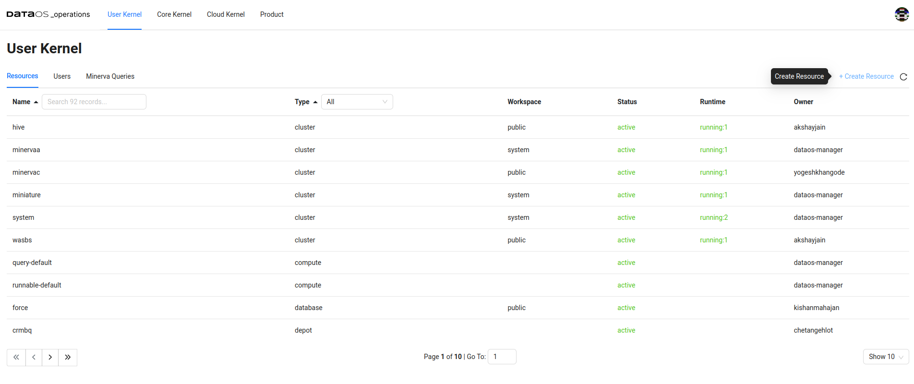

# Creating Cluster Using Operations App UI

You can also create a Cluster via the Operations App UI.

> This functionality is available in versions above DataOS® centaurus-1.8.72

To get started, follow the below steps:

## Step 1: Open the Operations App

To get started, open the Operations App either via the GUI or directly using the CLI by the command:

```bash
dataos-ctl view -a operations
```
 
<center>



</center>

## Step 2: Navigate to the ‘Create Resource’ Section

On the Operations App, click the ‘+ Create Resource’ button. Once you click it a window will open up with various fields as showcased below:
 
<center>


</center>

## Step 3: Fill up the required fields

Fill up all the required properties and click Create Cluster.
 
<center>


</center>
 
<center>


</center>

<center>


</center>

## Step 4: Check out the Created Cluster in Operations App

Once you click Create Cluster, a Cluster Resource will be created which can observed in the DataOS Operations App in the User Kernel Section
 
<center>


</center>