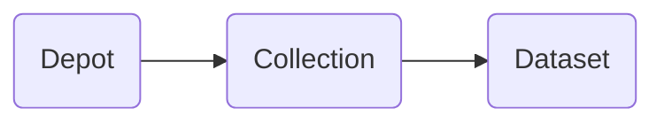
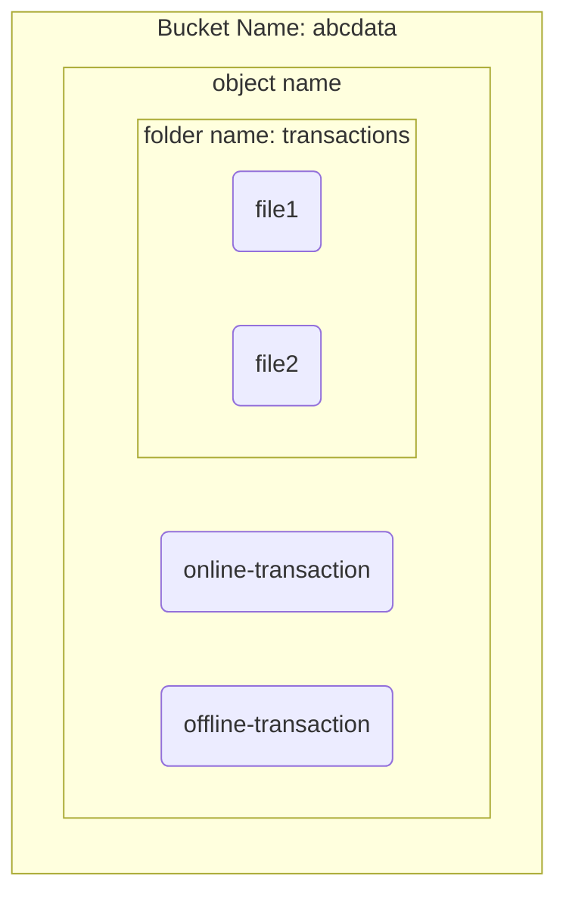

# Create Depot

This is the stuff we like talking about - after all, we are people of action and not armchair philosophers. The first thing to do is check if you have permission to create depots.

```yaml
dataos-ctl user get

#this is the output you will get
INFO[0000] 😃 user get...                                
INFO[0000] 😃 user get...complete                        

       NAME      |      ID       |  TYPE  |         EMAIL          |              TAGS               
-----------------|---------------|--------|------------------------|---------------------------------
  IamGroot       | iamgroot      | person | iamgroot@tmdc.io       | roles:id:data-dev,              
                 |               |        |                        | roles:id:operator,              
                 |               |        |                        | roles:id:system-dev,            
                 |               |        |                        | roles:id:user,                  
                 |               |        |                        | users:id:iamgroot          

```

To be able to create depots, you will need the following tags

`roles:id:user`  
`roles:id:data-dev`  
`roles:id:system-dev`

If you don’t have these tags, contact the operator/admin of DataOS within your enterprise. They can assign you the use-case for creating a depot through Bifrost.


> 🗣️ If you do not have the necessary tags/roles for creating a depot and have been assigned a standalone use-case authorising you to create a depot, you need to declare an additional key-value property in the YAML configuration file: `runAsUser`
>
>  ```yaml
>  version: 
>  name: 
>  type: depot
>  tags:
>  layer: user
>  depot:
>    type:
>    description: 
>    external:
>    runAsUser: #id of the person who assigned you the use case
>    connectionSecret:
>    spec: 
>  ```

</aside>

`runAsUser` is only to be used in the aforementioned context, meaning you do not need to mention it if you already have the necessary tags.

We will create a Depot in 3 simple steps:

1. Create YAML configuration file
2. Apply the file in DataOS CLI
3. Verify if the Depot has been successfully created

## YAML File

A typical YAML configuration file to create a depot looks like this:

```yaml
version: v1
name: <strawberry> #who doesn't like strawberry
type: depot
tags:
  - dropzone
  - bigquery
layer: user
depot:
  type: BIGQUERY
  description: "Google Cloud BigQuery"
  external: true
  connectionSecret:
    - acl: rw
      type: key-value-properties
      files:
        json_keyfile: ./secrets/gcp-demo-sa.json
  spec:
    project:
```
<figcaption align = "center">Sample Config file for creating a depot for BigQuery DB</figcaption>
<br>

The YAML file allows you to write the properties of the depot in a simple declarative format. If you are wondering whether you can read a YAML file to discern the use & details of a depot, or for that matter, any other DataOS Resource created by someone, you will be right - must have had your wisdom hat on! You can access the YAML file in Operations Center on GUI, as well as through DataOS CLI.

If the importance of the config file is clear, we can examine its characteristics. You can think of the config file as made up of three sections:

## General Properties

These properties are common across all the Depot types. A ‘Depot Type’ in DataOS means the depot created for a specific data source. So the depot created for two different data sources will be referred to as two different depot types. You can create multiple depots connecting to the same data source, they will all be considered as one Depot type. The YAML given below explains the key-values you need to declare in this section.

```yaml
version: <v1>                       #Resource API version here
  name: <nameofdepo>                #(REQUIRED) depo will be referred to with this name.
                                    #name of depot should be alphanumeric (cannot have special characters like hyphen)
#depot name should follow the following regex: [a-z]([a-z0-9*]) 
  type: depot                       #(REQUIRED) Resource type
  tags:                             #(OPTIONAL) helpful in classification, searchability and governance
    - dropzone
    - bigquery
  owner: bob_tmdc_io                #(OPTIONAL) owner (name of the person creating the depot)
  layer: user                       #(OPTIONAL) user or operator (access information)

  depot:   
    type: BIGQUERY                  #(REQUIRED) <depottype> depends on the underlying data source
    description: <description>      #(OPTIONAL) helps in stating the purpose 
    external: true                  #(REQUIRED) data source is managed externally or by DataOS
```
<figcaption align = "center">This example intends to create a depot to access the BigQuery database of your enterprise.</figcaption>
<br>

## Connection Secrets

The connection secrets are specific to a particular depot type. Thus, the configuration details(Secret) will depend on the underlying data source, and you should get these details from your enterprise. We have collated the connection secrets for commonly used data sources, refer to
[Depot Config Template](../Depot%20Config%20Templates/Depot%20Config%20Templates.md).


> 🗣️ The credentials you use here need to have access to the schemas in the configured database.


The basic key-value properties you fill in this section are:

acl (Access Control List): Here you have to declare the access policy for the depot. You can create multiple connections with different access levels for the same depot. For instance, you might want to allow read and write permissions to carry out a particular transformation, but only allow read permission to carry out another operation using the same depot.

values:

data: Provide the credentials and additional information needed to connect with the data source such as accesskey id, secretkey id, username, and passwords.

files: Instead of mentioning the sensitive information in the ‘data’ above, you can store the information in a JSON file; then provide the absolute path to the JSON file containing the credentials.

Check out the examples below to understand how these key-value properties can be defined for different Depot types.

The ‘connectionSecret’ section of the config file for BigQuery will look something like this: 

```yaml
#Properties depend on the underlying data source
connectionSecret:                    #(OPTIONAL) connection secrets and access permissions
    - acl: rw                        #providing read and write permission  
      type: key-value-properties
      data:
        projectid: <project-name>
        email: <email-id>
      files:
        json_keyfile: secrets/gcp-demo-sa.json #JSON file containing the credentials to read-write    
    - acl: r                         #providing read-only permission
      type: key-value-properties
      files:
        json_keyfile: secrets/gcp-demo-sa.json #JSON file containing the credentials to read-only
```
<figcaption align = "center">This example intends to create a depot to access the BigQuery database of your enterprise.</figcaption>
<br>

This is how you can declare connection secrets to create a depot for AWS S3 storage:

```yaml
connectionSecret:   #(OPTIONAL) connection secrets and access permissions
    - acl: rw       #Access permission
      type: key-value-properties
      data:    #credentials required to access aws
        awsaccesskeyid: ${AWS_ACCESS_KEY_ID}     
        awsbucketname: ${bucket-name}
        awssecretaccesskey: ${AWS_SECRET_ACCESS_KEY}
```
<figcaption align = "center">This example intends to create a depot to access the BigQuery database of your enterprise.</figcaption>
<br>

For accessing JDBC, all you need is a username and password. Check it out below:

```yaml
connectionSecret:
    - acl: rw
      type: key-value-properties
      data:   #for JDBC, the credentials you get from the data source should have permission to read/write schemas of the database being accessed 
        username: username
        password: password
```

Secret is also a primitive in DataOS. This means that you can use it with stacks and components within DataOS in a composable manner. Let’s take the example of MySQL to understand how you can use Secret as a primitive/resource:

1. Create a YAML file with the details on the connection secret:

    ```yaml
    version: v1
    name: "mysql-secret"         #names are important! You will use it later
    type: secret
    secret:
      type: key-value-properties
      acl: rw
      data:
        connection-user: <user>
        connection-password: <password>
    ```

1. Apply this YAML file as a resource, on DataOS CLI

```yaml
dataos-ctl apply -f <path/secret.yaml> -w <name of the workspace>
```

If you have created this Secret in public workspace, everyone in your enterprise can directly use it by simply referring to the name of the Secret you just created, “mysql-secret”. 

For instance, if a user now wants to create a MySQL depot-type, they will now be able to create a Depot config file in the following manner:

```yaml

version: v1
name: "mysql05"
type: depot
tags:
  - dropzone
  - mysql
layer: user
depot:
  type: MYSQL
  description: "MYSQL Sample data"
  spec:
    host: <Host>
    port: 
  external: true
  data:
    connectionSecret:
      name: "mysql-secret"     #secret name containing credential details

```
<figcaption align = "center">The depot owner/creator doesn’t need to know the actual credentials for the connection</figcaption>
<br>

You can learn more about Secret in the primitive/resource section:
[Primitives/Resources](../../Primitives.md).


## Specifications

The information you declare in ‘spec’ does two things - first, it points the depot to the precise location of your data and second, it indirectly provides the depot with the hierarchical structure in which this data is stored. Allow us to elucidate these aspects!

The specification parameters depend on the storage structure of the data source. These parameters allow you to map the data to the hierarchy followed within DataOS:

<center>


</center>

Once mapped, this automatically generates the UDL which you can use everywhere within the DataOS to access the dataset. If memory serves you right, you should be able to recall that the UDL has the following format:

 `dataos://[depot]:[collection]/[dataset]`

Let’s understand this hierarchy through real-world examples:

The data stored in BigQuery is structured as ‘Projects’ within which you have ‘Datasets’ that contain the ‘Tables’. This means the Project is equivalent to Depot; Dataset is equivalent to Collection; Table is equivalent to Datasets within DataOS. Are you still confused? Then stop scratching your head and take a look at this example.

    BigQuery has some data stored in the structure given below;
    Project name: bigquery-public-data          =         Depot
    Dataset name: covid19_usa                   =         Collection
    Table name: datafile_01                     =         Dataset
    The UDL for this data will be dataos://<depot name>:covid19_usa/datafile_01

In the YAML file below you can see the values filled in order to create this Big Query depot.

```yaml
version: v1
name: covidbq    #once again, names are important
type: depot
tags:
  - bigquery
layer: user
depot:
  type: BIGQUERY
  description: "Covid public data in Google Cloud BigQuery"
  external: true
  spec:             #the spec part here only mentions the project name
    project: bigquery-public-data

#all the datasets within this project now automatically get mapped to Collections
#all the Tables within it get mapped to Datasets
```
<figcaption align = "center">Pointing the depot to a Project in BigQuery</figcaption>
<br>

You can spot in the YAML that the depot has been named ‘covidbq’, and it references the project ‘bigquery-public-data’ in Google cloud. So all the datasets and tables within this project can now be accessed via the UDL 

`dataos://covidbq:<collection name>/<dataset name>`

Depot also allows for certain flexibility while mapping this hierarchy. To unravel this, we will take the example of the AWS S3 bucket. Amazon S3 has a flat structure, wherein you have buckets which are containers containing objects. At the same time, they allow for the creation of folders within a bucket, and you can save the objects within these folders. See the diagram given below:

<center>


</center>
<figcaption align = "center">Example of S3 storage</figcaption>
<br>

Now, create a depot with the name ‘s3depot’, where you want to map the bucket ‘abcdata’ to the depot, the folder ‘transactions’ to Collection, and the objects file1 and file2 as Datasets. Within spec, you only need to state the bucket name and relativePath to the folder. Scrutinize the YAML given below to see how we have done it.

```yaml
version: v1
name: s3depot
type: depot
tags:
  - S3
layer: user
depot:
  type: S3
  description: "AWS S3 Bucket for dummy data"
  external: true
  spec:
    bucket: "abcdata" # the bucket 'abcdata' can now be accessed by the depot name - 's3depot'
    relativePath:     #intentionally left blank
#depot will automatically map the transaction folder to Collection and the files/objects within that folder to Datasets
```

If you do not declare the relativePath in the YAML above, then given the ordinal structure/hierarchy of the stored data, the bucket ‘abcdata’ itself becomes your depot. You can now access the data using the UDLs given below: 

> Note that the depot automatically mapped the transactions folder to Collection in DataOS (this is a result of the ordinal hierarchy of the bucket) <br>
 `dataos://s3depot:transactions/file1` <br>
 `dataos://s3depot:transactions/file2`
 <br>
> The two UDLs to point to the objects present in the bucket, outside the folder: <br>
> 
>  `dataos://s3depot:none/online-transaction` <br>
>  `dataos://s3depot:none/offline-transaction` <br>
> 
> Note: Here ‘Collection’ name is mentioned as ‘none’ because there isn’t a three-level  ordinal hierarchy. The object files online-transaction and offline transaction are your datasets and are present directly in the S3 bucket.
> 
> The pliability of Depot allows you to envision the ‘transactions’ folder itself as another object in the bucket, rather than a folder. If this is what you prefer, then you can use the following UDLs to address the files within the folder: <br>
> `dataos://s3depot:none/transactions/file1` <br>
> `dataos://s3depot:none/transactions/file2` <br>
>
> Here, the interpretation by the user is that there is no collection in the bucket, and file1 and file2 are directly being accessed as objects having the path /transactions/file1 and /transactions/file2
> 

Since you have already spent so much time to fathom how Depot behaves, why not acquiesce in checking out a couple of more examples - leave no stone unturned!

In the above example of AWS S3, we will now mention the relativePath in the YAML.

```yaml
version: v1
name: s3depot
type: depot
tags:
  - S3
layer: user
depot:
  type: S3
  description: "AWS S3 Bucket for dummy data"
  external: true
  spec:
    bucket: "abcdata"          
    relativePath: "/transactions" 
#the folder 'transactions' can now be accessed by the depot name - 's3depot'             
```

> Since the folder ‘transactions’ in the bucket has now been positioned as the depot, two things happen. <br>
> First, you cannot access the object files online-transaction and offline-transaction using this depot. <br>
> Second, you can now access the files within the ‘transactions’ folder using the following UDLs: <br>
 `dataos://s3depot:none/file1` <br>
 `dataos://s3depot:none/file2` <br>

Say you want to access data from Kafka. Kafka’s structure is such that you have a broker list, within which you have the Topics. So the ‘spec’ section will point the depot to the broker list, and the datasets will map to Topic lists. The YAML will have the following format:

```yaml
depot:
  type: KAFKA
  description: <description>
  external: true
  spec:                             #Kafka specific configurations
    brokers:
      - <broker1>
      - <broker2>
```

For File based systems, if you define the format as ‘Iceberg’, you can choose the meta-store catalog between Hadoop and Hive. This is how you do it:

```yaml
depot:
  type: ABFSS
  description: "ABFSS Iceberg depot for sanity"
  compute: runnable-default
  spec:
    "account": 
    "container": 
    "relativePath":
    "format": "ICEBERG"
    "endpointSuffix":
    "icebergCatalogType": "Hive"  #you have two options: Hive/Hadoop
  connectionSecret:

```

If you do not mention the catalogue name as Hive, it will use Hadoop as the default catalog for Iceberg format.
 
<center>


</center>

<figcaption align = "center">Flow when Hive is chosen as the catalog type</figcaption>
<br>

> Hive, automatically keeps the pointer updated to the latest metadata version. If you use Hadoop, you have to manually do this by running the set metadata command as described on this page: 
[Set metadata](../../../Storage/Icebase/Case%20Scenario%20Maintenance%20(Snapshots%20and%20Meta%20Data).md).

## Optional Properties

Apart from the above properties, you can choose to declare two other configurations in the YAML file. These are:

1. compute: This allows you to mention the compute you want to use for the depot being created.
2. source: This maps the depot to the metadata source name in Metis. Running a scanner job on this depot will save the metadata in Metis DB under the ‘source’ name declared here. If you do not mention this key-value property, the metadata will surface under the Depot’s name on Metis UI.

```yaml
version: v1
name: 
type: depot
tags: 
layer:
depot:
  type:
  description:
  external:
  source: bigquerymetadata
#the scanned metadata will now save the metadata corresponding to this depot under the source name 'bigquerymetadata'
  compute: runnable-default
#write the name of the cluster out of the available clusters
```

## Apply Config File

Once you have the YAML file ready in your code editor, simply copy the path of the YAML file and apply it through the DataOS CLI.

```yaml
dataos-ctl apply -f <yamlfilepath>
```

## Verify

To verify if your depot has been successfully created, you can simply check the name of the newly created depot in the list of all the depots.

```yaml
dataos-ctl get -t depot      #gives the list of depots where you are named as the owner
dataos-ctl get -t depot -a   #gives the list of all the depots created in your organisation
```

You can also check the details of any created depot on the DataOS GUI in Operations Center and Metis.

Check out ready-to-use YAML config files on this page:
[Depot Config Templates](../Depot%20Config%20Templates/Depot%20Config%20Templates.md).