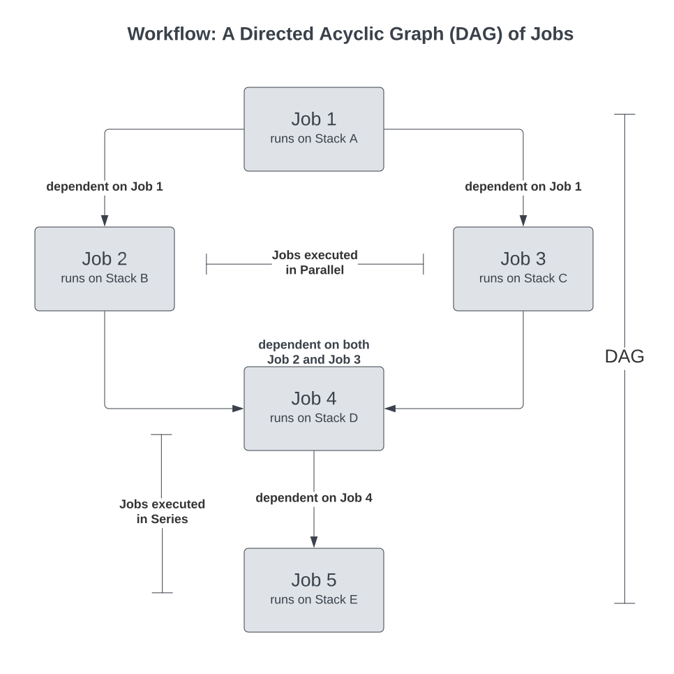
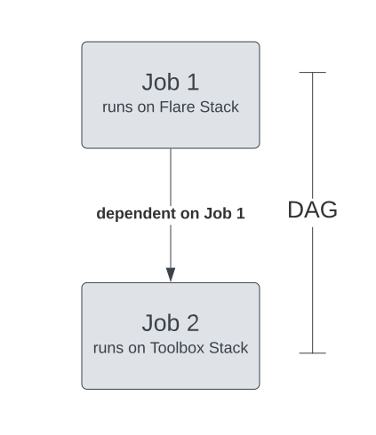

# Workflow

Workflow, within the DataOS, is a collection of jobs with directional dependencies. It defines a hierarchy based on a dependency mechanism.

You can visualize workflow as a representation of a DAG, while a DAG can be thought of as a collection of jobs and their dependencies and sets the context for when and how those jobs should be executed. You can have multiple jobs or even a single job within each DAG (there should be at least one). 

A job within a workflow defines a sequence of processing tasks in which each job runs in its own Kubernetes pod. This is done so that the computation of one job doesn't create a bottleneck for the others.

Each job within a DAG gets executed upon a particular stack, an extension point within a job that adds new programming paradigms for the user, depending on what they need to do. For instance, if you want to perform data transformation, ingestion, or syndication, go with the Flare stack. DataOS, out-of-the-box, provides you with different stacks, such as Flare, Scanner, Benthos, Alpha, and many more.
 
<center>



</center>


<figcaption align = "center">Diagrammatic representation of a workflow</figcaption>

<br>

In the above workflow, `Job 1` runs first, as it has no dependencies. Once `Job 1` has finished, `Job 2` and `Job 3` run in parallel. Finally, once `Job 2` and `Job 3` have been completed, `Job 4` can run as it depends on both `Job 2` and `Job 3`. Finally, once `Job 4` has been completed `Job 5` can run.

The Directed Acyclic Graph may have multiple roots. It implies that the DAG within a workflow can not only have jobs but also workflows themselves stored in different places. This can allow for complex workflows to be split into manageable pieces. To know more about this scenario, read through the [Executing Multiple Workflow YAMLs from a Single One](./Executing%20Multiple%20Workflow%20YAMLs%20from%20a%20Single%20On/Executing%20Multiple%20Workflow%20YAMLs%20from%20a%20Single%20One.md) page.

## Types of Workflows

Workflows are either single-time run or schedulable. To schedule a workflow, you must add the `schedule` property, under which you define a `cron` and prepare it as a scheduled workflow or a cron workflow. The details related to the cron workflow properties are available in the below table. If you want to check out a case scenario for a cron or scheduled workflow, read through the [Scheduled or Cron Workflow](./Scheduled%20or%20Cron%20Workflow.md) page.

## Syntax of a workflow

The code block below gives the YAML syntax for a single-time run workflow. You can learn what these key-value properties mean and how these are declared in the table below.

```yaml
version: v1 #(Mandatory) 
name: wf-tmdc #(Mandatory) 
type: workflow #(Mandatory)
tags: #(Optional)
	- read
	- write 
description: This is a template for defining a workflow #(Optional)
workflow: #(Mandatory) 
	schedule: #(Optional)
		cron: '*/10 * * * *' #(Optional)
		concurrencyPolicy: Forbid #(Optional)
		startOn: 2022-01-01T23:30:30Z #(Optional)
		endOn: 2022-01-01T23:40:45Z #(Optional)
		completeOn: 2022-01-01T23:30:45Z #(Optional)
  dag: #(Mandatory) 
			# Job 1 (There should be at least one job within a DAG)
    - name: <job1 name>
      spec:
        stack: <stack1-version> #this could be Flare, Toolbox, etc.
        compute: <compute-type>
        stack1: # stack1 name like Flare, Scanner, etc. 
					<stack1 specific properties>
      # Job 2
    - name: <job 2>
      spec:
        stack: <stack2-version>
      compute: <compute-type>
        stack2: # stack2 name like Flare, Toolbox, etc.
      dependencies: # this job is dependent on the completion of job1
       - <job1 name>
```
 
<center>



</center>

<figcaption align = "center">Diagrammatic representation of Sample Workflow</figcaption>

<br>

  Sample Workflow YAML 
    
  ```yaml
    version: v1 # Version
    name: wf-tmdc-01 # Workflow Name
    type: workflow # Type here is Workflow
    tags:
    - Connect
    - City
    description: The job ingests city data from dropzone into raw zone
    workflow:
      title: Connect City
    	# Directed Acyclic Graph (DAG)
      dag: 
    		# Job 1
      - name: wf-job1 # Job 1 name
        title: City Dimension Ingester
        description: The job ingests city data from dropzone into raw zone
        spec:
          tags:
          - Connect
          - City
          stack: flare:3.0 # The job gets executed upon the Flare Stack, so its a Flare Job
          compute: runnable-default
    			# Flare Stack Specific Properties
          flare:
            job:
              explain: true
              logLevel: INFO
    
              inputs:
               - name: city_connect
                 dataset: dataos://thirdparty01:none/city
                 format: csv
                 schemaPath: dataos://thirdparty01:none/schemas/avsc/city.avsc
    
              outputs:
                - name: cities
                  dataset: dataos://icebase:retail/city01?acl=rw
                  format: Iceberg
                  description: City data ingested from external csv
                  options:
                    saveMode: append
                    sort:
                      mode: partition
                      columns:
                        - name: version
                          order: desc
                    iceberg:
                      properties:
                        write.format.default: parquet
                        write.metadata.compression-codec: gzip
                      partitionSpec:
                        - type: identity
                          column: version
              steps:
              - sequence:
                  - name: cities
                    doc: Pick all columns from cities and add version as yyyyMMddHHmm formatted
                      timestamp.
                    sql: |
                        SELECT
                          *,
                          date_format (now(), 'yyyyMMddHHmm') AS version,
                          now() AS ts_city
                        FROM
                          city_connect
    		# Job 2
      - name: datatool-1 # Job 2 name
        spec:
          stack: toolbox # The Job gets executed upon Toolbox Stack, so its a Toolbox Job 
          compute: runnable-default
    			# Toolbox Stack specific properties
          toolbox:
            dataset: dataos://icebase:retail/city01
            action:
              name: set_version
              value: latest
    		# Dependent on Job 1 for the start of execution
        dependencies: wf-job1
  ```
  
<br>

## Building Blocks of Workflow

The below table summarizes various properties within a Workflow YAML.

| Property | Description | Example | Default Value | Possible Value | Rules/ Additional Details | Field (Optional / Mandatory) |
| --- | --- | --- | --- | --- | --- | --- |
| `version` | Version allows iteration on the schema.  | `version: v1` | NA | v1 | Configure all the properties according to the manifest version. Currently it's `v1`. This document is for `v1` manifest. | Mandatory |
| `name` | Defines the name of the resource | `name: cust-bq-demo-01` | NA | NA | Rules for name: 37 alphanumeric characters and a special character '-' allowed. `[a-z0-9]([-a-z0-9]*[a-z0-9])`. The maximum permissible length for the name is 47, as showcased on CLI. Still, it's advised to keep the name length less than 30 characters because Kubernetes appends a Unique ID in the name which is usually 17 characters. Hence reduce the `name` length to 30, or your workflow will fail. | Mandatory |
| `type` | Resource type is declared here. In the current case, it is workflow. | `type: workflow` | NA | Any of the available resource in DataOS | The name of the primitive/Resource should be only in lowercase characters. Else it will throw an error. | Mandatory |
| `tags` | Tags are arrays of strings. These are attributes and keywords. They are used in access control and for quick searches within Metis. | `tags:` <br>&nbsp;&nbsp;&nbsp;&nbsp;`- Connect` <br>&nbsp;&nbsp;&nbsp;&nbsp;`- Customer` | NA | NA | The tags are case-sensitive, so `Connect` and `CONNECT` will be different tags. There is no limit on the length of the `tag`. In order to assign an output dataset in the Bronze/Silver/Gold categories within Metis UI we can use the tag-like `tier.Bronze/tier.Silver/tier.Gold`. | Optional |
| `description` | Text describing the workflow. | `description:  Customer data ingestion from bigquery`  | NA | NA | There is no limit on description length. | Optional |
| `owner` | The `user-id` of the owner applying the resource. | `owner: iamgroot` | `user:id` of the resource owner (Can be seen by running the `dataos-ctl` user get command after logging in) in the Tags Section. | NA | The `owner` should be in all lowercase letters `[a-z]`, and another unique character - allowed. You cannot use a different user’s `user:id`, if you do you will encounter a Forbidden Error. Users with operator-level permissions or `roles:id:operator` can use another owner name, but the login token remains the same, thus making every owner of a workflow unique. | Optional |
| `workflow` | The workflow will incorporate the DAG of jobs and various properties of jobs | `workflow:` <br>&nbsp;&nbsp;&nbsp;&nbsp;`dag: {}` | NA | NA | For workflow, the key should be `workflow`. | Mandatory |
| `schedule` | For schedule or cron workflows.  | `schedule:` <br> &nbsp;&nbsp;&nbsp;&nbsp;`cron: '*/10 * * * *'` <br>&nbsp;&nbsp;&nbsp;&nbsp;`concurrencyPolicy: Forbid` | NA | NA | NA | Optional |
| `cron` | The `cron` is a sub-property within the `schedule` that containing the cron expression which is a string consisting of six or seven sub-expressions that describe individual details of the schedule.  | `cron: '*/10 * * * *'` | NA | NA | The `cron` expression should be valid. It contains values separated by white space and can contain any of the allowed values with various combinations of the allowed characters for that field.  | Optional |
| `concurrencyPolicy` | The `concurrencyPolicy` is a sub-property within the `schedule` that specifies how to treat concurrent executions of a job that is created by this cron job. | `concurrencyPolicy: Forbid` | `Allow` | `Allow`/`Forbid`/`Replace` | `Allow`: The cron job allows concurrently running jobs <br>`Forbid`: The cron job does not allow concurrent runs; if it is time for a new job run and the previous job run hasn't finished yet, the cron job skips the new job run <br>`Replace`: If it is time for a new job run and the previous job run hasn't finished yet, the cron job replaces the currently running job run with a new job run | Optional |
| `startOn` | Specifies start time of schedule in ISO 8601 format | `startOn: 2022-01-01T23:30:45Z` | NA | NA | Time is to be provided in ISO 8601 format. | Optional |
| `endOn` | Specifies end time of schedule  If not present, the schedule will run indefinitely | `endOn: 2022-01-01T23:40:45Z` | NA | NA | Time is to be provided in ISO 8601 format. | Optional |
| `completeOn` | Specifies the time of completion of schedule. | `completeOn: 2022-01-01T23:30:45Z` | NA | NA | Time is to be provided in ISO 8601 format. | Optional |
| `title` | Title of Directed Acyclic Graph (DAG) | `title: Quality Summary` | NA | NA | NA | Optional |
| `dag` | DAG is a Directed Acyclic Graph, a conceptual representation of a sequence of activities (jobs). These jobs in a dag are executed in the order of dependencies between them. |  `dag:` <br> &nbsp;&nbsp;&nbsp;&nbsp;`{}` <span style="color:green"> # sequence of jobs</span>  | NA | NA | There should be at least one job within a DAG. | Mandatory |

> 📖 Best Practice: It is part of the best practice to add relevant `description` and `tags` for your workflow. While `description` helps to determine what the workflow will help you accomplish, `tags` can help in faster searching in Metis and Operations.

# Case Scenarios

[1. Executing Multiple Workflow YAMLs from a Single One](./Executing%20Multiple%20Workflow%20YAMLs%20from%20a%20Single%20On/Executing%20Multiple%20Workflow%20YAMLs%20from%20a%20Single%20One.md)

[2. Scheduled or Cron Workflow](./Scheduled%20or%20Cron%20Workflow.md)